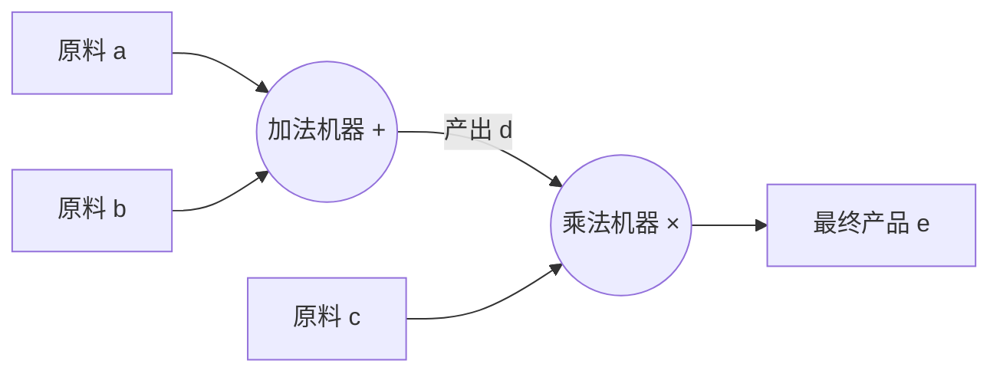

# 什么是计算图？（通俗易懂版）

想象一下，你正在做一道复杂的烹饪大餐。这道菜需要切菜、炒肉、煮汤，最后混合在一起。你不可能一下子把所有事情都做完，而是需要一步一步来：先洗菜，再切菜；先热油，再下肉。

**计算图（Computational Graph）** 就是这样一张“烹饪流程图”。在人工智能和深度学习的世界里，它是一张地图，告诉计算机如何一步步地处理数据，最终得到结果。

## 1. 它是怎么工作的？用“流水线”来打比方

你可以把计算图看作是一个工厂的**流水线**。

*   **原材料（输入节点）**：就像是工厂进货的钢材、橡胶。在 AI 里，这些就是我们输入的数据（比如一张图片）和模型的参数（权重）。
*   **加工机器（运算节点）**：流水线上的机器，有的负责“加法”，有的负责“乘法”，有的负责更复杂的“变形”。
*   **传送带（边/Edge）**：连接机器的传送带，把上一步加工好的半成品传送到下一步。

### 举个简单的栗子 🌰

假设我们要算一个简单的数学题：$e = (a + b) \times c$

如果画成计算图，它是长这样的：

1.  **第一步**：把 `a` 和 `b` 送进 **加法机器**，生产出中间产品 `d`（也就是 $a+b$）。
2.  **第二步**：把中间产品 `d` 和原料 `c` 送进 **乘法机器**。
3.  **第三步**：得到最终产品 `e`。

这就是计算图！它把一个复杂的数学公式，拆解成了很多个简单的小步骤，并把它们连接起来。

## 2. 为什么要用计算图？

你可能会问：“直接算不就行了吗？为什么要画这么麻烦的图？”

这就好比你去餐厅点菜。如果厨师没有菜谱（计算图），他可能每次都要现想先放盐还是先放糖。但有了菜谱，一切都变得井井有条。

计算图有两个超级大的用处：

### A. 自动求导（“反悔”机制）
这是 AI 训练中最核心的魔法。
想象你在玩一个这就好比“冷热游戏”。你想找到宝藏（最优解），但蒙着眼睛。
*   **正向传播（Forward Pass）**：你按照地图走了一步，算出结果，发现离宝藏还很远（误差很大）。
*   **反向传播（Backpropagation）**：计算图允许计算机**从终点往回推**。它能精确地告诉每一个节点：“嘿，你刚才算得太大了，下次小一点”或者“你刚才贡献了多少误差”。
*   因为图里清楚地记录了谁连着谁，计算机就能顺藤摸瓜，自动算出如何调整每一个参数。

### B. 并行计算（“多管齐下”）
再看回我们的流水线。如果计算图显示“切土豆”和“腌牛肉”这两步互不干扰（没有连线），那聪明的计算机（比如 GPU）就会安排两个厨师**同时**做这两件事。这能大大加快计算速度！

## 3. 动态图 vs 静态图

在深度学习框架中，有两种常见的计算图风格，就像两种不同的建筑方式：

*   **静态图 (Static Graph)**：**先画图纸，再盖楼**。
    *   代表人物：旧版 TensorFlow (1.x)。
    *   特点：你需要先把整个复杂的流水线设计得天衣无缝，然后按下启动键。一旦开始，就不能改图纸了。
    *   优点：运行超快（因为优化得好）。
    *   缺点：太死板，想改个小细节得重画图纸。

*   **动态图 (Dynamic Graph)**：**边盖楼，边画图**。
    *   代表人物：**PyTorch** (现在的顶流)。
    *   特点：像搭积木一样，你想怎么搭就怎么搭，随时可以换个积木。代码运行到哪一行，图就画到哪一步。
    *   优点：非常灵活，写代码就像写 Python 一样自然，debug 很方便。
    *   缺点：以前比静态图慢一点点（但现在优化得非常好了）。

## 4. 总结

所以，下次提到**计算图**，你就想：

> 它就是一张**数据的导航地图**。它把复杂的数学运算拆解成一个个小零件，让计算机不仅知道**怎么算结果**（正向），还知道**怎么找错误**（反向），并且还能**同时做很多事**（并行）。

正是因为有了这张图，现代 AI 才能处理那些包含数亿个参数的超级大模型！
