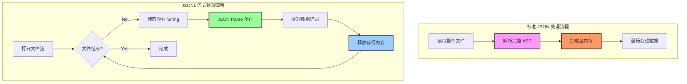

# JSONL (JSON Lines) 格式技术白皮书

## 摘要

JSON Lines (简称 JSONL) 是一种基于文本的数据交换格式，旨在解决传统 JSON 格式在处理大规模数据集和流式传输时的局限性。作为一种行分隔的 JSON 变体 (Newline Delimited JSON)，JSONL 通过将每个数据记录封装为独立的行，实现了高效的增量处理、流式读写和并行计算能力。本文档深入探讨 JSONL 的技术规范、底层架构原理、性能优势及其在现代大数据与人工智能工程中的关键应用。

## 1. 规范定义 (Specification Definition)

JSON Lines 的官方规范定义简洁而严格，确保了跨平台的兼容性和解析的确定性。一个合法的 JSONL 文件必须遵循以下三项核心规则：

### 1.1 UTF-8 编码
*   文件必须使用 UTF-8 编码。
*   允许对 Unicode 字符进行转义（例如使用 `\uXXXX`），以确保文件在纯 ASCII 环境下的兼容性，但推荐直接使用 UTF-8 字符以提高可读性。
*   **禁止使用字节顺序标记 (BOM)**：与标准 JSON 规范一致，文件开头不得包含 `U+FEFF` 字节顺序标记。

### 1.2 行分隔符
*   每一行必须是一个有效的 JSON 值（Valid JSON Value）。
*   行与行之间通过换行符 `\n` (Line Feed, LF, `0x0A`) 分隔。
*   由于 JSON 解析器通常会忽略周围的空白字符，因此 `\r\n` (CRLF) 在大多数实现中也被视为有效，但规范推荐使用 `\n`。
*   文件最后一行建议包含换行符，但非强制。

### 1.3 独立的 JSON 值
*   每一行代表一个独立的数据单元，通常是 JSON 对象（Object）或数组（Array），但理论上可以是任何合法的 JSON 值（如字符串、数字）。
*   行内数据不得跨行，即单个 JSON 对象的起始 `{` 和结束 `}` 必须在同一物理行内闭合。
*   **注意**：空行（Blank lines）在 JSONL 中通常被视为无效或被解析器忽略，建议避免产生无意义的空行。

## 2. 架构与原理 (Architecture & Principles)

### 2.1 内存模型对比 (Memory Model)

JSONL 与标准 JSON 最根本的区别在于内存访问模式。标准 JSON 是一个单一的根对象（通常是数组或对象），解析时必须构建完整的抽象语法树 (AST)，这要求将整个文件加载到内存中。相比之下，JSONL 采用“流式架构”，允许解析器逐行读取、解析和释放内存。



### 2.2 流式传输与容错性
*   **流式友好 (Stream Friendly)**：在网络传输中，接收端可以每接收一行就处理一行，无需等待整个响应结束。这对于实时日志聚合和长连接 API 至关重要。
*   **容错隔离 (Fault Isolation)**：在标准 JSON 文件中，任何位置的一个语法错误（如缺少逗号）都会导致整个文件解析失败。在 JSONL 中，解析器可以设计为捕获单行的解析错误，记录日志并跳过该行，从而保护其余数据的完整性。

## 3. 核心优势与劣势分析 (Analysis of Pros & Cons)

| 特性 | JSONL (JSON Lines) | Standard JSON |
| :--- | :--- | :--- |
| **内存效率** | **极高** (O(1) 空间复杂度，取决于单行大小) | **低** (O(N) 空间复杂度，取决于文件大小) |
| **写入性能** | **O(1) 追加** (Append-only，无需读取旧数据) | **O(N) 重写** (需读取旧结构，插入新项，重写文件) |
| **可读性** | 中等 (大对象单行显示可能难以阅读) | **高** (支持 Pretty Print 和缩进) |
| **数据完整性** | 行级隔离，单行错误不影响整体 | 结构脆弱，单点错误导致全盘失败 |
| **压缩效率** | 极高 (适合 gzip/bzip2 流式压缩) | 高 (但压缩后通常无法分块读取) |
| **工具生态** | 增长中 (Unix 工具链 awk/sed/grep 友好) | **成熟** (所有语言原生支持) |
| **类型约束** | 无内置 Schema，每行结构可变 | 无内置 Schema，通常结构一致 |

## 4. 应用场景 (Use Cases)

### 4.1 AI 与大模型训练 (LLM Training)
这是 JSONL 目前最热门的应用领域。在大规模语言模型预训练和微调中，数据集往往达到 TB 级别。
*   **示例**：OpenAI 的 GPT-3 微调 API 强制要求训练数据为 JSONL 格式。
*   **优势**：允许训练程序使用 `Lazy Loading` 策略，打乱数据顺序（Shuffle）时也无需加载全量数据。

### 4.2 日志聚合 (Log Aggregation)
*   **场景**：分布式系统将日志输出到文件或 stdout。
*   **优势**：原子写入。多进程向同一文件追加日志时，只要保证单行写入的原子性，就不会破坏文件结构。相比于二进制格式，JSONL 保留了人类可读性。

### 4.3 数据仓库导出 (Data Warehousing)
*   **场景**：从 BigQuery, Snowflake 或 Hive 导出数据。
*   **优势**：便于分割（Sharding）。100GB 的 JSONL 文件可以简单地按字节切割成 10 个 10GB 的文件进行并行处理，而标准 JSON 必须解析结构才能分割。

## 5. 实现指南 (Implementation Guide)

### 5.1 Python 实现

Python 标准库 `json` 模块不直接支持 JSONL 的读写，通常结合文件迭代器实现。

```python
import json
from typing import Iterator, Dict, Any

def read_jsonl(file_path: str) -> Iterator[Dict[str, Any]]:
    """生成器方式读取 JSONL，内存高效"""
    with open(file_path, 'r', encoding='utf-8') as f:
        for line_number, line in enumerate(f, 1):
            line = line.strip()
            if not line: continue  # 跳过空行
            try:
                yield json.loads(line)
            except json.JSONDecodeError as e:
                print(f"Error parsing line {line_number}: {e}")

def write_jsonl(file_path: str, data: Iterator[Dict[str, Any]]):
    """追加模式写入 JSONL"""
    with open(file_path, 'a', encoding='utf-8') as f:
        for record in data:
            # ensure_ascii=False 确保中文不被转义，减小体积
            json_str = json.dumps(record, ensure_ascii=False)
            f.write(json_str + '\n')
```

### 5.2 Node.js 实现 (Streams)

利用 Node.js 的 Stream API 可以实现极高性能的管道处理。

```javascript
const fs = require('fs');
const readline = require('readline');

async function processJsonl(filePath) {
  const fileStream = fs.createReadStream(filePath);

  const rl = readline.createInterface({
    input: fileStream,
    crlfDelay: Infinity
  });

  for await (const line of rl) {
    if (!line.trim()) continue;
    try {
      const record = JSON.parse(line);
      // 处理逻辑
      console.log(`Processing ID: ${record.id}`);
    } catch (err) {
      console.error('Invalid JSON line:', err);
    }
  }
}
```

### 5.3 最佳实践
1.  **文件扩展名**：推荐使用 `.jsonl`。部分系统也支持 `.ndjson`。
2.  **压缩**：对于长期存储，强烈建议使用 `.jsonl.gz`。大多数处理工具库支持直接读取 gzip 压缩流。
3.  **Schema 验证**：由于 JSONL 不强制所有行结构一致，建议在处理管道的入口处引入 JSON Schema 校验，确保每行数据符合预期结构。

## 参考资料

1.  **JSON Lines Official Website**
    *   URL: https://jsonlines.org/
2.  **JSONL vs JSON: Which Format to Choose? (2025 Comparison Guide)** - JSONL Tools
    *   URL: https://jsonltools.com/jsonl-vs-json
3.  **Why JSON and JSON Lines** - NCBI Datasets Documentation
    *   URL: https://www.ncbi.nlm.nih.gov/datasets/docs/v2/reference-docs/file-formats/metadata-files/why-jsonl/
4.  **JSONL for Developers: Complete Guide to JSON Lines Format** - JSONL Tools
    *   URL: https://jsonltools.com/jsonl-for-developers
