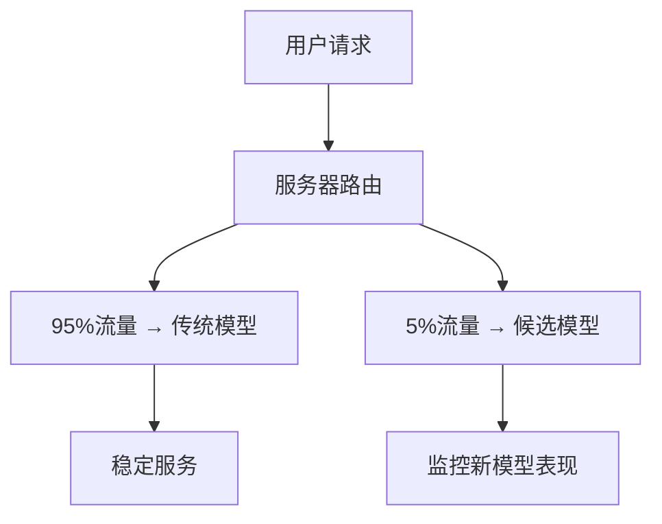

## 🐦 什么是金丝雀测试？

金丝雀测试的名字来源于矿工用金丝雀检测矿井中有毒气体的做法。在软件部署中，它指的是**先让少数用户试用新版本，观察是否有问题，再逐步扩大范围**。

## 📊 图中的部署架构

### 🏗️ 系统组件：

1. **两个用户组**：
   - **User group #1**（绿色）：大部分用户，使用稳定的旧模型
   - **User group #2**（橙色）：少数用户，作为"金丝雀"测试新模型

2. **服务器**：负责路由请求到不同的模型

3. **两个模型**：
   - **Legacy model**（传统模型）：经过验证的稳定版本
   - **Candidate model**（候选模型）：新训练的待验证版本

## 🔄 工作流程



## 💡 具体实施步骤

### 阶段1：小规模测试（5%流量）
```python
# 伪代码示例
def route_request(user_id):
    if user_id % 20 == 0:  # 5%的用户
        return candidate_model.predict(features)
    else:  # 95%的用户
        return legacy_model.predict(features)
```

### 阶段2：监控关键指标
```python
metrics_to_monitor = {
    'accuracy': 0.85,      # 准确率不能下降
    'latency': 100,        # 响应时间不能增加
    'error_rate': 0.01,    # 错误率不能上升
    'business_kpi': 0.12   # 业务指标（如转化率）
}
```

### 阶段3：逐步扩大（如果表现良好）
```
第1天: 5%流量  → 候选模型
第3天: 10%流量 → 候选模型  
第7天: 25%流量 → 候选模型
第14天: 50%流量 → 候选模型
第21天: 100%流量 → 候选模型（完全替换）
```

## ⚠️ 风险控制机制

### 🚨 自动回滚触发条件：
```python
if candidate_model_error_rate > legacy_model_error_rate * 1.2:
    # 错误率增加20%以上，立即回滚
    rollback_to_legacy_model()
    
if candidate_model_latency > legacy_model_latency * 1.5:
    # 延迟增加50%以上，立即回滚
    rollback_to_legacy_model()
```

## 🎯 金丝雀测试的优势

### ✅ 优点：
1. **风险最小化**：只影响少数用户
2. **真实环境验证**：在生产环境中测试
3. **渐进式部署**：可以随时停止或回滚
4. **数据驱动决策**：基于真实指标决定是否继续

### 📈 实际应用场景：

**电商推荐系统**：
```
传统模型: 点击率 12%，转化率 3%
候选模型: 点击率 13%，转化率 3.2% ✅ 表现更好

→ 逐步增加候选模型的流量比例
```

**欺诈检测系统**：
```
传统模型: 准确率 95%，误报率 2%
候选模型: 准确率 96%，误报率 3% ⚠️ 误报率过高

→ 停止金丝雀测试，优化候选模型
```

## 🔄 与A/B测试的区别

| 特征 | 金丝雀测试 | A/B测试 |
|------|------------|---------|
| **目的** | 风险控制，验证稳定性 | 效果对比，优化指标 |
| **流量分配** | 不平衡（5% vs 95%） | 平衡（50% vs 50%） |
| **持续时间** | 短期，逐步扩大 | 固定时间段 |
| **关注指标** | 系统稳定性指标 | 业务效果指标 |

## 🎪 总结

这张图展示的金丝雀测试是现代MLOps的核心实践：

1. **谨慎部署**：新模型先服务少数用户
2. **持续监控**：密切观察各项指标
3. **快速响应**：发现问题立即回滚
4. **渐进推广**：表现良好则逐步扩大

这种方法确保了**在享受新模型带来的改进的同时，最大程度地降低了部署风险**！


## 🧪 什么是A/B测试？

A/B测试是一种**对照实验方法**，通过将用户随机分成两组，让他们体验不同版本的模型，然后比较哪个版本的**业务效果更好**。

## 📊 图中的A/B测试架构

### 🏗️ 系统组件：

1. **用户请求**：所有用户发送相同的请求到服务器
2. **服务器**：负责随机分配流量到两个模型
3. **流量分配**：
   - **90%** → Legacy model（传统模型/控制组）
   - **10%** → Candidate model（候选模型/实验组）

## 🔄 A/B测试 vs 金丝雀测试对比

| 特征 | A/B测试 | 金丝雀测试 |
|------|---------|------------|
| **主要目的** | 📈 **效果优化** | ⚠️ **风险控制** |
| **流量分配** | 相对平衡（90%/10%） | 极不平衡（95%/5%） |
| **测试时长** | 固定周期（如2-4周） | 渐进式扩大 |
| **关注指标** | 业务KPI（转化率、收入） | 系统稳定性（错误率、延迟） |
| **决策标准** | 统计显著性 | 风险阈值 |

## 🎯 A/B测试的具体实施

### 📋 实施步骤：

#### 1. **随机分组**
```python
import hashlib

def assign_user_to_group(user_id):
    # 使用用户ID的哈希值确保一致性分组
    hash_value = int(hashlib.md5(str(user_id).encode()).hexdigest(), 16)
    if hash_value % 100 < 10:  # 10%的用户
        return "candidate_model"
    else:  # 90%的用户
        return "legacy_model"

def route_request(user_id, features):
    group = assign_user_to_group(user_id)
    if group == "candidate_model":
        return candidate_model.predict(features)
    else:
        return legacy_model.predict(features)
```

#### 2. **数据收集**
```python
# 记录每个用户的体验和行为
experiment_data = {
    'user_id': user_id,
    'model_version': group,
    'prediction': prediction,
    'user_action': user_clicked,  # 用户是否点击
    'conversion': user_purchased,  # 用户是否购买
    'timestamp': datetime.now()
}
```

#### 3. **统计分析**
```python
# 比较两组的业务指标
control_group = data[data['model_version'] == 'legacy_model']
treatment_group = data[data['model_version'] == 'candidate_model']

control_conversion_rate = control_group['conversion'].mean()
treatment_conversion_rate = treatment_group['conversion'].mean()

# 统计显著性检验
from scipy import stats
t_stat, p_value = stats.ttest_ind(
    control_group['conversion'], 
    treatment_group['conversion']
)
```

## 📈 实际应用场景示例

### 🛒 电商推荐系统A/B测试：

```
测试假设: 新的深度学习推荐模型比传统协同过滤模型效果更好

控制组 (Legacy Model - 90%用户):
├── 协同过滤推荐算法
├── 点击率: 12.3%
├── 转化率: 3.1%
└── 平均订单价值: ¥156

实验组 (Candidate Model - 10%用户):
├── 深度学习推荐算法  
├── 点击率: 13.8% ↑ (+12.2%)
├── 转化率: 3.6% ↑ (+16.1%)
└── 平均订单价值: ¥168 ↑ (+7.7%)

结论: 新模型在所有关键指标上都显著优于旧模型 ✅
```

### 🎵 音乐流媒体个性化A/B测试：

```
测试假设: 基于用户情绪的推荐算法提升用户参与度

控制组 (90%用户):
├── 基于历史播放的推荐
├── 日均播放时长: 45分钟
├── 跳过率: 23%
└── 用户满意度: 7.2/10

实验组 (10%用户):
├── 基于情绪识别的推荐
├── 日均播放时长: 52分钟 ↑ (+15.6%)
├── 跳过率: 18% ↓ (-21.7%)
└── 用户满意度: 8.1/10 ↑ (+12.5%)

结论: 情绪推荐显著提升用户体验 ✅
```

## ⚖️ A/B测试的关键考虑

### 📊 **统计要求**：
```python
# 样本量计算
from statsmodels.stats.power import ttest_power

required_sample_size = ttest_power(
    effect_size=0.05,      # 期望检测到5%的提升
    power=0.8,             # 80%的统计功效
    alpha=0.05,            # 5%的显著性水平
    alternative='two-sided'
)
```

### 🕐 **测试时长**：
- **最短时长**：确保覆盖业务周期（如一周包含工作日和周末）
- **最长时长**：避免外部因素干扰（如节假日、促销活动）
- **典型时长**：2-4周

### 🎯 **成功标准**：
```python
success_criteria = {
    'primary_metric': 'conversion_rate',
    'minimum_improvement': 0.05,  # 至少5%提升
    'statistical_significance': 0.05,  # p < 0.05
    'practical_significance': True  # 业务上有意义
}
```

## 🚀 A/B测试的优势

### ✅ **优点**：
1. **科学严谨**：基于统计学原理，结果可信
2. **业务导向**：直接测量对业务指标的影响
3. **因果推断**：能确定模型改进与业务提升的因果关系
4. **决策支持**：为产品决策提供数据依据

### ⚠️ **注意事项**：
1. **样本量要求**：需要足够的用户数量才能得出可靠结论
2. **时间成本**：需要运行足够长时间收集数据
3. **外部干扰**：节假日、营销活动等可能影响结果
4. **多重比较**：同时测试多个指标时需要调整显著性水平

## 🎪 总结

这张A/B测试图展示了一种**以业务效果为导向的模型验证方法**：

1. **随机分组**：确保实验的公平性和可信度
2. **并行运行**：两个模型同时服务不同用户群体
3. **数据驱动**：基于真实业务数据做决策
4. **统计验证**：通过统计检验确保结果的可靠性

A/B测试回答的核心问题是：**"新模型真的能带来更好的业务结果吗？"** 🎯
