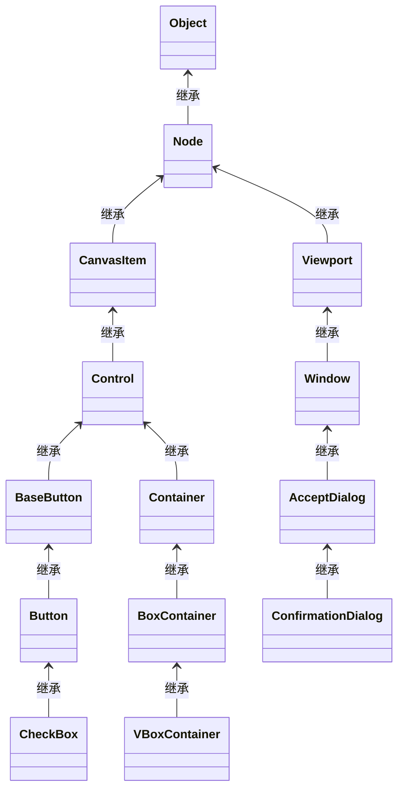

```mermaid
classDiagram
    direction TB
    
    class Object
    class Node
    class CanvasItem
    class Control
    class BaseButton
    class Button
    class CheckBox
    class Container
    class BoxContainer
    class VBoxContainer
    class Viewport
    class Window
    class AcceptDialog
    class ConfirmationDialog
    
    %% CheckBox 继承链
    Object <-- Node : 继承
    Node <-- CanvasItem : 继承
    CanvasItem <-- Control : 继承
    Control <-- BaseButton : 继承
    BaseButton <-- Button : 继承
    Button <-- CheckBox : 继承
    
    %% VBoxContainer 继承链
    Control <-- Container : 继承
    Container <-- BoxContainer : 继承
    BoxContainer <-- VBoxContainer : 继承
    
    %% ConfirmationDialog 继承链
    Node <-- Viewport : 继承
    Viewport <-- Window : 继承
    Window <-- AcceptDialog : 继承
    AcceptDialog <-- ConfirmationDialog : 继承
```