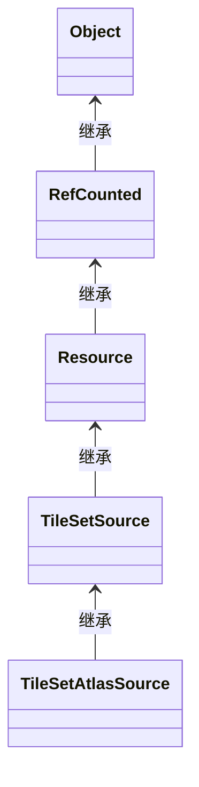

```mermaid
classDiagram
    direction TB
    
    class Object
    class RefCounted
    class Resource
    class TileSetSource
    class TileSetAtlasSource
    
    Object <-- RefCounted : 继承
    RefCounted <-- Resource : 继承
    Resource <-- TileSetSource : 继承
    TileSetSource <-- TileSetAtlasSource : 继承
```
