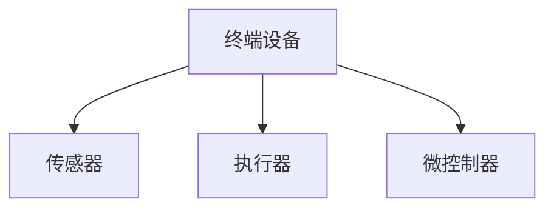
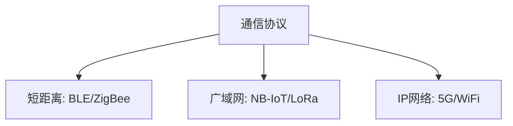
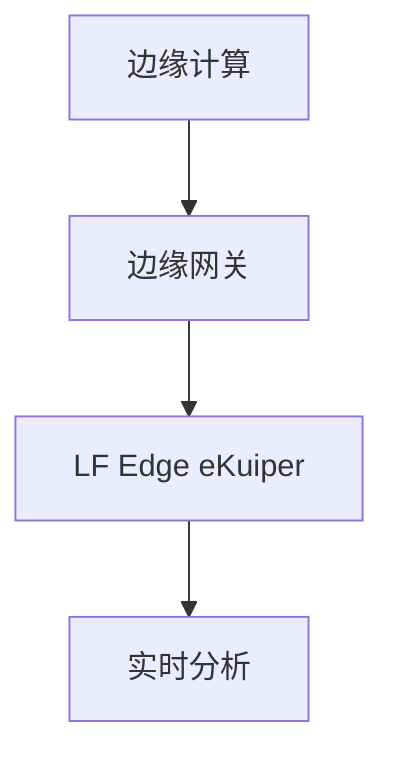
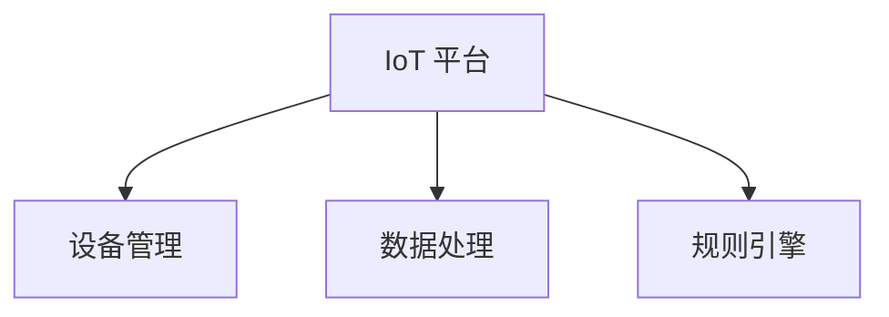
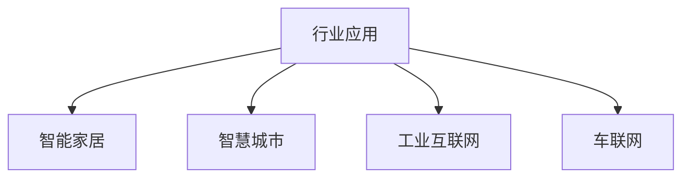
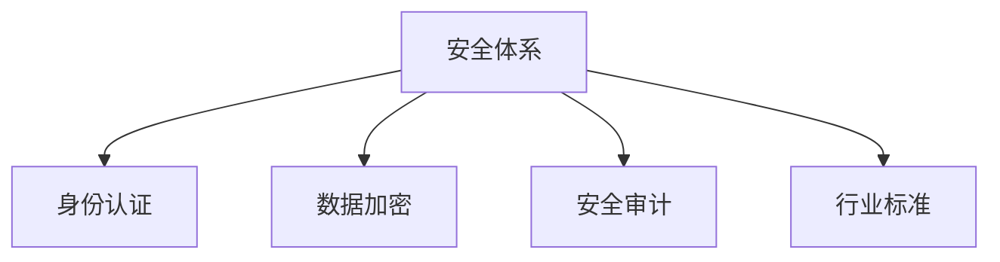

# 物联网 (IoT) 知识图谱

## 1. 感知与设备 (Perception & Devices)

### 关键组件

### 参考链接

## 2. 网络与通信 (Network & Communication)

### 关键组件

### 参考链接

## 3. 边缘计算 (Edge Computing)

**eKuiper**: LF Edge eKuiper 是一款专为资源受限的边缘设备设计的轻量级物联网数据分析和流处理引擎。

### 关键组件

### 参考链接
- [LF Edge eKuiper 官网](https://ekuiper.org/)

## 4. 平台与云 (Platform & Cloud)

### 关键组件

### 参考链接

## 5. 行业应用 (Applications)

### 关键组件

### 参考链接

## 6. 安全与标准 (Security & Standards)

### 关键组件

### 参考链接
