# 股票投资基础知识详解

> 本文针对 `@docs\Personal\个人选股平台` 项目中涉及的股票专业名词进行讲解
> 通过图表帮助你建立直观理解

---

## 一、股票基础概念

### 1.1 什么是股票？

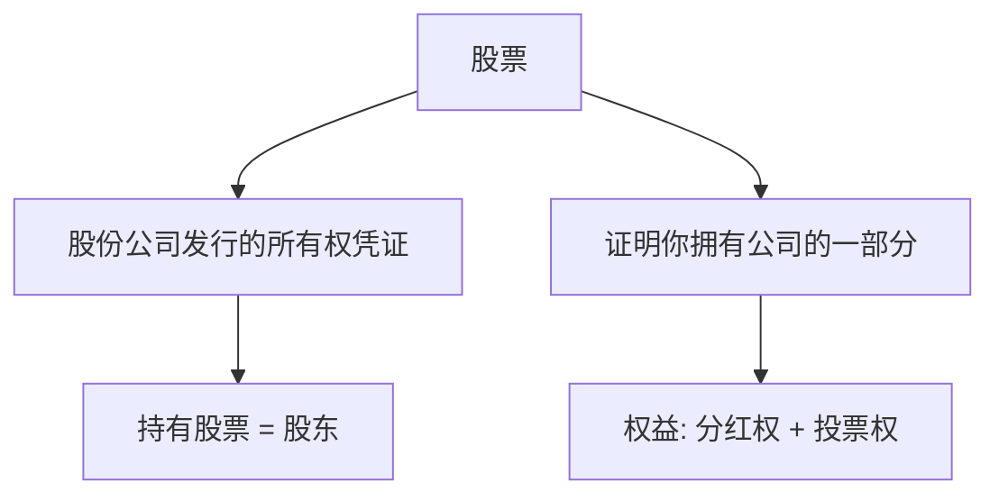

**通俗解释**：
- 公司需要钱发展业务 → 发行股票融资
- 你花钱买公司的股票 → 你成了公司的"小老板"之一
- 公司赚钱分红给你 → 你也跟着赚钱
- 公司发展好 → 股票升值 → 你卖掉也能赚

---

### 1.2 股票市场分类（A股/港股/美股）

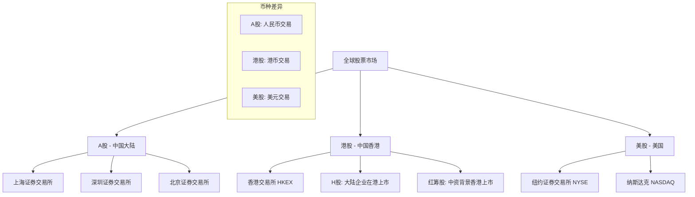

#### **A股 - 人民币普通股票**

| 特征 | 说明 |
|------|------|
| **交易市场** | 上海证券交易所、深圳证券交易所、北京证券交易所 |
| **交易货币** | 人民币(CNY) |
| **交易时间** | 9:30-11:30, 13:00-15:00（北京时间） |
| **涨跌幅限制** | 主板±10%，科创板/创业板±20%，北交所±30% |
| **投资者** | 境内投资者为主，境外通过QFII/RQFII/沪深港通 |

**A股板块分类**：
- **主板**：大型成熟企业，代码60开头(沪)/00开头(深)
- **科创板**：科技创新企业，代码688开头，注册制
- **创业板**：成长型创新企业，代码300开头
- **北交所**：专精特新中小企业，代码8开头

#### **港股 - 香港联合交易所**

| 特征 | 说明 |
|------|------|
| **交易市场** | 香港交易所(HKEX) |
| **交易货币** | 港币(HKD) |
| **交易时间** | 9:30-12:00, 13:00-16:00（香港时间） |
| **涨跌幅限制** | 无涨跌幅限制（可一天跌90%或涨100%） |
| **投资者** | 全球投资者，国际化程度高 |

**港股分类**：
- **H股**：中国大陆注册企业在香港上市
- **红筹股**：中资背景、境外注册在香港上市
- **蓝筹股**：大型优质企业（如腾讯、汇丰、港交所）

#### **美股 - 美国证券市场**

| 特征 | 说明 |
|------|------|
| **主要市场** | 纽交所(NYSE)、纳斯达克(NASDAQ)、美交所(AMEX) |
| **交易货币** | 美元(USD) |
| **交易时间** | 盘前4:00-9:30, 盘中9:30-16:00, 盘后16:00-20:00（美东时间） |
| **涨跌幅限制** | 个股无限制，但有熔断机制（市场层面） |
| **投资者** | 全球投资者，市场最成熟 |

**美股分类**：
- **NYSE**：传统大企业（金融、能源、工业）
- **NASDAQ**：科技股为主（苹果、微软、谷歌、特斯拉）
- **中概股**：中国企业在美上市（阿里巴巴、拼多多、京东）

---

### 1.3 股票代码规则

股票代码是每只股票的唯一标识符，不同市场规则不同：

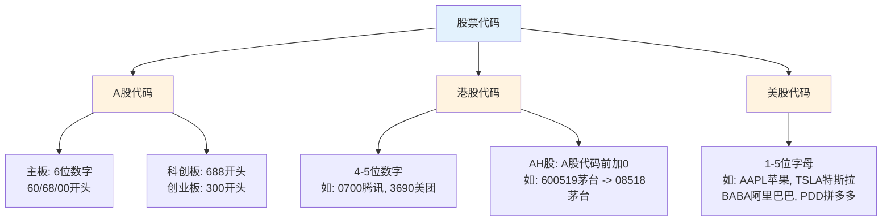

#### **A股代码详解**

| 代码范围 | 市场/板块 | 示例 |
|----------|----------|------|
| **600/601/603/605** | 上海主板 | 600519 贵州茅台 |
| **688** | 科创板 | 688981 中芯国际 |
| **000/001/002/003** | 深圳主板 | 000858 五粮液 |
| **300/301** | 创业板 | 300750 宁德时代 |
| **430/830/87/88** | 北交所 | 835185 贝特瑞 |

#### **港股代码详解**

| 代码类型 | 说明 | 示例 |
|----------|------|------|
| **1-4位数字** | 普通港股代码 | 0001 长和, 0700 腾讯 |
| **8xxx** | 创业板(已取消，现存多为旧股) | 8001 易方达 |
| **H股代码** | 大陆企业在港上市 | 1288 农业银行H股 |
| **红筹代码** | 中资企业境外注册 | 0700 腾讯控股 |

#### **美股代码详解**

| 代码特征 | 说明 | 示例 |
|----------|------|------|
| **1-5位字母** | 普通股票代码 | AAPL(苹果)、TSLA(特斯拉) |
| **带"."后缀** | 特殊类别股 | BRK.A(伯克希尔A股)、BRK.B(B股) |
| **中概股** | 中国企业美国上市 | BABA(阿里)、PDD(拼多多)、JD(京东) |
| **ETF** | 指数基金 | SPY(S&P500)、QQQ(纳斯达克100) |

#### **跨市场对照示例**

| 公司 | A股代码 | 港股代码 | 美股代码 |
|------|---------|----------|----------|
| **阿里巴巴** | — | 9988.HK | BABA |
| **腾讯** | — | 0700.HK | TCEHY(ADR) |
| **工商银行** | 601398 | 1398.HK | ICBCY(ADR) |
| **中国平安** | 601318 | 2318.HK | PINGY(ADR) |
| **比亚迪** | 002594 | 1211.HK | BYDDF |
| **招商银行** | 600036 | 3968.HK | CIHHY(ADR) |

> 💡 **ADR说明**：American Depositary Receipt（美国存托凭证），让美股投资者可以间接持有外国公司股票

---

## 二、核心财务指标（重点）

### 2.1 PE - 市盈率（Price-to-Earnings Ratio）

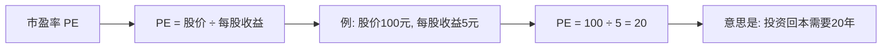

| PE范围 | 含义 | 投资策略 |
|--------|------|---------|
| **PE < 15** | 可能被低估 | 价值投资者关注 |
| **PE 15-30** | 合理估值 | 正常区间 |
| **PE > 30** | 可能被高估 | 需谨慎 |

**实战案例**：
```
贵州茅台 PE ≈ 25  →  估值相对合理
工商银行 PE ≈ 5   →  银行传统低PE
特斯拉 PE ≈ 100   →  高增长预期支撑高PE
```

---

### 2.2 PB - 市净率（Price-to-Book Ratio）

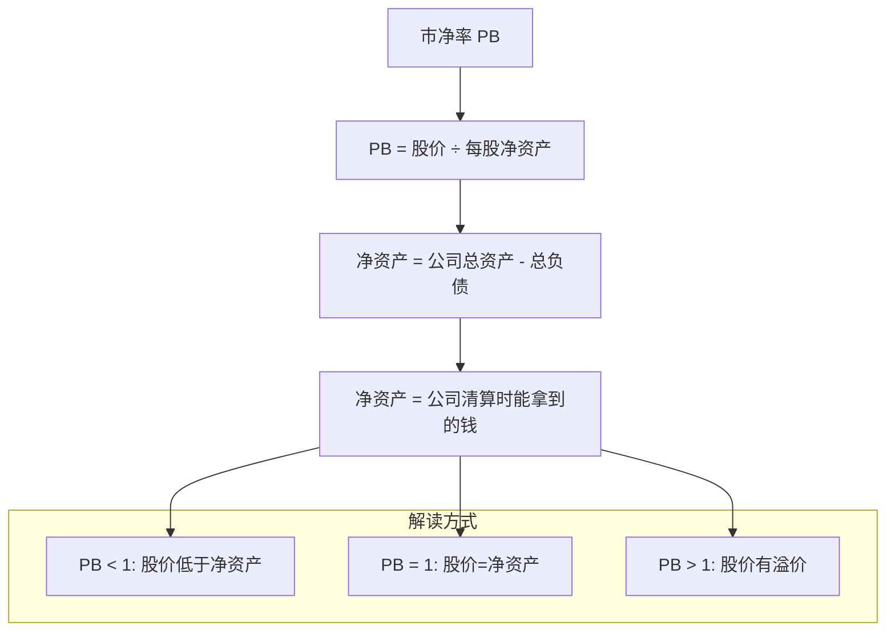

**适用场景**：
- **重资产行业**（银行、地产、钢铁）：PB很重要
- **轻资产行业**（互联网、软件）：PB参考意义不大

---

### 2.3 ROIC - 投资资本回报率

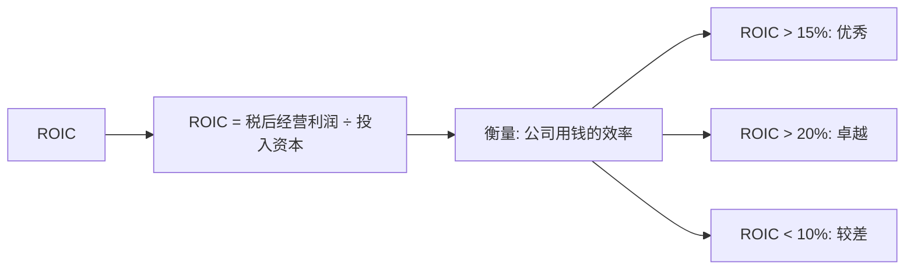

**ROIC vs ROE 对比**：

| 指标 | 全称 | 关注点 | 缺点 |
|------|------|--------|------|
| **ROE** | 净资产收益率 | 股东回报 | 可通过负债放大 |
| **ROIC** | 投资资本回报率 | 整体资本效率 | 更准确反映真实盈利能力 |

> 💡 **巴菲特最爱**：高ROIC + 高ROE = 优秀公司标志

---

## 三、估值方法

### 3.1 DCF - 折现现金流模型

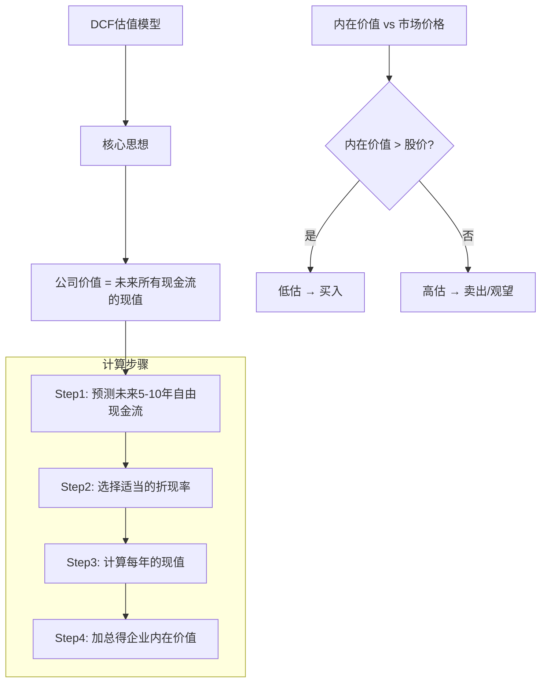

**关键参数**：

| 参数 | 含义 | 常用取值 |
|------|------|---------|
| **增长率** | 未来现金流增长速度 | 5%-15%（保守估计） |
| **折现率** | 资金的时间成本 | 8%-12%（常用10%） |
| **永续增长率** | 长期稳定增长率 | 2%-3%（通常=通胀率） |

**公式可视化**：
```
企业价值 = CF₁/(1+r)¹ + CF₂/(1+r)² + CF₃/(1+r)³ + ... + 终值/(1+r)ⁿ

其中:
CF = 每年的自由现金流
r  = 折现率
```

---

### 3.2 股息与股息率

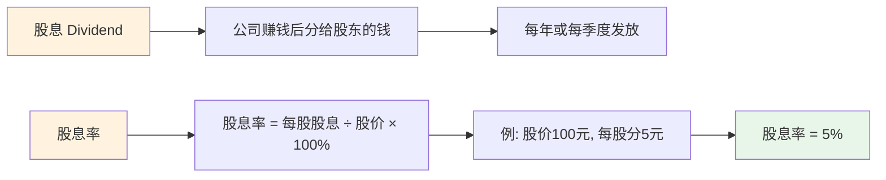

**高股息策略适用人群**：
- 追求稳定现金流的投资者
- 退休养老需求
- 熊市时的防御策略

---

## 四、价值投资核心概念

### 4.1 护城河（Economic Moat）

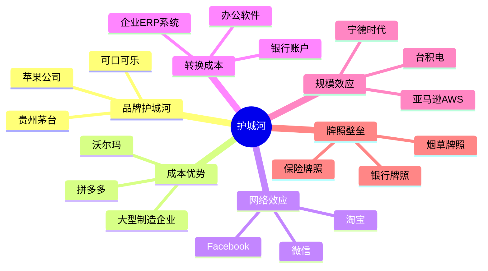

**护城河评分（1-10分）**：

| 分数 | 含义 | 代表公司 |
|------|------|---------|
| 9-10 | 极宽护城河 | 茅台、苹果、微软 |
| 7-8 | 强护城河 | 腾讯、阿里巴巴、宁德时代 |
| 5-6 | 中等护城河 | 大部分细分龙头 |
| 3-4 | 弱护城河 | 一般公司 |
| 1-2 | 几乎没有 | 同质化竞争激烈 |

---

### 4.2 价值投资的本质

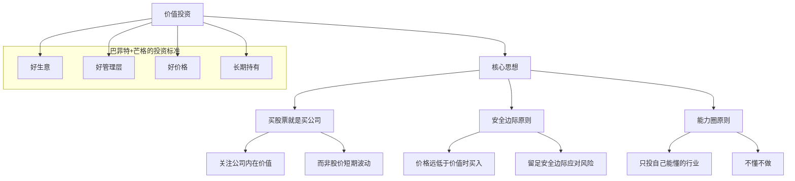

---

## 五、技术分析工具

### 5.1 财报分析要点

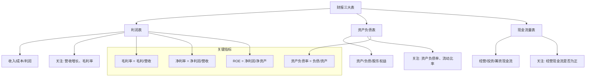

---

### 5.2 回测（Backtesting）

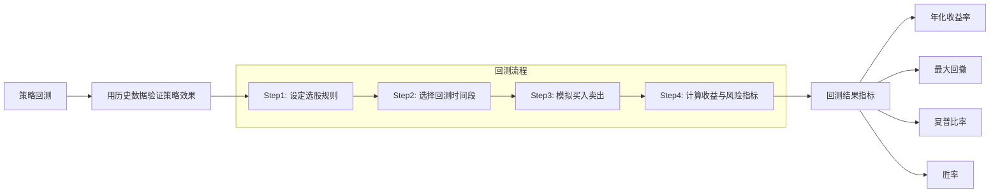

**回测关键指标**：

| 指标 | 含义 | 理想值 |
|------|------|--------|
| **年化收益率** | 策略每年平均收益 | >15%（优秀） |
| **最大回撤** | 从高点到低点的最大跌幅 | `<20%`（可控） |
| **夏普比率** | 风险调整后的收益 | >1（良好） |
| **胜率** | 盈利交易占比 | >50% |

---

### 5.3 风险预警指标

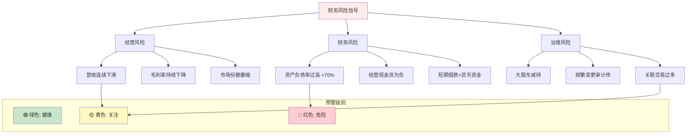

---

## 六、选股策略框架

### 6.1 多因子选股模型

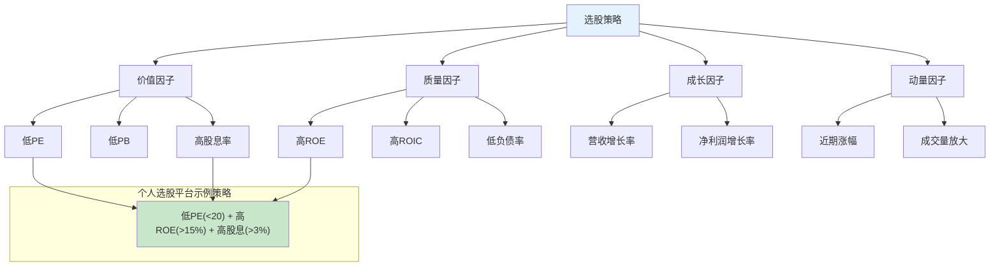

---

### 6.2 估值状态判断

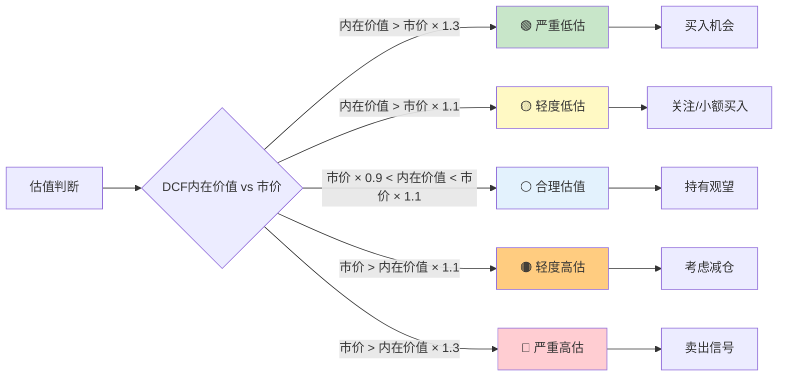

---

## 七、实战投资框架

### 7.1 完整投资决策流程

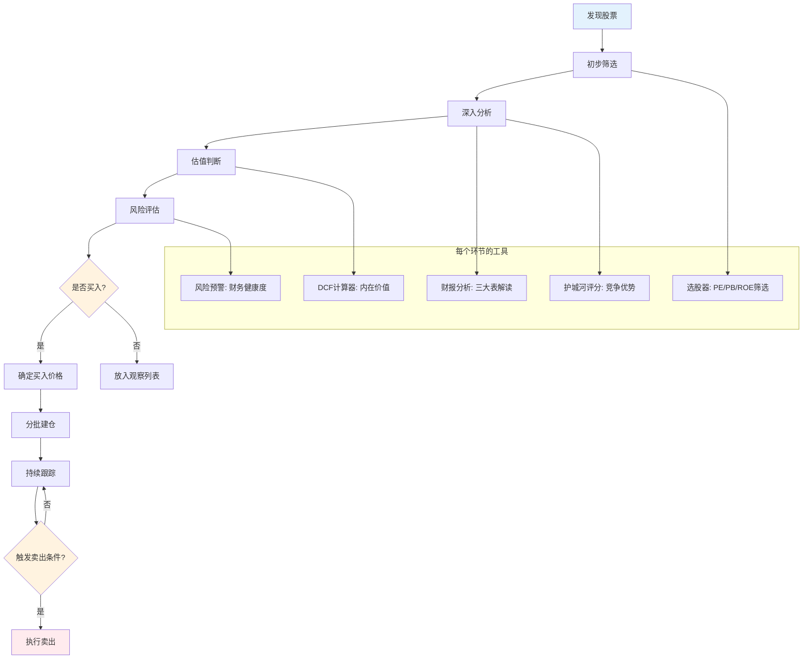

---

### 7.2 持仓管理原则

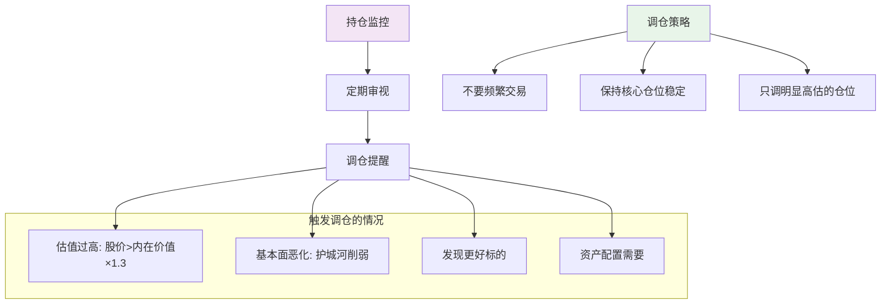

---

## 八、名词速查表

### 基础概念

| 名词 | 英文 | 含义 | 应用 |
|------|------|------|------|
| **市盈率** | PE | 股价/每股收益 | 估值参考 |
| **市净率** | PB | 股价/每股净资产 | 重资产行业估值 |
| **ROE** | Return on Equity | 净资产收益率 | 盈利能力指标 |
| **ROIC** | Return on Invested Capital | 投资资本回报率 | 资本效率指标 |
| **DCF** | Discounted Cash Flow | 折现现金流 | 估值模型 |
| **EPS** | Earnings Per Share | 每股收益 | 盈利指标 |
| **股息率** | Dividend Yield | 股息/股价 | 分红指标 |
| **财报** | Financial Report | 季度/年度财务报告 | 基本面分析 |
| **护城河** | Moat | 竞争优势 | 长期竞争力 |
| **回测** | Backtesting | 历史数据验证 | 策略检验 |
| **内在价值** | Intrinsic Value | 公司真实价值 | 投资决策 |
| **安全边际** | Margin of Safety | 价格与价值的差距 | 风险控制 |

### 市场与代码

| 名词 | 英文 | 含义 | 代码特征 |
|------|------|------|----------|
| **A股** | A-Share | 中国大陆人民币普通股票 | 6位数字，60/00/688/300开头 |
| **港股** | Hong Kong Stock | 香港联合交易所上市股票 | 4-5位数字，如0700腾讯 |
| **美股** | US Stock | 美国证券市场股票 | 1-5位字母，如AAPL苹果 |
| **H股** | H-Share | 大陆企业在香港上市的股票 | 港股代码，如1398工行H股 |
| **红筹股** | Red Chip | 中资背景、境外注册在港上市 | 港股代码，如0700腾讯 |
| **中概股** | China Concept | 中国企业在美上市股票 | 美股代码，如BABA阿里 |
| **ADR** | American Depositary Receipt | 美国存托凭证 | 美股代码交易外国公司股票 |
| **主板** | Main Board | 大型成熟企业板块 | 60/00开头 |
| **科创板** | STAR Market | 科技创新企业板块 | 688开头 |
| **创业板** | ChiNext | 成长型创新企业板块 | 300开头 |
| **沪深港通** | Stock Connect | 内地与香港股票市场互通机制 | — |

---

## 九、总结

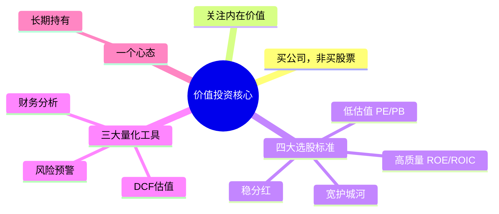

---

> 📌 **记住**:
> - PE看估值便宜与否
> - ROE看赚钱能力强弱
> - 护城河看竞争优势大小
> - DCF算内在价值高低
> - 安全边际保投资安全

*本文档配合 `个人选股平台` 项目使用，帮助你理解项目中涉及的各项股票专业指标。*
