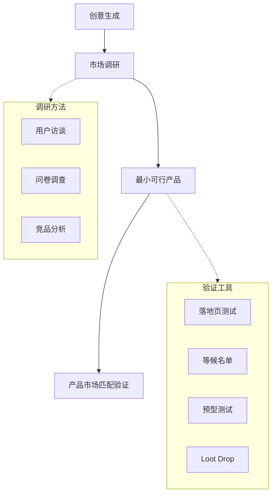
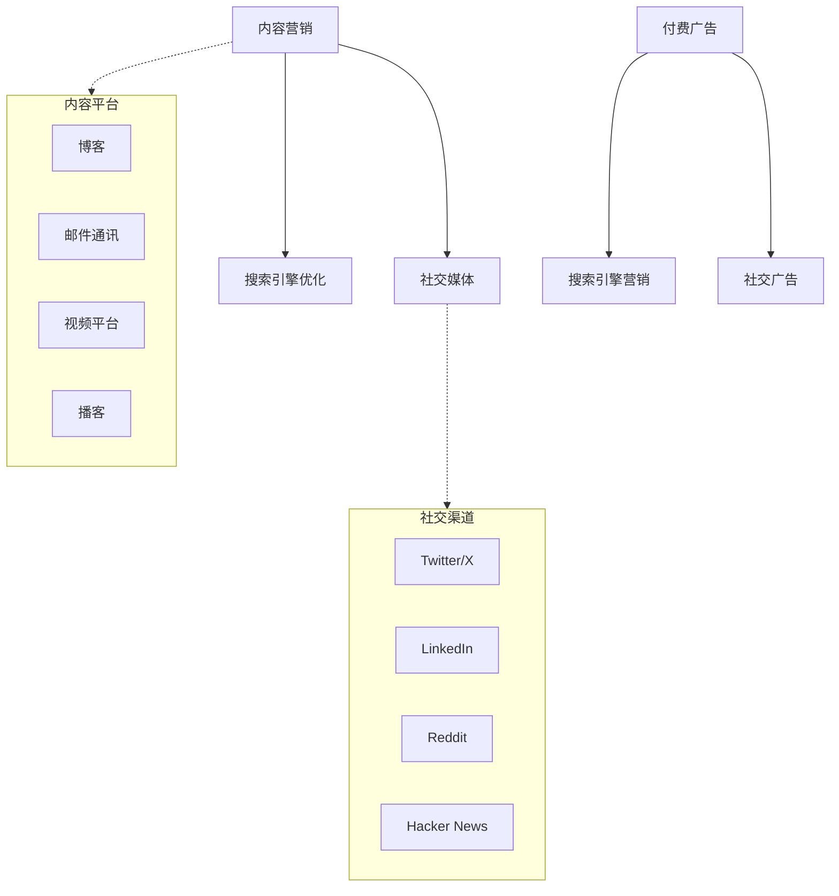
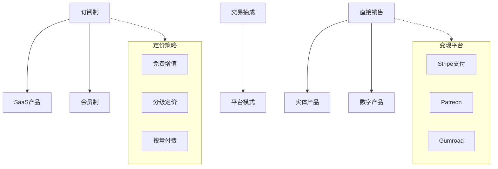
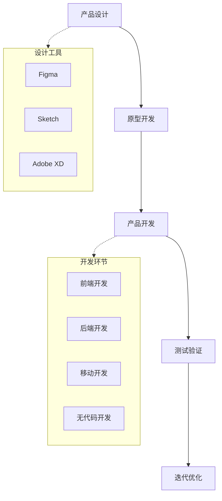
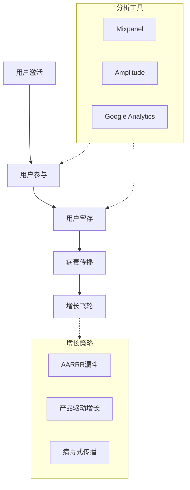
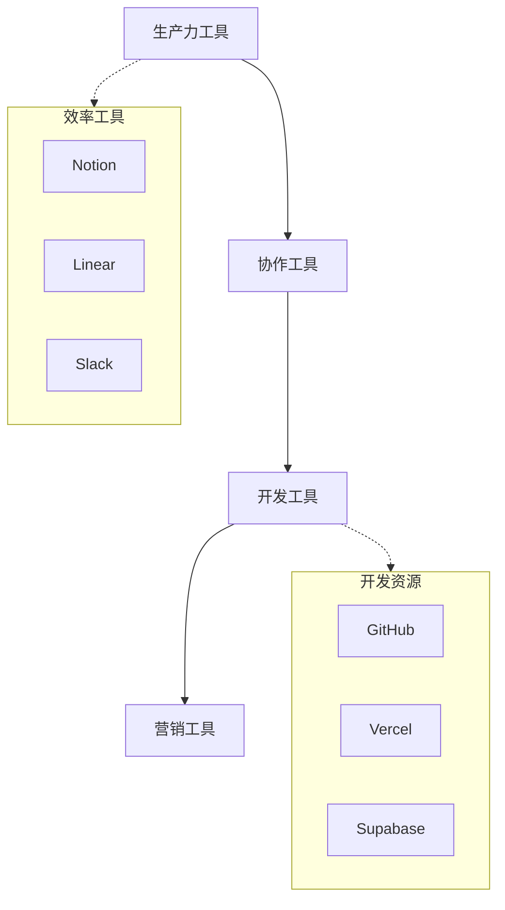

# 创业知识网

本文档旨在梳理创业生态系统中的关键概念、方法、工具及其相互关系，帮助创业者系统化理解从创意到变现的完整路径。

## 1. 创意与验证 (Ideation & Validation)

创业始于一个好的创意，但更重要的是快速验证这个创意是否值得投入。本章节涵盖创意生成、市场调研和商业模式验证等关键环节。

### 关键组件

### 概念说明

*   **创意生成**: 通过头脑风暴、问题观察、趋势分析等方法产生创业想法的过程。
*   **市场调研**: 系统性地收集和分析市场信息，了解目标用户需求、市场规模和竞争格局。
*   **用户访谈**: 与潜在用户进行一对一深度交流，挖掘真实痛点和需求。
*   **竞品分析**: 研究竞争对手的产品、定价、营销策略，找到差异化机会。
*   **最小可行产品 (MVP)**: 用最小成本开发的、能验证核心假设的产品版本。
*   **产品市场匹配 (PMF)**: 产品满足市场需求的程度，是创业成功的关键指标。
*   **落地页测试**: 通过创建简单的宣传页面，测试用户对产品概念的兴趣度。
*   **Loot Drop**: 一个收录了 1100 多个失败创业案例的库，提供失败原因分析，帮助创业者通过复盘历史失败经验来验证和优化自己的创意。

### 参考链接

- [Y Combinator](https://www.ycombinator.com/) - 知名创业孵化器
- [Product Hunt](https://www.producthunt.com/) - 新产品发现平台
- [Loot Drop](https://www.loot-drop.io/) - 失败创业公司案例库

## 2. 流量获取 (Traffic Acquisition)

没有流量就没有用户。本章节涵盖各种获取目标用户的方法和渠道，包括免费和付费流量策略。

### 关键组件

### 概念说明

*   **内容营销**: 通过创作和分享有价值的内容吸引和留住目标受众，最终推动盈利行为。
*   **SEO (搜索引擎优化)**: 通过优化网站内容和结构，提高在搜索引擎自然排名中的位置。
*   **社交媒体营销**: 利用社交平台建立品牌认知、与用户互动并获取流量。
*   **付费广告**: 通过购买广告位快速获取流量，包括搜索广告、展示广告、社交广告等。
*   **邮件通讯 (Newsletter)**: 定期向订阅者发送内容，建立长期用户关系。
*   **Reddit**: 全球最大的社区平台，包含大量创业相关的子版块（如 r/entrepreneur），是进行用户调研和早期引流的重要渠道。
*   **Hacker News**: Y Combinator 运营的科技社区，是技术产品获取早期用户的重要渠道。

### 参考链接

- [Google Analytics](https://analytics.google.com/) - 网站分析工具
- [Hacker News](https://news.ycombinator.com/) - 技术社区流量来源
- [Reddit](https://www.reddit.com/) - 全球最大的社区讨论平台

## 3. 变现模式 (Monetization)

将流量转化为收入是创业的核心目标。本章节涵盖各种商业模式和变现策略。

### 关键组件

### 概念说明

*   **订阅制**: 用户定期付费（月付/年付）获取产品或服务使用权的商业模式。
*   **SaaS (软件即服务)**: 通过互联网提供软件应用，用户按需订阅使用。
*   **免费增值 (Freemium)**: 提供基础功能免费，高级功能付费的商业模式。
*   **平台抽成**: 搭建交易平台，从每笔交易中抽取一定比例作为收入。
*   **Patreon**: 创作者订阅变现平台，粉丝按月付费支持喜欢的创作者。
*   **Stripe**: 在线支付处理平台，帮助创业者快速接入支付功能。

### 参考链接

- [Stripe](https://stripe.com/) - 在线支付处理平台
- [Patreon](https://www.patreon.com/) - 创作者订阅变现平台

## 4. 产品开发 (Product Development)

将想法转化为实际产品的过程。本章节涵盖产品构建、设计、开发和迭代的方法论。

### 关键组件

### 概念说明

*   **产品设计**: 定义产品功能、用户体验和界面设计的过程。
*   **原型开发**: 创建产品的可交互模型，用于测试和验证设计想法。
*   **敏捷开发**: 通过短周期迭代、持续反馈快速交付产品的方法论。
*   **无代码开发**: 使用可视化工具而非编程代码构建应用，降低开发门槛。
*   **Figma**: 基于云的界面设计工具，支持实时协作和原型制作。
*   **Vercel**: 前端部署平台，支持快速发布和自动扩缩容。

### 参考链接

- [Figma](https://www.figma.com/) - 界面设计和原型工具
- [Vercel](https://vercel.com/) - 前端部署平台

## 5. 运营增长 (Operations & Growth)

获取用户只是开始，如何留住用户并推动增长才是关键。本章节涵盖用户运营、增长黑客和数据分析。

### 关键组件

### 概念说明

*   **AARRR 漏斗**: 用户获取 (Acquisition)、激活 (Activation)、留存 (Retention)、收入 (Revenue)、推荐 (Referral) 五个阶段的增长模型。
*   **产品驱动增长 (PLG)**: 以产品体验为核心驱动力，让用户通过使用产品自然转化为付费客户。
*   **用户留存**: 衡量用户持续使用产品的能力，是产品健康度的关键指标。
*   **病毒式传播**: 通过现有用户推荐新用户，实现指数级增长的传播机制。
*   **Mixpanel**: 用户行为分析工具，帮助理解用户如何与产品互动。
*   **Intercom**: 客户沟通平台，支持应用内消息、邮件和客服聊天。

### 参考链接

- [Mixpanel](https://mixpanel.com/) - 用户行为分析工具
- [Intercom](https://www.intercom.com/) - 客户沟通平台

## 6. 工具与资源 (Tools & Resources)

工欲善其事，必先利其器。本章节汇总创业过程中常用的工具和资源。

### 关键组件

### 概念说明

*   **Notion**: 知识管理和协作工具，支持笔记、数据库、项目管理等多种功能。
*   **Linear**: 现代化的项目管理工具，专为软件团队设计，界面简洁高效。
*   **Slack**: 团队即时通讯工具，支持频道、集成和自动化工作流。
*   **GitHub**: 代码托管和协作平台，支持版本控制、CI/CD 和项目管理。
*   **Supabase**: 开源 Firebase 替代品，提供数据库、认证、存储等后端服务。
*   **Zapier**: 自动化工具，可以连接不同应用，实现工作流程自动化。

### 参考链接

- [Notion](https://www.notion.so/) - 知识管理和协作工具
- [Linear](https://linear.app/) - 项目管理工具
