# 智能销售助手系统 — 技术解决方案

## 文档信息

| 项目 | 内容 |
|------|------|
| **产品名称** | 智能销售助手 (AI Sales Assistant) |
| **版本** | MVP v1.0 (一期) |
| **企业** | 子午线高科智能科技 |
| **创建日期** | 2026-02-07 |
| **文档版本** | v1.0 |

---

## 1. 执行摘要

### 1.1 项目概述

智能销售助手是一款面向**线上课程训练营销售团队**的 AI 驱动客户关系管理系统。系统通过整合企业微信、直播平台、试听课平台等多源数据，借助 AI 智能分析和自动化提醒，帮助销售人员在 **4-5 天训练营转化窗口**内高效管理客户、精准跟进、提升转化率。

### 1.2 核心价值主张

> "让销售拥有超强记忆力，精准记住每个客户的所有细节，智能识别高意向学员，高效完成转化。"

### 1.3 技术方案要点

- **整体架构**：采用 **"三层两翼"** 设计理念 — 感知层、决策层、执行层为核心主干，销售工作台（左翼）与运营配置中心（右翼）为协作翅膀
- **后端**：Python + FastAPI，微服务架构
- **前端**：React 管理后台 + Rust/Tauri 企微侧边栏
- **AI 引擎**：LangChain + LangGraph 多智能体框架，Qdrant 向量数据库，LlamaIndex 文档索引
- **提示词工程**：DSPy 自动化提示词优化 + Agent Skill 技能体系
- **模型策略**：多模型路由（Gemini 3 Pro / Claude Sonnet 4 / Claude Opus 4 / GPT），按场景择优选用国际顶尖模型

---

## 2. 背景与需求

### 2.1 业务背景

| 维度 | 说明 |
|------|------|
| **业务模式** | 成人线上课程 — AI Agent 副业培训 |
| **业务流程** | 直播引流 → 4天试听训练营 → 销售跟进转化 → 购买正式课程 |
| **团队规模** | 销售主管管理 5-10 名销售 |
| **每期新增** | 120 人/期 |
| **训练营频率** | 每周一期 (DAY0-DAY5) |
| **长期培育池** | 往期未成交学员累积增长，无清理机制 |

### 2.2 核心痛点

| 痛点 | 现状 | 业务影响 |
|------|------|----------|
| **120人/期记忆负担极重** | 每周新增120人，每人独特痛点、顾虑、家庭情况 | 重复询问客户问题，体验差，转化率低 |
| **长期池无限累积失控** | 往期未成交学员持续累积（第5期已有570人） | 高价值客户被埋没，激活困难 |
| **4-5天转化窗口压力大** | DAY0-DAY5必须完成转化，时间紧迫 | 低效跟进导致转化率低 |
| **意向识别靠经验判断** | 凭感觉判断谁是高意向，容易遗漏 S/A 量学员 | 高价值客户流失，资源浪费 |
| **数据散落多系统** | 企微聊天、直播数据、试听课数据分散在3-4个系统 | 查询效率低，准备时间长 |

### 2.3 功能需求清单

#### P0 — 核心功能（MVP 必须）

| 编号 | 功能模块 | 说明 |
|------|----------|------|
| F1 | **客户智能列表（批次管理视图）** | 本期营/长期池双池视图，按 AI 评分排序，多维筛选 |
| F2 | **客户360°视图（记忆辅助）** | 基本信息、AI意向分析、训练营进度、聊天记录检索、快捷操作 |
| F3 | **AI 意向分析引擎** | 四维度评分（价格/需求/共识/信任，各0-100），综合评分，S/A/B 自动分级 |
| F4 | **智能提醒系统** | 紧急/重要/常规/长期池四级提醒，收单倒计时，未回复预警 |
| F5 | **企业微信数据同步** | 实时同步客户信息、聊天记录、行为数据；支持企微+星程+抖音+电话录音 |

#### P1 — 重要功能（后续迭代）

| 编号 | 功能模块 | 说明 |
|------|----------|------|
| F6 | **AI 话术推荐** | 基于客户分级+场景生成 3 条个性化话术，一键复制 |
| F7 | **未成交原因分析** | LLM 分析聊天记录，自动分类（价格敏感/延迟购买/效果怀疑/需商量等） |
| F8 | **长期池智能激活** | 高潜力筛选 + 个性化激活话术生成 |
| F9 | **主管视图与异常预警** | 团队看板、个人排名、高意向跟进率预警、一键干预 |

### 2.4 非功能需求

| 维度 | 要求 |
|------|------|
| **性能** | AI 意向分析每小时执行一次（可配置30min/1h/2h），仅在有新数据时触发；聊天记录检索 < 2s |
| **安全** | 数据加密存储（AES-256），聊天记录仅销售本人可见，客户敏感信息脱敏 |
| **合规** | 严格遵守企业微信会话存档规则，需双重授权（员工+客户） |
| **可扩展** | 支持新数据源接入（抖音开发者平台、电话录音），支持新模型热替换 |
| **可用性** | 企微侧边栏秒级加载，管理后台 SPA 流畅交互 |

---

## 3. 系统架构

### 3.1 总体架构 — "三层两翼" 设计

系统采用 **"三层两翼"** 架构设计理念，以事件驱动和状态机决策为核心模型。

```
┌─────────────────────────────────────────────────────────────────────────────────────┐
│                              智能销售助手系统架构                                     │
│                         基于 "三层两翼" 设计理念                                      │
├─────────────────────────────────────────────────────────────────────────────────────┤
│                                                                                     │
│  ┌──────────────────┐    ┌────────────────────────────────┐    ┌──────────────────┐ │
│  │  🦅 左翼          │    │     ⬇️ 核心三层 (Main Spine)    │    │  🦅 右翼          │ │
│  │  销售实操工作台   │◀──│                                │──▶│  运营配置中心     │ │
│  │  (Human-in-loop) │    │  ┌──────────────────────────┐  │    │  (Configuration) │ │
│  │                  │    │  │ 1. 感知层 (Perception)   │  │    │                  │ │
│  │  • 企微侧边栏    │    │  │    事件驱动信号总线      │  │    │  • 策略画布配置   │ │
│  │    (Tauri)       │    │  │    Webhook接收 → 清洗    │  │    │  • 原子事实管理   │ │
│  │  • 实时漏斗仪表盘│    │  │    → 去重/防抖 → MQ      │  │    │    (价格/政策)    │ │
│  │  • 人工干预/改派  │    │  └────────────┬─────────────┘  │    │  • 人群包与LTV   │ │
│  │  • 待办任务中心   │    │               ▼                │    │    配置           │ │
│  │                  │    │  ┌──────────────────────────┐  │    │  • 审计与风控日志 │ │
│  │  ──────────────  │    │  │ 2. 决策层 (Decision)     │  │    │                  │ │
│  │  React管理后台   │    │  │    FSM状态机 & 策略路由  │  │    │  ──────────────  │ │
│  │  • 客户列表      │    │  │    冲突消解 → AI Agent   │  │    │  React管理后台   │ │
│  │  • 客户360°视图  │    │  │    & RAG 知识检索        │  │    │  • 策略配置界面   │ │
│  │  • 团队看板      │    │  └────────────┬─────────────┘  │    │  • 模型管理      │ │
│  │  • 数据分析      │    │               ▼                │    │  • 系统监控      │ │
│  │                  │    │  ┌──────────────────────────┐  │    │                  │ │
│  │                  │    │  │ 3. 执行层 (Execution)    │  │    │                  │ │
│  │                  │    │  │    通道抽象网关           │  │    │                  │ │
│  │                  │    │  │    统一发送 → 高频防护   │  │    │                  │ │
│  │                  │    │  │    → 企微/短信/外呼适配  │  │    │                  │ │
│  │                  │    │  └──────────────────────────┘  │    │                  │ │
│  └──────────────────┘    └────────────────────────────────┘    └──────────────────┘ │
│                                                                                     │
│  ┌─────────────────────────────────────────────────────────────────────────────────┐ │
│  │                          基础设施层 (Infrastructure)                             │ │
│  │  PostgreSQL │ MongoDB │ Redis │ Qdrant │ Kafka │ MinIO/OSS │ Docker/K8s        │ │
│  └─────────────────────────────────────────────────────────────────────────────────┘ │
└─────────────────────────────────────────────────────────────────────────────────────┘
```

### 3.2 架构层级详解

#### 3.2.1 感知层 (Perception Layer)

> **系统的"耳目"** — 负责实时监听全渠道的异构信号，清洗并标准化为内部事件。

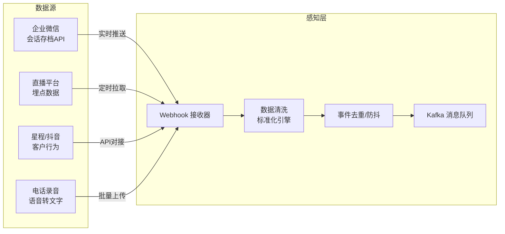

**技术选型**：

| 组件 | 技术 | 说明 |
|------|------|------|
| Webhook 接收器 | FastAPI + Uvicorn | 高性能异步 HTTP 服务，处理企微回调 |
| 消息队列 | Kafka / Redis Streams | 事件缓冲与解耦，保证消息不丢失 |
| 数据清洗 | Python + Pydantic | 统一事件模型，类型安全的数据校验 |
| 定时任务 | Celery + Redis | 周期性数据拉取（直播数据、试听课数据） |

**企微数据同步策略**：

| 同步类型 | 数据 | 频率 |
|----------|------|------|
| 实时同步 | 客户新增/删除 | 即时（Webhook回调） |
| 准实时同步 | 聊天消息 | 5分钟内（会话存档API轮询） |
| 定时同步 | 客户信息变更 | 每小时 |
| 批量同步 | 历史聊天补全 | 每天凌晨 |

> **⚠️ 企微接口说明**：优先使用企业微信官方会话存档 API（需企业认证+员工/客户双重授权）。若官方未开放所需接口，回退到 RPA 方案实现数据采集。

#### 3.2.2 决策层 (Decision Layer)

> **系统的"大脑"** — 维护客户状态 (FSM)，基于规则引擎和原子事实做出判断，驱动 AI 生成策略。

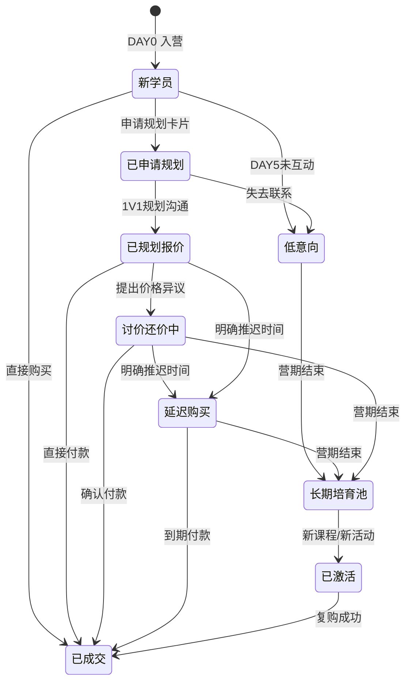

**AI Agent 架构**（基于 LangChain + LangGraph）：

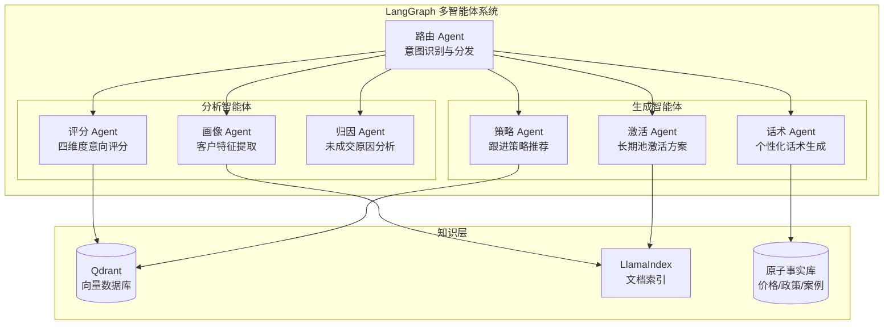

**AI 意向评分体系**：

| 维度 | 分析因子 | 评分规则 |
|------|----------|----------|
| **价格维度** (0-100) | 价格反应、消费能力、付款意愿 | 90-100: 主动询问付款方式；70-89: 关注性价比；50-69: 价格敏感；&lt;50: 强烈要求打折 |
| **需求维度** (0-100) | 痛点强度、紧迫性、主动性 | 90-100: 痛点明确+多次主动咨询；70-89: 有需求不紧迫；50-69: 兴趣了解；&lt;50: 被动了解 |
| **共识维度** (0-100) | 课程认可度、效果信心、竞品对比 | 90-100: 全勤听课+高度认可；70-89: 部分认可；50-69: 观望；&lt;50: 质疑效果 |
| **信任维度** (0-100) | 沟通深度、信息分享、互动质量 | 90-100: 主动深入沟通；70-89: 有所保留；50-69: 戒备中等；&lt;50: 戒备心强 |

**综合评分** = (价格 + 需求 + 共识 + 信任) / 4

**自动分级**：S量 (90-100) → A量 (80-89) → B量 (70-79) → 低意向 (&lt;70)

**定时分析引擎**：

| 配置 | 说明 |
|------|------|
| 默认频率 | 每1小时执行一次 |
| 可配置 | 30分钟 / 1小时 / 2小时 |
| 智能触发 | 仅在有新聊天记录或行为数据时执行 |
| Buff调整 | 销售可手动微调综合评分 ±5分 |

**模型路由策略**：

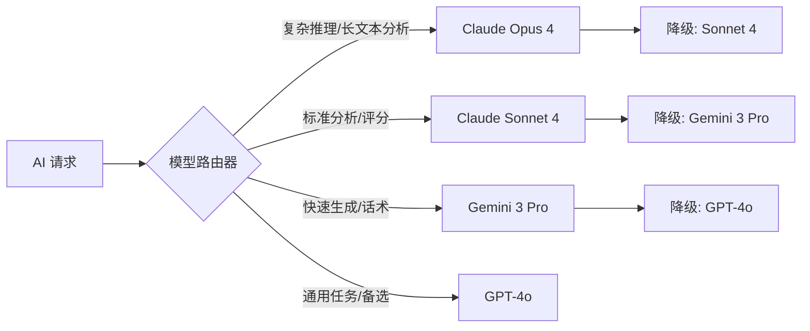

总原则：**优先使用国际顶尖模型**，具体选型需在实际开发中通过 DSPy 评估框架进行 A/B 测试，根据各场景（评分准确度、话术生成质量、响应速度、成本）综合择优。

#### 3.2.3 执行层 (Execution Layer)

> **系统的"手脚"** — 屏蔽底层 API 差异，负责安全、合规地将指令触达给客户。

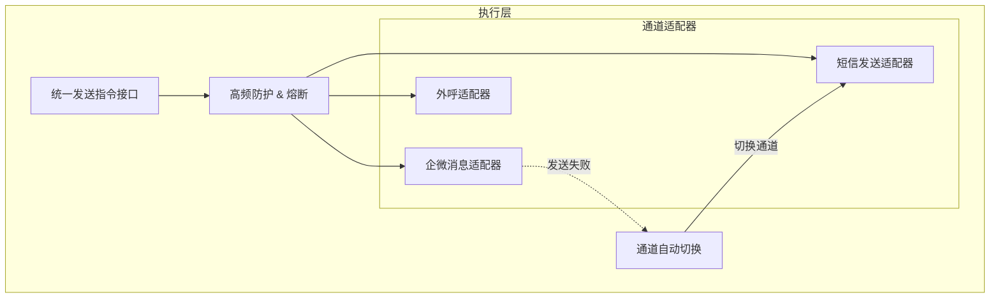

**通道优先级**：企微消息 > 短信 > 外呼

**安全机制**：

| 机制 | 说明 |
|------|------|
| 频率限制 | 同一客户每小时最多 N 条消息（可配置） |
| 熔断保护 | 通道异常时自动降级，防止消息轰炸 |
| 审计日志 | 所有发送记录可追溯 |
| 敏感词过滤 | 发送前检查话术合规性 |

#### 3.2.4 左翼 — 销售实操工作台

> **Human-in-the-loop** — 销售人员的核心交互界面

**两个终端**：

| 终端 | 技术 | 场景 |
|------|------|------|
| **企微侧边栏** | Rust + Tauri | 在企微聊天窗口旁实时展示客户信息、AI建议 |
| **管理后台 (Web)** | React + TypeScript | 全量客户管理、数据分析、批量操作 |

**企微侧边栏功能**：
- 客户360°视图（精简版）
- AI 实时评分与分级标签
- AI 话术推荐（一键复制）
- 快捷跟进记录
- 未读提醒

**管理后台功能**：
- 本期营/长期池双池视图
- 客户360°完整视图
- 批量操作（群发、标签管理）
- 实时漏斗仪表盘
- 人工干预/改派
- 待办任务中心

#### 3.2.5 右翼 — 运营配置中心

> **Configuration** — 运营/管理人员的规则配置平台

**核心功能**：
- **策略画布配置**：可视化编排跟进策略（基于训练营 DAY 节点）
- **原子事实管理**：价格政策、优惠规则、课程信息维护
- **人群包与 LTV 配置**：客户分群规则、生命周期价值模型
- **审计与风控日志**：操作记录、异常行为告警

### 3.3 技术栈全景

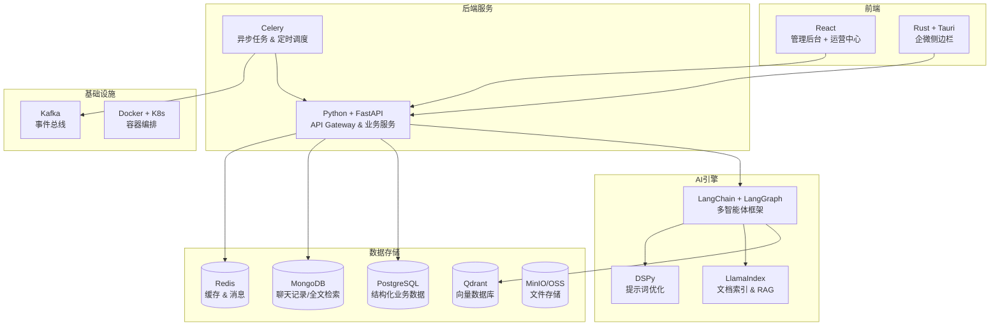

### 3.4 数据架构

#### 3.4.1 数据存储方案

| 数据类型 | 存储 | 说明 |
|----------|------|------|
| 客户基本信息 | PostgreSQL | 结构化数据，支持复杂查询 |
| 聊天记录 | MongoDB | 文档型存储，支持全文检索 |
| AI评分/分级 | PostgreSQL | 与客户信息关联 |
| 训练营批次 | PostgreSQL | 期次管理、DAY 节点 |
| 客户行为轨迹 | MongoDB | 时序事件流 |
| 图片/文件/录音 | MinIO (对象存储) | 大文件独立存储 |
| 知识库向量 | Qdrant | 话术库、案例库、产品知识 |
| 缓存/会话 | Redis | 热点数据、用户会话 |
| 事件流 | Kafka | 跨服务事件传递 |

#### 3.4.2 核心数据模型

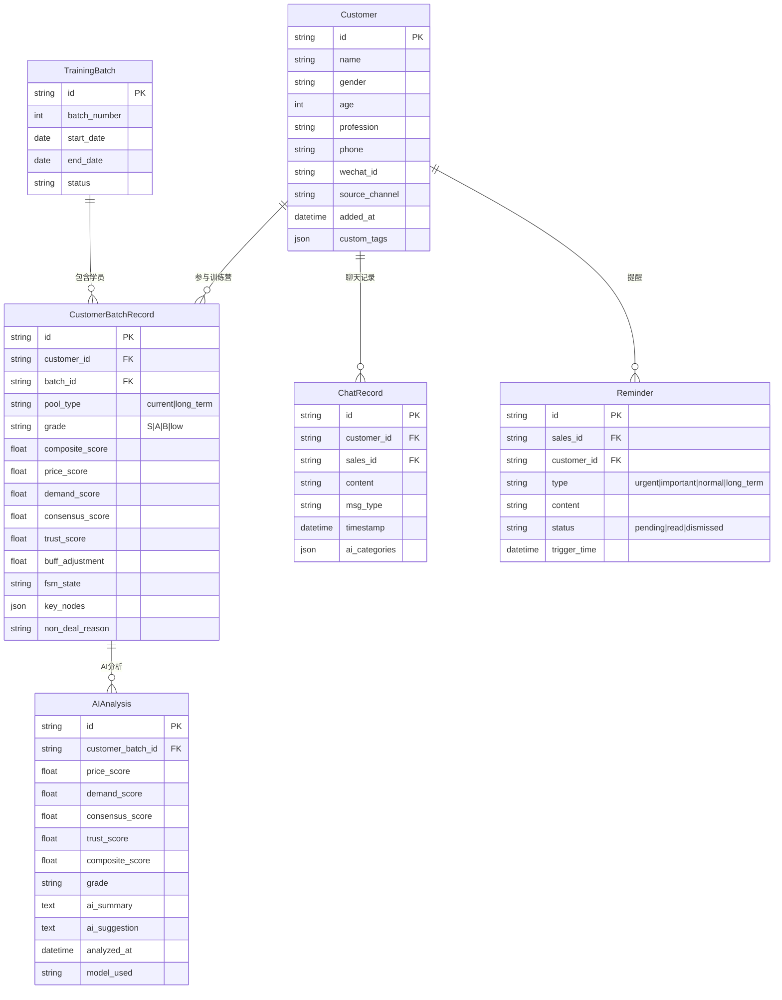

### 3.5 API 设计

#### 3.5.1 API 模块划分

| 模块 | 路由前缀 | 说明 |
|------|----------|------|
| 认证授权 | `/api/v1/auth` | 登录、Token管理 |
| 客户管理 | `/api/v1/customers` | CRUD、搜索、筛选 |
| 训练营批次 | `/api/v1/batches` | 批次管理、状态流转 |
| AI 分析 | `/api/v1/ai` | 评分触发、话术生成、原因分析 |
| 提醒系统 | `/api/v1/reminders` | 提醒列表、状态更新 |
| 聊天记录 | `/api/v1/chats` | 检索、分类、关键词搜索 |
| 主管看板 | `/api/v1/dashboard` | 团队数据、异常预警 |
| 数据同步 | `/api/v1/sync` | 企微数据同步状态管理 |
| 系统配置 | `/api/v1/config` | 策略配置、模型配置 |

#### 3.5.2 关键 API 示例

```
# 获取客户列表（带AI评分排序）
GET /api/v1/customers?pool=current&batch=10&grade=S&sort=composite_score:desc&page=1&size=20

# 获取客户360°视图
GET /api/v1/customers/{customer_id}/profile

# 触发AI评分分析
POST /api/v1/ai/analyze
{
  "customer_id": "xxx",
  "trigger": "manual"  // manual | scheduled | event
}

# 生成AI话术推荐
POST /api/v1/ai/scripts
{
  "customer_id": "xxx",
  "scenario": "price_sensitive_s_grade"
}

# 搜索聊天记录
GET /api/v1/chats/search?customer_id=xxx&keyword=价格&category=price&from=2026-02-01&to=2026-02-05

# 主管看板数据
GET /api/v1/dashboard/team?batch=10&day=4
```

### 3.6 部署架构

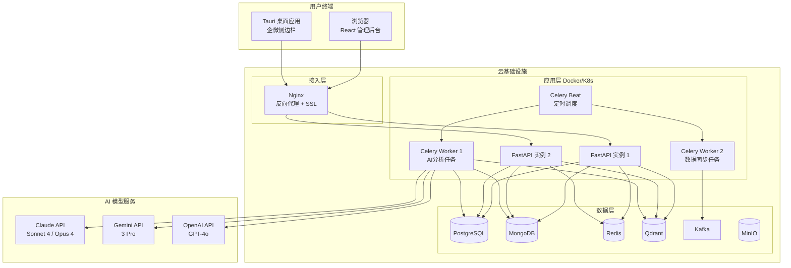

---

## 4. 关键技术方案

### 4.1 企业微信数据同步方案

#### 方案A：官方 API（首选）

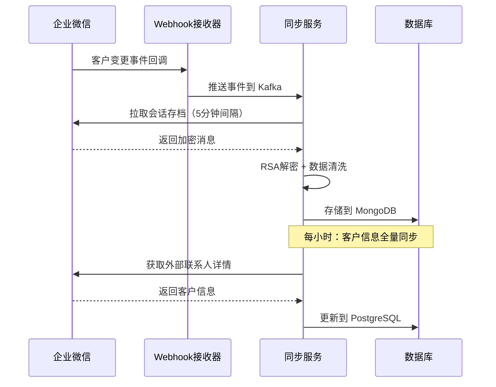

**关键接口**：
- **会话存档 API**：拉取聊天文本、图片、语音、视频、文件
- **客户联系 API**：获取外部联系人详情、标签管理
- **回调事件**：客户新增/删除、群变更

**限制与应对**：
| 限制 | 应对策略 |
|------|----------|
| 数据保留期最长90天 | 自建永久存储（MongoDB + MinIO） |
| 需要双重授权 | 系统引导客户确认，自动化授权流程 |
| API QPS 限制 | 请求队列 + 限流 + 缓存 |

#### 方案B：RPA 回退（备选）

若企微官方 API 不满足需求（如特定数据无法获取），回退到 RPA 方案：
- 使用桌面自动化工具模拟操作
- 定时截取/解析企微客户端数据
- 风险：稳定性较差，维护成本高

### 4.2 AI 意向分析引擎

#### LangGraph 评分工作流

```python
# 伪代码 - AI评分Agent工作流
from langgraph.graph import StateGraph

class ScoringState(TypedDict):
    customer_id: str
    chat_records: list
    behavior_data: dict
    price_score: float
    demand_score: float
    consensus_score: float
    trust_score: float
    composite_score: float
    grade: str
    ai_summary: str

# 构建评分工作流
workflow = StateGraph(ScoringState)
workflow.add_node("collect_data", collect_customer_data)
workflow.add_node("extract_features", llm_feature_extraction)  
workflow.add_node("score_price", score_price_dimension)
workflow.add_node("score_demand", score_demand_dimension)
workflow.add_node("score_consensus", score_consensus_dimension)
workflow.add_node("score_trust", score_trust_dimension)
workflow.add_node("compute_composite", compute_composite_score)
workflow.add_node("generate_summary", generate_ai_summary)

# 四维度可并行评分
workflow.add_edge("collect_data", "extract_features")
workflow.add_edge("extract_features", ["score_price", "score_demand", 
                                        "score_consensus", "score_trust"])
workflow.add_edge(["score_price", "score_demand", 
                   "score_consensus", "score_trust"], "compute_composite")
workflow.add_edge("compute_composite", "generate_summary")
```

#### DSPy 提示词优化

```python
# 伪代码 - DSPy 自动优化评分提示词
import dspy

class ScoreCustomerIntent(dspy.Signature):
    """分析客户聊天记录，评估其购买意向"""
    chat_history = dspy.InputField(desc="客户聊天记录")
    behavior_data = dspy.InputField(desc="客户行为数据")
    price_score = dspy.OutputField(desc="价格维度评分0-100")
    demand_score = dspy.OutputField(desc="需求维度评分0-100")
    consensus_score = dspy.OutputField(desc="共识维度评分0-100")
    trust_score = dspy.OutputField(desc="信任维度评分0-100")
    reasoning = dspy.OutputField(desc="评分理由")

# 使用MIPROv2优化器自动寻找最优提示词
optimizer = dspy.MIPROv2(
    metric=scoring_accuracy_metric,
    auto="light"
)
optimized_scorer = optimizer.compile(
    ScoreCustomerIntent(),
    trainset=labeled_examples
)
```

### 4.3 Tauri 企微侧边栏方案

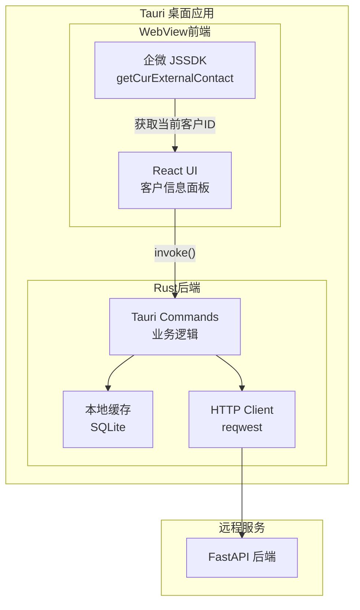

**开发流程**：
1. Tauri 应用内嵌 WebView 加载侧边栏页面
2. 通过企微 JSSDK 获取当前聊天客户的 external_userid
3. 前端调用 `invoke()` 与 Rust 后端通信
4. Rust 后端通过 HTTP 请求 FastAPI 服务获取客户详情
5. 本地 SQLite 缓存常用数据，减少网络请求

---

## 5. 实施计划

### 5.1 总体里程碑

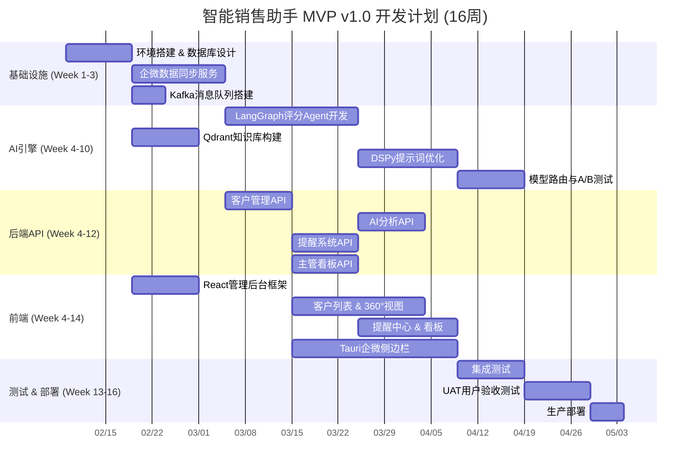

### 5.2 阶段划分

| 阶段 | 周期 | 核心交付 |
|------|------|----------|
| **Phase 1: 基础设施** | 3周 | 数据库设计、企微同步、消息队列、开发环境 |
| **Phase 2: AI 引擎** | 7周 | 评分Agent、知识库、提示词优化、模型路由 |
| **Phase 3: 后端 API** | 8周（并行） | 全量API、提醒系统、看板接口 |
| **Phase 4: 前端** | 10周（并行） | React管理后台、Tauri侧边栏、交互开发 |
| **Phase 5: 测试部署** | 4周 | 集成测试、压力测试、UAT、上线培训 |

**预计总工期**：16 周（4个月）

---

### 5.3 资源配置与投入预算

本项目采用 **"7人全功能战队"** 模式，总研发投入预算为 **¥480,000** (48万元)，周期为 4 个月。

| 关键角色 | 人数 | 核心职责 | 月薪 (预估) | 投入人月 | 总成本 (CNY) |
| :--- | :--- | :--- | :--- | :--- | :--- |
| **系统架构师** | 1 | **技术总负责**。负责架构把控、技术选型、核心难点攻关。 | ¥30,000 | 2.0 | ¥60,000 |
| **大模型应用工程师** | 1 | **AI 核心**。负责 LangGraph 编排、DSPy 提示词调优、RAG 知识库构建。 | ¥28,000 | 3.0 | ¥84,000 |
| **后端工程师** | 2 | **业务逻辑**。负责 FastAPI 微服务、企微对接、数据库设计与性能优化。 | ¥22,000 | 3.5 × 2 | ¥154,000 |
| **前端工程师** | 2 | **交互体验**。负责 React 后台、Tauri 侧边栏、数据可视化开发。 | ¥18,000 | 3.5 × 2 | ¥126,000 |
| **测试工程师** | 1 | **质量保障**。负责用例编写、自动化测试、压力测试、UAT 验收。 | ¥16,000 | 3.5 | ¥56,000 |
| **研发总计** | **7人** | **全栈闭环团队** | | **22.5 人月** | **¥480,000** |

> **注**：
> 1. 架构师重点投入项目前期设计与后期验收（按50%投入计算）。
> 2. 费用为项目总包报价，含研发人力、管理成本及首年维保服务。
> 3. 不含云服务器、AI Token 费、企微接口费等第三方运营成本。

### 5.4 交付物标准

项目验收将基于 **"代码+文档+实测"** 的综合标准进行交付。

#### 1. 软件交付
- **源代码仓库**：包含后端 (Python)、前端 (React/Rust)、AI 模块 (LangGraph) 的完整 Git 代码库。
- **容器化部署包**：提供标准的 `docker-compose.yml` 或 K8s Helm Chart，确保一键拉起所有服务（API, DB, Worker, Redis）。
- **数据库脚本**：PostgreSQL 初始化 SQL、Qdrant 向量库 Schema 定义。

#### 2. 文档交付
- **《系统架构设计文档》**：包含最终的架构图、数据流图、状态机流转图。
- **《API 接口文档》**：基于 OpenAPI/Swagger 的在线接口文档，定义清晰的请求/响应结构。
- **《部署运维手册》**：环境依赖说明、配置项详解、常见故障排查指南。
- **《用户操作手册》**：面向销售人员的侧边栏使用指南，面向管理人员的后台配置指南。

#### 3. 质量与验收交付
- **UAT 验收报告**：包含核心业务流程（数据同步、AI评分、话术生成）的测试通过记录。
- **AI 效果验证报告**：基于历史脱敏数据的回测报告，验证 AI 意向评分与人工判断的一致性（目标准确率 > 85%）。

---

## 6. 风险评估与应对

| 风险 | 影响 | 概率 | 应对策略 |
|------|------|------|----------|
| **企微 API 限制** | 无法获取所需聊天数据 | 中 | 优先验证 API 能力；回退到 RPA 方案 |
| **会话存档成本** | 企微会话存档功能涨价（2026年1月22日调价） | 高 | 自建永久存储降低对企微存储依赖 |
| **双重授权合规** | 客户拒绝授权导致数据缺失 | 中 | 设计优雅的授权引导流程，降低用户抵触 |
| **AI 评分准确度** | 模型输出不稳定，影响S/A/B分级 | 中 | DSPy 自动优化 + 人工Buff微调 ±5分机制 |
| **多模型一致性** | 不同模型评分差异大 | 中 | 建立基准测试集，统一评分校准 |
| **Tauri + 企微兼容性** | 企微 WebView 与 Tauri 兼容问题 | 中 | Phase 1 优先进行技术验证（PoC） |
| **数据安全** | 客户隐私泄露 | 高 | AES-256加密、脱敏显示、权限隔离、审计日志 |
| **系统性能** | 120人/期 × 每小时分析，任务堆积 | 低 | Celery 分布式任务、增量分析、智能触发 |

---

## 7. 附录

### 7.1 技术栈汇总

| 层面 | 技术 | 版本要求 |
|------|------|----------|
| **后端框架** | Python + FastAPI | Python 3.11+, FastAPI 0.100+ |
| **管理后台** | React + TypeScript | React 18+, TypeScript 5+ |
| **企微侧边栏** | Rust + Tauri | Tauri v2, Rust 2024 Edition |
| **AI 框架** | LangChain + LangGraph | LangChain 0.3+, LangGraph 0.2+ |
| **文档索引** | LlamaIndex | LlamaIndex 0.11+ |
| **向量数据库** | Qdrant | Qdrant 1.10+ |
| **提示词优化** | DSPy | DSPy 2.5+ |
| **关系数据库** | PostgreSQL | 16+ |
| **文档数据库** | MongoDB | 7.0+ |
| **缓存** | Redis | 7.0+ |
| **消息队列** | Kafka | 3.7+ |
| **对象存储** | MinIO | RELEASE.2024+ |
| **容器编排** | Docker + Kubernetes | Docker 25+, K8s 1.29+ |

### 7.2 AI 模型候选

| 模型 | 提供商 | 适用场景 | 备注 |
|------|--------|----------|------|
| Claude Opus 4 | Anthropic | 复杂推理、长文本深度分析 | 最高质量，成本最高 |
| Claude Sonnet 4 | Anthropic | 标准分析、四维度评分 | 性价比均衡 |
| Gemini 3 Pro | Google | 快速生成、话术推荐 | 速度快，多模态 |
| GPT-4o | OpenAI | 通用任务、备选兜底 | 生态成熟，稳定 |

> 最终选型将通过 DSPy 评估框架在实际销售场景数据上进行 A/B 测试后确定。

### 7.3 参考文档

- [企业微信开发者文档](https://developer.work.weixin.qq.com/document)
- [企业微信会话存档API](https://developer.work.weixin.qq.com/document/path/91354)
- [抖音开发者平台](https://developer.open-douyin.com/docs/resource/zh-CN/developer/introduction/overview)
- [LangGraph 官方文档](https://langchain-ai.github.io/langgraph/)
- [DSPy 官方文档](https://dspy.ai/)
- [Qdrant 文档](https://qdrant.tech/documentation/)
- [Tauri v2 文档](https://v2.tauri.app/)

---

*文档版本：v1.0 | 创建日期：2026-02-07 | 最后更新：2026-02-07*
