## 摘要

| 内容维度 | 核心阐述 |
|--------|---------|
| **项目名称** | Sup-01 消防数智主管系统技术方案 |
| **技术定位** | 数智化消防架构中的**理解认知层（L2）**，是连接感知与决策的核心枢纽，负责将碎片化感知数据转化为可解释的态势结论。 |
| **核心创新** | "物理铁律兜底"机制（无热不报火、燃烧必产气）；四层深度推理模型（现象→特征→模式→原因）；四维风险评估体系。 |
| **关键成果** | 误报率大幅降低（较传统系统）；研判总时延控制在秒级；真火零漏报；输出包含完整推理逻辑的可追溯证据包。 |
| **技术栈概览** | **架构**：云边协同、边缘优先；**核心引擎**：多源融合 + 世界模型 + 因果推理 + 风险评估；**部署**：容器化微服务集群。 |
| **硬件方案** | **边缘优先架构**，核心推理能力部署在楼层/防火分区级边缘节点，云端负责重型计算与全局监控。 |
| **开发周期** | 4个月（16周）敏捷迭代；里程碑：数据链路贯通→认知内核就绪→系统上线就绪。 |
| **投资规模** | 研发投入预算 ¥360,000；采用"全栈专家团队"模式（架构师+算法工程师+开发工程师+实施工程师，4人/16人月）。 |
| **交付物** | 核心认知引擎Docker镜像 + 统一接入网关 + 区域拓扑配置 + 场景特征规则库 + 全套技术文档 |
| **差异竞争力** | **物理铁律兜底**（消除AI幻觉风险）；**Skills-First架构**（原子能力动态编排）；**秒级闭环**（边缘优先极致时延优化）。 |

---

## **总体架构与设计哲学**

### **建设背景与系统定位：从“感知”到“认知”的跃迁**

#### **核心痛点分析**
传统消防系统长期停留在感知层水平，面临“只报警、不判断”的结构性困境，导致三大核心痛点：
1.  **极高的误报率**：商业综合体平均误报率高，导致严重的“狼来了”效应，引发用户对报警系统的麻木。
2.  **决策依据缺失**：指挥官面对“烟感报警”单一信号，无法获知现场是真火、水蒸气还是装修粉尘，必须依赖人工跑点核实，错失黄金扑救窗口。
3.  **态势不可知**：缺乏对火势蔓延趋势、人员分布及疏散窗口的预测能力，导致应急决策滞后。

#### **认知四层架构中的定位**
Sup-01系统在数智化消防架构中处于核心的**理解认知层**，是连接感知与决策的关键枢纽。

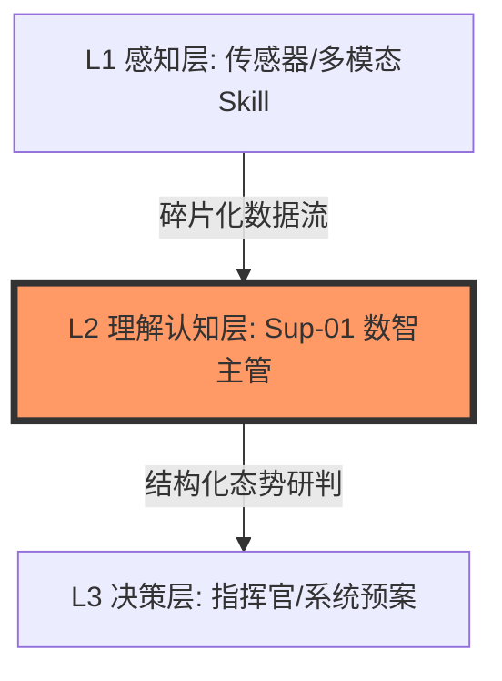

*   **感知层**：负责多模态数据的采集（视觉、热成像、气体、IoT），解决“是什么信号”的问题。
*   **理解认知层**：**这是本方案的建设重点**。负责将碎片化的感知数据，通过证据融合与因果推理，转化为可解释的态势结论（如“这是喷漆作业误报”或“这是电气阴燃真火”），解决“发生了什么”及“为什么发生”的问题。
*   **决策层**：基于研判结论，进行全局资源调度与应急指挥。

#### **核心职责边界**
L2层的核心职责被定义为**态势理解**与**局部判断**，严格遵循以下边界：
*   **承担“看懂”的责任**：必须在秒级时间内完成多模态证据的融合，输出高置信度的研判结论。
*   **承担“过滤”的责任**：作为信息过滤器，需拦截绝大部分的无效误报噪音，确保上报给指挥官的信息均为高价值、需决策的真实危机。
*   **不承担“最终决策”责任**：对于涉及生命安全、重大资产及P0级风险的场景，必须强制上报由指挥官或预案系统进行最终确认，遵循“技术辅助、人类确权”原则。

### **设计原则与架构哲学**

#### **能力优先架构**
摒弃单体式应用设计，采用**Skills-First**架构风格。将感知、推理、评估能力解耦为独立的“原子能力（Skills）”（如`visual_fire_verification`、`causal_reasoning`）。
*   **动态编排**：支持根据不同场景（如装修期 vs. 营业期）动态编排Skill调用链，实现系统的弹性与可扩展性。
*   **独立演进**：单个Skill（如视觉检测算法）的升级不影响整体架构稳定性。

#### **物理铁律兜底**
AI模型存在“幻觉”风险，因此系统引入基于物理常识的**硬约束机制**，作为安全底线：

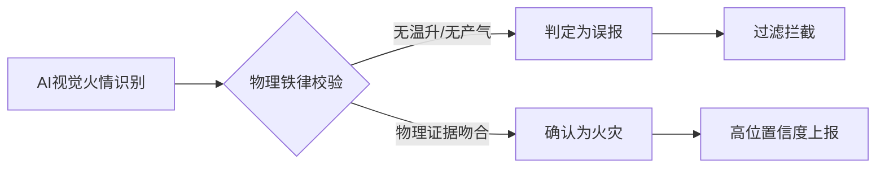

*   **铁律一**：无热不报火（视觉检测到火焰但热成像无温升，判定为误报）。
*   **铁律二**：燃烧必产气（真火必伴随CO或VOC浓度变化）。
*   **价值**：确保AI推理结果符合物理世界的基本规律，从根本上消除逻辑性误判。

#### **边缘优先与秒级闭环**
鉴于火灾处置的时效性要求，架构采用**云边协同、边缘优先**策略：
*   **算力下沉**：所有的感知Skill与核心推理Skill均部署在楼层或防火分区级的边缘节点，避免网络抖动影响。
*   **时延SLA**：严格执行“秒级研判”标准——从传感器触发到输出决策建议，全程耗时控制在极短时间内，为后续处置争取宝贵时间。

### **逻辑架构视图**

L2层内部逻辑被划分为四个核心引擎，形成从数据到价值的处理流水线：


1.  **多源信息融合引擎**
    *   负责将视觉、热成像、气体、工单上下文四维数据进行**时空对齐**。
    *   执行证据一致性评估，计算各模态数据的冲突程度与置信度权重。

2.  **世界模型与态势感知引擎**
    *   构建包含建筑结构、设备状态及物理规律的**数字化物理环境**。
    *   提供**超实时推演能力**，基于当前数据预测一段时间内的火势蔓延路径与烟雾扩散范围。

3.  **因果推理与模式匹配引擎**
    *   执行“现象 → 特征 → 模式 → 原因”的**四层深度推理**。
    *   基于多种典型场景库（如油烟、水蒸气、电焊），进行特征向量匹配，识别事件的本质原因。

4.  **四维风险评估引擎**
    *   从火灾概率、蔓延风险、人员风险、财产风险四个维度量化当前态势。
    *   输出P0（灾难级）至P4（极低风险）的分级结论，驱动L3层的差异化响应。

### **核心技术指标**

本方案旨在达成以下关键技术指标，以量化L2层的建设成效：

| 指标维度 | 关键指标 | 目标值 | 依据/来源 |
| :--- | :--- | :--- | :--- |
| **准确性** | **误报率** | **极低** | 较传统系统大幅降低 |
| | **漏报率** | **趋于零** | 物理铁律兜底，对真火零容忍 |
| **时效性** | **研判总时延** | **秒级** | 含感知、融合、推理全流程 |
| | **边缘推理时延** | **毫秒级** | 单个视觉/推理Skill耗时 |
| **可靠性** | **多模态一致性评分** | **极高** | 确保决策证据充分 |
| **可解释性**| **证据链完整度** | **完整** | 包含视频、曲线、推理逻辑的全量归档 |

---

### **本章总结**

Sup-01系统的L2层不仅仅是一个算法集合，更是一个具备物理感知力与逻辑推理力的智能体。通过本章规划的架构，我们将彻底改变传统消防系统“盲目报警”的现状，实现从“被动响应”向“主动认知”的范式转移。

---

## **多源信息融合引擎设计**

### **设计目标与核心挑战**

#### **核心挑战：异构数据的“巴别塔”**
L1感知层上报的数据存在天然的异构性，直接导致推理困难：
1.  **频率非对齐**：视觉数据是25fps的连续流，而气体传感器可能仅为1Hz的采样点，IoT设备（如水压）甚至是按需上报的离散事件。
2.  **空间非对齐**：摄像头使用的是二维像素坐标 $(u, v)$，而热成像使用的是温度矩阵行列 $(r, c)$，物理传感器使用的是三维空间坐标 $(x, y, z)$。
3.  **语义非对齐**：视觉看到的是“白色雾气”（定性），而传感器读到的是“PM2.5=200μg/m³”（定量）。

#### **引擎定位**

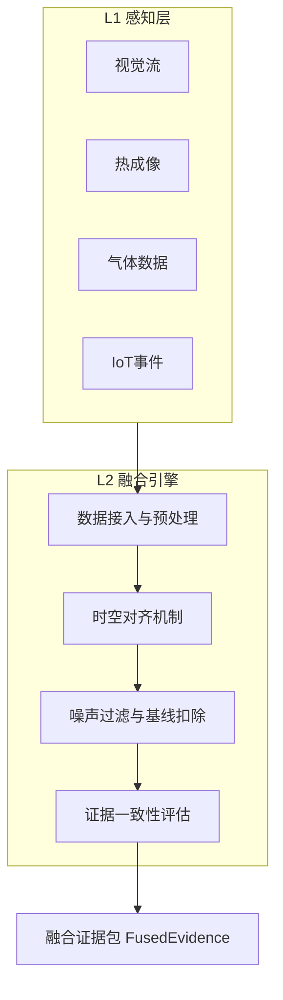

本引擎位于数据流入L2层的第一站，负责执行数据到信息的转换。
*   **输入**：L1层上报的原始感知事件（含时间戳、设备ID、原始值）。
*   **输出**：标准化的融合证据包，包含时空对齐后的多维特征向量及一致性置信度。
*   **性能指标**：融合处理时延控制在毫秒级。

### **多模态数据时空对齐机制**

#### **时间对齐算法**
针对异构数据采样率不一致的问题，采用**“滑动窗口 + 插值补全”**策略。

*   **全局时钟同步**：基于高精度协议，要求所有边缘节点与传感器的时间偏差 $<10ms$，确保所有数据打上统一的到达时间戳。
*   **时间切片窗口**：定义一个研判时间窗口 $T_{window} = 500ms$。
    *   **高频数据**：选取窗口内置信度最高的一帧或最近一帧作为代表。
    *   **低频数据**：
        *   若窗口内有数据点，取最新值。
        *   若窗口内无数据点，采用**线性插值（Linear Interpolation）** 或**零阶保持（Zero-order Hold）** 补全当前时刻数值。
*   **对齐能力**：将视觉流、传感器流等异构数据映射至统一的时间轴。

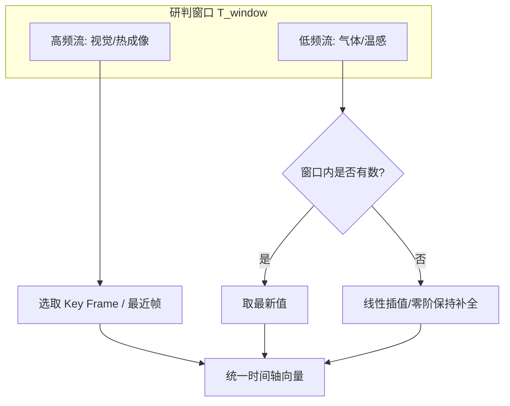

#### **空间对齐与数字孪生映射**
解决不同感知设备在物理空间上的关联性问题。

*   **统一坐标系**：建立基于BIM模型的数字孪生世界坐标系 $(x, y, z)$。所有设备在入网时，必须在其智能体中注册物理坐标与朝向。
*   **视域映射**：
    *   利用数字孪生引擎，计算摄像头的视锥体与地面的投影区域。
    *   建立**拓扑关联矩阵**：明确摄像头视野覆盖的传感器。
    *   **坐标转换算法**：
        $$ P_{world} = M^{-1}_{camera} \cdot P_{pixel} $$
        通过摄像机内外参矩阵，将视觉检测框的中心点 $(u, v)$ 反投影到物理世界坐标 $(x, y, z)$，判断其是否与热成像的高温点或传感器的位置重合。

### **证据一致性评估体系**

#### **三维一致性计算模型**
为了量化证据的可信度，我们构建了物理、时间、空间三维评估体系。

1.  **物理一致性**：
    *   **定义**：不同模态数据是否符合物理定律。
    *   **铁律规则**：
        *   明火（视觉）必伴随热辐射（热成像）。若视觉置信度 $>0.8$ 但热成像温度无显著变化，则物理一致性得分急剧下降。
        *   阴燃（烟雾）必伴随产物（气体）。若烟雾浓度高但CO/VOC无变化，判定为非燃烧烟雾（如水蒸气）。
    *   **计算公式**：
        $$ S_{phy} = w_1 \cdot f(Vis, Therm) + w_2 \cdot f(Smoke, Gas) $$

2.  **空间一致性**：不同模态异常信号在物理位置上的接近程度。

3.  **时间一致性**：多模态信号变化趋势的同步性（如拐点时间差 $\Delta t < 5s$）。

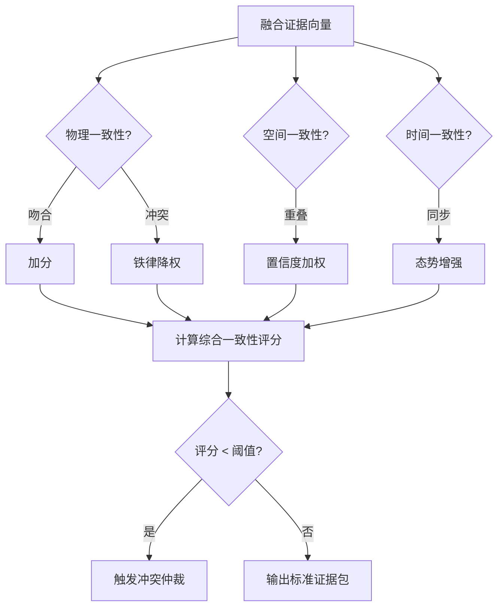

#### **冲突检测与仲裁策略**
当一致性评分 $S_{consistency} < Threshold$ 时，触发冲突处理机制。

*   **强冲突**：关键证据完全矛盾。
*   **弱冲突**：部分证据微弱不一致。
*   **仲裁策略**：物理铁律优先。认定视觉干扰为误报。

### **数据清洗与噪声过滤**

#### **瞬态干扰剔除**
针对持续时间 $t < 100ms$ 的数值突变噪声进行中值滤波。

#### **环境背景扣除**
维护动态基准线 $B_t$：
$$ V_{effective} = V_{raw} - B_t $$
只关注显著超过基线的异常波动。

### **融合引擎的输出接口**
经过处理后，引擎输出标准化的**融合证据包 (FusedEvidence)**：

```json
{
  "event_id": "EVT-20260202-001",
  "timestamp": 1770030000123,
  "location": {
    "zone_id": "3F-Kitchen-ZoneA",
    "coordinates": {"x": 12.5, "y": 8.0, "z": 3.0}
  },
  "evidence_vector": {
    "visual_fire_conf": 0.95,
    "max_temperature": 28.0,
    "co_concentration": 2.0
  },
  "consistency_score": {
    "physical": 0.15,
    "spatial": 0.90,
    "temporal": 0.85
  },
  "conflict_status": {
    "is_conflict": true,
    "conflict_type": "STRONG_CONFLICT"
  }
}
```

### **本章总结**

本章的设计核心在于**去伪存真**。通过时空对齐与物理一致性校验，我们为后续推理提供了鲁棒的高质量证据包，确保了系统在复杂商业环境下的研判准确性。

---

## **世界模型与态势感知引擎**

### **引擎定义与核心理念**

#### **核心理念：从“离散数据”到“连续时空”**
在**多源信息融合引擎设计**中，我们获得了清洗后的融合数据。然而，孤立的数据（如“温度50℃”）没有意义，只有放入具体的**物理环境**和**时间上下文**中，才能推导出正确的结论。

**世界模型** 是对真实物理世界的数字化抽象。它不仅仅是一个静态数据库，而是一个能够基于物理方程运行的**动态仿真器**。
*   **输入**：融合引擎输出的实时证据包。
*   **核心逻辑**：将数据映射到BIM模型中，结合燃烧物理学规律进行状态更新与演化。
*   **输出**：带有物理语义的**当前态势**及**未来态势预测**。

#### **引擎架构三要素**
基于设计文档，世界模型由三大核心要素构建：
1.  **火灾物理规律模型**：植入燃烧三要素、热传导方程、烟雾扩散规律，是引擎的**自然法则**。
2.  **建筑环境模型**：基于BIM的静态空间结构，是引擎的**地理约束**。
3.  **设备状态模型**：消防设施与电气设备的实时运行状态，是引擎的**交互变量**。

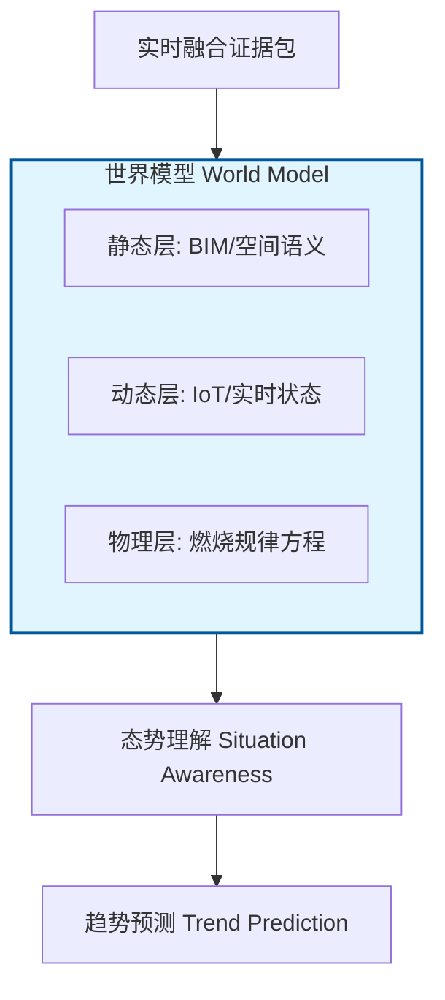

---

### **世界模型构建与数字化映射**

#### **静态层：建筑空间语义化**
利用数字孪生技术，将物理空间转化为机器可理解的语义网络。
*   **空间拓扑树**：构建“园区-楼栋-楼层-防火分区-房间”的标准空间树结构。
*   **视域与传感映射**：
    *   计算摄像头的可视范围，建立摄像头覆盖传感器的拓扑关系。
    *   **盲区标记**：系统自动识别监控盲区，并在推理时对此区域的视觉缺失进行置信度降权处理。
*   **资产与风险属性**：
    *   **高风险区标记**：将配电房、危化品库标记为高风险，此类区域的报警阈值将自动收紧。
    *   **易燃物分布**：录入装修材料、货物分布信息，用于计算火灾荷载。

#### **动态层：实时状态同步**
世界模型必须与物理世界保持毫秒级同步。
*   **IoT全量映射**：接入水压、风机状态、电气参数等IoT数据。例如，当排烟风机启动时，世界模型中的通风条件参数立即更新，影响后续的烟雾扩散预测。
*   **人员热力图**：基于门禁、Wi-Fi探针及视觉计数，实时更新各防火分区的人员密度。这直接决定了人员风险的评估权重。

#### **物理层：燃烧物理规律嵌入**
这是本引擎的灵魂。我们将简化的流体力学与热力学方程嵌入计算节点，使系统具备物理常识。
*   **燃烧三要素校验**：
    *   $Check(Fire) = F(Fuel, Oxygen, Heat)$。
    *   例如：在全封闭且氧气耗尽的模拟状态下，即使温度高，系统也会预测火势将转为阴燃或熄灭。
*   **热传导模型**：
    *   $T(x, t)$：基于热传导系数，评估温度在空间中的传播。若某点温度突升但周边无热传递迹象，倾向判定为传感器故障或局部热源。

---

### **上下文感知能力**

世界模型不仅理解物理空间，更需理解业务上下文。这是降低误报率的关键手段，用于识别合法异常。

#### **工单系统RAG检索**
针对装修、维修等高频误报源，建立实时检索机制。
*   **机制**：当感知到烟雾或高温时，Skill `check_zone_context` 立即查询工单数据库。
*   **逻辑判定**：
    *   `IF` (位置=3F区域) `AND` (现象=白色烟雾/VOC高) `AND` (存在有效工单) `AND` (当前时间 IN 工单作业时间)
    *   `THEN` 判定为 **“合法作业误报”**，自动抑制报警，并标记为“施工干扰”。

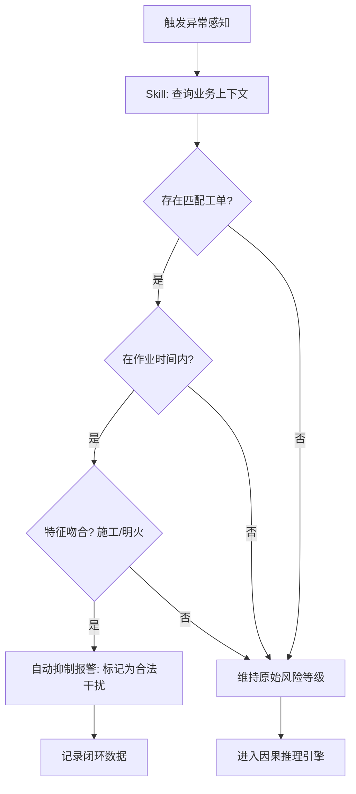

#### **时空历史模式匹配**
系统具备记忆能力，利用历史数据建立每个点位的常态基线。
*   **高频误报点位识别**：若某烟感在过去一段时间内每逢特定高峰时段即报警，且每次均为油烟特征，系统将其标记为油烟敏感点，自动调高该时段的触发阈值。
*   **环境基线漂移**：自动学习环境温度的日夜变化规律。例如，西晒区域在下午的自然温升不应触发火警，除非温升速率显著超过历史基线的数倍。

---

### **超实时推演与趋势预测**

系统不仅要看懂当下，还要能预判未来。利用世界模型进行**前向推演**。

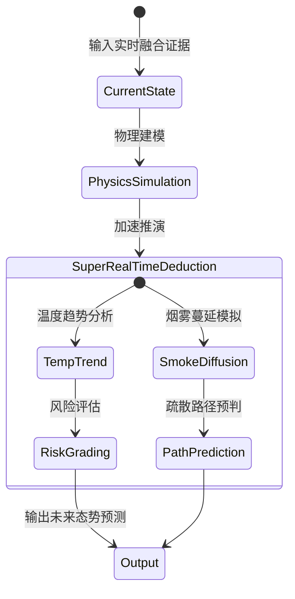

#### **短期趋势预测**
*   **温度趋势**：基于当前的温升速率 $k$，利用公式 $T(t) = T_0 \cdot e^{kt}$ 预测未来一段时间内的温度。若预测值 $T_{+t} > 600^\circ C$ 立即升级风险等级至P0。
*   **CO浓度预测**：针对阴燃火灾，预测CO浓度的积累速度，判断何时达到对人体致命的浓度。

#### **蔓延路径模拟**
基于数字孪生的连通性分析，预测火势和烟雾的扩散方向。
*   **输入**：当前火源位置、风机运行状态、防火门开闭状态。
*   **推演逻辑**：
    *   检测到火灾，且通往走廊的防火门未关闭。
    *   模型预测：烟雾将在极短时间内扩散至走廊，随后通过楼梯间垂直蔓延至上层区域。
*   **输出**：生成红色危险区域预警，指导L3层提前关闭防火门并规划疏散路线。

---

### **引擎输出接口**

世界模型与态势感知引擎处理完毕后，向下一层级因果推理引擎输出标准化的**态势对象**：

```json
{
  "situation_id": "SIT-20260202-001",
  "timestamp": 1770030000500,
  "current_state": {
    "location_semantic": "3F-餐饮区-火锅店后厨",
    "is_high_risk_area": true,
    "environment_context": {
      "business_status": "DINING_PEAK",
      "active_work_orders": [],
      "historical_pattern": "OIL_SMOKE_SENSITIVE"
    },
    "physical_parameters": {
      "temp_max": 45.0,
      "temp_trend": "STABLE",
      "co_level": "NORMAL",
      "voc_level": "HIGH"
    }
  },
  "predictions": {
    "fire_probability": 0.05,
    "spread_risk": "NONE",
    "prediction_5min": {
      "temp_expected": 46.0,
      "smoke_diffusion": "LOCALIZED"
    }
  },
  "world_model_validation": {
    "physics_check": "PASS",
    "context_check": "MATCH_HISTORY"
  }
}
```

### **本章总结**

**世界模型与态势感知引擎**的设计赋予了系统**“理解环境”**的能力。通过**静态BIM与动态IoT的结合**，我们让系统知道我在哪里；通过**物理规律的嵌入**，我们让系统知道这是否合理；通过**工单与历史数据的关联**，我们让系统知道这是否正常。正是这一层，将孤立的感知数据升维成了具备时空语义的态势信息，为下一章的因果推理提供了最坚实的逻辑基础。

---

## **因果推理与模式匹配引擎**

### **引擎定义与设计哲学**

#### **核心职能：从 Data 到 Wisdom 的跃迁**
如果说多源融合引擎解决了“数据一致性”，世界模型解决了“环境上下文”，那么因果推理引擎的核心职能就是解决**语义解释性**。
*   **输入**：融合后的证据包 + 世界模型提供的态势上下文。
*   **处理**：执行特征提取、向量匹配、因果链推导。
*   **输出**：具备可解释性的研判结论，例如：“检测到白烟和高VOC，结合喷漆工单，判定为装修误报，置信度高”。

#### **推理框架：四层深度推理模型**
为了确保推理过程的逻辑严密性，我们设计了“现象 → 特征 → 模式 → 原因”的四层推理架构：

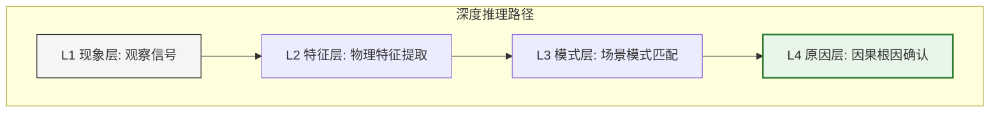

1.  **现象层**：观察到的原始信号（如：烟感报警、视频有白雾）。
2.  **特征层**：提取的关键物理特征（如：温升速率 `< 2℃/min`，VOC 浓度 `> 1000ppb`）。
3.  **模式层**：匹配到的典型场景模式（如：匹配装修喷漆误报模式）。
4.  **原因层**：推断的根本原因（如：装修作业产生气溶胶触发传感器）。

---

### **场景模式匹配算法**

#### **特征向量构建**
为了让算法能够计算当前态势与已知场景的相似度，必须将多模态数据转化为标准的数学特征向量。定义 $F$ 为 $N$ 维特征向量：

$$ F = [f_1, f_2, ..., f_n] $$

| 维度 | 特征名称 | 取值范围/单位 | 权重 ($w_i$) | 说明 |
| :--- | :--- | :--- | :--- | :--- |
| $f_1$ | **温度峰值** | $0-500^\circ C$ | 15% | 热成像/温感最高值 |
| $f_2$ | **CO浓度** | $0-1000ppm$ | 15% | 阴燃核心指标 |
| $f_3$ | **VOC浓度** | $0-2000ppb$ | 8% | 区分干扰气体的关键 |
| $f_4$ | **火焰特征** | 0/1 (Bool) | 20% | 视觉AI检测结果 |
| $f_5$ | **温升速率** | $^\circ C/min$ | 12% | 区分突发火与环境温升 |
| $f_6$ | **空间属性** | Enum | 8% | 区域功能上下文 |
| $f_7$ | **工单状态** | 0/1 (Bool) | 5% | 是否有动火/装修工单 |

#### **场景库构建**
系统内置并持续更新多种典型场景模式库 ($S$)，分为三大类：

1.  **误报干扰类**：
    *   喷漆: 白雾+高VOC+常温+有工单。
    *   水蒸气: 白雾+高湿+常温+特定功能间。
    *   粉尘: 颗粒物高+常温+无CO。
    *   电焊: 局部闪光+高VOC+有工单。
    *   设备故障: 单点数值突变+多模态不一致。

2.  **真实火情类**：
    *   阴燃: 高CO+缓升温+灰烟+无明火。
    *   明火: 视觉火焰+急升温+高CO。
    *   电气: 局部极高温+配电房+电流异常。
    *   油锅: 极速升温+后厨+黑烟。

3.  **复合/特殊类**：
    *   真火+干扰: 装修区起火（有工单但温升异常）。

#### **相似度计算与置信度评估**
采用加权欧氏距离算法计算当前向量 $F$ 与场景库中模式 $S_k$ 的匹配度：

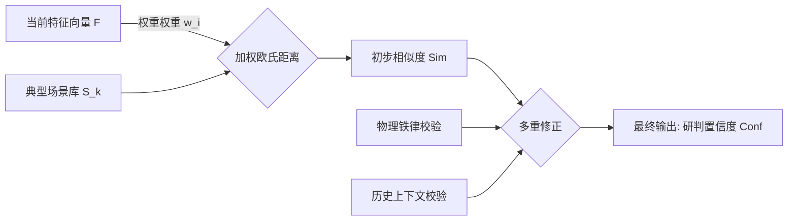

1.  **相似度计算**：
    $$ Sim(F, S_k) = \frac{1}{1 + \sqrt{\sum_{i=1}^{n} w_i (f_i - s_{k,i})^2}} $$

2.  **置信度修正**：
    单纯的数学距离不够安全，需引入物理铁律和上下文进行修正：
    $$ Conf = 0.6 \times Sim + 0.3 \times P_{physics} + 0.1 \times C_{context} $$
    *   $P_{physics}$：物理规律验证得分。
    *   $C_{context}$：历史上下文吻合度。

---

### **误报识别与抑制策略**

针对商业综合体高误报率的问题，本引擎设计了专项抑制逻辑。

#### **典型误报场景的推理逻辑**

*   **装修喷漆误报**
    *   **推理链**：判定与喷漆模式呈极高相似度。
    *   **处置策略**：**自动抑制**。静默报警，标记为施工干扰，派人在极短时间内进行核查。

*   **后厨油烟误报**
    *   **推理链**：处于高峰时段，地点为后厨，匹配油烟干扰模式。
    *   **处置策略**：**条件抑制**。短时间内抑制报警，并启动**持续监控模式**。

#### **抑制安全阀**
为了防止漏报真火，抑制逻辑必须通过物理铁律的校验：
*   **铁律**：只要数值超过预设安全红线（如温度、CO、温升速率），**禁止任何形式的自动抑制**，强制升级为疑似火情。

---

### **真实火情确认与分级**

#### **阴燃火灾的早期识别**
阴燃是传统系统最难发现的阶段。
*   **核心特征**：CO浓度持续上升。
*   **推理逻辑**：若 $CO$ 呈明显线性增长趋势，判定为阴燃。
*   **风险等级**：**P1 (重要)**。

#### **极速火灾的秒级响应**
*   **核心特征**：温升速率极快。
*   **推理逻辑**：只要检测到超高温升速率，且位置处于配电房等关键区域。
*   **风险等级**：**P0 (紧急)**。毫秒级触发联动，全楼报警，无需人工确认。

---

### **因果链的可解释性输出**

AI系统的决策必须是“白盒”的。推理引擎输出标准化的推理对象：

```json
{
  "reasoning_id": "RSN-20260202-001",
  "conclusion": "FALSE_ALARM_PAINTING",
  "confidence": 0.96,
  "causal_chain": [
    {
      "layer": "PHENOMENON",
      "desc": "烟感报警，视觉检测到白色烟雾"
    },
    {
      "layer": "FEATURE",
      "desc": "物理指标正常，VOC极高"
    },
    {
      "layer": "CONTEXT",
      "desc": "关联到装修工单，处于作业时段"
    },
    {
      "layer": "PATTERN",
      "desc": "特征向量匹配度高"
    }
  ],
  "safety_check": {
    "physics_constraints": "PASS",
    "risk_level": "P3"
  }
}
```

### **本章总结**

本章的设计核心在于通过算法赋能系统“识别场景”的能力。通过对典型场景的精细化定义，我们解决了误报率高的行业痛点，同时利用物理铁律作为刹车片，守住了安全底线。

## **四维风险评估引擎**

### **引擎定义与评估模型框架**

#### **引擎定位**
风险评估引擎位于 L2 层的输出端，其核心职能是将定性的推理结果转化为定量的**风险分值**和**响应等级**。
*   **输入**：因果推理引擎的结论、世界模型的预测数据、数字孪生的静态属性。
*   **输出**：标准化的风险对象，包含四维评分及综合评级。
*   **价值**：解决传统系统一刀切报警的问题，实现差异化响应。

#### **四维评估模型**
为了全面衡量火情影响，我们构建了加权评估模型 $R_{total}$：

$$ R_{total} = w_1 \cdot P_{fire} + w_2 \cdot R_{spread} + w_3 \cdot R_{person} + w_4 \cdot R_{property} $$

根据系统设计文档，各维度权重分配如下：
1.  **火灾概率 ($P_{fire}$)**：占主要权重。核心指标，决定是否报警。
2.  **蔓延风险 ($R_{spread}$)**：重要指标。决定阻断措施的紧迫性。
3.  **人员风险 ($R_{person}$)**：优先指标。决定疏散策略的优先级。
4.  **财产风险 ($R_{property}$)**：参考指标。决定灭火资源的投入力度。

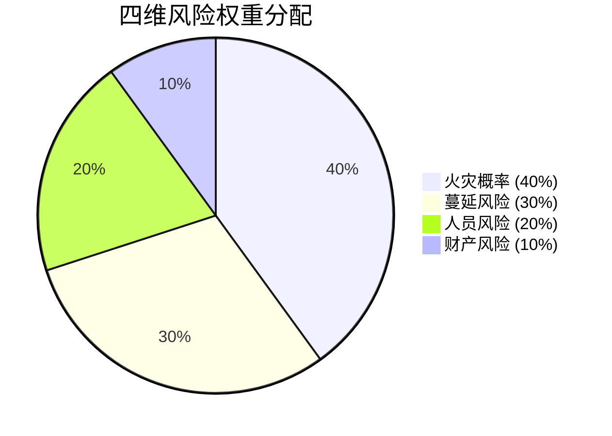

---

### **火灾概率评估**

该维度用于量化当前事件是真实火灾的可能性。

#### **评估因子与权重**
*   **物理证据 ($S_{phy}$)**：最强因子。
    *   $Temp > 100^\circ C$ 或 检测到明火 $\rightarrow$ 对应得分高。
    *   $CO > 50ppm$ $\rightarrow$ 对应显著得分。
*   **场景模式 ($S_{scene}$)**：
    *   匹配明火模式 $\rightarrow$ 对应极高得分。
    *   匹配油烟误报模式 $\rightarrow$ 对应极低得分。
*   **上下文 ($S_{ctx}$)**：
    *   存在有效作业工单 $\rightarrow$ 显著降分（降低概率）。
    *   属于高频误报点位 $\rightarrow$ 适度降分。
*   **空间因素 ($S_{space}$)**：
    *   处于高密度可燃物区域 $\rightarrow$ 适度加分。

#### **计算示例**
以“配电房电气火灾”为例：
*   物理证据：温度与 CO 浓度均表现异常。
*   场景模式：高度匹配电气火灾特征。
*   上下文：时段内无相关作业工单。
*   **结果**：综合判定为中高概率火灾，需立即核实。

---

### **蔓延风险评估**

该维度基于世界模型的推演能力，评估火势失控的速度。

#### **评估因子与权重**
*   **火势强度 ($S_{int}$)**：温升速率极快时风险得分锁定为高值。
*   **可燃物分布 ($S_{fuel}$)**：根据 BIM 数据区分易燃仓库与不可燃通道。
*   **防火分隔 ($S_{bar}$)**：实时监控防火门与卷帘状态，开启或故障时风险激增。
*   **蔓延路径 ($S_{path}$)**：识别电缆井等烟囱效应区域。

#### **动态模拟支撑**
系统调用相关技能，在数字孪生中模拟一段时间内的火势演化。若预测火势将突破防火分区边界，该维度得分将自动升至峰值。

---

### **人员风险评估**

该维度以“生命至上”为原则，评估对人员安全的威胁。

#### **评估因子与权重**
*   **人员数量 ($S_{num}$)**：基于实时客流与门禁数据。
*   **疏散能力 ($S_{evac}$)**：考虑通道宽度与安全出口距离。
*   **烟雾威胁 ($S_{smoke}$)**：比对烟雾到达时间与预计疏散完成时间。
*   **特殊人员 ($S_{spec}$)**：针对老人、儿童等特殊区域自动增加风险系数。

#### **安全窗口计算 (ASET vs RSET)**
系统实时计算 **ASET** (Available Safe Egress Time) 与 **RSET** (Required Safe Egress Time)。若安全窗口不足，人员风险评级直接升至最高。

---

### **财产风险评估**

该维度用于指导灭火资源的投入成本权衡。

#### **评估因子与权重**
*   **直接损失 ($S_{dir}$)**：识别精密仪器或服务器区域风险极高。
*   **间接损失 ($S_{indir}$)**：评估停业等衍生损失。
*   **重要设施 ($S_{crit}$)**：配电房、消控室、数据中心等关键节点权重加倍。
*   **蔓延损失 ($S_{sprd}$)**：评估跨层蔓延风险。

---

### **综合评级与动态响应机制**

根据加权总分 $R_{total}$，系统将风险划分为五个等级，驱动不同的决策响应。

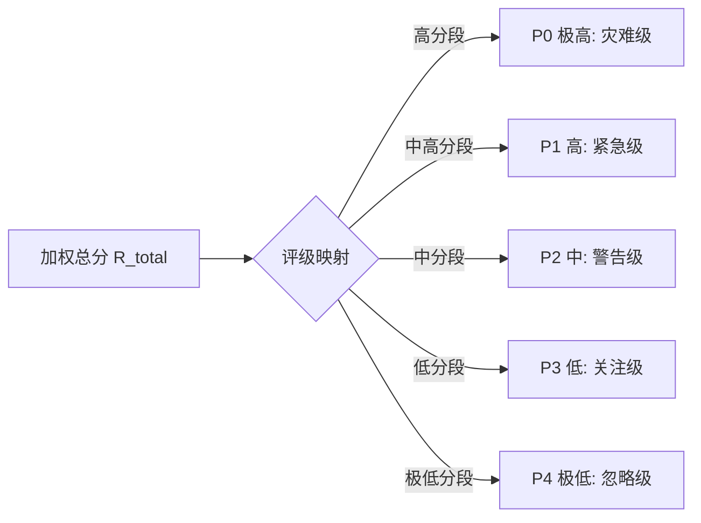

| 风险等级 | 定义 | 处置策略 |
| :--- | :--- | :--- |
| **P0 (极高)** | **灾难级** | **全楼报警 + 全面联动 + 立即疏散 + 119联动** |
| **P1 (高)** | **紧急级** | **局部报警 + 保安极速到场 + 设备预备** |
| **P2 (中)** | **警告级** | **静默报警 + 保安到场核实 + 持续监控** |
| **P3 (低)** | **关注级** | **抑制报警 + 纳入日常巡检** |
| **P4 (极低)** | **忽略级** | **自动抑制 + 仅做日志归档** |

#### **动态升级机制**
风险等级随态势演化实时更新：
*   **趋势升级**：若温升速率突然超过预设红线，等级立即上调。
*   **超时升级**：若现场核实反馈超时，系统自动升级响应级别。

---

### **风险评估引擎输出接口**
本引擎向决策层输出标准化的风险评估对象。

```json
{
  "assessment_id": "ASM-20260202-001",
  "comprehensive_risk": {
    "level": "P0",
    "score": 88.5
  },
  "dimensions": {
    "fire_probability": 95,
    "spread_risk": 90,
    "personnel_risk": 40,
    "property_risk": 95
  },
  "safety_guardrails": {
    "physics_law_check": "PASS"
  }
}
```

### **本章总结**
本章的设计通过四维评估模型，精确量化了火情的严重程度。这套体系为系统在复杂环境下的智能决策提供了科学依据。

---

## **工程实现与性能优化**

### **总体工程架构：云边协同与边缘优先**

#### **物理部署视图**
为了满足消防场景对实时性的极高要求（`< 0.5秒`），我们摒弃纯云端架构，采用**边缘优先**的分布式部署策略。

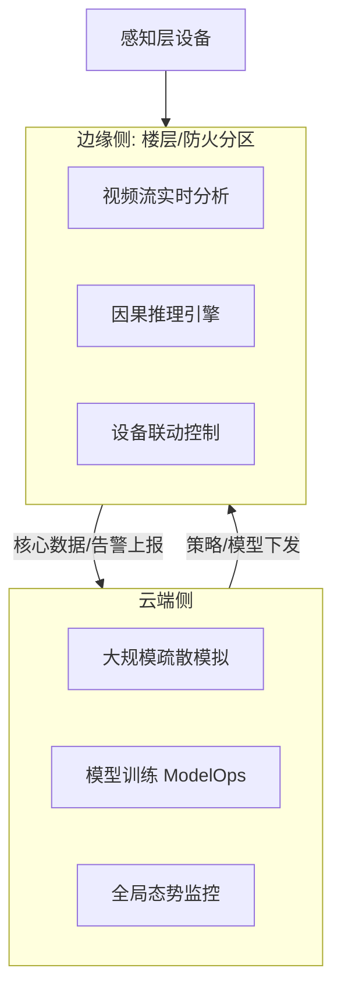

*   **边缘侧**：部署在楼层或防火分区的工业级边缘服务器。承载L2层绝大部分的计算任务，包括视频流分析、实时推理、设备联动控制。
*   **云端侧**：部署在中心机房或私有云。负责重型计算任务（如跨楼栋的大规模疏散模拟）、模型训练、长周期历史数据存储及全局态势监控。

#### **软件架构：容器化与微服务**
*   **容器编排**：边缘节点采用轻量级集群，云端采用标准集群，实现应用的一键部署与弹性伸缩。
*   **服务治理**：所有推理能力封装为容器，通过高效协议进行微服务间的高效通信。

---

### **原子化能力编排**

#### **定义与封装**
我们将L2层的核心能力解耦为**20+个独立的原子能力**，每个能力具备标准化的输入输出接口。
*   **感知类能力**：视觉验火、热成像分析、气体分析。
*   **推理类能力**：证据融合、因果推理、工单检索。
*   **执行类能力**：报警抑制、设备联动。

#### **动态编排引擎**
系统不使用硬编码的串行逻辑，而是基于**有向无环图**的动态编排引擎。

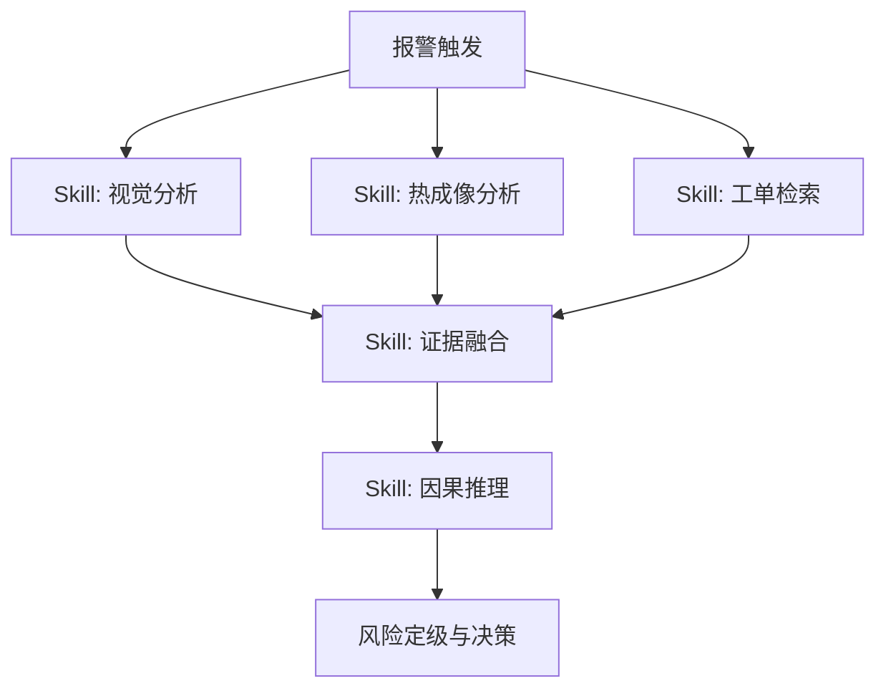

*   **并行计算**：当报警触发时，系统同时唤醒视觉、热成像、工单检索三个能力并行执行，而非依次等待。这将感知阶段的总耗时从串行模式大幅压缩至并行模式的极短时间内。
*   **场景化模板**：
    *   *烟感报警*：加载综合检查模板（调用视觉+气体+工单）。
    *   *手动报警*：加载快速确认模板（调用最近摄像头+保安定位）。

---

### **秒级极致研判的性能优化策略**

为了达成核心性能指标，我们在工程链路的每个环节进行了毫秒级优化。

#### **时延分解与预算**
| 阶段 | 时间预算 | 关键优化手段 |
| :--- | :--- | :--- |
| **唤醒与接入** | **`< 10ms`** | 预加载实例，内存池复用，避免冷启动。 |
| **并行感知** | **`< 150ms`** | 多模态并行执行；模型推理加速。 |
| **融合推理** | **`< 100ms`** | 内存数据库高速读写；向量检索加速。 |
| **决策定级** | **`< 50ms`** | 规则引擎本地缓存，无需查库。 |
| **指令下发** | **`< 30ms`** | 长连接推送，减少握手开销。 |
| **总计** | **`< 340ms`** | **留有充足的安全冗余空间。** |

#### **推理加速技术**
*   **模型量化**：将视觉模型量化处理，在保证精度的前提下，大幅提升推理速度。
*   **显存共享**：实现多个模型共享 GPU 显存，避免频繁的模型加载开销。

#### **数据传输优化**
*   **零拷贝**：在视频流处理中，解码数据直接进入显存供后续模型读取，避免系统间的数据搬运。

---

### **高可用性与离线自治**

#### **断网自治机制**
消防系统必须具备极端环境下的生存能力。当边缘节点与云端网络中断时，L2层自动进入**离线自治模式**。
*   **本地闭环**：所有核心能力均在边缘节点本地运行，不依赖云端接口。
*   **数据缓存**：内置高速存储，支持长周期的原始数据与日志循环存储。网络恢复后，自动进行断点续传。
*   **功能降级**：离线状态下，暂停重算力推演任务，优先保障火情确认与设备联动等核心功能。

#### **看门狗与自愈**
*   **软硬件双重监控**：实时监控传感器心跳与推理进程状态。一旦检测到算法进程异常，系统在极短时间内自动重启服务实例，确保业务连续性。

---

### **全链路证据链与审计实现**

为了解决 AI 信任问题，工程上实现了**五层证据记录体系**。

#### **全链路追踪**
*   每个报警事件在触发时刻生成唯一的追踪 ID。
*   该 ID 贯穿数据采集、能力调用、推理逻辑、决策输出的全过程，所有日志均打上此标签。

#### **证据数据结构**
系统将以下数据打包存储，形成不可篡改的证据：
```json
{
  "trace_id": "EVT-20260202-001",
  "snapshots": ["s3://local/cam01/t0.jpg", "s3://local/cam01/t_plus_5s.jpg"],
  "sensor_curves": {"temp": [22, 25, 28, 35, 45, 85], "co": [0, 0, 2, 5, 12, 45]},
  "reasoning_log": {
    "logic": "Visual smoke + High CO -> Smoldering Fire",
    "skills_output": {"visual": 0.95, "thermal": 0.4},
    "guardrails_check": "PASS"
  },
  "decision": "P1_ALARM",
  "timestamp": 1770030000123
}
```

---

### **接口规范与系统集成**

#### **北向接口**
面向L3决策层及第三方应用。
*   **协议**：高性能 gRPC 或通用 RESTful。
*   **核心功能**：上报实时态势对象，获取完整证据包。

#### **南向接口**
面向L1感知层设备。
*   **协议支持**：支持主流视频协议与各类 IoT 传感器协议。
*   **接入网关**：部署协议转换模块，将异构设备的私有报文清洗为统一的物模型格式。

#### **东西向接口**
面向其他边缘节点或子系统。
*   **功能**：实现跨防火分区的联动（如A区着火，通知B区关闭防火门）。
*   **机制**：基于发布/订阅模式实现低耦合的事件广播。

---

### **本章总结**
本章通过**边缘优先与并行编排**的工程架构，将L2层的算法理论转化为实战能力。
1.  **快**：通过并行计算与模型加速，死磕处理时延，为系统响应留出余量。
2.  **稳**：离线自治设计确保了在火灾可能导致的网络中断场景下，系统依然是忠实的守夜人。
3.  **通**：标准化的北向/南向接口设计，使得系统既能向下兼容各类设备，又能向上融入智慧城市生态。


## **系统实施路线图与里程碑规划**

### **总体实施策略：敏捷交付，价值驱动**

鉴于 Sup-01 L2 认知层项目的高复杂性与创新性，我们采用 **核心优先，迭代演进** 的研发策略。项目初期聚焦于构建高稳健性的数据底座与物理铁律规则引擎，确保系统在基础逻辑上的零失误，随后逐步加载更复杂的AI场景模型。资源配置采用 **全栈专家团队**，确保架构的高可用性与可扩展性，为后续的大规模推广奠定坚实基础。

**总体周期**：**4 个月 (16 周)**，采用标准化双周 Sprint 敏捷开发模式。

---

### **阶段一：基础框架与数据治理 (Foundation & Data Governance)**

**周期**：第 1 - 4 周
**核心目标**：完成高性能服务架构搭建，实现多模态数据的精准关联与标准化接入。

*   **Sprint 1：架构设计与接口规范 (W1-W2)**
    *   **后端**：搭建高并发微服务架构；定义 L1 (感知) 到 L2 (认知) 的企业级 gRPC 标准接口；设计高扩展性的“融合证据包 (FusedEvidence)”数据结构。
    *   **数据**：设计“区域-设备”拓扑映射模型 (Zone-Mapping Model)，建立设备与物理空间的逻辑关联，支持大规模设备接入。
    *   **交付物**：系统架构设计文档、接口定义规范 (.proto)、区域拓扑标准模板。

*   **Sprint 2：数据清洗与时序对齐 (W3-W4)**
    *   **后端**：实现自适应时间窗口 (Adaptive Time Window) 对齐算法，解决异构系统间的数据时钟偏差问题。
    *   **算法**：部署工业级信号滤波器，有效剔除电磁干扰与网络抖动产生的瞬态噪声。
    *   **里程碑 (M1)**：**数据链路贯通**。系统成功接入 L1 实时数据流，并输出清洗对齐后的标准化多维特征数据。

### **阶段二：核心认知引擎研发 (Cognitive Engine Implementation)**

**周期**：第 5 - 12 周
**核心目标**：构建基于物理铁律与场景模式的智能推理内核，实现核心高频场景的精准研判。

*   **Sprint 3：物理铁律与世界模型 (W5-W8)**
    *   **逻辑**：部署“物理铁律”校验模块，实现基于热力学与化学原理的逻辑守门机制；构建动态世界模型，对接工单系统实现作业报备联动。
    *   **后端**：集成高性能规则引擎，编排复杂的物理约束逻辑，保障决策的安全性与合规性。
    *   **交付物**：铁律校验引擎、业务上下文关联服务。

*   **Sprint 4：场景推理与证据链 (W9-W12)**
    *   **算法**：针对明火、施工、水雾等核心高频场景，构建高维特征匹配模型；优化决策树算法，提升识别准确率。
    *   **后端**：实现全链路证据溯源系统，对每一次系统判定生成包含完整逻辑链的“证据快照”，满足审计合规要求。
    *   **里程碑 (M2)**：**认知内核就绪**。系统具备对复杂场景的逻辑判断能力，能够自动识别误报特征并输出可解释的判定依据。

### **阶段三：系统验证与部署交付 (Validation & Delivery)**

**周期**：第 13 - 16 周
**核心目标**：在真实物理环境中验证系统的稳定性与可靠性，完成生产级部署。

*   **Sprint 5：实地联调与参数调优 (W13-W15)**
    *   **测试**：构建包含视觉、热成像、气体传感器的标准验证环境。进行全方位的场景模拟测试，涵盖真实火情与各类典型干扰源。
    *   **调优**：基于实测数据对模型参数与阈值进行精细化校准；验证业务联动逻辑的闭环有效性。
    *   **交付物**：系统测试分析报告、运维配置手册。

*   **Sprint 6：生产部署与最终验收 (W16)**
    *   **部署**：执行容器化部署方案，确保服务在生产环境的高可用运行。
    *   **验收**：进行全系统功能验收，演示秒级火情响应与智能误报过滤能力。
    *   **里程碑 (M3)**：**系统上线就绪**。系统通过各项性能与功能指标考核，具备正式上线运行条件。

---

### **关键里程碑与验收标准**

| 里程碑编号 | 节点名称 | 时间点 | 验收标准 (Definition of Done) |
| :--- | :--- | :--- | :--- |
| **M1** | **数据链路贯通** | W4 | 后端服务稳定接收多模态数据；空间拓扑逻辑生效，实现多设备数据的自动聚合与标准化。 |
| **M2** | **认知内核就绪** | W12 | 规则引擎上线运行；物理铁律校验机制生效；核心场景识别逻辑验证通过，具备高置信度推理能力。 |
| **M3** | **系统上线就绪** | W16 | 实地验证通过：真火零漏报，误报率达到指标要求；系统完整输出包含推理逻辑的可追溯证据包。 |

---

### **交付物清单**

1.  **软件资产**：
    *   Sup-01 核心认知引擎 Docker 镜像 (Release版)。
    *   统一接入网关服务 (Gateway)。
2.  **配置与数据**：
    *   区域-设备拓扑配置文件 (Zone-Mapping.yaml)。
    *   核心场景特征规则库 (Rule-Set v1.0)。
3.  **文档集**：
    *   《系统接口集成规范》
    *   《核心算法逻辑说明书》
    *   《系统部署与运维管理手册》

---

## **数据源约束**

本系统定位为**推理认知层**，不承担数据采集职责。为确保系统正常运行，客户需提供以下数据源的接入支持：

### **一、感知层数据源（L1层必需）**

| 数据源类型 | 数据格式/协议要求 | 接入频率 | 用途说明 |
| :--- | :--- | :--- | :--- |
| **视频监控流** | RTSP/RTMP/GB28181协议，分辨率≥1080P | 实时流（25fps） | 火焰/烟雾视觉检测、现场态势可视化 |
| **热成像数据** | 温度矩阵数据，含设备坐标信息 | ≥1Hz | 温度异常检测、物理铁律校验 |
| **烟感报警信号** | 标准消防协议或API接口 | 事件触发 | 报警事件触发源 |
| **气体传感器数据** | CO浓度(ppm)、VOC浓度(ppb)、PM2.5(μg/m³) | ≥1Hz | 阴燃识别、误报特征判定 |
| **温度传感器数据** | 点位温度值(℃)，含设备ID与坐标 | ≥1Hz | 温升趋势分析、物理一致性校验 |

### **二、建筑空间数据源（静态配置）**

| 数据源类型 | 数据格式要求 | 更新频率 | 用途说明 |
| :--- | :--- | :--- | :--- |
| **BIM建筑模型** | IFC/Revit格式或简化JSON拓扑 | 建筑改造时更新 | 空间语义化、蔓延路径模拟、视域映射 |
| **设备点位表** | 含设备ID、类型、物理坐标(x,y,z)、所属区域 | 设备变更时更新 | 设备-空间关联、拓扑映射 |
| **防火分区划分** | 区域ID、边界坐标、防火等级 | 建筑改造时更新 | 风险分区、蔓延预测 |
| **摄像头视域配置** | 摄像头ID、安装位置、视锥参数、覆盖区域 | 设备变更时更新 | 视觉-传感器关联、盲区标记 |
| **高风险区域标注** | 配电房、危化品库、数据中心等区域清单 | 业态变更时更新 | 风险等级加权、阈值自动收紧 |
| **可燃物分布信息** | 装修材料、货物类型、火灾荷载等级 | 业态变更时更新 | 蔓延风险评估、财产风险计算 |

### **三、业务系统数据源（动态对接）**

| 数据源类型 | 对接方式 | 数据内容要求 | 用途说明 |
| :--- | :--- | :--- | :--- |
| **工单管理系统** | API/数据库直连 | 工单ID、作业类型(动火/装修/维修)、作业区域、起止时间、审批状态 | 合法作业识别、误报抑制 |
| **门禁系统** | API/消息队列 | 刷卡记录、区域人员进出统计 | 人员密度计算、疏散风险评估 |
| **客流统计系统** | API接口 | 各区域实时客流量 | 人员风险评估、RSET计算 |
| **Wi-Fi探针数据**（可选） | API接口 | MAC地址热力分布 | 人员热力图增强 |

### **四、设备状态数据源（IoT层）**

| 数据源类型 | 协议要求 | 数据内容 | 用途说明 |
| :--- | :--- | :--- | :--- |
| **消防水系统** | Modbus/OPC-UA/MQTT | 水压值、水泵运行状态 | 设备联动状态监控 |
| **排烟系统** | Modbus/OPC-UA/MQTT | 风机启停状态、风速 | 烟雾扩散模型参数 |
| **防火门/卷帘** | 干接点/协议接口 | 开闭状态、故障告警 | 蔓延路径预测、分隔有效性评估 |
| **电气监控系统** | API/协议接口 | 电流、电压、功率、故障告警 | 电气火灾早期识别 |
| **消防主机** | 消防协议(如CAN总线) | 各类报警信号、设备状态 | 报警事件触发、设备健康监控 |

### **五、历史数据源（系统自学习）**

| 数据源类型 | 数据要求 | 用途说明 |
| :--- | :--- | :--- |
| **历史报警记录** | 过去1年以上的报警日志，含时间、位置、处置结果 | 高频误报点位识别、环境基线学习 |
| **历史环境数据** | 各点位的温度、湿度等历史曲线 | 日夜基线漂移学习、异常阈值自适应 |

### **六、数据质量要求**

| 要求维度 | 具体标准 |
| :--- | :--- |
| **时间同步** | 所有数据源时间偏差 **< 10ms**（需部署NTP/PTP时钟同步） |
| **数据完整性** | 关键传感器数据缺失率 **< 1%** |
| **接口可用性** | 业务系统API可用性 **≥ 99.9%** |
| **坐标一致性** | 所有设备坐标需统一至BIM世界坐标系 |

### **七、数据安全与合规**

| 要求类型 | 具体说明 |
| :--- | :--- |
| **数据脱敏** | 视频流中的人脸信息需在边缘侧脱敏处理（如启用人脸模糊） |
| **传输加密** | 所有数据传输通道需支持TLS加密 |
| **访问控制** | 提供细粒度的API访问权限控制 |
| **数据存储** | 明确数据存储周期与删除策略，符合相关法规要求 |

---

## **项目资源投入与预算估算**

### **测算模型设定**

*   **团队配置**：**专家级研发团队 (4人)**。配置资深架构师与算法专家，确保系统底层架构的稳健性与算法模型的精准度。
*   **周期设定**：**4 个月** (16 周)。
*   **费用构成**：包含直接研发人力成本（薪资、社保、公积金等综合成本），不含硬件采购及场地费用。

### **研发人力投入预算**

| 关键角色 | 人员职责 | 综合月成本 (预估) | 投入人月 | 总成本 (CNY) |
| :--- | :--- | :--- | :--- | :--- |
| **系统架构师 (Tech Lead)** | 负责整体技术架构设计、核心接口定义、技术难点攻关及系统集成质量把控。 | ¥35,000 | 4.0 | ¥140,000 |
| **高级算法工程师** | 负责多模态数据融合算法设计、物理模型构建、场景特征提取及核心识别逻辑调优。 | ¥25,000 | 4.0 | ¥100,000 |
| **核心开发工程师** | 负责业务逻辑实现、第三方系统对接、数据持久化及可视化管理后台开发。 | ¥15,000 | 4.0 | ¥60,000 |
| **系统实施工程师** | 负责现场环境勘测、硬件联调、场景模拟测试、参数校准及交付培训。 | ¥15,000 | 4.0 | ¥60,000 |
| **投入总计** | **4人专家团队** | | **16 人月** | **¥360,000** |

### **投资效益分析**

*   **高性价比交付**：通过精准的架构设计与高效的敏捷开发，以可控的投入实现了传统方案难以企及的**“主动认知”**与**“精准研判”**能力。
*   **资产复用性**：项目中沉淀的**“空间语义拓扑”**与**“多模态校验规则库”**是高价值的数字资产，可低成本快速复制到其他类似商业综合体项目。
*   **平滑演进**：系统架构具备高度的可扩展性，支持未来无缝接入更多类型的传感器与更复杂的AI模型，保护客户的长期投资。