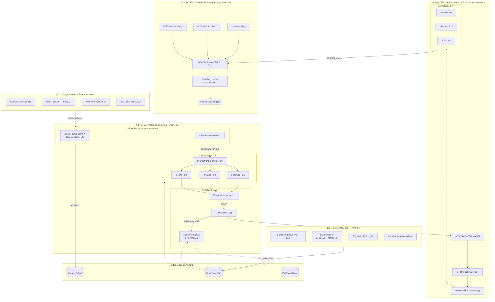

import SystemArchitecture from '@site/src/components/SystemArchitecture';

<SystemArchitecture />

---

```mermaid
graph TD

    %% --- 左翼：销售侧 (Human-in-the-Loop) ---
    subgraph LeftWing [🦅 左翼：销售å®æ“工作å°]
        direction TB
        SalesUI[ä¼å¾®ä¾§è¾¹æ /H5]
        Dashboard[å®æ—¶æ¼æ–—仪表盘]
        HumanIntervene[人工干预/改派]
        TaskCenter[å¾…åŠä»»åŠ¡ä¸­å¿ƒ]
    end
    class LeftWing,SalesUI,Dashboard,HumanIntervene,TaskCenter wings;

    %% --- å³ç¿¼ï¼šè¿è¥ä¾§ (Configuration) ---
    subgraph RightWing [🦅 å³ç¿¼ï¼šè¿è¥é…置中心]
        direction TB
        StrategyConfig[策略画布/规则é…ç½®]
        KnowledgeBase[åŸå­äº‹å®ç®¡ç†<br>价格日å†/政策]
        CrowdMgr[分群ä¸LTVé…ç½®]
        AuditLog[审计ä¸é£æ§æ—¥å¿—]
    end
    class RightWing,StrategyConfig,KnowledgeBase,CrowdMgr,AuditLog wings;

    %% --- 中间核心：三层æ¶æ„ ---
    
    %% 第一层：感知层
    subgraph Layer1 [1. 感知层: 事件驱动信å·æ€»çº¿ Event Bus]
        direction LR
        SignalReceiver[多æºä¿¡å·æ¥æ”¶é€‚é…器]
        EventCleaner[事件清洗ä¸æ ‡å‡†åŒ–]
        msg_queue{{Kafka / Coze Trigger}}
        
        LiveStream[直播间埋点] --> SignalReceiver
        PaySystem[支付网关å›è°ƒ] --> SignalReceiver
        WeComHook[ä¼å¾®æ¶ˆæ¯å›è°ƒ] --> SignalReceiver
        SignalReceiver --> EventCleaner --> msg_queue
    end
    class Layer1 perception;
    class SignalReceiver,EventCleaner,msg_queue perception;

    %% 第二层：决策层
    subgraph Layer2 [2. 决策层: FSM状æ€æœº & 路由引æ“]
        direction TB
        
        %% 核心状æ€æœº
        subgraph FSM_Core [动æ€å®¢æˆ·çŠ¶æ€æœº FSM]
            CustomerState[客户状æ€å®¹å™¨<br>Stage / Intent / LTV]
            StateTransition[状æ€æµè½¬é€»è¾‘]
        end
        
        %% 策略路由
        subgraph Routing_Engine [分层策略路由]
            ConflictResolver[冲çªæ¶ˆè§£ & 优先级]
            StageRouter[阶段路由]
            EventRouter[事件路由]
            ProfileRouter[ç”»åƒè·¯ç”±]
        end
        
        %% AI 大脑
        subgraph AI_Brain [AI Agent & RAG]
            LLM_Core[LLM æ¨ç†æ ¸å¿ƒ]
            PromptEngine[åŠ¨æ€ Prompt 组装]
            FactCheck[åŸå­äº‹å®æ ¡éªŒ<br>ä»·æ ¼/政策]
        end

        %% æ•°æ®æµè½¬
        msg_queue --> StateTransition
        StateTransition -- 状æ€å˜æ›´äº‹ä»¶ --> ConflictResolver
        ConflictResolver --> StageRouter & EventRouter & ProfileRouter
        StageRouter & EventRouter & ProfileRouter --> PromptEngine
        PromptEngine -- 调用 --> LLM_Core
        LLM_Core -- 检索/校验 --> FactCheck
    end
    class Layer2 decision;
    class FSM_Core,Routing_Engine,AI_Brain,CustomerState,StateTransition,ConflictResolver,StageRouter,EventRouter,ProfileRouter,LLM_Core,PromptEngine,FactCheck decision;

    %% 第三层：执行层
    subgraph Layer3 [3. 执行层: 通é“抽象网关 Channel Gateway]
        direction TB
        UnifiedSender[统一å‘é€æŒ‡ä»¤æ¥å£]
        FreqControl[高频防护 & 熔断]
        ChannelSwitch[通é“自动切æ¢/é™çº§]
        
        subgraph Adaptors [å议适é…器]
            WeComAPI[ä¼å¾® API]
            SMS_API[短信网关]
            Voice_API[AI 外呼]
        end
    end
    class Layer3 execution;
    class UnifiedSender,FreqControl,ChannelSwitch,Adaptors,WeComAPI,SMS_API,Voice_API execution;

    %% --- 存储层 (支撑) ---
    subgraph DataLayer [æŒä¹…化数æ®å­˜å‚¨]
        DB_User[(客户画åƒåº“)]
        DB_Rules[(规则策略库)]
        DB_Logs[(交互日志)]
    end
    class DataLayer,DB_User,DB_Rules,DB_Logs db;

    %% --- 跨层è¿æ¥ ---
    RightWing -- é…置更新 --> DB_Rules
    DB_Rules -.-> Routing_Engine & FactCheck
    
    LeftWing -- 查询/干预 --> FSM_Core
    FSM_Core -- 读写 --> DB_User
    
    FactCheck -.-> DB_Rules
    
    LLM_Core -- 生æˆè¯æœ¯/动作 --> UnifiedSender
    UnifiedSender --> FreqControl --> ChannelSwitch --> Adaptors
    
    Adaptors -- è§¦è¾¾ç»“æœ --> SignalReceiver
```