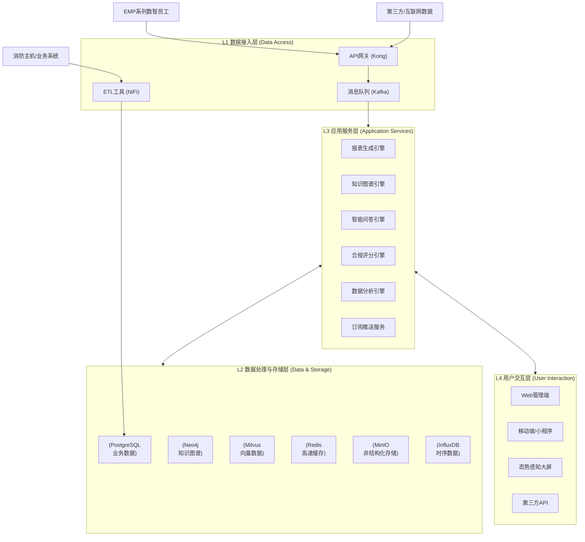
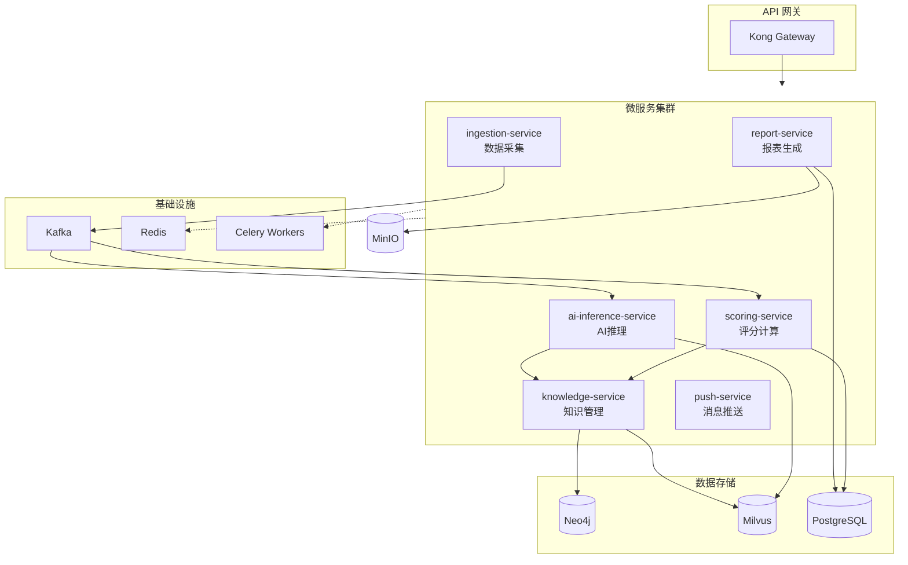
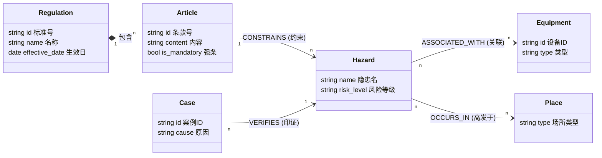
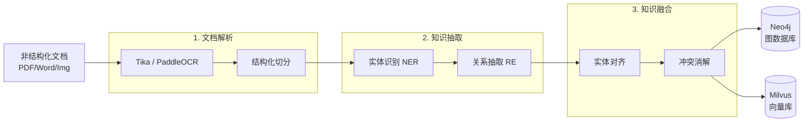
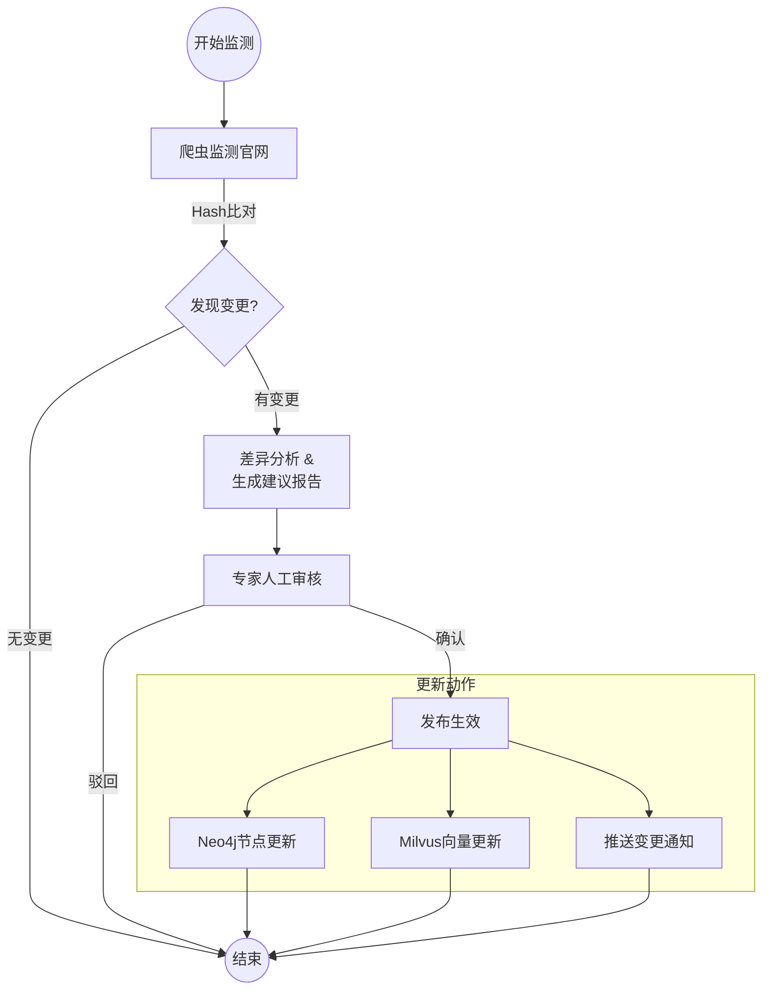
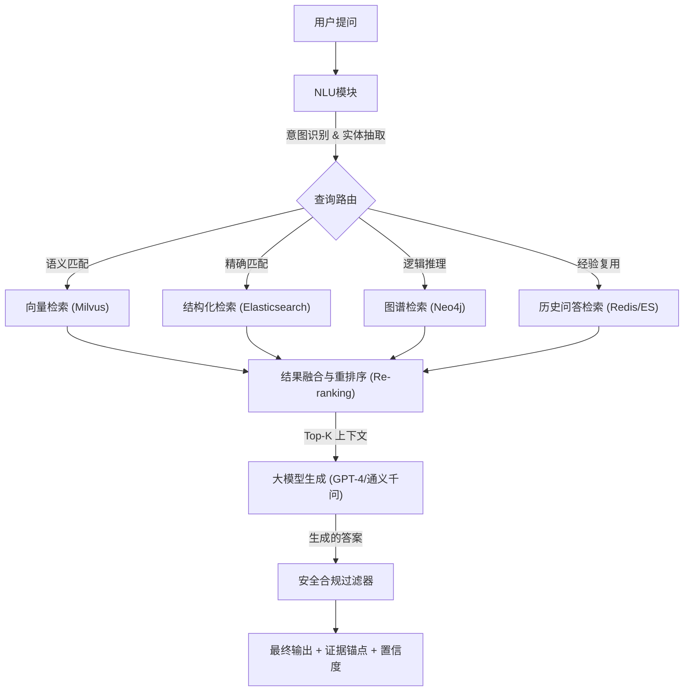
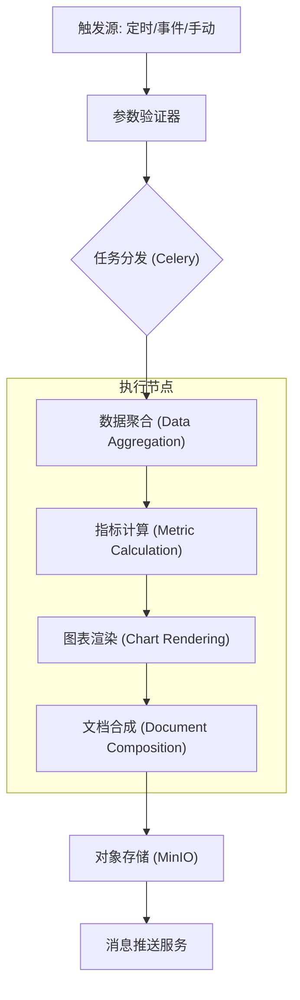

## 摘要

| 内容维度 | 核心阐述 |
|--------|---------|
| **项目名称** | EMP-20 知识与报表专员系统技术及实施方案 |
| **技术定位** | 消防安全管理体系中的“理性中枢”与“知识大脑”，负责将数据转化为组织共识。 |
| **核心创新** | 构建“法规-隐患-案例”知识图谱，结合 RAG 实现智能问答，基于动态权重的合规评分模型。 |
| **关键成果** | 自动化生成多维报表（&lt;30s/份）；实现“隐患-工单-整改”全闭环管理；知识问答准确率 >90%。 |
| **技术栈概览** | **后端**：Java Spring Boot / Python FastAPI + Celery；**数据**：Neo4j (图) + Milvus (向量) + PG；**AI**：RAG (BGE-M3 + LLM) + AHP 评分算法。 |
| **硬件方案** | **全云原生架构**，解耦前端硬件。支持私有云/公有云容器化部署 (K8s/Docker)。 |
| **开发周期** | 2.5个月（10周）敏捷迭代；里程碑：数据底座→核心引擎(KG+RAG)→应用上线。 |
| **投资规模** | 研发投入预算 ¥175,000；采用“核心+执行”梯队模式（架构师+AI专家+开发+测试）。 |
| **交付物** | 部署镜像包 + 知识图谱数据资产 + 自动化报表服务 + 全套技术文档 |
| **差异竞争力** | **逻辑自研** (核心算法自有)；**依据优先** (RAG 严控幻觉)；**管理闭环** (数据驱动持续改进)。 |


## 总体技术架构与设计哲学

### 设计哲学：理性中枢与知识大脑

EMP-20 系统（知识与报表专员）的定位并非单纯的 IT 工具或报表生成器，而是作为整个消防安全管理体系中的 **"理性中枢"** 与 **"知识大脑"**。在设计上，我们摒弃了传统安防系统重硬件、轻数据的弊端，确立了以下三大核心设计哲学，以确保系统具备可持续的生命力和高附加值的管理产出。

#### 核心定位：从数据到共识的价值链
传统消防管理往往止步于数据的采集与堆砌，而 EMP-20 的核心使命是构建一条完整的价值转化链条：
1.  **把数据变成知识**：将分散的告警、法规、案例转化为结构化的知识图谱。
2.  **把知识变成判断**：利用算法模型对合规性、风险趋势进行量化评分与研判。
3.  **把判断变成组织共识**：通过标准化的报表和可视化的态势大屏，统一管理层的认知。
4.  **把共识变成持续改进的动力**：通过工单联动与复盘闭环，推动隐患的实质性解决。

#### 三大技术原则
基于技术实施方案的要求，EMP-20 的架构设计严格遵循以下三大原则：

1.  **硬件解耦 (Hardware Decoupling)**
    EMP-20 不直接绑定任何特定的传感器或感知硬件。所有感知数据（如 EMP-01 的视觉告警、消防主机的状态数据）均通过标准化的 API 接口（RESTful/gRPC/Kafka）接入。这种设计确保了系统不受限于前端硬件的品牌或型号，极大地降低了感知层的替换成本，聚焦于数据价值挖掘。

2.  **逻辑自研 (Logic Self-Research)**
    系统的核心竞争力在于 L3 应用服务层的高价值逻辑推理能力。我们通过自研的 **知识图谱 (KG)**、**RAG 智能问答引擎** 以及 **合规评分算法**，构建起不可替代的行业壁垒。这是 EMP-20 的“灵魂”，负责将碎片化数据转化为结构化认知。

3.  **管理闭环 (Management Closed-Loop)**
    系统不仅仅负责发现问题，更关注问题的解决。通过与工单系统的深度集成，EMP-20 实现了从“隐患发现 → 自动派单 → 整改执行 → 效果验证 → 闭环归档”的全链路数字化管理。

---

### 总体技术架构图解

EMP-20 采用 **云端轻量化四层架构**，核心计算与存储集中在云端，通过微服务化部署保障系统的弹性伸缩与高可用性。

#### 逻辑架构视图

系统自下而上分为四层，各层职责边界清晰，通过标准化协议进行交互。



##### **各层级核心功能解析：**

1.  **L1 数据接入层 (Data Access Layer)**
    *   **核心组件**：Kong API 网关、Apache Kafka、Apache NiFi。
    *   **功能**：负责多源异构数据的汇聚。包括 EMP-01/02/03 的实时告警流、消防主机的状态数据、以及互联网法规爬虫数据。该层负责数据的清洗、标准化和协议转换，屏蔽底层数据源的差异性。

2.  **L2 数据处理与存储层 (Data Processing & Storage Layer)**
    *   **核心组件**：采用 **多模数据库架构 (Multi-Model Database)**。
        *   **PostgreSQL**：存储结构化业务数据（报表、工单、用户权限）。
        *   **Neo4j**：存储消防法规与设备关系的知识图谱，支持复杂关联查询。
        *   **Milvus**：存储法规文档和案例的向量特征，支撑语义检索。
        *   **Redis**：处理热点数据缓存与会话管理。
        *   **MinIO**：存储报表 PDF、现场照片、演练视频等非结构化文件。
        *   **InfluxDB/ClickHouse**：处理时序监控数据与海量日志分析。

3.  **L3 应用服务层 (Application Service Layer)**
    *   **核心组件**：基于 Spring Boot / Python 的微服务集群。
    *   **功能**：
        *   **报表引擎**：基于 Jinja2/Thymeleaf 模板技术，实现多格式报表（PDF/Excel）的自动化渲染与生成。
        *   **知识引擎**：集成 NLP 模型（BERT）与 LLM（通义千问/GPT），提供 RAG 问答与图谱推理能力。
        *   **评分引擎**：执行 AHP 层次分析法与动态权重计算，输出合规评分与风险等级。

4.  **L4 用户交互层 (User Interaction Layer)**
    *   **设计原则**：认知优先于操作，结论优先于细节。
    *   **终端形态**：
        *   **Web 管理端**：全功能操作，支持报表钻取与知识库维护。
        *   **移动端 (App/小程序)**：轻量化查看报表、接收告警推送与快速问答。
        *   **态势大屏**：面向决策层，展示核心风险指标与趋势。

---

### 技术栈全景与选型理由

为保证系统的高性能、可扩展性与可维护性，EMP-20 选用了目前主流且成熟的云原生技术栈。

| 分层 | 关键技术组件 | 选型理由 |
| :--- | :--- | :--- |
| **前端交互** | **React + Ant Design Pro**<br/>**ECharts** | 适合构建复杂的企业级后台；ECharts 提供丰富的可视化图表能力，满足报表与大屏需求。 |
| **后端服务** | **Spring Boot (Java)**<br/>**Python (FastAPI/Flask)** | Java 负责业务逻辑与事务处理（稳定）；Python 负责 AI 算法、NLP 处理与报表渲染（生态丰富）。 |
| **AI 与算法** | **PyTorch / TensorFlow**<br/>**LangChain**<br/>**BERT / LLM API** | PyTorch 用于模型训练；LangChain 编排 RAG 流程；LLM 提供生成式能力。 |
| **数据存储** | **PostgreSQL (v14+)**<br/>**Neo4j**<br/>**Milvus (v2.x)** | PG 处理复杂关系数据性能优异；Neo4j 是图数据库事实标准；Milvus 专为向量检索设计，性能高。 |
| **中间件** | **Apache Kafka**<br/>**Redis**<br/>**Celery** | Kafka 处理高吞吐量数据流；Redis 提供高性能缓存；Celery 处理报表生成等异步耗时任务。 |
| **基础设施** | **Docker + Kubernetes (K8s)**<br/>**Prometheus + Grafana** | 容器化部署实现环境隔离与弹性伸缩；Prometheus 提供全链路监控。 |

#### 核心微服务拓扑
系统将业务逻辑拆分为独立的微服务，通过 API 网关统一管理：



*   **report-service**：报表生成服务，负责数据聚合与文件渲染。
*   **knowledge-service**：知识管理服务，负责图谱查询与文档解析。
*   **scoring-service**：评分计算服务，负责合规模型运算。
*   **push-service**：推送服务，集成邮件、短信、IM 渠道。
*   **ingestion-service**：数据采集服务，对接外部数据源。
*   **ai-inference-service**：AI 推理服务，封装向量检索与 LLM 调用。

---

### 本章小结
本章明确了 EMP-20 作为“组织智慧大脑”的顶层设计。通过**硬件解耦**，我们摆脱了对特定设备的依赖；通过**逻辑自研**，我们掌握了知识图谱与评分模型等核心 IP；通过**四层架构与微服务设计**，我们构建了一个高可用、易扩展的技术底座。这一切为后续章节中具体的知识管理、报表生成及算法模型的实现奠定了坚实基础。

---

## 知识管理与图谱构建

### 设计目标与能力定义

知识管理是 EMP-20 的**基础能力层**。不同于传统的文档管理系统（DMS），EMP-20 的目标是构建一个**动态、可计算、可推理的领域知识大脑**。

**核心技术目标：**
1.  **结构化（Structuring）**：将 PDF/Word 格式的消防法规、国标（GB）、行标（GA）转化为实体与关系。
2.  **图谱化（Graphing）**：构建“法规—隐患—设备—场所”的多维关联网络，支持多跳查询。
3.  **动态化（Dynamic Updating）**：实现法规更新的自动监测与图谱的增量更新，解决“知识过时”痛点。

---

### 知识图谱本体设计 (Ontology Design)

本体（Schema）是知识图谱的骨架。基于 EMP-20 的业务场景，我们设计了以“合规”为核心的五大类实体节点与六类核心关系。

#### 实体节点定义 (Nodes)

| 实体类型 (Label) | 定义描述 | 核心属性 (Properties) | 数据来源示例 |
| :--- | :--- | :--- | :--- |
| **Regulation** (法规) | 法律、行政法规、技术标准 | `id` (标准号), `name`, `level` (国家/地方), `effective_date` | GB 50016-2014 |
| **Article** (条款) | 法规中的具体条文 | `id`, `content`, `chapter`, `is_mandatory` (是否强条) | 第8.1.2条 |
| **Hazard** (隐患) | 可能导致事故的不安全状态 | `code`, `name`, `risk_level`, `description` | 疏散通道堵塞 |
| **Equipment** (设备) | 消防设施与器材 | `id`, `type`, `model`, `maintenance_cycle` | 自动喷水灭火系统 |
| **Place** (场所) | 物理空间或业态类型 | `type` (厨房/仓库), `risk_category` | 商业综合体餐饮区 |
| **Case** (案例) | 历史事故或处罚案例 | `id`, `date`, `location`, `loss`, `cause` | 2023年某商场火灾 |

#### 关系定义 (Relationships)

我们使用有向边来表达实体间的逻辑约束：



*   **(:Article)-[:CONSTRAINS]->(:Hazard)**
    *   语义：某法规模范约束某类隐患。
    *   示例：`GB 50016 第5.5.15条` -> 约束 -> `疏散门宽度不足`
*   **(:Hazard)-[:ASSOCIATED_WITH]->(:Equipment)**
    *   语义：某隐患与特定设备相关。
    *   示例：`喷头堵塞` -> 关联 -> `闭式喷头`
*   **(:Hazard)-[:OCCURS_IN]->(:Place)**
    *   语义：某隐患高发于特定场所。
    *   示例：`油烟管道积油` -> 高发于 -> `商用厨房`
*   **(:Equipment)-[:REQUIRES_ACTION]->(:Procedure)**
    *   语义：设备需要特定的维保或操作规程。
    *   示例：`灭火器` -> 需要 -> `每月外观检查`
*   **(:Case)-[:VERIFIES]->(:Hazard)**
    *   语义：历史案例印证了某类隐患的风险。

#### 图谱存储模型 (Neo4j)

采用 **Neo4j** 作为图数据库存储引擎，利用其原生的图遍历能力支持实时推理。

**Cypher 建表语句示例：**
```cypher
// 创建法规节点约束
CREATE CONSTRAINT ON (r:Regulation) ASSERT r.id IS UNIQUE;

// 创建隐患与法规的关系示例
MATCH (a:Article {id: 'GB50016-5.5.15'}), (h:Hazard {name: '疏散门宽度不足'})
MERGE (a)-[:CONSTRAINS {confidence: 0.95}]->(h);
```

---

### 知识抽取与融合流水线 (ETL Pipeline)

为了将非结构化文档转化为上述图谱，EMP-20 构建了一套自动化的 NLP 处理流水线。

#### 技术架构



#### 详细处理流程

**1. 文档解析 (Document Parsing)**
*   **工具选型**：Apache Tika + PaddleOCR。
*   **处理逻辑**：
    *   对于 PDF/Word：利用 Tika 提取文本，保留段落结构和表格信息。
    *   对于扫描件/图片：利用 PaddleOCR 进行文字识别。
    *   **结构化切分**：基于正则表达式（如 `第[一二三四五六七八九十]+章`、`\d+\.\d+\.\d+`）将长文档切分为独立的“条款（Article）”颗粒度。

**2. 知识抽取 (Information Extraction)**
这是“逻辑自研”的核心算法部分，采用 **BERT-BiLSTM-CRF** 模型进行训练。

*   **实体识别 (NER)**：
    *   模型：基于消防领域语料微调的 BERT 模型。
    *   任务：从条款文本中识别出 `<设备: 疏散指示标志>`、`<数值: 1.0m>`、`<动作: 设置>`。
*   **关系抽取 (RE)**：
    *   模型：使用 Joint Extraction 联合抽取模型或基于规则的依存句法分析。
    *   示例输入：“疏散走道的净宽度不应小于1.1m。”
    *   抽取结果：`疏散走道` (主体) --`净宽度要求`--> `1.1m` (客体)。

**3. 知识融合 (Knowledge Fusion)**
*   **实体对齐**：解决同义词问题。例如，将“消火栓”、“室内消火栓”、“消防栓”统一对齐到标准实体 ID `EQ_001`。
    *   *算法*：基于编辑距离（Levenshtein）和语义相似度（Cosine Similarity）的混合对齐。
*   **冲突消解**：当新旧法规冲突时，依据属性 `effective_date`（生效日期）和 `authority_level`（效力等级），保留高优先级的知识，将旧知识标记为 `expired`。

---

### 向量化与混合索引 (Hybrid Indexing)

为了支持 RAG（检索增强生成），知识不仅要存入图数据库，还需进行向量化处理。

#### 文本向量化 (Embedding)
*   **模型**：使用 **BGE-M3 (BAAI General Embedding)**，支持长文本和多语言，适合中文法律法规场景。
*   **分块策略 (Chunking)**：
    *   按“条款”分块：保留完整的法条语义。
    *   滑动窗口：对于超长案例，使用 512 tokens 窗口，重叠 128 tokens。

#### 向量存储 (Milvus)
*   将生成的 Embedding 向量存入 **Milvus** 向量数据库。
*   **元数据绑定**：在 Milvus 中存储向量的同时，绑定 `regulation_id`、`article_id`，以便在检索时能反查到 Neo4j 中的具体节点，实现“向量+图”的联动。

---

### 知识版本管理与更新机制

为确保知识的时效性（Time-to-Live），系统设计了严密的版本控制流程。

#### 版本控制策略
采用 **主版本.次版本.修订版本** 的策略：
*   **主版本**：国家大法（如《消防法》）修订。
*   **次版本**：行业标准（如 GB/GA）更新。
*   **修订版本**：内部纠错或补充案例。

#### 自动更新闭环
1.  **监测 (Monitor)**：爬虫每日监测应急管理部、住建部官网，通过哈希比对发现新文件。
2.  **差异分析 (Diff)**：自动对比新旧文档，高亮变更条款（如“罚款上限由5万调整为10万”）。
3.  **审核 (Review)**：
    *   系统自动生成“更新建议报告”。
    *   专家（Knowledge Admin）进行人工确认。
4.  **生效 (Publish)**：
    *   Neo4j：创建新节点，建立 `REPLACED_BY` 关系指向新节点。
    *   Milvus：插入新向量，旧向量标记为软删除。
    *   推送：通过订阅服务通知相关管理人员（F08 场景）。



---

### 本章技术栈总结

| 模块 | 技术组件/算法 | 选型理由 |
| :--- | :--- | :--- |
| **文档解析** | **Apache Tika, PaddleOCR** | 处理 PDF/图片扫描件的工业级标准，OCR 对中文支持好。 |
| **NLP 模型** | **BERT-BiLSTM-CRF** | 实体识别（NER）的主流架构，适合领域知识抽取。 |
| **图数据库** | **Neo4j (v5.x)** | 社区成熟，Cypher 查询语言表达能力强，支持复杂路径推理。 |
| **向量数据库** | **Milvus (v2.3)** | 高性能、分布式向量检索，支持混合查询。 |
| **Embedding** | **BGE-M3** | 目前中文语义理解效果最佳的开源 Embedding 模型之一。 |
| **知识融合** | **Dedupe (Python库)** | 基于机器学习的实体去重与对齐工具。 |


通过本章方案的实施，EMP-20 将构建起一个包含**法规、设备、隐患、案例**四大维度的知识底座，为后续的智能问答（第三章）和合规评分（第五章）提供坚实的数据支撑。

## RAG 智能问答引擎

### 核心定位与设计原则

EMP-20 的问答引擎并非通用的聊天机器人，而是**消防安全领域的专业顾问**。其技术设计的核心原则是**依据优先，生成为辅**，坚决杜绝大模型的“幻觉”风险。

**三大技术铁律：**
1. **无依据不回答**：所有答案必须基于知识库中检索到的法规、标准或案例，严禁模型“脑补”事实。
2. **非指令性输出**：对于操作性问题（如“如何灭火”），仅提供规范建议，严禁输出直接的操作指令（如“立即按下红色按钮”），规避责任风险。
3. **可解释性**：每一条回答必须附带可点击的**证据锚点**，直接链接到原始法规条文或案例记录。

---

### RAG (检索增强生成) 架构设计

我们采用 **多路混合检索（Hybrid Search）** 架构，以解决单一向量检索在精确匹配（如法规条文号）和复杂推理（如隐患归因）方面的不足。

#### 检索架构全景



#### 多路召回策略详解

1. **路径一：向量检索**
    * **适用场景**：语义模糊的自然语言提问（如“通道堵了怎么罚款？”）。
    * **技术实现**：
        * **Embedding 模型**：采用 **BGE-M3**，将用户问题转化为 1024 维向量。
        * **检索引擎**：**Milvus (v2.x)**，使用 HNSW 索引实现毫秒级 ANN（近似最近邻）搜索。
        * **分块策略**：法规文档按“条款”粒度切分，案例按“事件”切分，保留 512 tokens 窗口。

2. **路径二：结构化检索**
    * **适用场景**：精确查询特定法规条款、设备参数（如“GB 50016 第5.5.15条的内容”）。
    * **技术实现**：
        * 使用 **Elasticsearch** 进行倒排索引检索。
        * 对法规名称、条文号、设备型号字段进行加权（Boost）。

3. **路径三：图谱检索**
    * **适用场景**：多跳关系推理（如“厨房有哪些高风险隐患，对应的整改措施是什么？”）。
    * **技术实现**：
        * 解析问题中的实体（如“厨房”），在 Neo4j 中执行 Cypher 查询：
          `MATCH (p:Place {name:"厨房"})-[:HAS_RISK]->(h:Hazard)-[:SOLVED_BY]->(m:Measure) RETURN h, m`
        * 利用图谱的结构化关系补充上下文。

4. **路径四：历史问答检索**
    * **适用场景**：高频问题（如“灭火器有效期多久”）。
    * **技术实现**：基于语义相似度匹配历史高分问答对（QA Pairs），优先返回经过人工校验的“金标准”答案。

#### 结果融合与重排序
使用 **Cross-Encoder** 模型（如 BGE-Reranker）对多路召回的 Top-50 结果进行精细打分，最终保留 Top-5 最相关的片段作为 Prompt 的上下文。

---

### 答案生成与 Prompt Engineering

#### 结构化提示词模板
为了抑制幻觉，EMP-20 使用严格限制的 Prompt 模板：

```text
【角色设定】
你是由 EMP-20 系统驱动的消防安全专家。请仅根据下方的【参考资料】回答用户问题。

【参考资料】
1. [法规] GB 50016-2014 第5.5.15条: ... (ID: REF_001)
2. [案例] 2023年某商场疏散通道堵塞处罚案例... (ID: REF_002)
3. [图谱] 疏散通道 -> 关联隐患 -> 堵塞 (ID: KG_05)

【用户问题】
{user_query}

【生成约束】
1. 必须引用【参考资料】中的内容，并在句尾标注来源ID，如[REF_001]。
2. 若参考资料无法回答问题，直接回复“系统暂未收录相关信息”，禁止编造。
3. 禁止输出“切断电源”、“按下按钮”等直接操作指令，应使用“建议检查”、“建议联系维保”等建议性语言。
4. 保持语气专业、客观、简洁。
```

#### 证据绑定与可解释性实现
* **技术逻辑**：在 LLM 生成文本后，后处理模块会解析文本中的 `[REF_XXX]` 标记。
* **前端交互**：用户点击 `[REF_001]`，系统侧边栏自动展开对应的法规原文或案例详情，实现“结论—证据”的互证。

---

### 置信度评估模型

EMP-20 独创了**答案置信度评分机制**，让用户知道“机器有多大把握”。

#### 计算公式
$$ \text{Confidence} = \alpha \times S_{\text{consistency}} + \beta \times S_{\text{coverage}} + \gamma \times S_{\text{history}} $$

* **$S_{\text{consistency}}$ (召回一致性)**：向量检索、关键词检索和图谱检索结果的语义重合度（权重 0.4）。
* **$S_{\text{coverage}}$ (证据覆盖率)**：生成的答案覆盖了多少用户问题中的关键实体（权重 0.3）。
* **$S_{\text{history}}$ (历史命中率)**：该类问题的历史用户点赞率（权重 0.3）。

#### 分级处理策略
* **高置信度 (Score ≥ 0.8)**：直接展示答案，绿色标识。
* **中置信度 (0.5 ≤ Score < 0.8)**：展示答案，但在显著位置标注“⚠ 建议人工核实”，黄色标识。
* **低置信度 (Score < 0.5)**：不直接展示生成答案，而是列出检索到的相关文档片段，提示“未能生成确切回答，请参考以下资料”，红色标识。

---

### 安全与合规过滤器

为防止模型输出有害或违规内容，系统设置了最后一道防线——**GuardRail（护栏）**。

1. **敏感词过滤**：基于 DFA 算法过滤政治敏感、暴力恐怖等词汇。
2. **指令拦截**：使用正则匹配和语义分类器，拦截包含强执行意图的动词（如“立即关闭”、“切断”、“启动”），强制转换为建议性描述（如“建议确认状态”、“需检查”）。
3. **免责声明**：所有回答底部自动附加“本回答仅供参考，具体操作请遵循现场管理规定”的提示。

---

### 本章技术栈总结

| 模块 | 技术组件 | 核心作用 |
| :--- | :--- | :--- |
| **语义检索** | **Milvus + BGE-M3** | 处理模糊的自然语言提问，召回语义相关片段。 |
| **精确检索** | **Elasticsearch** | 处理法规号、设备型号等精确匹配需求。 |
| **图谱推理** | **Neo4j** | 处理隐患与设备、法规之间的复杂关联推理。 |
| **重排序** | **BGE-Reranker** | 对多路召回结果进行精排，提升上下文质量。 |
| **大模型** | **GPT-4 / 通义千问** | 基于上下文生成通顺、逻辑严密的回答。 |
| **会话管理** | **Redis** | 存储多轮对话上下文，支持追问。 |

通过本章方案，EMP-20 实现了从“搜索”到“智能问答”的跨越，将死板的法规库变成了**随时可咨询的 7x24 小时消防专家**。

## 自动化报表引擎

### 设计目标与能力定义

报表引擎是 EMP-20 的**核心生产能力**。其技术目标并非简单的“数据导出”，而是实现**管理语言的自动化翻译**。

**核心技术指标：**
1. **高效率**：支持 100+ 门店/区域的并发生成，单份月报生成时间 < 30秒。
2. **多模态**：支持 PDF（正式存档）、Excel（数据分析）、Word（二次编辑）多种格式输出。
3. **可追溯**：报表中的每一个统计指标（如“隐患整改率 85%”）都必须能通过**证据锚点**追溯到具体的原始工单或告警记录。

---

### 报表生成流水线设计

EMP-20 采用**基于事件驱动与定时调度混合**的流水线架构，利用 **Celery** 分布式任务队列进行编排。

#### 流程编排架构



#### 核心环节技术实现

**1. 触发层 (Trigger Layer)**
* **定时触发**：使用 **APScheduler** 或 **Celery Beat** 管理 Cron 表达式（如 `0 10 1 * *` 每月1日10点触发月报）。
* **事件触发**：监听 Kafka 中的特定 Topic（如 `drill_finished` 演练结束），实时触发 F04 演练评估报告生成。

**2. 数据聚合层 (Data Aggregation)**
* **多源异构清洗**：
    * **时序数据**（如告警频次）：从 **InfluxDB** 或 **ClickHouse** 查询，利用其聚合函数（如 `count()`, `timeBucket()`）进行秒级预计算。
    * **业务台账**（如工单状态）：从 **PostgreSQL** 查询，通过 SQL 进行关联统计。
    * **外部数据**（如天气、法规）：通过 API 网关实时获取。
* **数据快照**：为了保证报表数据的“不可变性”，在生成时刻将查询结果序列化为 JSON 快照存入 MongoDB，作为该版本报表的永久数据源。

**3. 指标计算层 (Calculation Layer)**
* **计算引擎**：基于 Pandas 进行内存计算，执行同比、环比、排名、分布等统计。
* **评分算法**：调用 `ScoringService`（详见第五章）计算合规评分。
* **异常标记**：自动对比阈值（如“环比下降 > 10%”），在数据中标注 `is_abnormal=True`，供模板渲染时高亮显示。

---

### 模板引擎与渲染技术方案

EMP-20 摒弃了硬编码的方式，采用**数据与样式分离**的模板化技术，支持灵活的配置与扩展。

#### 动态模板设计
采用 **Jinja2 (Python)** 或 **Thymeleaf (Java)** 作为模板引擎。

* **逻辑控制**：支持条件渲染。例如，若某区域无隐患，则自动隐藏“隐患详情”章节；若评分低于 60 分，则自动插入“整改建议书”模板。
* **动态章节**：
    ```html
    <!-- Jinja2 模板示例 -->
    
      <div class="alert-box">
        <h3>⚠️ 本月风险等级：高风险</h3>
        <p>主要原因：{{ high_risk_reason }}</p>
      </div>
    
    ```

#### 可视化图表渲染
为了在 PDF/Word 中嵌入高质量图表，系统采用 **ECharts 服务端渲染 (SSR)** 方案。

1. **无头浏览器方案**：使用 **Puppeteer** 或 **Playwright** 在服务端运行 ECharts，将生成的 Canvas/SVG 截图为高清 PNG 图片。
2. **图片嵌入**：将生成的图片流（Base64编码）直接注入到 HTML 模板中。
3. **图表类型**：支持折线图（趋势）、雷达图（五维评分）、热力图（区域风险分布）。

#### 多格式文档生成

* **PDF 生成**：使用 **WeasyPrint**。它支持 CSS 分页控制（`page-break-after`），能完美还原 HTML/CSS 布局，适合生成正式的 F01 安全评估报告。
* **Excel 生成**：使用 **openpyxl**。基于预设的 `.xlsx` 模板文件，向特定单元格写入数据，适合 F06 数据统计报表。
* **Word 生成**：使用 **python-docx-template**。利用 Jinja2 语法直接操作 Word 文档，支持段落、表格的动态循环生成。

---

### 证据链溯源与交互技术

这是 EMP-20 区别于传统 BI 工具的核心特性——**报表即索引**。

#### 数据血缘记录
在生成报表时，系统会自动构建一张**指标—原始数据映射表**：

| 报表元素 | 指标值 | 原始数据ID列表 (Source IDs) | 数据来源表 |
| :--- | :--- | :--- | :--- |
| 设备完好率 | 95.2% | `['chk_001', 'chk_002', ...]` | `inspection_record` |
| 重大隐患数 | 3个 | `['hz_881', 'hz_902', 'hz_905']` | `hazard_ledger` |

#### 锚点跳转技术实现
* **PDF 交互**：在 PDF 生成时，利用 `<a>` 标签嵌入超链接。链接格式为 `emp://record?type=hazard&id=hz_881`。
* **Web 端响应**：当用户在 Web 端预览 PDF 并点击该数字时，前端拦截该协议，侧边栏滑出，展示对应的原始告警视频、巡检照片或工单详情。
* **二维码回溯**：对于打印版纸质报表，在关键指标旁自动生成二维码，手机扫码即可查看原始证据链。

---

### 报表存储与推送机制

#### 分级存储策略
* **元数据**（生成时间、评分、摘要）：存入 PostgreSQL，便于快速检索。
* **报表文件**（PDF/Excel）：存入 **MinIO** 对象存储。
    * **热存储**（最近3个月）：高性能 SSD，秒级下载。
    * **冷存储**（3个月以上）：低成本 HDD，归档保存。

#### 多渠道推送服务
* **邮件推送**：SMTP 服务，支持带有 PDF 附件的富文本邮件，邮件正文自动嵌入“管理结论摘要”。
* **即时通讯**：集成**钉钉/企业微信 API**，推送卡片消息（包含风险等级颜色标记、核心指标摘要及下载链接）。
* **失败重试**：基于 RabbitMQ 的死信队列机制，确保推送必达（最多重试 3 次）。

---

### 本章技术栈总结

| 模块 | 技术组件 | 选型理由 |
| :--- | :--- | :--- |
| **任务调度** | **Celery + Redis** | 成熟的分布式任务队列，支持高并发与定时任务。 |
| **数据聚合** | **ClickHouse** | 极速 OLAP 查询，适合海量日志的秒级聚合。 |
| **模板引擎** | **Jinja2** | Python 生态标准，语法灵活，支持宏和过滤器。 |
| **PDF生成** | **WeasyPrint** | 基于 Web 标准（HTML/CSS），布局控制精确，中文支持好。 |
| **图表渲染** | **ECharts + Puppeteer** | 图表表现力强，服务端渲染保证图片高质量。 |
| **文件存储** | **MinIO** | 兼容 S3 协议，部署简单，适合海量非结构化文件。 |

通过本章的技术方案，EMP-20 实现了报表生成的**全自动化与标准化**，将管理人员从繁琐的 Excel 汇总工作中解放出来，专注于高价值的风险研判与决策。

## 合规评分与风险模型

### 设计目标与能力定义

合规评分与风险模型是 EMP-20 **从数据到判断**的关键逻辑层。其技术目标是构建一套**透明、客观、动态**的评价体系，解决传统人工评估主观性强、标准不一的痛点。

**核心技术指标：**
1. **客观性**：评分逻辑固化在代码中，避免人为干扰。
2. **动态性**：支持基于季节（如冬季）、场景（如节假日）的权重自动调整。
3. **预测性**：不仅评估当前状态，还能基于时间序列预测未来风险趋势。

---

### 量化评分算法模型

EMP-20 采用**多层级加权评分模型**，底层指标通过 ETL 清洗计算，上层维度通过 AHP（层次分析法）聚合。

#### 指标体系构建

系统构建了 L1 到 L3 的三级指标体系，覆盖消防安全的五个核心维度。

**L1 核心维度（默认权重）：**
1. **设施设备 (30%)**：反映硬件设施的健康状况。
2. **管理执行 (25%)**：反映人员巡查与制度落实情况。
3. **隐患治理 (25%)**：反映问题发现后的闭环处理能力。
4. **制度合规 (10%)**：反映台账、证照的完备性。
5. **应急能力 (10%)**：反映演练与培训的效果。

**L2/L3 关键指标计算逻辑（示例）：**

| 维度 | 指标名称 | 计算公式 | 数据来源 |
| :--- | :--- | :--- | :--- |
| **设备** | 设备完好率 | $R_{eq} = \frac{N_{good}}{N_{total}} \times 100\%$ | 消防主机状态、巡检记录 |
| **设备** | 维保及时率 | $R_{mt} = \frac{N_{ontime}}{N_{plan}} \times 100\%$ | 维保工单系统 |
| **隐患** | 整改完成率 | $R_{fix} = \frac{N_{fixed}}{N_{total}} \times 100\%$ | 隐患台账、工单系统 |
| **管理** | 巡检合规率 | $R_{patrol} = \frac{N_{valid}}{N_{required}} \times 100\%$ | 巡检轨迹、打卡记录 |
| **应急** | 演练达标率 | $R_{drill} = \frac{N_{pass}}{N_{total}} \times 100\%$ | 演练评估记录 |

#### 评分算法实现

**1. 基础评分算法（加权求和）**
适用于日常实时计算。
$$ Score_{total} = \sum_{i=1}^{5} (Score_{dim\_i} \times Weight_{i}) $$
其中 $Score_{dim\_i}$ 为第 $i$ 个维度的得分（0-100），$Weight_{i}$ 为该维度的权重。

**2. 扣分制算法（负面清单）**
用于处理具体指标的扣分逻辑。
* **规则示例**：
    * 发现 1 个重大隐患：扣 10 分。
    * 发现 1 个一般隐患：扣 2 分。
    * 设备故障超过 24 小时未处理：扣 5 分。
* **代码实现（Python 伪代码）**：
    ```python
    def calculate_deduction(hazards, faults):
        score = 100
        for h in hazards:
            if h.level == 'major': score -= 10
            elif h.level == 'general': score -= 2
        for f in faults:
            if f.duration > 24: score -= 5
        return max(0, score)  # 最低0分
    ```

**3. AHP 层次分析法（权重计算）**
用于定期校准维度权重，确保权重的科学性。
* **构建判断矩阵**：专家对各维度重要性两两比较（如“隐患治理比制度合规重要 3 倍”）。
* **计算特征向量**：通过 `numpy.linalg.eig` 计算最大特征值对应的特征向量，归一化后得到权重。
* **一致性检验**：计算 CI 和 CR 值，确保 CR < 0.1，否则需调整判断矩阵。

#### 动态权重调整机制

为了适应不同时期的管理重点，系统引入**上下文感知（Context-Aware）**的权重调整算法。

**调整逻辑：**
$$ W_{final} = W_{base} \times (1 + \alpha_{season} + \beta_{scenario}) $$

* **季节性因子 ($\alpha$)**：
    * **冬季**：设备故障高发，设备维度权重增加（$\alpha_{eq} = +0.05$）。
    * **夏季**：电气火灾高发，隐患维度权重增加（$\alpha_{haz} = +0.05$）。
* **场景化因子 ($\beta$)**：
    * **节假日**：客流高峰，应急能力权重增加（$\beta_{em} = +0.1$）。
    * **复工复产**：管理执行权重增加（$\beta_{mgt} = +0.1$）。
* **归一化**：调整后重新归一化，确保权重之和为 1。

---

### 风险等级判定逻辑

#### 风险映射规则引擎

系统使用规则引擎（如 Drools 或 Python 装饰器模式）将分数映射为直观的风险等级（颜色管理）。

**等级标准：**
* **低风险**：90-100 分。管理建议：保持现状。
* **较低风险**：80-89 分。管理建议：持续改进。
* **中风险**：70-79 分。管理建议：重点关注。
* **较高风险**：60-69 分。管理建议：加强整改。
* **高风险**：< 60 分。管理建议：立即整改。

#### “一票否决”机制

为了防止“平均数掩盖大问题”，系统引入**硬约束规则**。无论总分多少，只要触发以下条件，直接判定为**高风险**：
1. 存在未整改的**重大火灾隐患**。
2. 火灾自动报警系统处于**瘫痪状态**。
3. 消防水系统**无水**。
4. 安全出口**被封堵**。

**技术实现：**
```python
def determine_risk_level(score, critical_issues):
    if len(critical_issues) > 0:
        return "HIGH_RISK", "RED"  # 一票否决
    
    if score >= 90: return "LOW_RISK", "GREEN"
    elif score >= 80: return "LOWER_RISK", "LIGHT_GREEN"
    elif score >= 70: return "MEDIUM_RISK", "YELLOW"
    elif score >= 60: return "HIGHER_RISK", "ORANGE"
    else: return "HIGH_RISK", "RED"
```

---

### 风险趋势预测模型

EMP-20 不仅评估“当下”，还通过时序分析预测“未来”。

#### 预测模型选型
* **ARIMA (自回归积分滑动平均模型)**：用于处理线性趋势，预测短期内的评分变化。
* **Prophet (Facebook 开源模型)**：适用于具有强烈季节性（如节假日效应）和突变点的数据，预测告警频次趋势。
* **LSTM (长短期记忆网络)**：用于处理复杂的非线性关系，基于历史多维数据预测未来风险概率。

#### 预测场景与实现
1. **评分趋势预测**：预测下个月的合规评分。若预测值呈下降趋势且逼近 70 分警戒线，提前发出预警。
2. **隐患反弹预测**：识别“整改-复发”周期性规律，预测哪些区域下周可能出现隐患反弹。

---

### 本章技术栈总结

| 模块 | 技术组件 | 选型理由 |
| :--- | :--- | :--- |
| **计算引擎** | **Python (Pandas, NumPy)** | 强大的科学计算生态，处理矩阵运算和指标聚合。 |
| **规则引擎** | **Drools / Easy-Rules** | 分离业务规则与代码，支持灵活配置扣分逻辑。 |
| **算法库** | **Scikit-learn, Statsmodels** | 提供 AHP、ARIMA 等经典算法实现。 |
| **深度学习** | **PyTorch / TensorFlow** | 用于训练 LSTM 等复杂预测模型。 |
| **调度** | **Celery Beat** | 定时触发评分计算任务（如每日凌晨计算）。 |

通过本章方案，EMP-20 实现了消防安全管理的**数字化度量**，为决策者提供了客观的“体检报告”和前瞻性的“天气预报”。

## 演练复盘与闭环管理

### 设计目标与能力定义

演练复盘与闭环管理能力是 EMP-20 **将“经验”转化为“制度”的关键环节**。其技术目标是实现演练过程的**全数字化记录**与演练效果的**多维度量化评估**。

**核心技术指标：**
1.  **数据采集完整性**：覆盖演练前（计划）、中（执行）、后（反馈）的全链路数据，时间戳精度达到秒级。
2.  **评估自动化**：基于采集数据自动计算时效性、合规性等 5 大维度评分，减少人工主观干扰。
3.  **闭环时效性**：演练结束 10 分钟内生成评估报告（F04），发现的问题自动转为工单。

---

### 多模态数据采集与分析技术方案

演练数据具有 **多模态（Multi-modal）** 特征，包含结构化的时间戳、半结构化的操作日志以及非结构化的音视频数据。系统采用**端云协同**采集架构。

#### 全流程数据采集体系

**1. 采集架构设计**
*   **移动端采集（App/小程序）**：作为演练人员的“数字化记录仪”。
    *   **关键动作打卡**：利用 GPS/蓝牙信标（iBeacon）验证位置，记录“到达现场”、“启动设备”、“疏散引导”等关键动作的绝对时间戳（Timestamp）。
    *   **多媒体上传**：调用摄像头拍摄现场照片/短视频，自动附带 EXIF 地理信息和时间信息，上传至 MinIO 对象存储。
*   **IoT 设备采集（自动感知）**：
    *   **设备状态流**：通过 MQTT 协议订阅消防主机状态，自动记录“声光报警启动”、“卷帘门下落”、“非消防电源切断”的确切时间。
    *   **视频流关键帧**：对接安防视频流（RTSP），利用 OpenCV 截取演练时段的关键帧作为证据链。

**2. 数据结构定义（JSON Schema 示例）**
```json
{
  "drill_id": "DR_20240115_001",
  "timeline": [
    {
      "action_code": "ACT_ALARM_TRIGGER",
      "timestamp": 1705286400,
      "actor_id": "EMP-01",
      "source": "IOT_SENSOR",
      "status": "SUCCESS",
      "evidence": {"log_id": "sys_log_8821"}
    },
    {
      "action_code": "ACT_ARRIVE_SCENE",
      "timestamp": 1705286520,
      "actor_id": "USER_007",
      "source": "APP_CHECKIN",
      "gps": {"lat": 31.23, "lng": 121.47},
      "evidence": {"image_url": "http://minio.../img_01.jpg"}
    }
  ]
}
```

#### 演练效果评估算法模型

系统建立五维评估模型，将采集的数据转化为量化得分。

**1. 时效性分析 ($S_{time}$)**
*   **计算逻辑**：基于时间轴数据，对比`实际耗时`与`标准耗时`。
*   **算法公式**：
    $$ S_{time} = \sum_{i=1}^{n} w_i \times \max(0, 100 - \alpha \times \frac{T_{actual\_i} - T_{target\_i}}{T_{target\_i}} \times 100) $$
    *   其中 $i$ 为环节（如响应、到场、处置），$w_i$ 为权重，$\alpha$ 为惩罚系数。
    *   *示例*：标准响应时间 3 分钟，实际 4 分钟，超时 33%，扣分。

**2. 合规性分析 ($S_{comp}$)**
*   **计算逻辑**：检查关键动作序列是否完整、顺序是否正确。
*   **实现技术**：采用**最长公共子序列 (LCS)** 算法或**编辑距离**算法，对比`实际操作序列`与`标准SOP序列`的相似度。若缺失关键步骤（如“未佩戴防烟面罩”），直接扣除对应分值。

**3. 协同性分析 ($S_{coord}$)**
*   **计算逻辑**：分析不同角色（如消控室、巡逻岗、灭火组）之间的响应时间差。若消控室下达指令后，巡逻岗超过 1 分钟未收到/未确认，视为协同效率低。

---

### 演练评估报告生成 (F04)

基于上述分析，利用第四章所述的**报表引擎**自动生成 F04 演练评估报告。

**1. 可视化呈现技术**
*   **演练时间轴**：使用 ECharts 绘制甘特图风格的时间轴，横轴为时间，纵轴为不同角色，直观展示各环节的并行与串行关系，标记“慢节点”（红色高亮）。
*   **能力雷达图**：展示时效性、合规性、协同性、稳定性、参与度五维评分，与“历史平均水平”或“行业标杆”进行对比。

**2. 问题自动诊断**
*   系统内置**规则引擎**，自动生成诊断结论：
    *   *IF 响应时间 > 5min THEN "响应迟缓，建议加强值班备勤"*
    *   *IF 关键动作缺失 > 2项 THEN "流程执行不严，建议加强SOP培训"*

---

### 闭环联动技术

演练的终点不是报告，而是改进。EMP-20 通过 API 实现**“问题→工单→改进”**的自动化闭环。

#### 问题转工单机制
*   **自动派单**：演练报告生成后，对于评分低于阈值（如 < 80分）的环节或明确记录的异常（如“卷帘门未降底”），系统自动调用**工单服务**接口创建工单。
*   **工单路由**：
    *   设备故障 → 维保组
    *   操作失误 → 培训组（生成培训任务）
    *   流程缺失 → 管理组

#### 改进效果验证（A/B Testing 思想）
*   **历史数据对比**：在下一次演练时，系统自动拉取该区域/班组的历史演练数据。
*   **趋势分析**：计算核心指标（如响应时间）的环比变化率。若指标未改善，系统将在新报告中标记“顽疾问题”，并提升风险等级。

#### 知识沉淀
*   **经验入库**：将演练中表现优秀的处置案例（高分记录）自动结构化，存入 Neo4j 知识图谱，建立 `(Scenario)-[:BEST_PRACTICE]->(Case)` 关系。
*   **教训入库**：将典型失误案例存入向量数据库，当用户查询“如何处理某类火情”时，RAG 引擎可调用这些反面教材作为警示。

---

### 本章技术栈总结

| 模块 | 技术组件 | 选型理由 |
| :--- | :--- | :--- |
| **移动端采集** | **Flutter / React Native** | 跨平台开发，快速构建演练打卡与多媒体上传功能。 |
| **设备数据流** | **MQTT + Kafka** | 处理 IoT 设备状态的高并发上报，确保时序一致性。 |
| **视频分析** | **OpenCV / FFmpeg** | 对演练视频进行关键帧截取和基础处理，辅助人工复盘。 |
| **分析算法** | **Python (NumPy, SciPy)** | 灵活实现加权评分、序列匹配等评估算法。 |
| **可视化** | **ECharts (Timeline, Radar)** | 丰富的图表库，适合展示演练的时序与多维数据。 |
| **流程编排** | **Camunda / Activity** | (可选) 管理从问题发现到工单闭环的复杂状态流转。 |

通过本章方案，EMP-20 将原本“做完即止”的线下演练，升级为**数据驱动的持续改进闭环**，确保每一次演练都能为组织带来实质性的安全能力提升。

## 开发实施周期与里程碑规划

### 总体实施策略：双核驱动敏捷开发

鉴于 EMP-20 项目需要在 **2.5 个月** 内完成从知识底座到上层应用的构建，资源配置调整为 **核心专家带队 + 执行人员落地** 的梯队模式（1名后端架构师 + 1名AI算法工程师 + 1名中级开发 + 1名测试工程师），我们采用 **“分层协作，快速迭代”** 的敏捷开发策略：

1.  **AI 核心流**：由算法工程师主导。重点攻克知识抽取（NER/RE）、RAG 检索增强及合规评分模型。遵循“数据-模型-调优”的研发闭环。
2.  **系统工程流**：由后端工程师主导。负责微服务架构搭建、数据库建设、报表引擎实现及 API 接口交付。遵循标准的软件工程周期。

**总体周期**：**2.5 个月 (10 周)**，按双周 Sprint 推进。

---

### 阶段一：基础设施与数据底座构建

**周期**：第 1 - 3 周
**核心目标**：完成多模态数据库搭建，打通数据清洗与入库流程。

*   **Sprint 1：架构初始化与环境搭建 (W1-W1.5)**
    *   **后端**：搭建 Spring Boot/FastAPI 微服务脚手架；部署 Neo4j, Milvus, PostgreSQL, MinIO 中间件集群。
    *   **AI**：确定法规文档的解析方案 (Tika/OCR)；设计知识图谱本体结构 (Schema)；验证 Embedding 模型 (BGE-M3)。
    *   **交付物**：系统架构设计文档、中间件部署脚本、KG Schema 定义。

*   **Sprint 2：数据管道与知识抽取 (W1.5-W3)**
    *   **后端**：开发数据采集服务 (Ingestion Service)，对接 EMP-01 告警流与外部法规数据；实现 ETL 基础流程。
    *   **AI**：开发非结构化文档处理流水线；跑通“法规文本 -> 知识图谱”的最小闭环 (MVP)。
    *   **里程碑 (M1)**：**数据底座就绪**。能够将一份 PDF 法规自动解析并存入 Neo4j 与 Milvus。

### 阶段二：核心引擎研发 (KG + RAG)

**周期**：第 4 - 7 周
**核心目标**：赋予系统“逻辑思考”与“知识问答”能力。

*   **Sprint 3：知识图谱与评分模型 (W4-W5)**
    *   **后端**：开发 Knowledge Service 接口；实现定时评分任务调度 (Celery)；构建评分计算的基础框架。
    *   **AI**：优化实体识别与关系抽取算法；实现 AHP 层次分析法与动态权重算法；完成第一批 500 条法规的知识化。
    *   **交付物**：知识查询 API、合规评分算法源码。

*   **Sprint 4：RAG 智能问答引擎 (W6-W7)**
    *   **后端**：封装 LLM 调用接口；实现多路召回 (Hybrid Search) 的后端逻辑；对接 Redis 缓存会话历史。
    *   **AI**：Prompt Engineering 调优 (防幻觉、格式化输出)；优化 Rerank 重排序效果；构建领域测试集 (Eval Set)。
    *   **里程碑 (M2)**：**认知内核上线**。系统能够准确回答“厨房有哪些合规要求”并给出法律依据链接。

### 阶段三：应用服务与交付验收

**周期**：第 8 - 10 周
**核心目标**：实现报表自动化生成，完成系统联调与验收。

*   **Sprint 5：报表引擎与交互对接 (W8-W9)**
    *   **后端**：开发 Report Service，集成 Jinja2 模板与 ECharts 服务端渲染；实现 PDF/Excel 导出功能；完成 API 网关鉴权与限流配置。
    *   **AI**：协助设计报表中的“智能分析”章节模板；对报表生成的结论进行置信度校验。
    *   **交付物**：自动化报表生成服务、API 接口文档 (Swagger)。

*   **Sprint 6：系统联调与 Pilot 试点 (W10)**
    *   **联调**：全链路压力测试（重点测试报表并发生成与 RAG 响应延迟）。
    *   **部署**：生产环境部署；移交运维手册。
    *   **里程碑 (M3)**：**项目验收**。系统上线运行，首份月度安全评估报告自动生成。

---

### 关键里程碑与验收标准

| 里程碑编号 | 节点名称 | 时间点 | 验收标准 (Definition of Done) |
| --- | --- | --- | --- |
| **M1** | **数据底座就绪** | W3 | 数据库集群运行正常；PDF 法规文件可解析并入库；知识图谱包含至少 500 个节点。 |
| **M2** | **认知内核上线** | W7 | RAG 问答准确率 > 90% (基于测试集)；评分模型能根据输入数据输出动态分数。 |
| **M3** | **系统上线验收** | W10 | 报表引擎能在 30s 内生成包含图表的 PDF；全功能 API 接口通过测试；交付全部部署镜像与文档。 |

---

### 交付物清单

1.  **部署包与镜像**：
    *   后端微服务 Docker 镜像 (Java/Python)。
    *   AI 算法服务 Docker 镜像 (含评分模型与 NLP 管道)。
    *   系统部署脚本 (K8s YAML / Docker Compose)。
2.  **数据资产**：
    *   知识图谱数据备份 (Neo4j Dump)。
    *   向量库索引文件。
3.  **文档集**：
    *   《系统架构与部署指南》
    *   《API 接口文档》
    *   《知识图谱构建与维护手册》

---

## 软件研发成本估算

### 测算模型设定

*   **人力配置**：核心与执行分离原则，**2 名核心专家 + 2 名执行人员** 协同投入。
*   **周期设定**：**2.5 个月** (10 周)。
*   **费用构成**：仅包含研发人力成本，服务器/API Token 等资源费用另计（通常计入运营成本）。

### 研发人力投入预算

| 关键角色 | 人员职责 | 月薪 (预估) | 投入人月 | 总成本 (CNY) |
| :--- | :--- | :--- | :--- | :--- |
| **AI 算法工程师** | 负责 NLP 管道构建、KG 图谱构建、RAG 调优、Prompt 工程及评分模型核心算法实现。 | ¥24,000 | 2.5 | ¥60,000 |
| **后端架构师** | 负责系统顶层架构设计、微服务核心模块搭建、数据库选型及技术难点攻关。 | ¥20,000 | 2.5 | ¥50,000 |
| **中级开发工程师** | 负责数据清洗 ETL、报表模板开发、API 接口实现及日常业务逻辑代码编写。 | ¥16,000 | 2.5 | ¥40,000 |
| **测试工程师** | 负责编写测试用例、执行功能测试与压力测试、RAG 回答准确率评估及验收文档编写。 | ¥10,000 | 2.5 | ¥25,000 |
| **研发总计** | **4 人敏捷团队** | | **10 人月** | **¥175,000** |

### 成本效益分析

*   **极高性价比**：相比传统外包团队（通常报价 50万+），本方案通过合理的**“高低搭配”**梯队策略，在保证核心架构与算法质量的同时，利用中级与测试人员降低平均单价，将总预算严格控制在 20万以内。
*   **核心资产自研**：投入的成本主要转化为**知识图谱**和**评分算法**等核心 IP，而非单纯的代码堆砌，具备长期的复用价值。
