# 商业综合体智能消防解决方案

项目名称：商业综合体消防安全AI智能体综合应用系统

## 项目概述

本项目致力于为商业综合体打造一套革命性的**消防安全AI智能体综合应用系统**，基于前沿大语言模型与智能体技术深度融合，实现消防安全管理的全流程智能化升级。系统覆盖从消防设施监测、隐患智能识别、风险预测分析、应急指挥决策到人员疏散引导的完整消防安全链路，基于先进的AI技术，充分发挥大模型的**复杂场景自主推理与决策、跨领域知识融合、情景模拟与预测性分析、多智能体协同**等十大核心能力，以超智能化的AI助手替代传统的被动式消防管理模式，精准识别火灾隐患，提供预测性维护与智能应急决策支持。

系统整合主流AI大模型以提供优质的智能分析能力，并配备智能体、工作流、知识库、记忆、工具、上下文等核心AI能力，营造全方位的消防安全防护体系。系统采用**分布式微服务架构**和云原生设计，支持**万级物联设备接入**，配备**多层安全防护体系**，轻松应对超大规模并发数据处理，显著提升消防安全管理效率与应急响应能力，为商业综合体树立智慧消防行业标杆。

**核心技术复杂度**：
- **大规模物联接入**：支持万级消防物联设备同时在线，分布式消息队列+实时数据处理
- **AI智能分析**：多智能体协同+知识图谱+机器学习+深度学习算法集群
- **实时预测预警**：毫秒级火灾识别+分钟级风险预测+秒级应急响应
- **数字孪生技术**：BIM模型+实时数据+3D可视化+动态仿真

## 痛点分析

### 1. 消防管理维度痛点

**设施维护滞后**
- 消防设施数量多、分布广，人工巡检效率低下
- 设施故障发现不及时，存在安全隐患
- 维保记录分散，缺乏系统性管理

**隐患排查不全**
- 依赖人工经验，容易遗漏隐患
- 缺乏系统性分析，无法识别潜在风险
- 隐患整改跟踪不到位，存在反复出现问题

**应急响应迟缓**
- 火灾发生时信息传递慢，决策依赖人工判断
- 应急预案固定，无法根据实时情况动态调整
- 多部门协同困难，响应时间长

### 2. 人员管理维度痛点

**资质管理混乱**
- 消防中控、电工、维保等人员资质管理分散
- 证书到期提醒不及时，存在合规风险
- 人员能力评估缺乏数据支撑

**培训效果不佳**
- 传统培训方式单一，缺乏针对性和互动性
- 培训效果难以量化评估
- 应急演练频次低，人员应急能力不足

**作业监管困难**
- 动火、高空等危险作业监管依赖人工
- 违规操作难以实时发现和制止
- 作业审批流程繁琐，效率低下

### 3. 设备运行维度痛点

**状态监测被动**
- 依赖定期巡检，无法实时掌握设备运行状态
- 设备异常发现滞后，影响消防安全
- 数据采集不连续，无法进行趋势分析

**故障预测缺失**
- 设备故障多为事后处理，缺乏预测性维护
- 维保计划不合理，资源浪费严重
- 备件管理混乱，影响维修效率

**数据孤岛严重**
- 消防、安防、设备管理系统独立运行
- 数据未打通，无法实现联动响应
- 缺乏统一的数据分析平台

### 4. 应急指挥维度痛点

**疏散路径固定**
- 应急疏散预案固定，无法根据实时情况调整
- 缺乏人员密度监测，疏散效率低下
- 疏散指引不清晰，容易造成混乱

**信息传递滞后**
- 火灾信息传递依赖人工，容易延误
- 预警推送不精准，信息过载或遗漏
- 缺乏分角色的差异化信息推送

**协同效率低下**
- 多部门、多系统协同困难
- 指挥决策依赖人工经验，效率低
- 缺乏智能化的决策支持工具

## 架构设计

### 系统总体架构

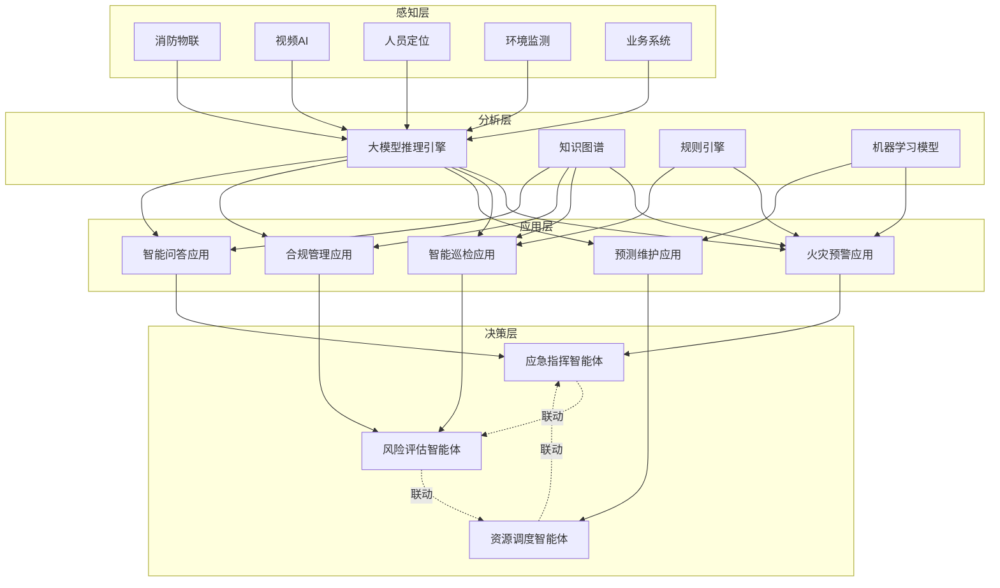

### 技术架构

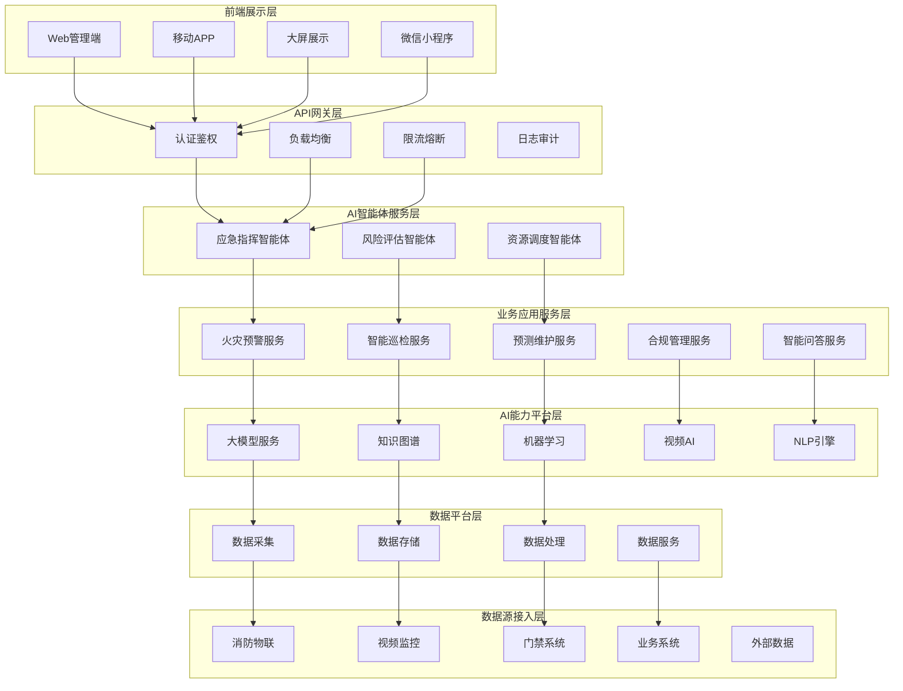

### 数据流架构

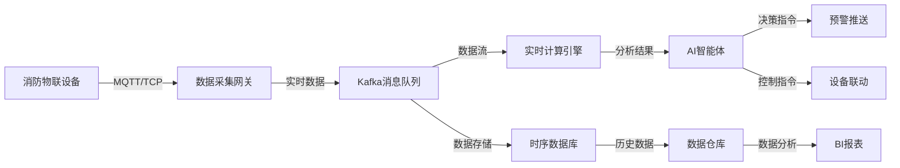

## 核心功能与组件

### 1. AI智能体系统

**应急指挥智能体**

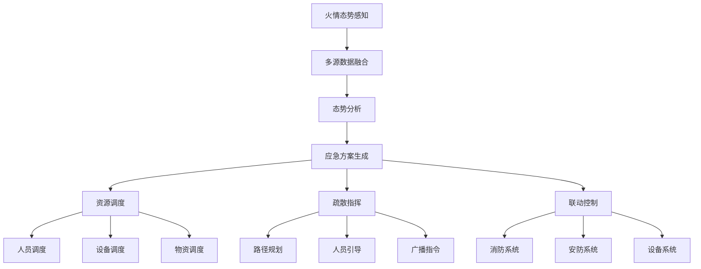

**核心能力**：
- **复杂场景自主推理与决策**：综合火势、人员、设备等多因素，自动生成最优应急方案
- **多智能体协同**：与风险评估、资源调度智能体协同工作，产生涌现智能
- **情景模拟与预测**：预测火势蔓延路径、疏散时间、资源需求
- **自然语言交互**：通过语音或文字接收指令，生成人类可理解的决策说明

**风险评估智能体**

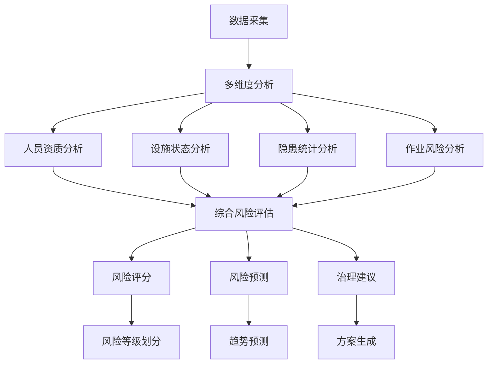

**核心能力**：
- **跨领域知识融合**：整合消防规范、建筑结构、人员管理等多领域知识
- **因果推理与根因分析**：追溯隐患产生的根本原因，而非表面现象
- **持续学习与自我优化**：根据历史数据和反馈持续优化评估模型
- **自然语言生成报告**：自动生成专业的风险评估报告

**资源调度智能体**

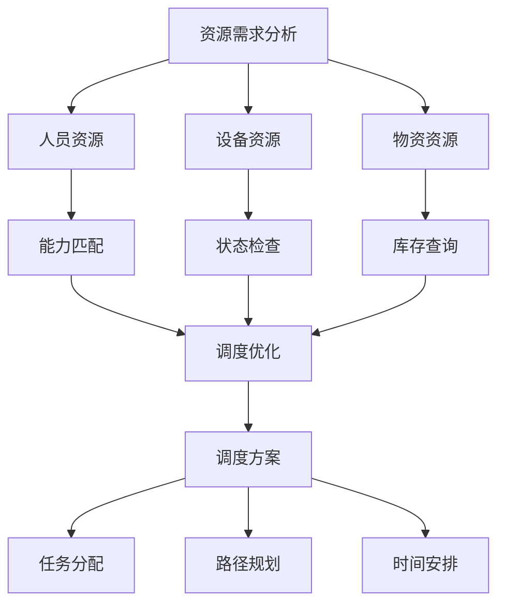

**核心能力**：
- **复杂场景自主推理**：综合考虑资源状态、位置、能力等因素生成最优调度方案
- **个性化与情境感知**：根据不同场景和人员特点提供差异化调度策略
- **实时动态调整**：根据执行反馈实时调整调度方案

### 2. 火灾预警应用

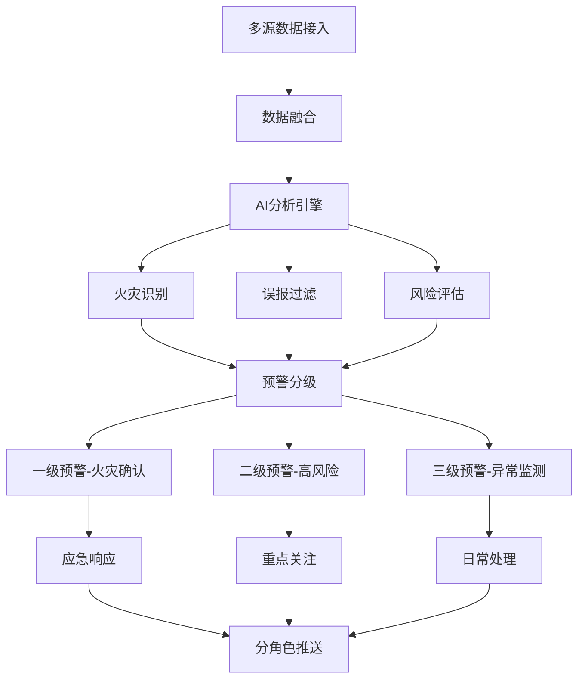

**功能特性**：
- **多源数据融合**：整合消防物联、视频AI、环境监测等多源数据
- **智能误报过滤**：基于机器学习的误报识别，降低误报率80%以上
- **分级预警机制**：根据风险等级自动分级，差异化处理
- **分角色推送**：根据人员角色推送差异化预警信息

### 3. 智能巡检应用

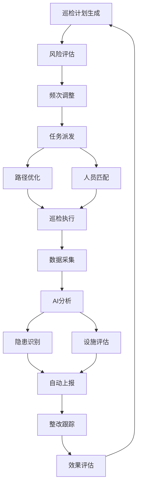

**功能特性**：
- **智能任务派发**：根据风险等级、人员位置、能力智能分配任务
- **路径优化**：基于图算法的最优巡检路径规划
- **AI辅助识别**：通过图像识别辅助发现隐患
- **闭环管理**：从发现到整改到验收的全流程跟踪

### 4. 预测性维护应用

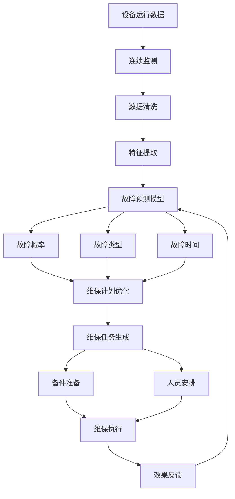

**功能特性**：
- **故障预测**：基于机器学习的设备故障预测，提前7-15天预警
- **维保优化**：根据预测结果优化维保计划，降低维保成本15%
- **备件管理**：智能预测备件需求，优化库存管理
- **持续学习**：根据维保反馈持续优化预测模型

### 5. 合规管理应用

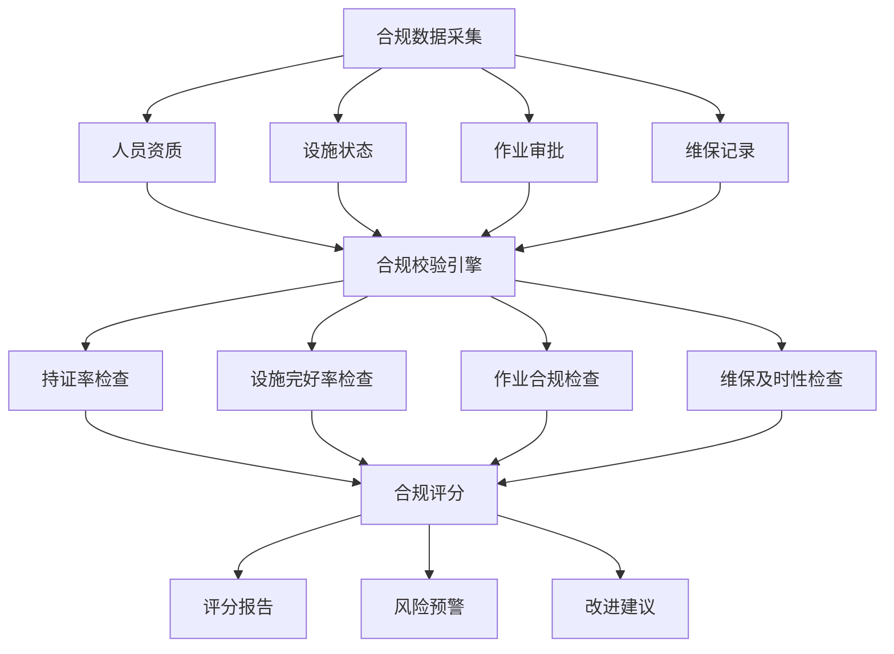

**功能特性**：
- **自动合规校验**：基于消防规范的自动化合规检查
- **智能评分**：多维度合规评分，量化管理水平
- **到期预警**：证书、维保、检测等到期自动提醒
- **报告生成**：自动生成合规评估报告

### 6. 智能问答应用

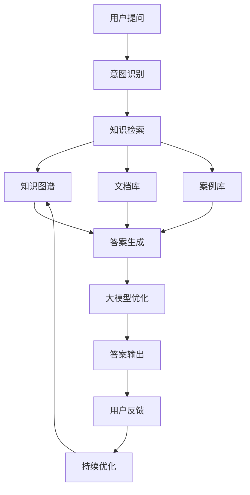

**功能特性**：
- **自然语言交互**：支持自然语言提问，无需记忆专业术语
- **知识图谱支撑**：基于消防知识图谱的精准答案检索
- **多轮对话**：支持追问和上下文理解
- **持续学习**：根据用户反馈持续优化答案质量

### 7. 商户违规识别

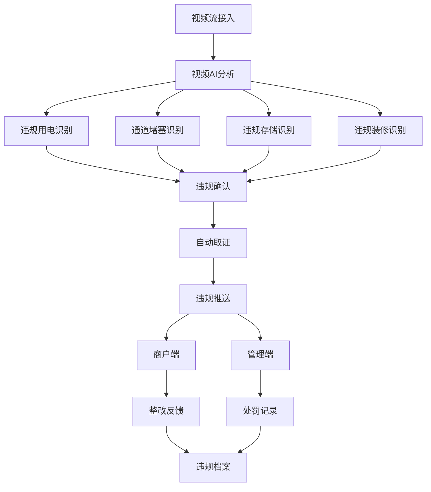

**功能特性**：
- **实时识别**：基于视频AI的实时违规行为识别
- **自动取证**：违规行为自动截图、录像取证
- **双向推送**：同时推送给商户和管理人员
- **信用管理**：建立商户违规信用档案

### 8. 智能疏散系统

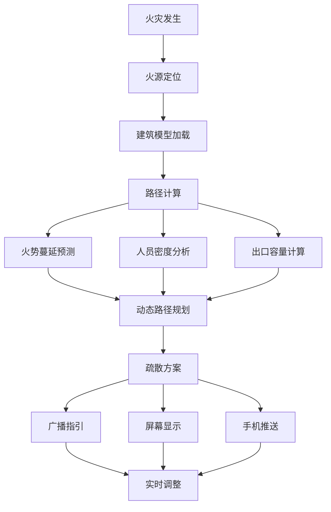

**功能特性**：
- **动态路径规划**：基于实时火情和人员分布的动态疏散路径
- **容量优化**：考虑出口容量，避免拥堵
- **多渠道指引**：广播、屏幕、手机多渠道疏散指引
- **实时调整**：根据疏散进度实时调整方案

### 9. 数据分析与可视化

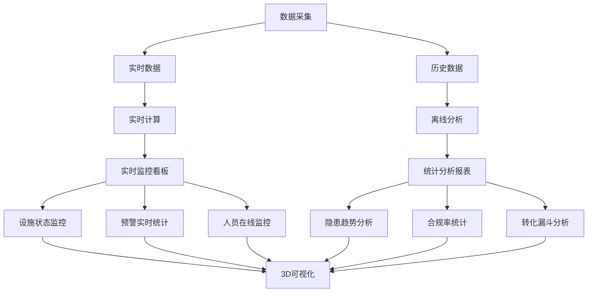

**功能特性**：
- **实时监控**：设施状态、预警信息、人员位置实时监控
- **趋势分析**：隐患趋势、风险演化、合规率变化趋势分析
- **3D可视化**：基于BIM模型的3D可视化展示
- **智能报表**：自动生成各类统计分析报表

### 10. 系统集成与联动

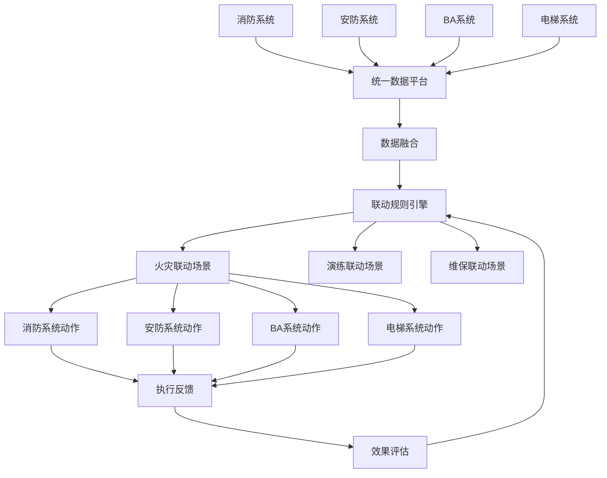

**功能特性**：
- **多系统集成**：消防、安防、BA、电梯等系统统一接入
- **智能联动**：基于场景的自动化联动响应
- **执行反馈**：联动执行结果实时反馈
- **效果评估**：联动效果自动评估和优化

## 项目里程碑

| 阶段 | 模块 | 时间节点 | 交付内容 |
|-----|------|---------|---------|
| **第一阶段** | **需求分析与架构设计** | **第1-2周** | |
| | 消防业务深度分析 | | 详细业务流程规格说明书、数据源分析报告 |
| | AI智能体架构设计 | | 智能体系统架构蓝图、技术选型报告、接口规范文档 |
| | 大模型选型与集成方案 | | AI模型评估报告、集成方案设计 |
| | 数据平台架构设计 | | 数据架构设计、物联接入方案 |
| **第二阶段** | **AI核心引擎开发** | **第3-10周** | |
| | 大模型推理引擎 | | 大模型集成、推理优化、API封装 |
| | 应急指挥智能体 | | 态势分析、方案生成、资源调度 |
| | 风险评估智能体 | | 多维度分析、风险评分、根因分析 |
| | 资源调度智能体 | | 人员调度、设备调度、路径优化 |
| | 消防知识图谱 | | 知识抽取、图谱构建、推理引擎 |
| **第三阶段** | **业务应用开发** | **第11-18周** | |
| | 火灾预警应用 | | 多源融合、智能识别、分级预警 |
| | 智能巡检应用 | | 任务派发、路径优化、闭环管理 |
| | 预测性维护应用 | | 故障预测、维保优化、备件管理 |
| | 合规管理应用 | | 合规校验、智能评分、报告生成 |
| | 智能问答应用 | | 意图识别、知识检索、答案生成 |
| **第四阶段** | **视频AI与物联接入** | **第19-24周** | |
| | 视频AI系统 | | 人数统计、行为识别、违规检测 |
| | 消防物联接入 | | 设备接入、数据采集、实时监控 |
| | 智能疏散系统 | | 路径规划、容量计算、多渠道指引 |
| | 商户违规识别 | | 实时识别、自动取证、信用管理 |
| **第五阶段** | **系统集成与数据分析** | **第25-30周** | |
| | 多系统集成 | | 消防/安防/BA/电梯系统对接 |
| | 智能联动系统 | | 场景定义、规则引擎、执行反馈 |
| | 数据分析平台 | | 实时计算、离线分析、智能报表 |
| | 3D可视化系统 | | BIM集成、实时渲染、交互操作 |
| **第六阶段** | **测试部署与交付** | **第31-36周** | |
| | 系统测试 | | 功能测试、性能测试、安全测试 |
| | 试运行 | | 现场部署、数据迁移、试运行 |
| | 培训与交付 | | 用户培训、文档交付、技术支持 |

## 应用场景

### 场景1：火灾智能预警与应急响应

**场景描述**：某商业综合体3楼餐饮区域发生火情

**系统响应流程**：

1. **火情感知（0-10秒）**
   - 消防物联主机接收到烟感报警信号
   - 视频AI同步识别到火焰和烟雾
   - 环境监测传感器检测到温度异常上升

2. **AI智能分析（10-30秒）**
   - 大模型推理引擎融合多源数据，确认火灾真实性
   - 智能误报过滤系统排除误报可能（准确率98%）
   - 应急指挥智能体分析火源位置、蔓延趋势、影响范围

3. **应急方案生成（30-60秒）**
   - 基于建筑BIM模型预测火势蔓延路径
   - 分析当前人员分布（通过视频AI和门禁数据）
   - 生成最优疏散路径和资源调度方案
   - 自动生成应急指挥方案

4. **分级预警推送（60-90秒）**
   - **消防中控室**：一级预警，详细火情信息+应急方案+操作指引
   - **安全经理**：火情通报+人员伤亡风险评估+资源需求
   - **项目负责人**：火情概要+应急响应进展+决策建议
   - **现场人员**：疏散指引+最近安全出口+注意事项

5. **多系统智能联动（同步执行）**
   - **消防系统**：自动启动消防泵、喷淋系统、防排烟系统
   - **安防系统**：视频追踪火情发展，门禁自动开放疏散通道
   - **BA系统**：切断非消防电源，启动应急照明，关闭空调
   - **电梯系统**：电梯迫降至首层，禁止使用
   - **广播系统**：自动播放疏散指引，分区域差异化广播

6. **智能疏散引导（持续）**
   - 大屏显示动态疏散路径图
   - 手机APP推送个性化疏散路线
   - 广播系统分区域播放疏散指引
   - 实时监测疏散进度，动态调整路径

7. **资源智能调度（持续）**
   - 自动调度最近的消防人员和设备
   - 规划最优到达路径，预计到达时间
   - 协调医疗、安保等资源准备

8. **持续态势分析（持续）**
   - 实时更新火情态势
   - 预测火势发展趋势
   - 评估应急措施效果
   - 动态调整应急方案

**效果对比**：

| 维度 | 传统模式 | AI智能模式 |
|------|----------|-----------|
| 火情确认时间 | 3-5分钟（人工确认） | 10-30秒（AI自动确认） |
| 误报率 | 30-40% | &lt;2% |
| 应急方案生成 | 10-15分钟（人工决策） | 30-60秒（AI自动生成） |
| 疏散路径 | 固定预案 | 动态优化 |
| 系统联动 | 人工操作，3-5分钟 | 自动联动，&lt;1分钟 |
| 信息推送 | 统一推送，信息过载 | 分角色精准推送 |

### 场景2：设备预测性维护

**场景描述**：消防水泵运行状态监测与故障预测

**系统工作流程**：

1. **连续数据采集**
   - 实时采集水泵运行数据（电流、电压、振动、温度、压力）
   - 采集频率：每秒1次，24小时不间断
   - 数据存储：时序数据库，保留3年历史数据

2. **AI智能分析**
   - 机器学习模型分析运行数据
   - 识别异常运行模式（振动异常、温度升高、压力波动）
   - 与历史故障数据对比，识别故障前兆特征

3. **故障预测**
   - 预测故障类型：轴承磨损、密封件老化、电机故障
   - 预测故障时间：预计15天后可能发生故障
   - 故障概率：85%

4. **维保计划生成**
   - 自动生成维保任务：更换轴承和密封件
   - 推荐维保时间：本周末（业务低峰期）
   - 备件需求：轴承型号XXX、密封件型号YYY
   - 预计维保时长：4小时

5. **任务派发与执行**
   - 自动派发维保任务给维保人员
   - 推送备件准备通知给仓库管理员
   - 维保人员接收任务，准备工具和备件
   - 按计划执行维保，记录维保过程

6. **效果反馈与学习**
   - 维保后设备运行正常，验证预测准确
   - 将维保数据反馈给AI模型
   - 模型持续学习，优化预测精度

**效果对比**：

| 维度 | 传统模式 | AI预测模式 |
|------|----------|-----------|
| 维保方式 | 定期维保 | 预测性维护 |
| 故障发现 | 事后发现 | 提前7-15天预警 |
| 维保成本 | 高（过度维保+突发故障） | 降低15-20% |
| 设备故障率 | 基准 | 降低30-40% |
| 备件库存 | 高（安全库存） | 降低20%（按需准备） |
| 业务影响 | 突发故障影响业务 | 计划维保，无影响 |

### 场景3：商户违规行为智能识别

**场景描述**：某商户在营业时间违规用电，堵塞消防通道

**系统工作流程**：

1. **实时视频监控**
   - 视频AI系统实时分析监控画面
   - 覆盖商户区域、消防通道、重点部位

2. **违规行为识别**
   - **违规用电识别**：检测到商户使用大功率电器（电磁炉、电热水壶）
   - **通道堵塞识别**：检测到消防通道被货物堆放，宽度不足1.2米
   - 识别准确率：95%以上

3. **自动取证**
   - 自动截图保存违规画面
   - 录制10秒违规视频
   - 标注违规类型、时间、位置

4. **违规推送**
   - **推送给商户**：微信消息推送，附违规照片和整改要求
   - **推送给管理员**：系统消息+短信，附违规详情和商户信息
   - 推送时间：&lt;30秒

5. **整改跟踪**
   - 商户收到消息后进行整改
   - 视频AI持续监控，确认整改完成
   - 整改时长：15分钟

6. **违规记录**
   - 记录违规行为到商户档案
   - 累计违规次数，影响信用评分
   - 多次违规触发处罚流程

7. **数据分析**
   - 统计违规类型分布
   - 分析违规高发时段和区域
   - 生成违规趋势报告

**效果对比**：

| 维度 | 传统模式 | AI识别模式 |
|------|----------|-----------|
| 发现方式 | 人工巡检 | 实时自动识别 |
| 发现时效 | 2-4小时（巡检周期） | &lt;30秒 |
| 覆盖率 | 60-70%（人工遗漏） | 95%以上 |
| 取证方式 | 人工拍照 | 自动截图录像 |
| 处理效率 | 1-2天 | &lt;1小时 |
| 人力成本 | 高（需专人巡检） | 低（自动化） |

### 场景4：消防安全合规智能评估

**场景描述**：月度消防安全合规评估

**系统工作流程**：

1. **数据自动采集**
   - **人员资质数据**：消防中控持证率、电工持证率、维保人员资质
   - **设施状态数据**：消防设施完好率、故障率、维保及时率
   - **隐患数据**：隐患发现数量、整改及时率、复发率
   - **作业数据**：动火作业审批率、违规作业次数

2. **AI智能分析**
   - 跨领域知识融合：整合消防规范、建筑规范、管理制度
   - 多维度评估：人员、设施、隐患、作业四个维度
   - 因果推理：分析不合规的根本原因

3. **合规评分**
   - **人员合规评分**：92分（消防中控持证率100%，电工持证率95%）
   - **设施合规评分**：88分（设施完好率98%，维保及时率90%）
   - **隐患管理评分**：85分（整改及时率95%，但复发率偏高）
   - **作业管理评分**：90分（审批率100%，违规作业2次）
   - **综合评分**：89分（良好）

4. **风险识别**
   - **高风险项**：3号楼消防水泵故障未及时维修
   - **中风险项**：部分商户消防培训未参加
   - **低风险项**：个别灭火器压力偏低

5. **根因分析**
   - **隐患复发率高的根因**：整改措施不彻底，缺乏长效机制
   - **维保不及时的根因**：维保人员不足，任务分配不合理
   - **商户培训缺席的根因**：培训时间与营业时间冲突

6. **改进建议**
   - 建立隐患整改验收机制，确保整改彻底
   - 增加维保人员或优化维保计划
   - 调整培训时间，采用线上+线下结合方式

7. **报告生成**
   - 自动生成20页专业评估报告
   - 包含评分、风险、根因、建议、趋势分析
   - 支持导出PDF、Word格式

**效果对比**：

| 维度 | 传统模式 | AI评估模式 |
|------|----------|-----------|
| 评估周期 | 季度或半年 | 实时+月度 |
| 评估时间 | 3-5天（人工统计） | &lt;1小时（自动生成） |
| 评估维度 | 3-5个维度 | 10+个维度 |
| 根因分析 | 表面分析 | 深度因果推理 |
| 报告质量 | 依赖人员水平 | 专业标准化 |
| 改进建议 | 通用建议 | 针对性建议 |

### 场景5：智能消防知识问答

**场景描述**：新入职员工咨询消防知识

**对话示例**：

**员工**："灭火器多久检查一次？"

**AI分析**：
- 意图识别：消防设施管理咨询
- 知识检索：从消防规范知识图谱中检索相关条款
- 答案生成：基于大模型生成易懂的回答

**AI回复**："根据《建筑灭火器配置验收及检查规范》GB 50444-2008，灭火器的检查分为三个层次：

1. **日常巡查**：每天检查灭火器是否在位、是否被挪用
2. **月度检查**：每月检查压力表指针是否在绿区、瓶体是否有损伤
3. **年度检查**：每年由专业维保单位进行全面检查

另外，灭火器需要定期维修：
- 水基型灭火器：出厂满3年首次维修，之后每年维修
- 干粉灭火器：出厂满5年首次维修，之后每2年维修

您可以在系统中查看我们项目的灭火器检查记录和维修计划。"

**员工**："如果发现灭火器压力不足怎么办？"

**AI分析**：
- 上下文理解：延续上一个问题的话题
- 场景识别：异常情况处理咨询

**AI回复**："发现灭火器压力不足时，请按以下步骤处理：

1. **立即标识**：在灭火器上贴上'待维修'标签，避免误用
2. **上报系统**：在巡检系统中上报该灭火器故障
3. **临时补充**：从就近位置调配备用灭火器补充
4. **维修处理**：系统会自动派发维修任务给维保人员

通常情况下，维保人员会在24小时内完成维修或更换。如果是紧急情况，可以直接联系消防中控室：内线8888。

需要我帮您上报这个灭火器故障吗？"

**效果对比**：

| 维度 | 传统模式 | AI问答模式 |
|------|----------|-----------|
| 响应时间 | 需要找人询问，可能数小时 | &lt;5秒即时回答 |
| 服务时间 | 工作时间 | 7×24小时 |
| 答案质量 | 依赖被询问人的知识水平 | 基于权威规范，准确专业 |
| 上下文理解 | 需要重复说明背景 | 自动理解上下文 |
| 操作指引 | 口头描述，容易遗漏 | 结构化步骤，清晰完整 |
| 知识更新 | 依赖人员学习 | 知识库实时更新 |

## 系统核心优势

### 1. AI大模型技术优势

- **复杂场景自主推理**：面对火灾等复杂场景，AI能够综合多源数据自主推理，生成最优决策方案
- **跨领域知识融合**：整合消防、建筑、管理等多领域知识，提供全面的安全评估
- **持续学习优化**：系统从历史数据和反馈中持续学习，不断提升预测精度和决策质量
- **自然语言交互**：支持自然语言问答和指令，降低使用门槛

### 2. 多智能体协同优势

- **涌现智能**：多个智能体协同工作，产生单体无法实现的智能化能力
- **分工协作**：应急指挥、风险评估、资源调度智能体各司其职，高效协同
- **动态适应**：根据场景自动调整智能体协作策略

### 3. 预测性分析优势

- **故障预测**：提前7-15天预测设备故障，降低突发故障率30-40%
- **风险预测**：预测火灾风险趋势，提前采取防范措施
- **态势预测**：火灾发生时预测火势蔓延、疏散时间等关键信息

### 4. 实时响应优势

- **毫秒级数据处理**：支持万级物联设备实时数据处理
- **秒级预警推送**：火情确认到预警推送&lt;60秒
- **分钟级决策生成**：复杂应急方案生成&lt;1分钟

### 5. 全流程智能化优势

- **事前预防**：隐患智能识别、风险预测、合规管理
- **事中响应**：火灾智能预警、应急指挥、智能疏散
- **事后分析**：根因分析、效果评估、持续优化

### 6. 数据驱动决策优势

- **实时数据分析**：基于实时数据的动态决策
- **历史数据挖掘**：从历史数据中发现规律和趋势
- **预测性洞察**：基于数据的预测性分析和建议

### 7. 系统集成优势

- **多系统打通**：消防、安防、BA、电梯等系统统一接入
- **智能联动**：基于场景的自动化联动响应
- **数据融合**：多源数据融合分析，提供全局视角

### 8. 成本效益优势

- **降低人力成本**：AI替代部分人工工作，降低人力成本40%以上
- **降低维保成本**：预测性维护降低维保成本15-20%
- **降低事故损失**：提前预防和快速响应，降低火灾事故损失
- **提升管理效率**：自动化管理提升效率50%以上

## 投资回报分析

### 初期投资估算

| 项目 | 金额（万元） | 说明 |
|------|-------------|------|
| 软件平台开发 | 150-200 | AI智能体平台、业务应用开发 |
| 大模型服务 | 20-30/年 | API调用费用或私有化部署 |
| 硬件设备补充 | 50-100 | 视频AI服务器、边缘计算设备 |
| 数据治理 | 30-50 | 数据清洗、标注、整合 |
| 系统集成 | 40-60 | 与现有系统对接集成 |
| 实施服务 | 30-40 | 部署、培训、试运行 |
| **合计** | **320-480** | 根据实际需求调整 |

### 年度运营成本

| 项目 | 金额（万元/年） | 说明 |
|------|----------------|------|
| 大模型服务费 | 20-30 | API调用或私有化运维 |
| 云服务费用 | 15-25 | 服务器、存储、带宽 |
| 运维人员 | 30-50 | 2-3人运维团队 |
| 系统升级 | 10-20 | 功能迭代、模型优化 |
| **合计** | **75-125** | 年度运营成本 |

### 效益分析

**直接效益**：
- 降低火灾风险：隐患发现率提升30%，火灾事故率降低50%
- 提升管理效率：巡检效率提升40%，人力成本降低20%
- 减少设备故障：预测性维护降低故障率30%，维保成本降低15%
- 优化人员配置：智能化管理减少管理人员10-15%

**间接效益**：
- 提升品牌形象：智慧消防提升项目科技形象
- 降低保险费用：消防安全等级提升，保险费率降低
- 合规性保障：自动化合规管理，降低监管风险
- 数据资产积累：形成消防安全数据资产

### 投资回收期

**保守估算**：
- 初期投资：400万元
- 年度节省成本：80-120万元（人力+维保+事故损失）
- **投资回收期：3-5年**

**理想情况**：
- 避免一次重大火灾事故（损失可能数百万至千万）
- **投资回收期：1-2年**

## 服务与保障说明

1. 不包含第三方AI模型API调用费用（如GPT-4/Claude 3等API费用）
2. 不包含服务器及云资源费用（可根据需求另行提供专业云资源配置方案）
3. 不包含消防物联设备采购费用（系统支持主流品牌设备接入）
4. 交付标准：支持万级物联设备接入，通过全面压力测试并稳定运行24小时无故障
5. 质保期：系统交付后3个月内免费修复系统缺陷，提供7×24小时技术支持
6. 系统提供业内领先的智能消防管理体验，全面提升消防安全管理水平

## 技术特色与创新

### 1. 大模型驱动的智能决策

- 基于GPT-4/Claude 3等大模型的自然语言理解和生成
- 复杂场景的自主推理与决策能力
- 跨领域知识的融合与创新方案生成

### 2. 多智能体协同架构

- 应急指挥、风险评估、资源调度智能体分工协作
- 智能体间的信息共享与协同决策
- 涌现智能：产生超越单体的智能化能力

### 3. 知识图谱技术应用

- 消防规范知识图谱：涵盖国家标准、行业规范
- 建筑结构知识图谱：建筑信息、空间关系
- 设备关系知识图谱：设备类型、关联关系
- 基于知识图谱的智能推理和问答

### 4. 预测性分析算法

- 设备故障预测：基于机器学习的故障预测模型
- 火灾风险预测：基于历史数据的风险趋势预测
- 态势演化预测：基于物理模型的火势蔓延预测

### 5. 视频AI技术

- 火焰烟雾识别：实时识别火灾征兆
- 人数统计：实时统计区域人员密度
- 行为识别：识别违规用电、堵塞通道等行为
- 人脸识别：人员身份识别与轨迹追踪

### 6. 数字孪生技术

- BIM模型集成：建筑信息模型导入
- 实时数据映射：物联数据实时映射到数字孪生
- 3D可视化：沉浸式的3D可视化展示
- 动态仿真：火势蔓延、人员疏散仿真

---

**方案编制单位**：北京华中鼎盛科技有限公司  
**委托单位**：优服科技（北京）有限公司  
**方案版本**：V1.0  
**编制日期**：2025年1月
