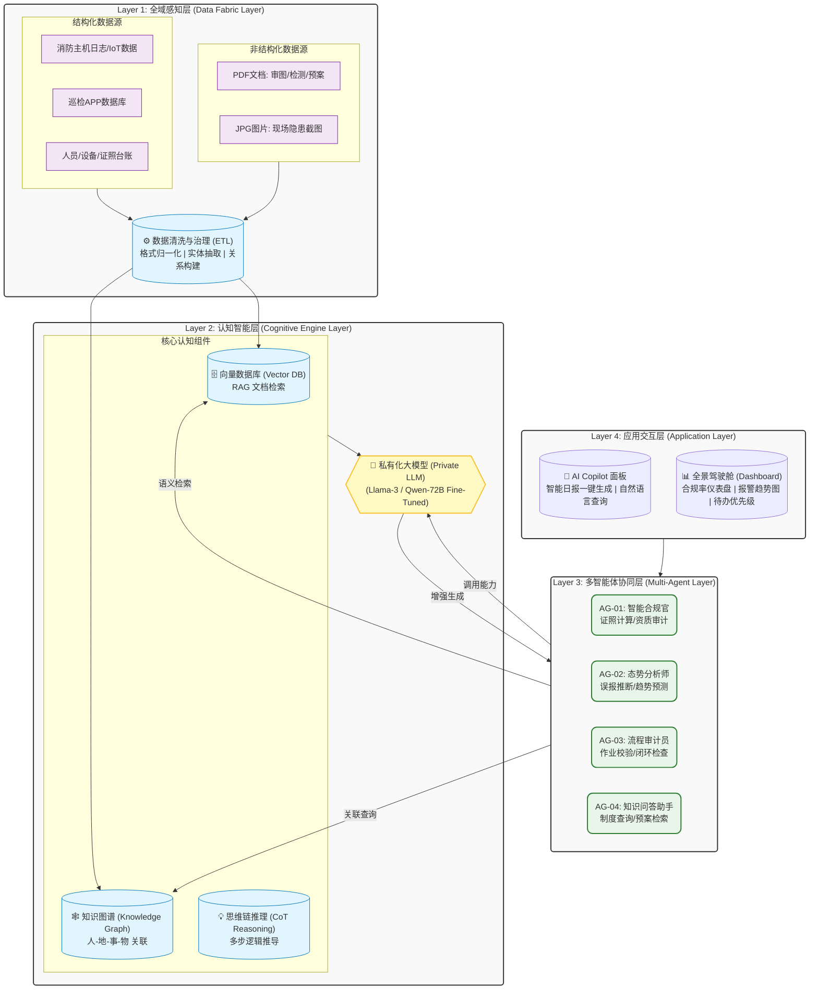

```mermaid
---
config:
  theme: mc
---
graph TD
    classDef layer fill:#f9f9f9,stroke:#333,stroke-width:2px,rx:5px,ry:5px;
    classDef component fill:#e1f5fe,stroke:#0277bd,stroke-width:1px,rx:3px,ry:3px;
    classDef core fill:#fff9c4,stroke:#fbc02d,stroke-width:2px,rx:3px,ry:3px;
    classDef agent fill:#e8f5e9,stroke:#2e7d32,stroke-width:2px,rx:10px,ry:10px;
    classDef input fill:#f3e5f5,stroke:#7b1fa2,stroke-width:1px,rx:0px,ry:0px;
    subgraph L4_App ["Layer 4: 应用交互层 (Application Layer)"]
        direction TB
        Copilot[("🤖 AI Copilot 面板<br>智能日报一键生成 | 自然语言查询")]
        Dashboard[("📊 全景驾驶舱 (Dashboard)<br>合规率仪表盘 | 报警趋势图 | 待办优先级")]
    end
    subgraph L3_Agents ["Layer 3: 多智能体协同层 (Multi-Agent Layer)"]
        direction LR
        AgentA(AG-01: 智能合规官<br>证照计算/资质审计):::agent
        AgentB(AG-02: 态势分析师<br>误报推断/趋势预测):::agent
        AgentC(AG-03: 流程审计员<br>作业校验/闭环检查):::agent
        AgentD(AG-04: 知识问答助手<br>制度查询/预案检索):::agent
    end
    subgraph L2_Core ["Layer 2: 认知智能层 (Cognitive Engine Layer)"]
        direction TB
        LLM{{"🧠 私有化大模型 (Private LLM)<br>(Llama-3 / Qwen-72B Fine-Tuned)"}}:::core
        
        subgraph Abilities ["核心认知组件"]
            VectorDB[("🗄️ 向量数据库 (Vector DB)<br>RAG 文档检索")]:::component
            KG[("🕸️ 知识图谱 (Knowledge Graph)<br>人-地-事-物 关联")]:::component
            CoT[("💡 思维链推理 (CoT Reasoning)<br>多步逻辑推导")]:::component
        end
    end
    subgraph L1_Data ["Layer 1: 全域感知层 (Data Fabric Layer)"]
        direction TB
        ETL[("⚙️ 数据清洗与治理 (ETL)<br>格式归一化 | 实体抽取 | 关系构建")]:::component
        
        subgraph Structured ["结构化数据源"]
            Logs[消防主机日志/IoT数据]:::input
            AppDB[巡检APP数据库]:::input
            Excel[人员/设备/证照台账]:::input
        end
        
        subgraph Unstructured ["非结构化数据源"]
            Docs[PDF文档: 审图/检测/预案]:::input
            Images[JPG图片: 现场隐患截图]:::input
        end
    end
    L4_App --> L3_Agents
    L3_Agents -- 调用能力 --> LLM
    L3_Agents -- 语义检索 --> VectorDB
    L3_Agents -- 关联查询 --> KG
    LLM -- 增强生成 --> L3_Agents
    Abilities --> LLM
    ETL --> VectorDB
    ETL --> KG
    Structured --> ETL
    Unstructured --> ETL
    class L4_App,L3_Agents,L2_Core,L1_Data layer;
```

