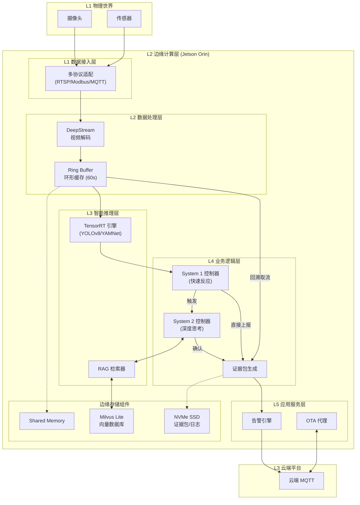

EMP-01 的边缘计算层（L2）设计核心在于 **“边缘优先、战术自治”**。它不再是简单的视频传输节点，而是具备 **双系统推理** 与 **多模态感知** 能力的智能体。通过在边缘端部署 **NVIDIA Jetson Orin** 算力平台，集成 **System 1 (快速反应)** 与 **System 2 (深度思考)** 架构，实现毫秒级风险识别与“有图有真相”的证据包生成。技术上采用 **Docker 容器化 + TensorRT 加速 + 本地 RAG** 组合，确保在断网情况下仍能独立完成从感知到决策的核心闭环。

边缘计算层位于 **L2 战术执行层**，是连接物理世界（L1）与数字孪生世界（L3）的桥梁，负责将高带宽的非结构化视频流转化为低带宽的高价值结构化事件。

--------------------------------------------------------------------------------

## 一、 边缘计算分层架构设计
为满足多模态融合与实时推理的高并发需求，采用 **L0-L5** 六层微服务架构设计。

| 层级 | 名称 | 核心职责 | 核心组件 | 关键指标 | 技术载体 |
| :--- | :--- | :--- | :--- | :--- | :--- |
| **L5** | **应用服务层** | 告警聚合、断点续传、心跳保活 | 告警引擎、OTA 代理 | 响应 &lt;`100ms` | Go / Python |
| **L4** | **业务逻辑层** | 双系统协同、思维链推理、证据包生成 | System `1/2` 控制器、状态机 | 逻辑闭环 | C++ / Python |
| **L3** | **智能推理层** | 视觉/听觉推理、多模态特征提取 | TensorRT 引擎、RAG 检索器 | FPS &gt; `25` | TensorRT / Milvus Lite |
| **L2** | **数据处理层** | 视频解码、环形缓存、数据清洗 | DeepStream、Ring Buffer | 缓存 `60s` | Shared Memory |
| **L1** | **数据接入层** | 多协议适配、异构数据采集 | RTSP、Modbus、MQTT | 采样 `1kHz` | ZeroMQ |
| **L0** | **基础环境层** | 算力调度、硬件抽象、容器编排 | CUDA、JetPack | 稳定性 `99.9%` | Ubuntu / Docker |

### 边缘计算架构图

--------------------------------------------------------------------------------

## 二、 核心技术选型
边缘层采用 **“高性能算力 + 轻量化软件栈”** 以平衡实时性与成本。

### 1. 硬件选型 (Hardware Stack)
*   **计算平台: NVIDIA Jetson Orin NX 16GB**
    *   **用途**：承载视觉模型、大语言模型（SLM）及多模态融合计算。
    *   **选型理由**：提供 **100 TOPS (INT8)** AI 算力，16GB 大内存足以支撑 **本地 RAG**（检索增强生成）和 **CoT**（思维链）推理所需的资源开销，且支持 FP16 高精度推理。
*   **存储介质: 1TB NVMe SSD**
    *   **用途**：从内存环形缓冲区持久化写入“触发前后 30 秒”的高清视频证据包，以及存储本地向量数据库。
    *   **选型理由**：高并发写入能力，满足多路高清视频流的实时缓存与切片需求。

### 2. 软件技术栈 (Software Stack)
*   **AI 推理引擎: TensorRT 8.5**
    *   **用途**：加速 YOLOv8（视觉）、YAMNet（声音）等模型的推理速度。
    *   **选型理由**：相比通用框架（PyTorch/ONNX），TensorRT 在 Orin 平台上可提供 **2-4倍** 的加速效果，将单帧推理延迟控制在 **2.5ms** 以内。
*   **向量数据库: Milvus Lite**
    *   **用途**：存储消防规范、历史误报案例的特征向量，支持 System 2 的知识检索。
    *   **选型理由**：轻量级、嵌入式部署，适合边缘端资源受限环境。
*   **通信中间件: ZeroMQ + MQTT**
    *   **用途**：ZeroMQ 负责进程间（如视觉容器到逻辑容器）的微秒级通信；MQTT 负责边缘与云端的低带宽通信。

--------------------------------------------------------------------------------

## 三、 推理策略与性能优化
边缘层最大的挑战是在有限算力下实现复杂的逻辑判断，需采用 **双系统协同** 与 **动态资源调度** 策略。

### 1. 双系统推理架构 (Dual-System Reasoning)
*   **System 1 (快速反应)**：
    *   **技术实现**：基于规则引擎（Rule Engine）和轻量级检测模型。
    *   **逻辑**：处理高频、明确的异常（如“明火面积>0.1m²”）。
    *   **性能**：延迟 **< 50ms**，覆盖 80% 的常规场景。
*   **System 2 (深度思考)**：
    *   **技术实现**：基于多模态融合模型和因果推理引擎。
    *   **逻辑**：当 System 1 触发时唤醒，结合视觉（无人）、温度（升高）、知识库（非营业时间）生成思维链（CoT），验证警情。
    *   **性能**：延迟 **100-500ms**，负责复杂场景研判，极大降低误报率。

### 2. 证据包生成机制 (Evidence Packaging)
*   **环形缓冲区 (Ring Buffer)**：在内存中开辟环形空间，始终保留最近 60 秒的视频流。
*   **按需切片**：仅在告警触发时，回溯切取“前 10 秒 + 后 10 秒”视频，结合关键帧截图与传感器曲线生成不可篡改的证据包。

--------------------------------------------------------------------------------

## 四、 容量规划与成本估算
基于 **单个标准厨房（200㎡，4-7路视频）** 的配置进行估算。

### 1. 算力与存储规划
*   **算力负载**：
    *   视频推理（4路 YOLOv8-s）：占用约 30% GPU。
    *   System 2 推理（间歇运行）：占用约 20-30% GPU。
    *   剩余算力：约 40% 用于并发峰值缓冲。
*   **存储容量**：
    *   证据包：每次约 30MB，按每天 20 次告警预留，一年约 220GB。
    *   本地数据库与日志：约 50GB。
    *   配置 **1TB** 硬盘可满足 3 年以上的数据循环存储需求。

### 2. 单点预算估计 (硬件成本)
| 项目 | 规格说明 | 预估单价 (CNY) | 数量 | 总价 (CNY) | 备注 |
| :--- | :--- | :--- | :--- | :--- | :--- |
| **边缘算力主机** | NVIDIA Jetson Orin NX 16GB | 5,500 | 1 | **5,500** | 核心算力单元 |
| **载板与外壳** | 工业级散热、接口扩展 | 1,500 | 1 | **1,500** | 适应油烟高温环境 |
| **存储介质** | 1TB NVMe SSD (工业级) | 600 | 1 | **600** | 数据持久化 |
| **电源与配件** | 工业电源适配器、线缆 | 400 | 1 | **400** | |
| **边缘层硬件总计** | | | | **8,000** | 约合 0.8 万元/店 |

--------------------------------------------------------------------------------

## 五、 开发实施周期
边缘层的软件开发与调优是系统落地的关键，预计周期为 **10-12 周**。

1.  **基础平台搭建 (Week 1-2)**：
    *   完成 Ubuntu 系统裁剪与 Docker 环境配置。
    *   适配各类传感器驱动（RTSP, Modbus）。
2.  **感知算法移植 (Week 3-5)**：
    *   YOLOv8 与 YAMNet 模型量化（TensorRT INT8）。
    *   多路视频流并发压力测试与优化。
3.  **双系统逻辑开发 (Week 6-8)**：
    *   构建 System 1 规则链库。
    *   开发 System 2 的多模态融合与 CoT 推理逻辑。
    *   集成 Milvus Lite 实现本地知识检索。
4.  **业务闭环与联调 (Week 9-10)**：
    *   开发证据包生成器与断点续传模块。
    *   实现 MQTT 云边通信协议。
5.  **稳定性测试 (Week 11-12)**：
    *   进行 7x24 小时老化测试与故障自愈（Watchdog）测试。