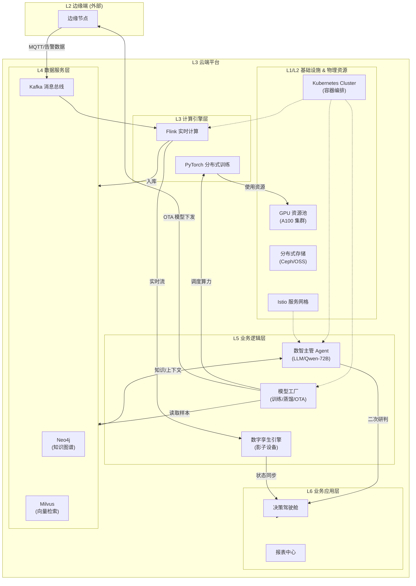

EMP-01 的云端平台层（L3）设计核心在于 **“全局统筹、持续进化”**。作为整个系统的“战略大脑”，它区别于边缘层（L2）的战术自治，侧重于跨厨房的全局数据分析、复杂态势的深度研判（Digital Supervisor）、以及AI模型的持续训练与迭代（Model Factory）。技术上采用 **Kubernetes 微服务架构 + 大模型（LLM）+ 知识图谱** 组合，确保系统不仅能发现当下的异常，还能通过学习历史数据变得越来越聪明。

云端平台层用于向下管理成百上千个边缘节点，向上为应用层提供决策支撑，是实现“千店一面”高标准安全管理的控制中枢。

--------------------------------------------------------------------------------

## 一、 云端平台分层架构设计
为支撑大规模并发接入与AI模型训练任务，采用 **L1-L6** 六层微服务架构设计。

| 层级 | 名称 | 核心职责 | 核心组件 | 关键指标 | 技术载体 |
| :--- | :--- | :--- | :--- | :--- | :--- |
| **L6** | **业务应用层** | 战略决策、可视化展示 | 决策驾驶舱、报表中心 | 刷新 &lt;1s | React / DataV |
| **L5** | **业务逻辑层** | 智能体编排、模型生产、数字孪生 | **数智主管**、**模型工厂** | 响应 &lt;3s | Java / Python |
| **L4** | **数据服务层** | 知识推理、特征工程、数据治理 | 知识图谱、向量检索 | 查询 &lt;10ms | Neo4j / Milvus |
| **L3** | **计算引擎层** | 大规模训练、流式计算 | 分布式训练、实时计算 | 吞吐 1GB/s | PyTorch / Flink |
| **L2** | **基础设施层** | 容器编排、服务治理 | 服务网格、自动扩缩容 | 可用性 99.9% | Kubernetes / Istio |
### 云端平台架构图

--------------------------------------------------------------------------------

## 二、 核心技术选型
云端平台采用 **“云原生 + AI Native”** 技术栈，以保障高可用性与算法迭代能力。

### 1. 核心服务组件 (Core Services)
*   **数智主管 (Digital Supervisor Agent)**
    *   **用途**：处理边缘上报的 P0/P1 级告警，进行二次深度研判，并基于全局数据进行风险预测。
    *   **选型理由**：基于 **LLM (如 Qwen-72B)** 构建 Agent，具备逻辑推理与自然语言理解能力，能处理非结构化复杂场景。
*   **模型工厂 (Model Factory)**
    *   **用途**：利用回流的误报/漏报数据进行模型重训（Fine-tuning），并将大模型蒸馏为边缘小模型（Distillation）。
    *   **选型理由**：基于 **PyTorch + Horovod** 实现分布式训练，支持 **OTA** 增量更新，确保边缘模型“越用越准”。
*   **组织记忆 (Organizational Memory)**
    *   **用途**：存储企业的消防规范、历史火灾案例、处置SOP。
    *   **选型理由**：采用 **Neo4j (知识图谱)** + **Milvus (向量库)**，实现 RAG（检索增强生成），让 AI 决策有据可依。

### 2. 基础设施组件 (Infrastructure)
*   **容器编排: Kubernetes 1.28**
    *   **用途**：统一管理云端微服务与 GPU 资源池，实现服务的自动扩缩容与故障自愈。
*   **消息总线: Kafka**
    *   **用途**：作为海量边缘节点数据的汇聚入口，削峰填谷，解耦数据流与计算流。

--------------------------------------------------------------------------------

## 三、 核心功能模块与策略
云端层的核心不在于“快”（这是边缘层的职责），而在于“深”和“全”。

### 1. 数智主管：深度研判与态势感知
*   **多模态二次验证**：
    *   当边缘层上报“疑似火灾”时，云端调用大模型（GPT-4V级别）对上传的图片/视频进行二次校验，排除复杂背景下的误报（如特定的反光、特殊的装饰物）。
*   **CFD 态势仿真**：
    *   基于 **OpenFOAM** 或简化流体力学模型，结合当前温度和风速，预测火势在未来 5-10 分钟的蔓延路径，为人工决策提供“撤离”或“扑灭”的建议。

### 2. 模型工厂：持续进化闭环
*   **数据回流机制**：边缘层每日自动上传“低置信度”样本和“人工修正”样本到云端。
*   **Teacher-Student 蒸馏策略**：
    *   **Teacher**：云端运行超大参数模型（如 Segment Anything Model, LLM）。
    *   **Student**：边缘端运行轻量化模型（如 YOLOv8-Nano）。
    *   **流程**：利用云端大模型自动标注海量数据，训练边缘小模型，实现低成本的高精度迭代。
*   **灰度 OTA 发布**：新模型先在 1-2 个试点厨房下发，验证 24 小时无异常后，再全量推送到所有边缘节点。

### 3. 数字孪生：全局监控
*   **影子设备 (Device Shadow)**：在云端维护每个物理设备（摄像头、传感器）的虚拟映射，实时同步状态。
*   **3D 可视化**：基于 **Three.js / UE5** 引擎，将分布在全国的厨房状态以 3D 热力图形式呈现在总部大屏，实现“上帝视角”指挥。

--------------------------------------------------------------------------------

## 四、 资源规划与成本估算
基于 **支撑 100 个标准厨房** 的规模，提供**私有云建设**与**公有云租赁**两种方案对比。

### 1. 资源需求分析
*   **计算资源**：
    *   **推理服务**：需处理 100 个厨房的并发告警复核，约需 64 vCPU。
    *   **训练服务**：每周全量重训一次模型，需高性能 GPU（如 A100/A800）。
*   **存储资源**：
    *   见《L4-数据湖.md》，年增量约 19TB。

### 2. 预算估计 (对比)

**方案 A：私有云自建 (推荐长期/大规模)**
*一次性投入较高，但数据自主可控，长期摊销成本低。*

| 项目 | 规格说明 | 数量 | 总价 (CNY) | 备注 |
| :--- | :--- | :--- | :--- | :--- |
| **AI 训练服务器** | Dell R750xa (4×A100 GPU) | 2 | **360,000** | 核心训练算力 |
| **应用服务器** | Dell R750 (数智主管/知识库) | 4 | **200,000** | 业务逻辑处理 |
| **网络与安全** | 核心交换机、防火墙、LB | 1套 | **295,000** | 保障网络安全 |
| **机房基础** | 机柜、UPS、精密空调 | 1套 | **358,000** | 物理环境保障 |
| **软件授权** | K8s 商业版/数据库授权 | 1套 | **63,000** | 估算值 |
| **私有云总计** | | | **1,276,000** | **摊销约 1.28 万/店** |

**方案 B：公有云 SaaS (推荐初创/试点)**
*零初期投入，按需付费，运维简单。*

| 资源类型 | 配置说明 | 月度费用 (CNY) | 年度费用 (CNY) |
| :--- | :--- | :--- | :--- |
| **计算 (ECS)** | 4台 16核32G (业务) + GPU实例 (训练,按需) | 15,256 | 183,072 |
| **存储 (OSS/EBS)** | 10TB 云盘 + 50TB 对象存储 | 16,000 | 192,000 |
| **网络 (EIP)** | 500Mbps 峰值带宽 | 40,000 | 480,000 |
| **中间件** | RDS, Redis, Kafka, WAF | 14,100 | 169,200 |
| **公有云总计** | | **85,356/月** | **1,024,272/年** |

**决策建议**：若门店规模超过 **35 家**，**私有云**方案的 3 年总拥有成本（TCO）将低于公有云，且具备更好的数据隐私保护。

--------------------------------------------------------------------------------

## 五、 开发实施周期
云端平台的建设通常与边缘层并行进行，预计周期为 **8-10 周**。

1.  **基础设施搭建 (Week 1-2)**：
    *   **私有云**：服务器上架、网络划分、K8s 集群初始化。
    *   **公有云**：VPC 规划、资源开通、安全组配置。
2.  **核心微服务部署 (Week 3-5)**：
    *   部署 **数智主管**、**组织记忆**、**模型工厂** 等核心 Docker 容器。
    *   配置数据库集群（PostgreSQL, Milvus, Neo4j）。
3.  **云边协同联调 (Week 6-7)**：
    *   打通 Edge (MQTT) 到 Cloud (Kafka) 的双向通道。
    *   测试模型 OTA 下发流程与告警上报链路。
4.  **AI 流水线跑通 (Week 8-9)**：
    *   搭建 MLOps 流程，跑通“数据标注 -> 训练 -> 蒸馏 -> 部署”全闭环。
5.  **压力测试与交付 (Week 10)**：
    *   模拟 100 个厨房同时并发 P0 级告警，验证系统高可用性 (HA)。