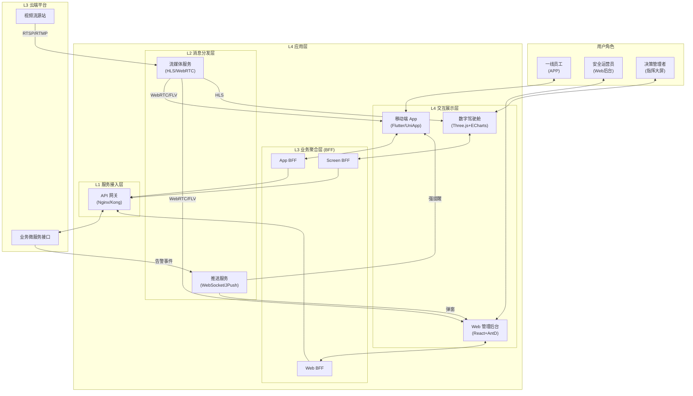

EMP-01 的应用层（L4）设计核心在于 **“人机协同、闭环管理”**。作为整个系统的“面子”和交互界面，它不再是简单的数据展示板，而是连接人与智能体（Agent）的协作终端。L4 负责将 L2/L3 产生的结构化告警与证据包，转化为人类可理解、可操作的业务指令，确保每一个风险都能被 **“看见、响应、解决”**。

应用层向下调用云端平台的原子能力，向上服务于一线员工、安全运营员及企业决策层，是实现“安全管理最后一公里”落地的关键。

--------------------------------------------------------------------------------

## 一、 应用层分层架构设计
为支撑多端协同与高频交互，采用 **L1-L4** 四层应用架构设计。

| 层级 | 名称 | 核心职责 | 核心组件 | 关键指标 | 技术载体 |
| :--- | :--- | :--- | :--- | :--- | :--- |
| **L4** | **交互展示层** | 多端UI渲染、人机交互 | Web后台、移动端App、数字大屏 | 首屏 &lt;1s | React / Flutter |
| **L3** | **业务聚合层** | 接口聚合(BFF)、会话管理 | Node.js BFF、GraphQL | 响应 &lt;200ms | NestJS / Gin |
| **L2** | **消息分发层** | 实时推送、长连接维持 | WebSocket 服务、短信/语音网关 | 触达 &lt;500ms | EMQX / JPush |
| **L1** | **服务接入层** | 协议转换、流媒体转发 | API Gateway、WebRTC 服务器 | 并发 &gt;10k | Nginx / ZLMediaKit |

### 应用层架构图

--------------------------------------------------------------------------------

## 二、 核心技术选型
应用层采用 **“跨平台 + 实时化”** 技术栈，以平衡开发效率与用户体验。

### 1. 前端交互技术 (Frontend Stack)
*   **Web 管理后台: React 18 + Ant Design Pro**
    *   **用途**：承载复杂的告警处置、设备管理、报表分析功能。
    *   **选型理由**：企业级中后台标准方案，组件库丰富，状态管理成熟，适合构建复杂的单页应用 (SPA)。
*   **移动端 App: Flutter 3.0**
    *   **用途**：一线人员的工单处理终端，支持 iOS/Android 双端。
    *   **选型理由**：高性能渲染引擎，接近原生的流畅度；一套代码多端运行，极大降低维护成本。
*   **可视化大屏: Three.js + ECharts**
    *   **用途**：总部指挥中心的 3D 态势感知与数据可视化。
    *   **选型理由**：Three.js 提供 WebGL 原生 3D 渲染能力，ECharts 处理海量图表数据，两者结合兼顾酷炫效果与数据深度。

### 2. 多媒体与通信 (Media & Comm)
*   **流媒体播放器: Jessibuca / flv.js**
    *   **用途**：在 Web/App 端低延迟播放 H.264/H.265 监控视频与证据包。
    *   **选型理由**：支持通过 WebSocket 传输 FLV 流，实现 **&lt;500ms** 的超低延迟直播，优于传统 HLS。
*   **消息推送: WebSocket + 极光推送 (JPush)**
    *   **用途**：实现告警的毫秒级触达与“强提醒”（震动/铃声）。
    *   **选型理由**：WebSocket 保证 Web 端实时在线，JPush 解决 App 进程保活与系统级通知通道问题。

--------------------------------------------------------------------------------

## 三、 核心功能与业务逻辑
应用层最重要的职责是实现 **告警闭环 (Closed-Loop)**，防止风险“漏斗式”衰减。

### 1. 告警全生命周期管理 (Alarm State Machine)
*   **Created (已生成)**：L2/L3 识别风险并上报，系统生成唯一告警 ID。
*   **Pushed (已推送)**：L4 根据排班表，将告警推送至对应门店的安全员/店长 App。
*   **Acked (已确认)**：
    *   **动作**：人员在 App 点击“收到”。
    *   **机制**：**SLA 计时停止**。若 3 分钟未 Ack，自动触发 **Escalated (升级)** 流程，电话通知区域经理。
*   **Processing (处置中)**：人员到达现场，排查隐患。
*   **Resolved (已解决)**：
    *   **动作**：人员拍摄整改照片/视频并上传。
    *   **验证**：L3 数智主管自动比对整改前后画面/传感器数值（如温度下降），验证通过后归档。

### 2. 证据包可视化 (Evidence Visualization)
*   **视频切片**：自动循环播放“触发前 10s + 触发后 10s”的高清视频。
*   **AI 标注**：在视频层上叠加 AI 推理结果（如红色 Bounding Box 框选明火，骨骼点标记倒地人员）。
*   **数据关联**：同步展示告警时刻的传感器曲线（温度、燃气浓度），辅助人工研判。

### 3. 分级指挥体系 (RBAC)
*   **店长视角**：仅关注本店实时告警与待办工单。
*   **区域经理视角**：辖区内门店的红黑榜排名、高频风险点分析。
*   **总部视角**：全国地图热力分布、重大风险事件督办、宏观安全态势。

--------------------------------------------------------------------------------

## 四、 资源规划与成本估算
应用层主要涉及软件开发人力成本与轻量级部署资源。

### 1. 部署资源规划
*   **Web/API 服务器**：推荐使用云原生 Serverless 或轻量级容器集群，按流量自动扩缩容。
*   **CDN 加速**：用于静态资源（JS/CSS/图片）与 HLS 视频流的分发，降低源站压力。

### 2. 软件开发预算 (估算)
*此部分主要为人力外包或自研薪资成本参考。*

| 项目 | 人员配置 | 周期 | 预估费用 (CNY) | 备注 |
| :--- | :--- | :--- | :--- | :--- |
| **前端开发** | 高级前端 (Web+大屏) | 1.5 月 | **30,000** | React/Three.js |
| **移动端开发** | Flutter 工程师 | 1.5 月 | **30,000** | iOS/Android 双端 |
| **后端/BFF** | Golang/Node 工程师 | 1.0 月 | **20,000** | 接口与网关 |
| **UI/UX设计** | 资深设计师 | 1.0 月 | **10,000** | 原型与视觉 |
| **三方服务** | 短信/语音/地图 API | 1 年 | **5,000** | 预估年费 |
| **应用层总计** | | | **95,000** | **一次性投入** |

--------------------------------------------------------------------------------

## 五、 开发实施周期
应用层开发通常滞后于底层平台 2 周启动，预计周期为 **6 周**。

1.  **设计与原型 (Week 1-2)**：
    *   完成 Web 后台与 App 的 UI/UX 设计。
    *   确定 API 接口定义 (Swagger/OpenAPI)。
2.  **核心功能开发 (Week 3-4)**：
    *   **Web 端**：搭建 Ant Design Pro 框架，实现告警列表与详情页。
    *   **App 端**：实现登录、推送接收、工单提交功能。
3.  **大屏与流媒体对接 (Week 5)**：
    *   开发 Three.js 3D 地图组件。
    *   调试 Jessibuca 播放器，优化视频起播速度 (&lt;1s)。
4.  **联调与验收 (Week 6)**：
    *   全链路联调：模拟 L2 告警 -> Cloud 转发 -> App 推送 -> 处置反馈。
    *   用户体验 (UE) 优化与 Bug 修复。