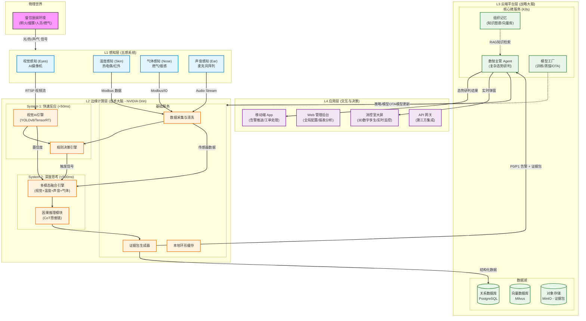

```mermaid
graph TD
    %% 定义样式
    classDef physical fill:#f9f,stroke:#333,stroke-width:2px;
    classDef layer1 fill:#e1f5fe,stroke:#0277bd,stroke-width:2px;
    classDef layer2 fill:#fff3e0,stroke:#ef6c00,stroke-width:2px;
    classDef layer3 fill:#e8f5e9,stroke:#2e7d32,stroke-width:2px;
    classDef layer4 fill:#f3e5f5,stroke:#7b1fa2,stroke-width:2px;
    classDef dataflow fill:none,stroke:#999,stroke-width:1px,stroke-dasharray:5 5;

    %% L4 应用层
    subgraph L4_Application["L4 应用层 (交互与决策)"]
        direction TB
        App_Mobile["移动端 App<br/>(告警推送/工单处理)"]:::layer4
        App_Web["Web 管理后台<br/>(全局配置/报表分析)"]:::layer4
        App_Screen["消控室大屏<br/>(3D数字孪生/实时监控)"]:::layer4
        App_API["API 网关<br/>(第三方集成)"]:::layer4
    end

    %% L3 云端平台层
    subgraph L3_Cloud["L3 云端平台层 (战略大脑)"]
        direction TB
        subgraph Cloud_Services["核心微服务 (K8s)"]
            Supervisor["数智主管 Agent<br/>(复杂态势研判)"]:::layer3
            ModelFactory["模型工厂<br/>(训练/蒸馏/OTA)"]:::layer3
            OrgMemory["组织记忆<br/>(知识图谱/向量库)"]:::layer3
        end
        
        subgraph Cloud_Data["数据湖"]
            DB_Relational[("关系数据库<br/>PostgreSQL")]:::layer3
            DB_Vector[("向量数据库<br/>Milvus")]:::layer3
            Storage_Obj[("对象存储<br/>MinIO - 证据包")]:::layer3
        end
    end

    %% L2 边缘计算层
    subgraph L2_Edge["L2 边缘计算层 (战术大脑 - NVIDIA Orin)"]
        direction TB
        
        subgraph Edge_System2["System 2: 深度思考 (<500ms)"]
            Fusion_Engine["多模态融合引擎<br/>(视觉+温度+声音+气体)"]:::layer2
            Causal_Reasoning["因果推理模块<br/>(CoT思维链)"]:::layer2
        end

        subgraph Edge_System1["System 1: 快速反应 (<50ms)"]
            AI_Vision["视觉AI引擎<br/>(YOLOv8/TensorRT)"]:::layer2
            Rule_Engine["规则决策引擎"]:::layer2
        end

        subgraph Edge_Infra["基础服务"]
            Data_Collector["数据采集与清洗"]:::layer2
            Evidence_Gen["证据包生成器"]:::layer2
            Local_Buffer["本地环形缓存"]:::layer2
        end
    end

    %% L1 感知层
    subgraph L1_Perception["L1 感知层 (五感系统)"]
        direction LR
        Sensor_Eye["视觉感知 (Eyes)<br/>AI摄像机"]:::layer1
        Sensor_Skin["温度感知 (Skin)<br/>热电偶/红外"]:::layer1
        Sensor_Nose["气体感知 (Nose)<br/>燃气/烟感"]:::layer1
        Sensor_Ear["声音感知 (Ear)<br/>麦克风阵列"]:::layer1
    end

    %% 物理世界
    subgraph Physical_World["物理世界"]
        Kitchen_Env["餐饮厨房环境<br/>(明火/烟雾/人员/燃气)"]:::physical
    end

    %% 数据流向关系
    Kitchen_Env ==>|"光/热/声/气 信号"| L1_Perception
    
    Sensor_Eye -->|"RTSP 视频流"| AI_Vision
    Sensor_Skin -->|"Modbus 数据"| Data_Collector
    Sensor_Nose -->|"Modbus/IO"| Data_Collector
    Sensor_Ear -->|"Audio Stream"| Data_Collector

    Data_Collector --> Rule_Engine
    AI_Vision --> Rule_Engine
    
    Rule_Engine -->|"触发信号"| Fusion_Engine
    AI_Vision -->|"置信度"| Fusion_Engine
    Data_Collector -->|"传感器数据"| Fusion_Engine
    
    Fusion_Engine --> Causal_Reasoning
    Causal_Reasoning --> Evidence_Gen
    
    Evidence_Gen -->|"P0/P1 告警 + 证据包"| Supervisor
    Evidence_Gen -->|"结构化数据"| DB_Relational
    
    Supervisor -->|"策略/模型OTA"| Edge_Infra
    Supervisor -->|"态势研判结果"| App_Mobile
    Supervisor -->|"实时弹窗"| App_Screen
    
    ModelFactory -.->|"模型更新"| Edge_Infra
    OrgMemory -.->|"RAG知识检索"| Supervisor

    %% 样式应用
    linkStyle default stroke-width:2px,fill:none,stroke:#333
```

import DocusaurusSvg from './Edge AI Fusion Platform-2026-01-19-182354.svg';