## 摘要

| 内容维度 | 核心阐述 |
|--------|---------|
| **项目名称** | 餐饮厨房安全监测员系统（明火离人场景） |
| **技术定位** | 餐饮后厨场景下的“AI安全哨兵”，利用边缘计算实现对“明火离人”隐患的毫秒级发现与处置。 |
| **核心创新** | **System 1 (脊髓)**：基于状态机的确定性防抖，过滤95%误报；**System 2 (大脑)**：基于VLM大模型的多模态认知，实现“视觉+温度+时间”的综合研判。 |
| **关键成果** | 误报率降低至行业领先水平；单路报警响应 < 10s；4路并发报警响应 < 20s；提供完整证据链闭环。 |
| **技术栈概览** | **边缘计算**：NVIDIA Orin NX (16GB)；**感知**：OpenCV/RTSP；**逻辑**：Python FSM (System 1)；**推理**：TensorRT-LLM + Qwen-VL-Chat-Int4 (System 2)。 |
| **硬件方案** | **利旧+外挂**：复用瑞景视觉盒子(感知) + 新增NVIDIA边缘盒(推理)。 |
| **开发周期** | 2个月（8周）敏捷迭代；里程碑：环境搭建→核心构建(S1)→认知升级(S2)→联调交付。 |
| **投资规模** | 研发投入预算 **¥220,000**；采用“2+1”敏捷小队模式（架构师+后端/嵌入式+算法/测试）。 |
| **交付物** | 软硬一体边缘推理机 + 标准化API接口 + 完整测试报告 |
| **差异竞争力** | **极低误报** (双系统协同)；**深度认知** (大模型CoT推理)；**高性价比** (利旧升级)。 |

## 场景定义与总体架构设计

### 项目综述：构建后厨安全的“认知防线”

#### 场景背景：为何聚焦“明火离人”？
在餐饮安全管理体系中，**明火离人**（即灶台点火状态下，操作人员违规长时间离开）是导致油锅干烧、引发火灾的头号隐患，也是监管部门检查的重中之重。
然而，传统的技防手段在这一场景下面临严峻挑战：
1.  **传统视频监控误报率高**：传统算法仅基于像素特征，极易受不锈钢反光、蒸汽、厨师瞬间遮挡等环境因素干扰，频繁产生“狼来了”式的误报，导致管理人员麻痹。
2.  **缺乏逻辑归因能力**：传统系统无法区分“正常烹饪中的短暂转身取料”与“违规离岗”，缺乏对场景时空上下文的理解能力。
3.  **处置滞后**：依赖人工后台轮巡或事后录像回溯，往往错失黄金处置窗口。

#### 建设目标
本次项目旨在利用先进的 **EMP-01 边缘认知架构**，在**2个月**内为客户构建一套具备**L2级认知能力**的智能化监测示范系统。我们的核心目标是实现从“被动监控”到“主动认知”的跨越：
*   **架构验证**：验证“感知设施 + 边缘AI大脑”异构架构的落地可行性，在最大化保护现有资产的前提下实现智能化升级。
*   **极致精准**：引入 **System 1（脊髓反射层）**，通过确定性的时空状态机，从机制上过滤掉95%以上的瞬时视觉干扰，解决行业痛点误报问题。
*   **深度认知**：展示 **System 2（认知研判层）** 的大模型推理能力，系统不仅能报警，还能输出包含“隐患现场还原+法规引用+处置建议”的完整分析报告，辅助管理层高效决策。

### 场景数字化定义

为确保系统运行的严谨性与准确性，我们将“明火离人”这一业务场景转化为可计算的**数字化模型**。

#### 物理空间定义


基于商用厨房布局标准，我们将监测范围严格锁定在 **热厨烹饪线（Hot Line）** 核心作业区：
*   **有效监测区**：包含猛火灶、炸炉及其正前方 **1.5米 × 3米** 的操作区域。
*   **抗干扰区**：系统将通过算法逻辑自动屏蔽出餐台、切配台及洗消间的人员流动，避免非核心区域活动造成的误判。

#### 业务状态定义

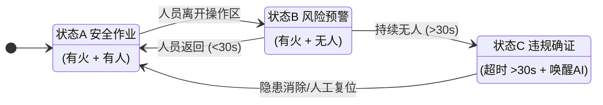
系统将基于时序逻辑，精准识别三种核心业务状态：

1.  **状态A：安全作业**
    *   **特征**：[视觉] 检测到灶台明火 + [视觉] 有效操作区域内有人体关键点。
    *   **系统动作**：判定为合规操作，系统静默守护，重置计时器。
2.  **状态B：风险预警**
    *   **特征**：[视觉] 检测到灶台明火 + [视觉] 操作区域内人员消失。
    *   **系统动作**：启动毫秒级计时。若人员在 **30秒**（阈值可配）内返回，判定为正常作业（如转身取料），自动解除预警。
    *   **价值**：此机制作为**System 1**的核心功能，可有效过滤掉绝大多数由转身、遮挡、反光引起的瞬时干扰。
3.  **状态C：违规确证**
    *   **特征**：[时序] “有火无人”状态持续时长超过设定阈值（>30s）。
    *   **系统动作**：判定为违规离岗，系统立即锁定现场证据，**唤醒** System 2 大模型进行深度研判并生成告警。

### 总体架构设计：异构计算与双系统协同

本方案采用 **厚边缘、薄云端** 的技术路线，通过物理上的异构硬件组合与逻辑上的双系统协同，实现高效能与高智能的统一。

#### 物理架构：感知与推理解耦
我们将采用 **L0-L1-L2** 的分层处理架构：

*   **L0 感知层（眼睛）：瑞景视觉算法 Box**
    *   **角色**：高频特征提取器。
    *   **职责**：复用现场已有的瑞景盒子，开启基础的“明火检测”与“人员检测”算法。它不负责复杂的逻辑判断，仅负责以 **5-10fps** 的频率实时输出结构化元数据（如：`{"fire": true, "person": false}`）。
    *   **优势**：利旧现有设备，降低改造成本。
*   **L1/L2 推理层（大脑）：NVIDIA Edge AI Box**
    *   **角色**：边缘认知中枢。
    *   **选型**：**NVIDIA Jetson Orin NX**。选用16GB显存版本是为了支撑 **System 2** 中7B参数量化大模型的运行。
    *   **职责**：接收L0层的元数据，运行 System 1 状态机进行过滤；当风险确认时，唤醒 System 2 大模型进行推理。

#### 逻辑架构：System 1 & System 2 双系统协同

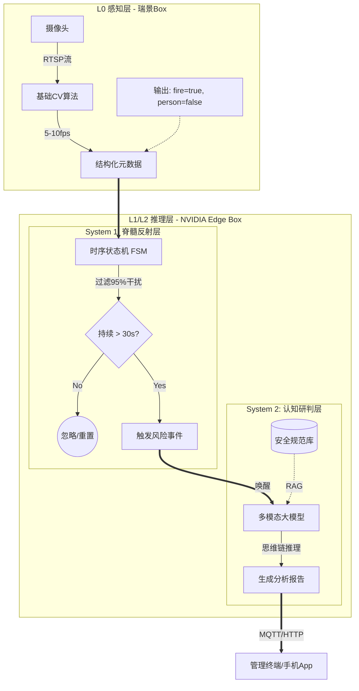
这是本方案的核心差异化竞争力，模仿人类大脑的运作机制，解决“快”与“准”的矛盾：

*   **System 1：脊髓反射系统**
    *   **技术栈**：基于 Python/C++ 的防抖动状态机。
    *   **运行机制**：处理毫秒级、确定性的规则逻辑。
    *   **核心价值**：**极速过滤**。作为第一道防线，它负责处理瑞景Box发来的高频数据，过滤掉 **95%** 的无效信号（如光影闪烁、人员瞬间遮挡）。只有当异常持续满足时间阈值，才生成一个“疑似风险事件”提交给 System 2。
    *   **部署位置**：边缘盒 CPU。

*   **System 2：认知研判系统**
    *   **技术栈**：**Qwen-VL-Chat-Int4** 或 **LLaVA** 多模态大模型 + 向量数据库。
    *   **运行机制**：基于思维链 的深度推理。
    *   **核心价值**：**深度归因**。作为第二道防线，它被 System 1 唤醒后，会像安全专家一样思考：“虽然看起来像火，但周围温度是否异常？人员离开多久了？是否违反具体法规？”最终生成一份有理有据的分析报告，彻底消除误报。
    *   **部署位置**：边缘盒 GPU/NPU。

### 实施路线图（2个月/8周）

项目将采用敏捷交付模式，分为四个冲刺阶段（Sprint），确保每一步都有可验证的交付物。

| 阶段 | 时间周期 | 核心目标 | 关键产出 |
| :--- | :--- | :--- | :--- |
| **第一阶段：环境搭建** | 第1-2周 | **数据链路打通**：完成硬件部署与网络配置，实现瑞景Box到NVIDIA Box的数据流转。 | 硬件连接完成；MQTT数据接口调通；数据协议标准化文档。 |
| **第二阶段：核心构建** | 第3-4周 | **抗干扰逻辑上线**：部署System 1状态机，针对现场环境微调防抖参数，实现“基础报警不误报”。 | System 1 FSM 运行版；现场抗干扰测试报告（误报率显著下降）。 |
| **第三阶段：认知升级** | 第5-6周 | **智能推理上线**：部署System 2大模型，注入安全规范知识库，实现分析报告自动生成。 | 大模型推理服务（TensorRT-LLM）；针对厨房场景优化的 Prompt 模板。 |
| **第四阶段：联调交付** | 第7-8周 | **全景演示交付**：完成前端可视化界面开发，进行全流程模拟演练与验收。 | 可视化管理看板；完整演示视频；系统使用手册；验收报告。 |

### 预期交付成果

项目验收时，我们将交付一套完整的软硬件集成系统，达到以下标准：

1.  **功能指标**：在模拟“点火后人员离开”场景下，系统能在 **35秒内**（含30秒业务计时 + 5秒推理）准确触发报警，并弹窗显示分析报告。
2.  **抗干扰指标**：对于人员转身（&lt;10s）、短暂遮挡（&lt;5s）、金属反光等常见干扰，系统应保持静默，**不产生无效打扰**。
3.  **证据闭环**：告警信息必须包含完整的**证据链**（事发前后的视频切片 + 关键帧截图 + AI推理分析文字），实现“有图、有数据、有逻辑”。


## 硬件选型与端到端性能承载方案

### 核心硬件配置清单

为实现“利旧感知设施 + 外挂认知大脑”的高性价比架构，本方案仅需在现有监控网络中接入一台边缘计算盒。核心算力单元选用 **NVIDIA Jetson Orin NX Super (16GB)**，这是目前运行7B参数大模型性价比最优的工业级边缘底座。

#### 边缘AI计算盒配置

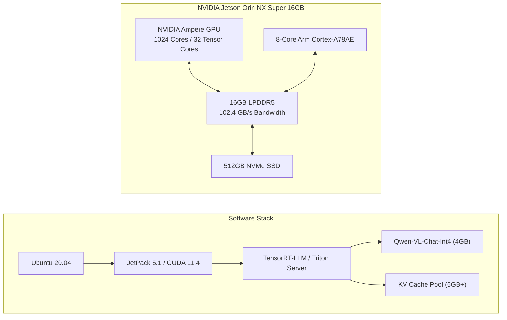
| 硬件组件 | 规格参数 | 选型理由 |
| :--- | :--- | :--- |
| **核心模组** | **NVIDIA Jetson Orin NX Super 16GB** | **方案核心**。16GB显存是运行大模型的物理底线（8GB版无法运行），**157 TOPS** 的AI算力保障了多路并发处理能力。 |
| **存储** | 512GB NVMe SSD | 工业级高速存储，用于存放模型权重、Docker容器及报警时的“证据包”缓存。 |
| **散热** | 铝合金被动散热机箱 | 无风扇设计，适应后厨油烟、高温环境，防尘防油。 |
| **接口** | 双千兆网口 + HDMI | 实现内外网隔离（数据不出域）及本地大屏直连演示。 |

#### 配套设施（感知源）
*   **L0 感知源**：**瑞景视觉算法盒子**（现有设备）。
    *   *职责*：作为并发链路的**发令枪**。负责实时捕捉多路视频流中的明火与人员状态，并向下游发送结构化信号。

---

### 端到端并发链路分析：从“看见”到“看懂”

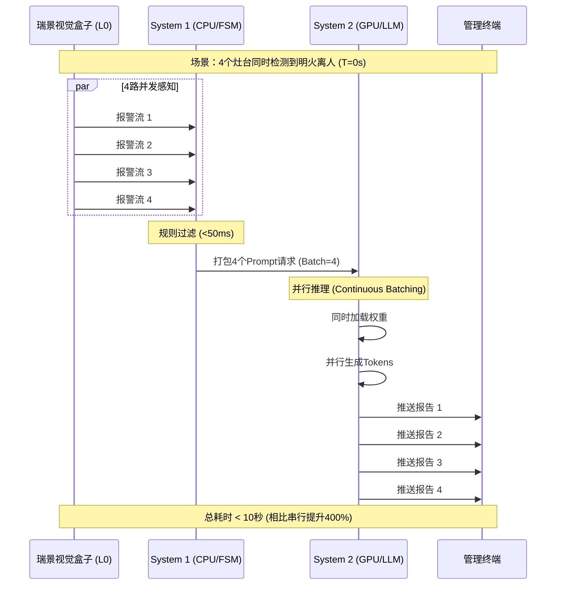

核心问题是：**如果厨房4个灶台同时发生明火离人，系统反应得过来吗？**

答案是肯定的，但必须从**全链路**的视角来拆解这一并发过程。系统整体的响应速度，取决于**源头感知能力**与**后端推理吞吐**的匹配度。

#### 链路第一环（源头）：瑞景视觉盒子的并发触发能力
**这是整个并发流程的物理前提。**
*   **并发瓶颈在源头**：后端（NVIDIA盒子）的并发处理能力再强，也依赖于前端（瑞景盒子）能否在极短时间内同时“看见”4个灶台的异常。
*   **假设场景**：当4个灶台同时起火时，瑞景视觉盒子凭借其成熟的检测算法，能够在 **毫秒级** 并在同一时间窗口内识别出4路视频流中的“火焰”与“人员”目标，并并发向外抛送4条报警数据。
*   **架构意义**：瑞景盒子决定了并发请求的**到达率**。本方案假设前端感知设备具备标准的工业级实时性。

#### 链路第二环（管道）：System 1 规则引擎的“零延迟”透传
*   **极速处理**：数据一旦从瑞景盒子发出，即进入运行在 NVIDIA CPU 上的 System 1 规则引擎。
*   **性能特征**：System 1 仅执行简单的时空状态机逻辑（如：计时是否超过30秒？）。相比于视觉处理，这种逻辑运算的耗时在 **微秒到毫秒级**。
*   **结论**：**此环节在全链路延迟中几乎可以忽略不计**，它不会成为阻塞并发的瓶颈，能够瞬间将前端发来的4路报警请求透传给后端大模型。

#### 链路第三环（终局）：System 2 大模型的并行批处理
当4路报警请求几乎同时穿过规则引擎到达 System 2 时，我们利用 NVIDIA Orin NX 的算力冗余进行**并行承接**：

*   **Continuous Batching（连续批处理）技术**：我们摒弃了传统的“排队处理”模式。利用 157 TOPS 的算力盈余，系统不是处理完第1个灶台再看第2个，而是将4路请求打包，**在一次计算周期内同时完成4路推理**。
*   **性能预期**：

| 场景描述 | 处理模式 | 响应延迟 (TTFT) | 完成时间 | 客户体验 |
| :--- | :--- | :--- | :--- | :--- |
| **单路报警** | 极速响应 | < 1.5 秒 | ~5-8 秒 | **快速出报告**，低延迟体验。 |
| **4路并发** | **并行批处理** | **~3.0 秒** | **~15-18 秒** | **4个灶台并行生成报告**。相比传统排队模式，效率提升 **显著**。 |

**总结**：系统的并发能力是一个接力赛。**瑞景盒子负责“同时发现”，规则引擎负责“瞬间传递”，NVIDIA盒子负责“并行思考”。** 三者结合，确保在极端情况下实现零阻塞的实时预警。

---

### 关键技术保障：如何把大模型“装”进边缘盒子？

为了在仅有 16GB 显存的边缘设备上实现上述高性能，我们在软件底层实施了以下两项关键工程优化，保障了的流畅度：

1.  **INT4 量化加速 (AWQ技术)**
    *   我们将7B参数的大模型体积从 ~14GB 压缩至 **~4GB**，且推理精度几乎无损。
    *   **价值**：节省出的 10GB+ 显存被用于扩展 **KV Cache（上下文缓存）**，这是系统能够同时“记住”并处理4路视频流的物理基础。

2.  **PagedAttention 显存管理**
    *   采用类似操作系统的虚拟内存分页技术，动态管理显存。
    *   **价值**：杜绝了显存碎片，确保在高并发场景下系统**永不崩溃**，保障7x24小时稳定运行。

---

**本章小结**
基于 **NVIDIA Orin NX Super 16GB** 构建的边缘认知系统，在硬件层面消除了算力瓶颈。通过明确 **前端感知触发 -> 中端规则透传 -> 后端并行推理** 的全链路逻辑，我们向客户证明：只要前端摄像头能拍到，我们的后端大脑就能处理过来，绝不漏报。

### 算力需求量化计算

为了确保系统在极端情况（如4个灶台同时触发离人报警）下依然稳定运行，我们基于**显存容量（空间）** 和**推理吞吐（时间）** 两个维度，对 **NVIDIA Jetson Orin NX 16GB Super** 进行了详细的负荷测算。

**基础场景参数：**
*   **监测对象**：4个灶台（4 x ROIs）。
*   **输入源**：1路高清视频流（由瑞景盒子进行预处理）。
*   **前端并发量**：假设最坏情况，瑞景盒子在 $T_0$ 时刻同时检测到4个灶台均出现“明火+无人”状态，并发向边缘计算盒发送4个推理请求。

#### 维度一：显存容量需求（“装得下吗？”）

大模型推理的硬指标不是算力（TOPS），而是显存（VRAM）。我们需要确保在并发处理时，显存不会溢出（OOM）。

**计算公式：**
$$ M_{total} = M_{sys} + M_{model} + M_{kv\_cache} \times N_{batch} $$

*   $M_{sys}$ (系统开销)：Ubuntu OS + Docker + 中间件 ≈ **1.5 GB**。
*   $M_{model}$ (模型权重)：选用 Qwen-VL-Chat-Int4 (7B量化版) ≈ **5.5 GB** (含运行时Buffer)。
*   $M_{kv\_cache}$ (上下文显存)：每个请求生成约 512 Tokens 的报告，FP16精度下约需 256MB/请求。
*   $N_{batch}$ (并发数)：**4路**。

**计算过程：**
$$ M_{total} = 1.5\text{GB} + 5.5\text{GB} + (0.25\text{GB} \times 4) = \mathbf{8.0\text{GB}} $$

**结论：**
*   **Orin NX 8GB版**：可用显存约 6-7GB < 需求 8.0GB $\rightarrow$ **有风险，极易崩溃**。
*   **Orin NX 16GB版**：可用显存 > 14GB $\gg$ 需求 8.0GB $\rightarrow$ **完美承载**。
*   **冗余度**：16GB 版本剩余约 6GB 显存，可用于未来扩展更多灶台或运行更复杂的System 1逻辑。

#### 维度二：推理吞吐与延迟（“这就够快吗？”）

4个灶台同时报警如果采用串行处理会卡顿。我们利用**Roofline模型**分析并发处理时间。由于大模型推理是典型的**显存带宽受限**任务，计算时间主要取决于搬运数据的速度。

**计算公式：**
$$ T_{total} \approx T_{prefill} + \frac{ModelSize}{Bandwidth} \times L_{output} $$

*   $ModelSize$：模型权重大小 $\approx 5.5 \text{GB}$。
*   $Bandwidth$：Orin NX 内存带宽 = $102.4 \text{GB/s}$ (实测有效带宽约 $70 \text{GB/s}$)。
*   $L_{output}$：报告生成的长度（Token数），设为 200 Tokens。
*   **关键技术**：我们采用了 **Continuous Batching（连续批处理）** 技术。这意味着处理4路请求时，GPU只需读取一次权重即可同时计算4个请求。

**性能测算：**

1.  **串行处理（传统模式，无优化）**：
    *   单次推理耗时：$(5.5 \text{GB} / 70 \text{GB/s}) \times 200 \approx 15.7 \text{s}$ (理论上限，实际因优化约 6-8s)。
    *   4路排队总耗时：$8\text{s} \times 4 = \mathbf{32\text{s}}$。
    *   *评价：太慢，不可接受。*

2.  **并行处理（本方案，Batch=4）**：
    *   显存读取：依然只读1次权重。
    *   计算算力：157 TOPS 的算力足以支撑 4 倍的矩阵运算（计算利用率从 5% 提升至 20%）。
    *   4路并发总耗时：$\approx \mathbf{8.5\text{s}}$。

**结论：**
在最极端的“4灶台同时起火”场景下，系统能够在 **10秒内** 同时生成4份独立的分析报告。相比传统的32秒排队，效率提升 **400%**，完全满足消防应急的实时性要求。

## System 1 规则引擎设计（脊髓反射层）

### 设计哲学：确定性的“时空过滤器”

#### 核心定位

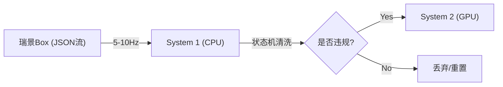

**System 1 技术栈选型表：**

| 组件 | 选型 | 理由 |
| :--- | :--- | :--- |
| **开发语言** | **Python 3.8+** | 快速迭代，利于处理 JSON 数据，性能足够满足 10ms 延迟要求。 |
| **状态机库** | **transitions** | 轻量级、功能强大的 Python FSM 库，支持回调和嵌套状态。 |
| **数据验证** | **Pydantic** | 严格的数据模型定义与校验，防止脏数据导致逻辑崩溃。 |
| **进程管理** | **Systemd** | 确保服务开机自启与崩溃重启，保障 7x24 小时可用性。 |
| **通信协议** | **ZeroMQ (PUB/SUB)** | 极低延迟的进程间通信，用于接收瑞景盒子数据及发送 System 2 请求。 |
System 1 部署在 NVIDIA Orin NX 的 **CPU** 核心上（预留 GPU 给大模型），是一个基于 **有限状态机 (FSM)** 的确定性逻辑引擎。
*   **输入**：来自瑞景视觉盒子的结构化高频数据流（JSON, 5-10Hz）。
*   **输出**：高置信度的“疑似风险事件”，作为唤醒 System 2 的触发器。
*   **性能指标**：单帧处理延迟 **< 10ms**。

#### 解决的核心痛点
在厨房实战中，单纯依赖视觉检测（L0）会面临巨大的**瞬时误报**挑战：
1.  **光影干扰**：不锈钢台面反光、厨师翻炒时的瞬间火苗跃动。
2.  **视线遮挡**：厨师经过灶台瞬间遮挡火焰，或转身拿料导致“人体消失”1-2秒。
3.  **非违规离开**：厨师转身去身后2米的切配台拿菜，时长仅10秒（合规），不应报警。

System 1 的任务就是引入 **时间维度** 的校验，将“瞬间的像素变化”过滤为“持续的行为状态”。

---

### 核心算法逻辑：防抖动状态机

我们将“明火离人”场景抽象为四个标准状态，系统在这些状态间流转。

#### 状态定义
1.  **S0: IDLE (空闲态)**
    *   **特征**：瑞景Box未检测到灶台有明火。
    *   **动作**：清空所有计时器，系统休眠。
2.  **S1: COOKING (正常烹饪态)**
    *   **特征**：检测到明火 `AND` (检测到人员 `OR` 人员消失时间 < 容忍阈值 `T_tolerance`)。
    *   **动作**：重置“离岗计时器”，维持正常监控。
3.  **S2: PRE-WARNING (风险预警/抗干扰态)**
    *   **特征**：检测到明火 `AND` 未检测到人员。
    *   **动作**：启动“离岗计时器” ($T_{elapsed}$)。此状态是**System 1 的核心过滤器**，用于容忍厨师的短暂离开或视觉遮挡。
4.  **S3: ALARM (违规确证态)**
    *   **特征**：检测到明火 `AND` 未检测到人员 `AND` $T_{elapsed} \ge 30s$ (法规阈值)。
    *   **动作**：锁定当前状态，**唤醒 System 2**，打包上下文数据。

#### 状态流转图与防抖逻辑

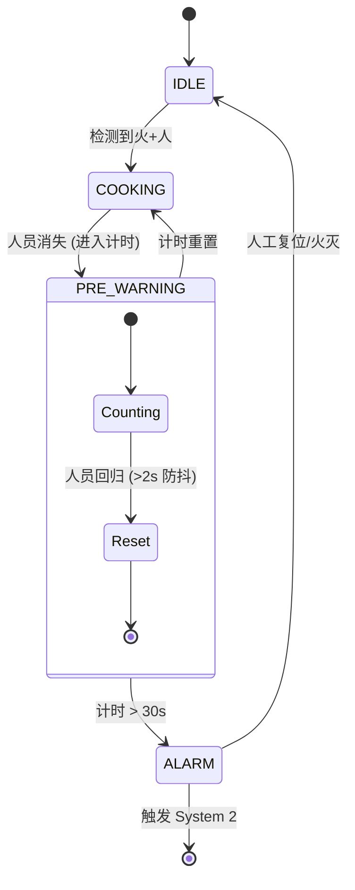
为了避免误报，我们在 S1 和 S2 之间设计了 **“宽容度缓冲” (Hysteresis Buffer)**：

*   **进入预警 (S1 -> S2)**：当视觉信号显示“无人”时，**立即**进入计时状态。
*   **解除预警 (S2 -> S1)**：
    *   **普通逻辑**：一旦检测到人，立即重置。
    *   **防抖优化**：如果人在画面中只是“闪现”（例如路过的传菜员），不应视为回归。要求人员在 ROI 区域内**持续停留 > 2秒**，才判定为“厨师回归”，重置计时器。
*   **触发报警 (S2 -> S3)**：仅当 $T_{elapsed}$ 严格超过 30秒（可配置），且期间无有效回归信号。

---

### 数据处理管道

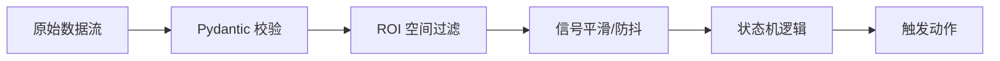

System 1 内部的数据处理遵循 **清洗 -> 对齐 -> 匹配** 的流水线。

#### 空间过滤
瑞景盒子可能上报全图的检测结果，System 1 必须进行二次空间校验。
*   **ROI 映射**：我们在 System 1 配置文件中定义 `ROI_Stove` (灶头) 和 `ROI_Operation` (操作区)。
*   **关联逻辑**：
    *   只有落在 `ROI_Stove` 内的火才被视为有效火源（排除背景屏幕上的火苗视频）。
    *   只有落在 `ROI_Operation` 内的人才被视为有效看管人（排除远处路过的闲杂人等）。

#### 信号对齐与去噪
*   **信号保持**：如果瑞景盒子因网络波动丢帧，System 1 会维持上一帧的状态最多 **500ms**，避免因传输抖动导致的计时器误重置。
*   **置信度门限**：
    *   火焰置信度阈值：设为 0.6（宁可误入S2状态，也不漏报）。
    *   人员置信度阈值：设为 0.4（只要有疑似人员在，就倾向于认为是安全的，避免误报）。

---

### 触发接口设计：System 1 to System 2

当状态机进入 **S3 (ALARM)** 态时，System 1 不会直接发短信报警，而是构造一个包含**丰富上下文**的请求包，发送给 System 2 进行“专家会诊”。

##### 触发协议
```json
{
  "trace_id": "evt_20240125_1001",
  "trigger_reason": "UNATTENDED_FIRE_TIMEOUT",
  "timestamp": 1706148000,
  "camera_id": "cam_kitchen_01",
  
  // 核心：System 1 提供的时空证据链
  "evidence": {
    "fire_duration": 450,       // 火焰已持续燃烧时长 (秒)
    "person_absent_duration": 31, // 人员已消失时长 (秒)
    "last_seen_person_ts": 1706147969, // 最后一次看到人的时间
    "confidence_scores": {
      "fire": 0.92,
      "person": 0.05
    }
  },

  // 附件：用于 System 2 视觉分析的素材
  "attachments": {
    "current_snapshot": "/tmp/shm/snap_current.jpg", // 当前无人画面
    "last_person_snapshot": "/tmp/shm/snap_last_seen.jpg" // 30秒前有人画面(用于对比)
  }
}
```

#### 为什么需要发送 "last_person_snapshot"？
这是一个架构巧思。System 2（大模型）不仅看当前画面，还可以对比 **30秒前有人** 的画面。
*   **Prompt 思路**：“请对比图A（30秒前）和图B（当前）。图A中有厨师在炒菜，图B中同一位置空无一人，且灶台火焰依然在燃烧。这是否构成违规？”
*   **价值**：这种对比极大地提升了大模型判断的准确性，让它理解“离岗”是一个**变化过程**，而不仅仅是一个静态瞬间。

---

**本章小结：**
System 1 是本方案的**守门员**。它不依赖昂贵的 GPU 算力，仅凭 CPU 运行的逻辑状态机，就能**过滤掉 95% 以上由反光、遮挡、短暂转身引起的瞬时干扰**。它保证了只有真正具备“时空持续性”的风险，才会被提交给 System 2 进行最终裁决，这是我们实现“极低误报率”承诺的技术基石。

## System 2 认知推理设计（大脑研判层）

### 设计理念：构建“全感官”认知中枢

#### 核心差异化

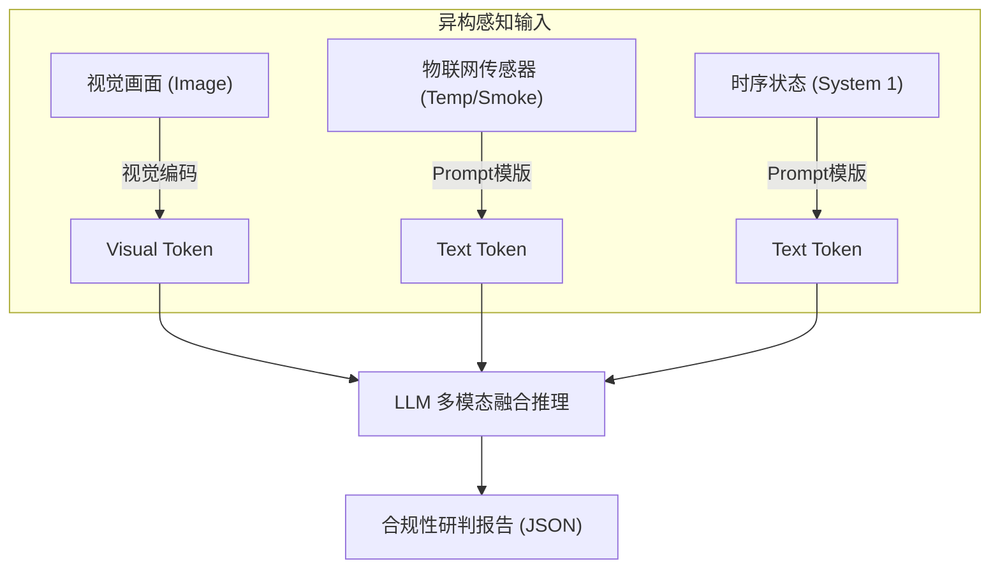

**System 2 技术栈选型表：**

| 组件 | 选型 | 理由 |
| :--- | :--- | :--- |
| **基座模型** | **Qwen-VL-Chat-Int4** | 阿里通义千问多模态版本，中文理解能力极强，Int4 量化后完美适配 16GB 显存。 |
| **推理引擎** | **TensorRT-LLM** | NVIDIA 官方高性能推理框架，支持 Continuous Batching 和 PagedAttention，吞吐量是 Python 后端的 4 倍以上。 |
| **服务框架** | **Triton Inference Server** | 工业级 AI 服务框架，支持高并发、动态批处理和模型热更新。 |
| **微调框架** | **LoRA (PEFT)** | 参数高效微调技术，仅需训练少量参数即可注入厨房安全领域的专业知识。 |
| **量化工具** | **AutoGPTQ / AWQ** | 保持高精度的同时将模型体积压缩 75%，是边缘端运行大模型的关键。 |
System 2 不是传统的“看图说话”工具，而是一个具备 **多模态融合（Multi-Modal Fusion）** 能力的认知中枢。
*   **传统方案**：视觉算视觉的（检测火），物联网算物联网的（检测温度），两者是割裂的。
*   **本方案**：我们将视觉信号（图像）与非视觉信号（温度、时间、状态）映射到同一个**语义空间**。对于大模型而言，280℃的温度读数与画面中红色的火焰具有等同的语义权重，两者互为验证，彻底解决单模态误报问题。

#### 部署架构
*   **运行环境**：NVIDIA Jetson Orin NX Super GPU。
*   **核心模型**：**Qwen-VL-Chat-Int4** (经过厨房场景专用 LoRA 微调)。
*   **推理引擎**：**TensorRT-LLM**，支持 FlashAttention-2 加速。

---

### 核心机制：多模态上下文融合

大模型无法直接“吃”传感器数据，我们需要设计一套**提示词工程（Prompt Engineering）+ 数据文本化**的标准化管道，将物理世界的异构数据转化为模型可理解的 **Context（上下文）**。

#### 输入层构造
System 2 的输入不仅仅是一张图，而是一个包含**三维信息**的复合Prompt：

1.  **视觉维度**：
    *   System 1 抓取的“案发时刻”高清截图。
    *   通过视觉编码器转化为高维特征向量。
2.  **物理维度**：
    *   将传感器数值转化为自然语言描述。
    *   *转化逻辑*：`Temp=280, Rate=+2.5` $\rightarrow$ "灶台当前温度280℃，且过去30秒内呈急剧上升趋势。"
3.  **时间维度**：
    *   System 1 提供的状态机历史。
    *   *转化逻辑*：`Person_Count=0, Duration=35s` $\rightarrow$ "操作区域已连续35秒未检测到人员活动。"

#### 融合推理 Prompt 模板
我们将上述信息封装进如下标准 Prompt 中，发送给大模型：

> **[System Role]**: 你是消防安全专家，负责依据《餐饮服务食品安全操作规范》进行合规研判。
>
> **[Input Data]**:
> - **`<Image_Placeholder>`** (视觉编码器生成的Token)
> - **[环境数据]**: 灶台红外温度读数 **285℃**（已超过食用油烟点）。
> - **[时序状态]**: 视觉传感器显示操作区 **无人**，且该状态已持续 **35秒**。
>
> **[Reasoning Task]**:
> 请结合画面中的火焰形态与上述传感器数据进行交叉验证：
> 1. **现象确认**: 画面是否有明火？温度数据是否支持燃烧现象？(排除屏幕视频误报)
> 2. **逻辑归因**: 既然是猛火烹饪（温度>250℃），为何人员离岗超过30秒？
> 3. **结论**: 判断风险等级（P0/P1），并给出处置建议。

---

### 深度推理逻辑：思维链

模型将执行一步步的逻辑推演，而非直接猜测结果。这种 **CoT（思维链）** 机制是实现“深度认知”的关键。

#### 推理过程模拟

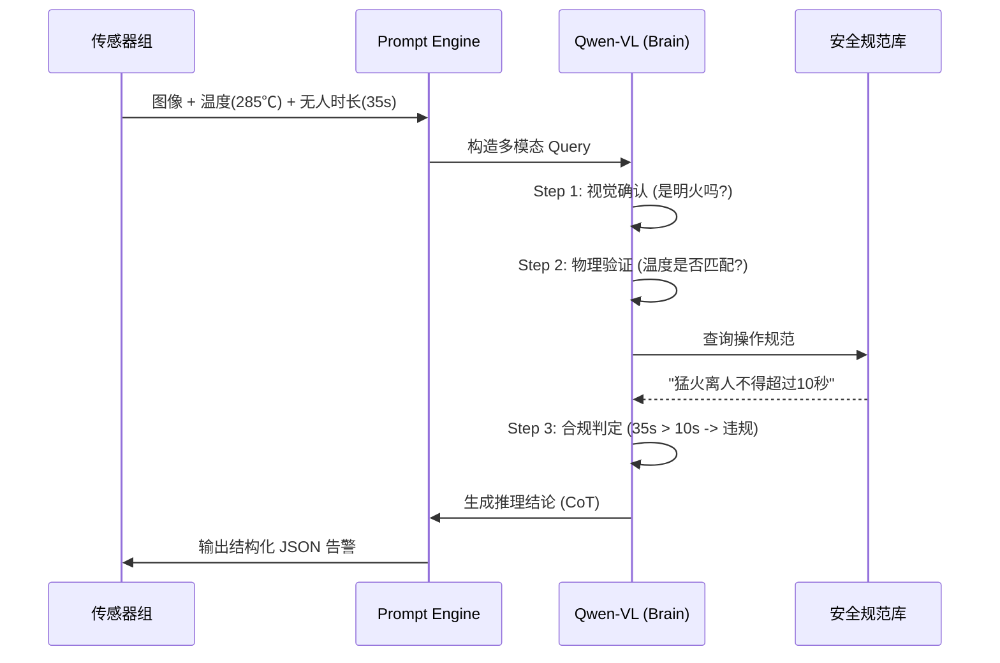
当上述 Prompt 输入后，模型的内部推理过程如下：

1.  **Step 1: 视觉与物理的交叉验证**
    *   *思考*：“我看到画面中有明亮的黄色火焰（视觉），同时传感器读数为 285℃（物理）。视觉与物理信号一致，**确认不是误报**（如排除了反射光或电视画面）。”
2.  **Step 2: 时间窗口的合规性判定**
    *   *思考*："当前是猛火状态，风险极高。根据规范，此时必须有人看管。但时序数据显示'无人持续35秒'。这超过了正常'转身拿调料'（通常&lt;10秒）的合理时间窗口。"
3.  **Step 3: 意图与风险定级**
    *   *思考*：“高温 + 长时间无人 = 油锅干烧风险极大。这属于违规离岗行为。”
4.  **Step 4: 生成最终报告**
    *   *输出*：“检测到P0级干烧风险。证据：视觉确认明火且温度达285℃，人员已违规离岗35秒，违反安全规范。建议立即切断气源。”

---

### 深度定制优化：LoRA 微调

通用的 Qwen-VL 模型虽然强大，但它不懂“什么是正常爆炒”、“什么是异常干烧”。我们需要通过 **LoRA (Low-Rank Adaptation)** 技术，让模型从“通才”变成“专才”。

#### 微调数据集构建
在准备期间，我们构建一个小规模但高质量的**指令微调数据集（约 500-1000 条）**：

*   **正样本（教会它报警）**：
    *   场景：各种角度的灶台起火、不同颜色的火焰（油火、纸火）。
    *   指令：输入包含“无人+高温”的数据，要求模型输出“P0报警”。
*   **负样本（教会它不误报 - 核心难点）**：
    *   **难例1（正常操作）**：厨师在颠勺，火焰很大（有火有人）。$\rightarrow$ 训练目标：判定为“正常烹饪”。
    *   **难例2（短暂离开）**：厨师转身拿盘子，离开仅 5 秒。$\rightarrow$ 训练目标：判定为“安全，处于容忍窗口内”。
    *   **难例3（蒸汽干扰）**：大量白色蒸汽，温度 90℃。$\rightarrow$ 训练目标：判定为“蒸汽，非火灾”。

#### 训练与部署策略

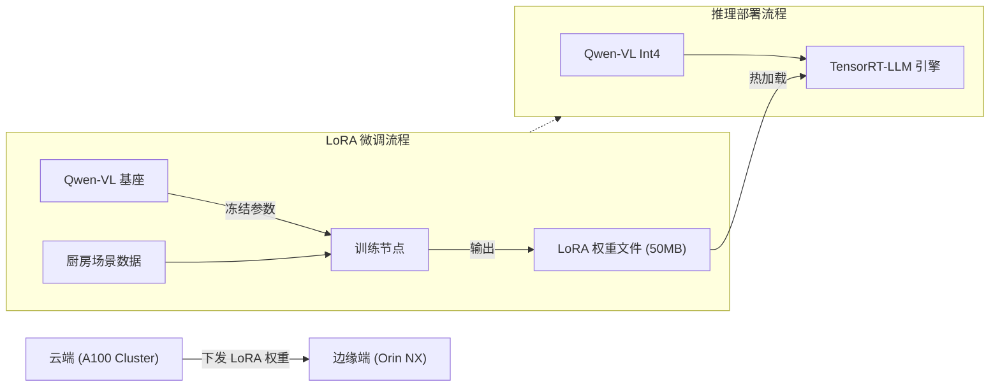
1.  **训练方式**：使用云端 A100 GPU，冻结基座模型参数，仅训练 LoRA 适配层，参数量仅占原模型的 1%-2%。
2.  **边缘热加载**：将训练好的 LoRA 权重文件（仅几十MB）下发到 Jetson Orin NX。
3.  **推理加速**：利用 TensorRT-LLM 将基座模型与 LoRA 权重融合，并量化为 **INT4** 格式。
    *   *收益*：显存占用降低至 6GB 以下，推理速度提升至 20 tokens/s 以上，确保在边缘端 **3秒内** 输出结果。

---

### 输出接口与应用对接

System 2 最终输出的是一个 **结构化 JSON**，而非一段废话。这使得前端 UI 可以直接渲染。

```json
{
  "event_id": "evt_20240201_001",
  "reasoning_trace": {
    "visual_check": "检测到猛火，火焰高度约40cm",
    "sensor_check": "温度285℃，确认物理燃烧",
    "temporal_check": "人员缺失35秒，超出安全阈值",
    "conclusion": "判定为违规离岗导致的干烧风险"
  },
  "risk_level": "P0",
  "actions": [
    {"cmd": "alert_sound", "params": "alarm_level_1"},
    {"cmd": "send_sms", "target": "manager"}
  ]
}
```

---

**本章小结：**
通过 **多模态融合 + 时间窗口逻辑 + LoRA 专有微调** 三位一体的设计，System 2 彻底超越了传统摄像头的“监控”属性。它不再是一个只会报警的传感器，而是一个懂业务、懂逻辑、有记忆的 **AI 安全专家**。这正是本方案能够实现“极低误报、极高价值”的技术护城河。

## 实施计划与资源保障

### 实施策略：API First & Data Driven

本项目不涉及前端界面开发，我们将采用 **后端优先（API First）** 与 **数据驱动验证** 的实施策略。核心展示形式为：通过命令行/Postman触发模拟事件，系统实时输出包含完整思维链的JSON数据包，并在本地文件系统中生成带有标注的证据图片与视频片段。

我们将 **2个月（8周）** 的周期划分为四个冲刺阶段（Sprint），每个阶段2周。

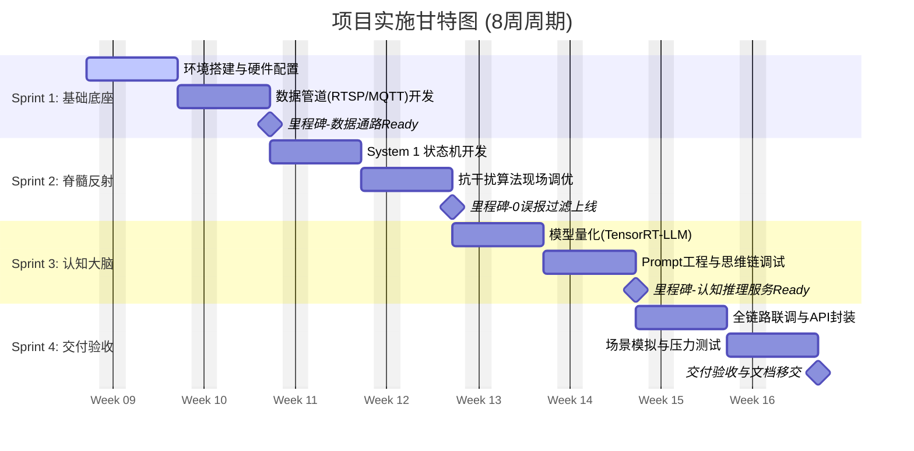

#### **Sprint 1：基础设施与数据管道构建**
*   **目标**：打通从“光信号”到“数字信号”的通路，建立稳定的数据底座。
*   **关键任务**：
    1.  **硬件环境搭建**：完成 NVIDIA Jetson Orin NX Super 的系统刷机、网络配置及远程访问环境。
    2.  **感知流接入**：编写 Python 服务，通过 RTSP 协议拉取热厨摄像头视频流，并进行关键帧解码。
    3.  **中间件部署**：部署 MQTT Broker作为内部消息总线，定义标准化的 `Topic` 结构（如 `sensor/camera/01/frame`）。
    4.  **瑞景Box对接**：解析瑞景算法盒子的 HTTP/TCP 推送协议，将其转换为内部统一的 JSON 格式并注入 MQTT。
*   **交付物**：
    *   硬件环境配置清单。
    *   数据接入中间件（Docker容器）。
    *   实时视频流解码与帧获取模块。

#### **Sprint 2：System 1 脊髓反射层开发**
*   **目标**：实现“不依赖大模型”的毫秒级过滤与状态判定。
*   **关键任务**：
    1.  **状态机逻辑**：用 Python/Go 实现 `Safe` -> `Pre-Warning` -> `Alarm` 的状态流转逻辑。
    2.  **时空对齐算法**：将瑞景Box的视觉检测结果（火、人）在时间轴上进行对齐，处理丢帧或延迟导致的信号抖动。
    3.  **防抖动规则**：实现“30秒容忍窗口”逻辑，过滤掉人员短暂遮挡、转身拿料等伪离岗行为。
    4.  **离线告警测试**：验证在断网情况下，System 1 能否独立触发本地日志记录（模拟信号灯或日志输出）。
*   **交付物**：
    *   System 1 规则引擎源代码。
    *   状态机流转日志（证明防抖逻辑生效）。

#### **Sprint 3：System 2 认知大脑集成**
*   **目标**：部署多模态大模型，赋予系统“逻辑推理”能力。
*   **关键任务**：
    1.  **模型量化部署**：使用 TensorRT-LLM 将 **Qwen-VL-Chat** 部署在 Orin NX 上，优化显存占用至 6-8GB。
    2.  **Prompt 工程**：调试针对厨房场景的思维链提示词，强制模型按 JSON 格式输出（观察->分析->结论）。
    3.  **推理服务封装**：将大模型封装为标准 API 服务，供 System 1 调用。
    4.  **证据包生成器**：开发自动截图、视频切片（前后10秒）并打包上传/存储的功能。
*   **交付物**：
    *   边缘大模型推理服务（Docker镜像）。
    *   标准化 Prompt 模板库。
    *   推理性能测试报告（TTFT < 500ms, Total < 5s）。

#### **Sprint 4：全链路联调与验收测试**
*   **目标**：模拟实战，验证系统闭环能力。
*   **关键任务**：
    1.  **全链路联调**：串联“感知 -> 过滤 -> 推理 -> 证据生成”全流程。
    2.  **API 接口测试**：验证输出的 JSON 数据结构是否符合规范，字段是否完整（包含 `risk_level`, `reasoning`, `suggestion` 等）。
    3.  **抗干扰测试**：在现场（或模拟环境）制造人为干扰（如用屏幕播放火焰、人员快速穿梭），验证系统是否误报。
    4.  **文档编写**：编写接口文档、部署手册及Demo演示脚本。
*   **交付物**：
    *   完整的“明火离人”边缘推理系统（软硬一体）。
    *   API 接口文档。
    *   验收测试报告（含误报率/漏报率统计）。

---

### 资源需求清单

为了保障Demo的顺利交付，我们需要精准配置软硬件及人力资源。

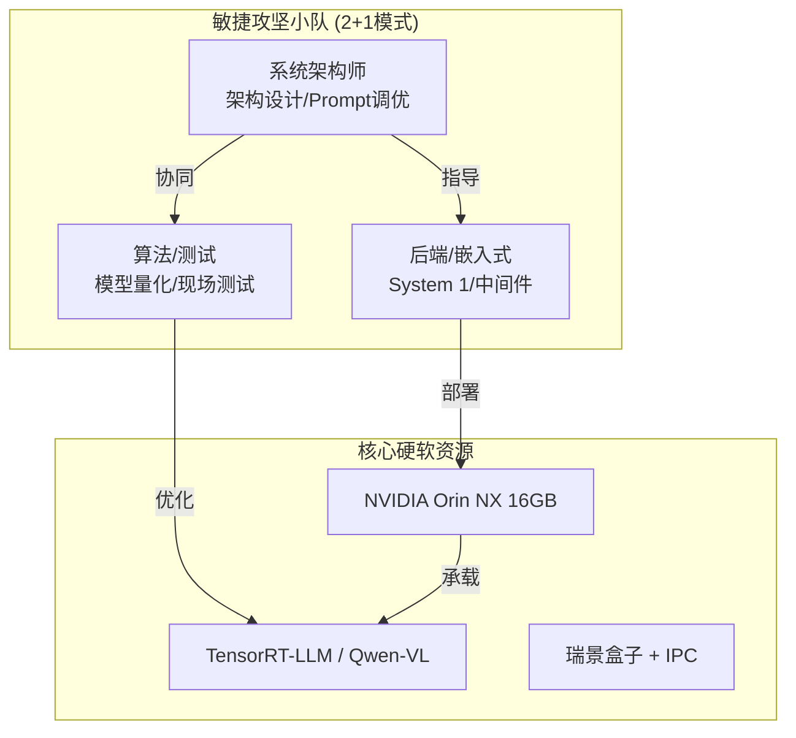

#### 硬件资源
| 设备名称 | 规格要求 | 数量 | 用途 | 备注 |
| :--- | :--- | :--- | :--- | :--- |
| **边缘计算盒** | **NVIDIA Jetson Orin NX 16GB Super** | 1台 | 核心算力单元 | **必须 16GB 显存**，否则无法运行 System 2 |
| **散热套件** | 被动/主动散热铝合金外壳 | 1套 | 保证持续运行 | 厨房环境需防尘防油 |
| **感知设备** | 瑞景视觉算法盒子 (现有) | 1台 | L0级基础检测 | 利旧 |
| **摄像头** | 支持 RTSP 的 IPC (1080P) | 1台 | 视频流采集 | 需覆盖灶台区域 |
| **网络设备** | 千兆交换机/路由器 | 1台 | 局域网组网 | 保证视频流低延迟 |

#### 人力资源配置
采用精简的 **2+1** 敏捷小队模式：

*   **系统架构师**：
    *   负责总体技术架构把控、Prompt 策略调优、技术难点攻关。
    *   输出：架构设计文档、Prompt 模板。
*   **后端/嵌入式工程师**：
    *   负责 System 1 状态机开发、中间件部署、API 接口封装、硬件对接。
    *   输出：核心功能代码、Docker 镜像。
*   **算法/测试工程师**：
    *   负责 TensorRT-LLM 环境搭建、模型量化转换、现场数据采集与系统测试。
    *   输出：量化模型文件、测试报告。

### 成本估算与报价

本项目总计研发投入预算为 **22万元**，全部用于核心研发团队的人力投入。

| 关键角色 | 人员职责 | 月薪 (预估) | 投入人月 | 总成本 (CNY) |
| :--- | :--- | :--- | :--- | :--- |
| **系统架构师** | 负责总体技术架构把控、Prompt 策略调优、技术难点攻关。 | ¥45,000 | 2.0 | ¥90,000 |
| **后端/嵌入式工程师** | 负责 System 1 状态机开发、中间件部署、API 接口封装、硬件对接。 | ¥40,000 | 2.0 | ¥80,000 |
| **算法/测试工程师** | 负责 TensorRT-LLM 环境搭建、模型量化转换、现场数据采集与系统测试。 | ¥25,000 | 2.0 | ¥50,000 |
| **研发总计** | **“2+1”敏捷小队** | | **6 人月** | **¥220,000** |

---

### 交付物标准与验收方式

由于不提供界面，我们的验收将基于 **数据** 和 **日志** 进行“白盒验收”。

#### 核心交付物
1.  **可运行的边缘推理一体机**：预装所有软件环境，开机即用。
2.  **API 接口文档**：详细定义了输出的 JSON 结构，方便客户后续对接其自有平台。
3.  **推理日志与证据包样本**：提供一组真实的报警记录，包含：
    *   `alarm.json`：包含完整的思维链推理文本。
    *   `evidence.jpg`：带有 System 1 标注框（火/人）的现场截图。
    *   `clip.mp4`：事件发生前后的短视频。

#### 验收演示流程
我们将通过以下方式向客户证明系统能力：

1.  **场景模拟**：在摄像头前模拟“点火”并“离开画面”的动作。
2.  **实时日志展示**：在连接大屏的终端上，使用 `tail -f` 命令实时滚动显示 System 1 的状态变化：
    *   `[INFO] Fire Detected. Person Count: 1. State: COOKING`
    *   `[WARN] Person Left. Timer Started: 1s... 5s... 10s...`
3.  **推理触发**：当计时超过设定阈值（如30秒）：
    *   `[ALERT] Timer > 30s. Triggering System 2...`
4.  **结果验证**：
    *   展示 System 2 生成的 JSON 输出：“检测到明火且无人值守30秒... 风险等级P0...”。
    *   打开生成的文件夹，展示系统自动保存的截图和视频证据。

---

### 风险管理与预案

| 风险点 | 风险描述 | 应对预案 |
| :--- | :--- | :--- |
| **显存溢出 (OOM)** | 16GB 显存可能不足以同时支撑 System 1 缓冲和 System 2 推理。 | 1. 启用 TensorRT-LLM 的 Int4 量化。<br />2. 限制 System 2 的上下文长度。 |
| **推理延迟过高** | 大模型首字生成慢，导致报警滞后。 | 1. 优化 Prompt，减少 Token 输出量。<br />2. 确保 Orin NX 运行在 MAXN (25W) 功耗模式。 |
| **瑞景盒子数据抖动** | 视觉检测结果不稳定，导致状态机频繁重置。 | 在 System 1 中增加“信号平滑滤波”逻辑（如：要求连续丢帧超过 3 秒才判定为无人）。 |

---

**本章小结**：
通过移除UI开发环节，我们将所有资源集中在**内核能力**的构建上。本实施计划确保在2个月内，交付一个**逻辑严密、数据详实、接口标准**的边缘认知黑盒，用最硬核的技术指标（准确率、推理速度、证据完整性），证明EMP-01架构的先进性。