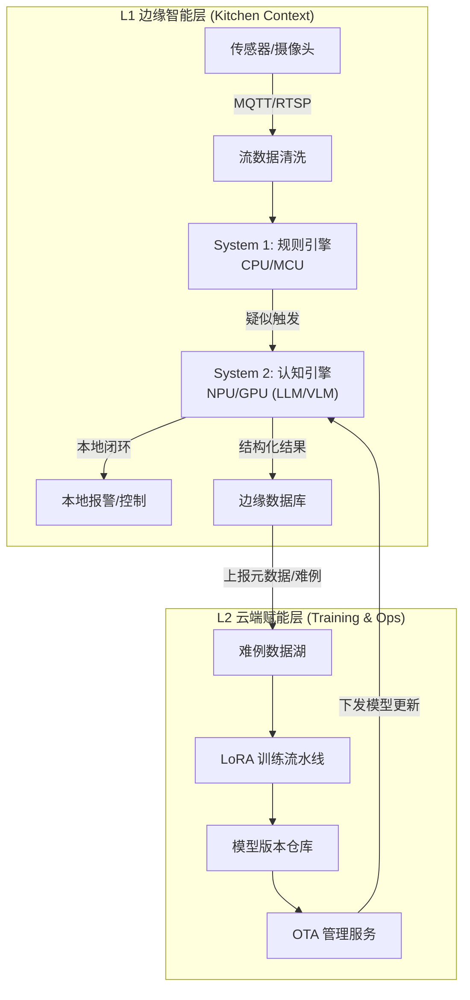
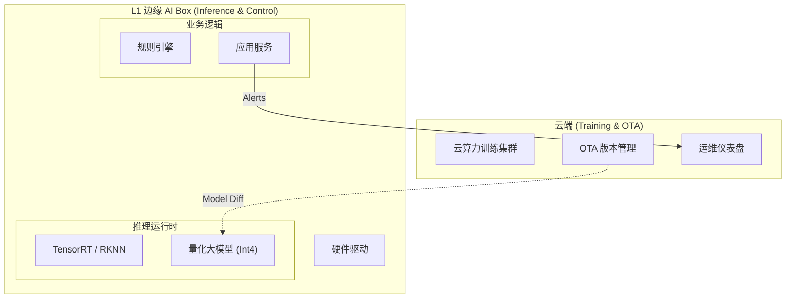
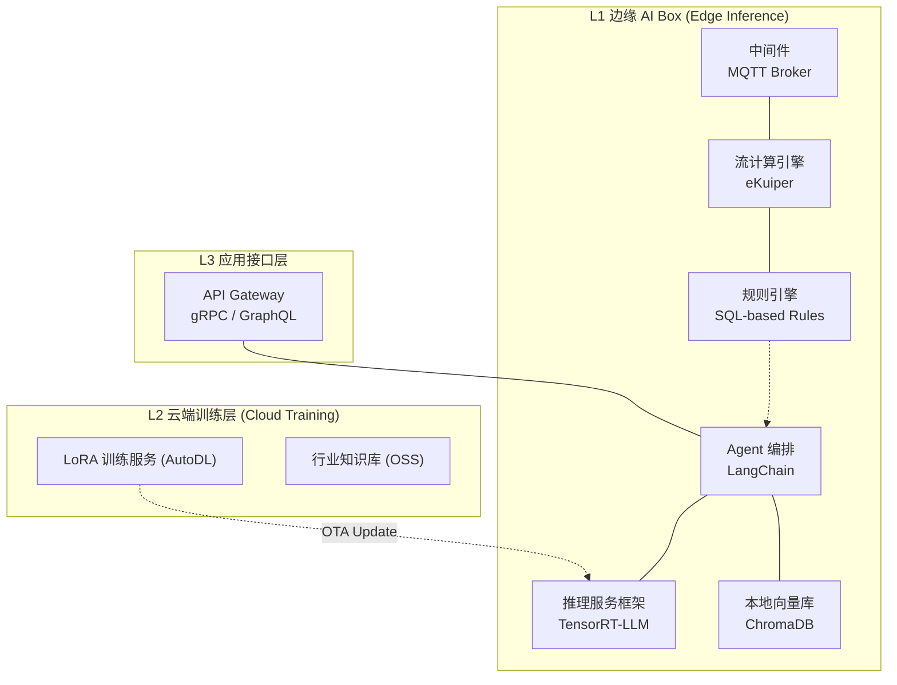
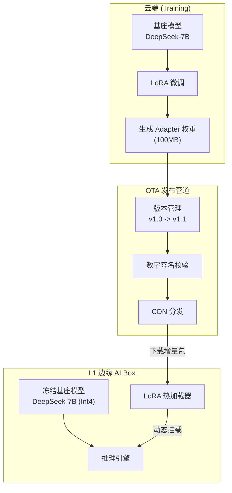

## 执行摘要

| 内容维度 | 核心阐述 |
|--------|---------|
| **项目名称** | 消防安全餐饮监测员系统-实时推理能力子系统技术及实施方案 |
| **技术定位** | 独立于硬件感知层之外的"认知中枢"，负责将碎片化的传感器信号转化为可执行的高置信度安全情报 |
| **核心创新** | 采用"边缘认知"架构：System 1（脊髓反射）与 System 2（认知研判）完全下沉至边缘端，实现数据不出域的闭环推理；云端专注于模型训练与 OTA 迭代。 |
| **关键成果** | 将行业误报率从 80% 降低至 1% 以内；实现 0 延迟离线推理；单节点支持 4 路视频流并发分析。 |
| **技术栈概览** | **边缘端**：C++/Python (Triton Server/RKNN) + Qwen-VL-Int4 (量化多模态大模型)；**云端**：PyTorch (LoRA微调) + OTA Manager (模型版本管理)。 |
| **硬件方案** | L1 **边缘 AI Box** 采用 **NVIDIA Jetson Orin NX** (16GB)；云端采用**按需租赁算力** (AutoDL/PAI)，无固定资产投入。 |
| **开发周期** | 6个月敏捷迭代；里程碑包括：边缘适配→量化剪枝→云端训练流→OTA机制→试点上线。 |
| **投资规模** | 一次性研发投入 ¥0.31M；单店建设成本 ¥3,500 (硬件成本上升)；年均运营成本极低 (无流量/云算力费)。 |
| **交付物** | 边缘推理引擎镜像 + LoRA微调权重 + OTA 升级协议 + 运维手册。 |
| **差异竞争力** | **数据隐私绝对安全** (图像不离店)；**离线可用** (断网不影响研判)；云端持续进化，通过 OTA 让边缘设备越用越聪明。 |


### 项目背景：跨越“感知瓶颈”，构建“认知中枢”

在EMP-01 消防安全餐饮安全监控场景中，我们发现现有系统普遍止步于基础采集，正面临着严峻的**感知-决策断层**挑战。

当前，前端感知硬件（AI摄像机、物联网传感器）解决了“看得见”的问题，但缺乏深度逻辑处理能力。为了彻底解决误报高、隐私顾虑及断网失效问题，本方案将**核心推理能力下沉至边缘**，构建**独立于硬件之外的边缘实时推理子系统**。

### 解决方案核心：边缘认知 + 云端进化

本方案采用 **“边缘推理 + 云端训练 + OTA 升级”** 的闭环架构，彻底重构了算力分配模式。

### System 1 & System 2：全边缘化部署

为了实现极致响应与隐私保护，我们将“快慢系统”全部部署在厨房现场的 **边缘 AI 盒子** 中：

*   **System 1 (脊髓反射)**：
    *   运行在边缘端 CPU/MCU 上。
    *   基于规则引擎，处理传感器数据（MQTT），毫秒级过滤 95% 的无效信号。
    *   负责将疑似风险上报给 System 2（断网可用）。

*   **System 2 (认知研判)**：
    *   运行在边缘端 **NPU/GPU** 上。
    *   部署 **量化版多模态大模型** (如 Qwen-VL-Int4, LLaVA-Phi-3)。
    *   对 System 1 筛选出的疑似图片进行深度逻辑分析（"看到火+无人+高温 -> 确认干烧"）。
    *   本地生成结构化推理报告。

### 云端角色：训练与指挥

云端不再参与实时推理，而是作为 **“训练中心”** 和 **“舰队指挥官”**：

*   **模型训练工厂**：收集边缘端上传的 **难例 (Hard Cases)**（经脱敏），进行 LoRA 微调，训练更聪明的模型版本。
*   **OTA 升级中心**：通过安全的 OTA 通道，将优化后的模型权重（Weight Diff）推送到数千个边缘节点，实现“一夜之间，全国厨房学会识别新型违规”。

### 核心优势总结

- **数据隐私零风险**：原始视频与图片数据 **绝不出域**（除非人工特许上传用于排障），完美符合政企食堂、涉密单位的合规要求。
- **极致可靠性**：彻底摆脱网络依赖。即使光纤被挖断，厨房内的边缘盒子依然能独立完成“感知-推理-报警”全闭环。
- **运营成本极低**：消灭了昂贵的云端 GPU 推理租赁费与视频上传流量费。一次性硬件投入后，边际运营成本趋近于零。

## 系统架构设计

### 设计原则：边缘自治与云端赋能

架构设计的核心理念是 **“Thick Edge, Thin Cloud” (厚边缘，薄云端)**。

### 逻辑架构视图



#### 第一层：边缘感知与推理（L1）

这是系统的核心计算单元，部署在厨房现场的高算力 **AI 边缘盒子** 内。

*   **全栈闭环**：从数据接入、规则过滤、大模型推理到风险研判，全部在本地完成。
*   **模型引擎**：集成 **TensorRT-LLM** 或 **RKNN-LLM** 推理框架，专门针对边缘芯片（Nvidia/Rockchip）进行算子优化，确保在有限功耗下跑通 VLM 模型。

#### 第二层：云端训练与管理（L2）

*   **主动学习 (Active Learning)**：边缘端会根据不确定度（Uncertainty）自动筛选“看不懂”的场景图片，脱敏后上传云端。
*   **持续进化**：云端工程师对难例进行标注，触发自动化训练管线，生成新的 LoRA 权重，通过 OTA 下发。

---

### 软件技术栈架构



### 接口设计

接口重心从“实时数据流”转向“管理流”。

#### 北向接口（管理）
*   **协议**：HTTPS / MQTT
*   **功能**：设备心跳、告警上报（仅结果）、OTA 指令接收、难例样本上传。

#### 南向接口（采集）

负责与现场异构感知设备的物理连接与数据标准化。

*   **视频流接入**：
    *   **协议**：RTSP (Real Time Streaming Protocol) / ONVIF Profile S。
    *   **规格**：主码流 (1080P@25fps) 用于 System 2 抽帧分析；子码流 (VGA@15fps) 用于 System 1 运动检测。
    *   **兼容性**：支持海康威视、大华、宇视等主流品牌 IPC。
*   **物联网传感接入**：
    *   **协议**：MQTT v3.1.1 / Modbus RTU (转 MQTT)。
    *   **接入方式**：
        *   **直连设备**：WiFi/NB-IoT 传感器直接发布至边缘端 MQTT Broker。
        *   **传统设备**：通过 RS485 串口采集数据（如燃气流量计），在边缘端转换为 JSON 格式。
    *   **数据频次**：高危传感器 (燃气/温度) 1Hz 采样；普通传感器 0.1Hz 采样。

---

### 核心数据流转管道

为了清晰展示系统内部运作机制，我们定义了一条典型的 **可疑火灾事件** 在架构中的流转全过程。

```mermaid
sequenceDiagram
    participant Cam as AI相机/传感器
    participant L1 as L1边缘网关
    participant Cloud as L2云端推理集群
    participant App as 上层SaaS应用

    Note over Cam: 检测到疑似火焰 (Conf:0.85)<br/>温度上升 (280℃)
    Cam->>L1: MQTT Publish (Tag:Fire, Temp:280)
    
    rect rgb(44, 45, 46)
        Note over L1: System 1: 脊髓反射
        L1->>L1: 数据清洗 & 时空对齐
        L1->>L1: 状态机: Pre-Alarm -> Confirmed
        L1-->>L1: 标记疑似风险
    end
    
    L1->>Cloud: 上报疑似事件 (Metadata + Snapshot URL)
    
    rect rgb(39, 37, 35)
        Note over Cloud: System 2: 认知研判
        Cloud->>Cloud: 组装 Prompt (多模态 + 历史数据)
        Cloud->>Cloud: RAG 检索消防法规
        Cloud->>Cloud: LLM 推理: "干烧风险"
    end
    
    Cloud->>App: 推送结构化情报 (Risk Level: Critical)
    App->>App: 触发工单 & 短信通知
```



#### 阶段一：感知元数据注入

前端硬件上报如下 JSON 数据包：

```json
// Topic: hardware/kitchen_01/visual
{ "tag": "fire", "conf": 0.85, "ts": 170001, "roi": "stove_01" }
// Topic: hardware/kitchen_01/thermal
{ "temp": 280, "unit": "celsius", "ts": 170002, "sensor_id": "t_01" }
```

#### 阶段二：L1 层的状态机过滤

- **关联聚合**：`Unified Data Adaptor` 根据 `kitchen_01` 将视觉和温度数据聚合。
- **状态机激活**：
    * 规则引擎检测到 `tag:fire`，触发 `PotentialFire` 规则。
    * 检查条件 A：`conf > 0.6`? -> Pass.
    * 检查条件 B（交叉验证）：查找同一时间窗口内的温度数据。发现 `temp=280`。
    * 逻辑判定：`Fire + HighTemp` = **有效疑似事件**。

- **事件升级**：如果温度仅 40度（可能是误报），FSM 会重置；此处温度高，FSM 生成 `Candidate_Risk_Event`，并附带关联的图片 URL，推送到 L2 层。

#### 阶段三：L2 层的深度研判

- **Prompt 构建**：`Agent Orchestrator` 组装提示词：
> "分析附件图片及数据。视觉检测到火，温度280度。请判断：是正常爆炒还是失控干烧？依据是什么？"

- **LLM 推理**：
    * 视觉模型（VLM）“看”图片：发现火焰很高，且锅旁边没有人，只有一把勺子。
    * 逻辑模型（LLM）“想”：温度280度接近闪点 + 无人看管 = 极高风险。

- **结果生成**：输出最终判定结果，并调用 RAG 模块附加“违反GBxxxx条款”的引用。

---

### 软件技术栈架构



| 层次 | 模块名称 | 关键技术选型 | 选型技术理由 |
| --- | --- | --- | --- |
| **L3 应用接口** | **API Gateway** | **gRPC / GraphQL** | 支持高效的结构化数据查询，方便上层应用按需获取推理结果。 |
| **L2 训练层** | **训练服务** | **PyTorch (AutoDL)** | 利用租赁的云端 A100 算力进行离线微调，降低固定资产投入。 |
| **L1 边缘 AI Box** | **推理服务框架** | **TensorRT-LLM** | 专为 NVIDIA Orin 优化，支持 Int4 量化，在边缘端实现 7B 模型的高速推理。 |
|  | **Agent 编排** | **LangChain (Python)** | 运行在边缘端，串联“检索-思考-回答”全过程，保障断网可用。 |
|  | **向量数据库** | **ChromaDB (Local)** | 轻量级嵌入式向量库，直接运行在边缘盒子内，无需外部依赖。 |
|  | **流计算/规则** | **eKuiper** | 超轻量级边缘流计算框架，毫秒级处理 MQTT 数据。 |

### 接口设计

#### 南向接口

定义系统如何“听”硬件的话。

* **协议**：MQTT over TCP/Websocket
* **Topic 规范**：`emp/v1/ingest/{kitchen_id}/{sensor_type}`
* **Payload 规范**：严格遵循 Schema 定义，必须包含 `timestamp`, `device_id`, `data_payload`。

#### 北向接口

定义系统如何“说”出结论。

* **协议**：HTTP/2 Webhook
* **数据包示例**：
```json
{
  "event_id": "EVT_20260121_999",
  "risk_level": "CRITICAL",  // 风险等级：P0
  "system2_verdict": {
    "type": "unattended_dry_burn",
    "reasoning": "Visual evidence confirms fire presence while person detection is strictly zero for 120s. Thermal sensor reads 280C, confirming physical combustion.", // 完整的推理逻辑
    "confidence": 0.99
  },
  "action_plan": [
    {"cmd": "close_valve", "target": "valve_01"},
    {"cmd": "sms_alert", "target": "manager"}
  ]
}
```

### 网络架构与通信链路

#### 设计理念：构建“永远在线”的神经传导网络

在餐饮厨房这一高危场景中，网络不仅仅是数据通道，更是系统的生命线。为了确保“端-云”数据链路在极端环境（如地下室信号弱、火灾烧毁光纤）下的安全与时效，我们摒弃了传统的单链路设计，构建了一套具备**电信级可靠性、多层级QoS保障与军事级加密**的传输网络体系。

#### 物理链路拓扑：有线无线双模互备

系统在物理层采用“主备双活”架构，确保单一链路故障时，数据传输“0感知”切换。

*   **主链路 (Primary)**：**千兆有线光纤 (FTTH)**。
    *   *职责*：承载 OTA 固件更新下载、历史视频流回放等大带宽业务。
    *   *保障*：连接 UPS 电源，防止市电切断导致光猫失效。
*   **备链路 (Backup)**：**工业级 4G/5G Cat.4 全网通**。
    *   *职责*：作为“逃生通道”。当主链路 Ping 丢包率 > 20% 时，毫秒级自动接管 MQTT 报警信令传输。
    *   *策略*：使用物联网专用 APN 卡，享有运营商侧的高优先级接入权。

#### 传输协议栈：分层流控与语义优先级

我们重新定义了应用层协议，引入了 **语义优先级队列 (Semantic Priority Queue)** 机制，根据数据的业务价值动态分配带宽资源。

*   **信令层**：**MQTT v5.0 over TLS 1.3**
    *   *特性*：利用 MQTT 5.0 的 `Shared Subscription` 实现云端负载均衡，利用 `Message Expiry Interval` 防止过时消息堆积。
    *   *心跳机制*：边缘端每 10s 发送 Keep-Alive，云端采用“漏桶算法”检测连接健康度。

*   **QoS 分级策略**：
    | 优先级 | 数据类型 | 传输通道 | 丢包策略 | 业务含义 |
    | :--- | :--- | :--- | :--- | :--- |
    | **P0 (Critical)** | 燃气泄漏/火情告警、切阀指令 | MQTT QoS 2 (Exactly Once) | **死磕到底** | 无论网络多差，必须送达，支持断点续传。 |
    | **P1 (High)** | System 2 研判结果、关键帧快照 | MQTT QoS 1 (At Least Once) | 允许延时 | 即使延迟 1分钟上传也不影响现场处置。 |
    | **P2 (Normal)** | 传感器周期性读数、设备状态日志 | MQTT QoS 0 | 允许丢弃 | 丢失个别数据点不影响整体趋势分析。 |
    | **P3 (Low)** | 难例样本图片、模型权重下载 | HTTPS (断点续传) | 闲时传输 | 仅在带宽利用率 &lt; 30% 时启动后台传输。 |

#### 弱网对抗与边缘自治机制

针对厨房常见的“信号黑洞”问题，L1 边缘 AI Box 内置了智能流控算法：

1.  **自适应压缩 (Adaptive Compression)**：
    *   当上行带宽充足 (>2Mbps) 时，上传 1080P 高清原图。
    *   当带宽劣化 (&lt;100Kbps) 时，自动将图片压缩为 320P 缩略图或仅上传 ROI (感兴趣区域) 裁剪图，确保证据链不丢失。
2.  **断网黑盒 (Offline Blackbox)**：
    *   内置 1GB 的环形缓冲区 (Ring Buffer)。
    *   一旦断网，所有 P0/P1 级数据自动写入本地 eMMC 存储。
    *   网络恢复瞬间，启用“快进模式”将积压数据以 5倍速回传云端，并自动进行时间戳对齐。

#### 安全防御体系

*   **通道加密**：全链路强制启用 **TLS 1.3**，禁用弱加密套件，防止中间人攻击窃取视频流。
*   **双向认证 (mTLS)**：不仅设备要验证云端证书，云端也要验证设备的 X.509 唯一证书，杜绝伪造设备接入。
*   **一机一密**：每个边缘盒子在出厂时烧录唯一的 Device Secret，存储在安全芯片 (SE) 中，物理层防破解。

---

### 系统扩展性评估

* **规则热更新**：
System 1 的过滤规则支持云端下发。当需要调整“高温阈值”从 280℃ 降为 260℃ 时，只需在云端修改 SQL，边缘网关即时生效，无需 OTA 升级固件。
* **模型热插拔**：
System 2 的 Agent 支持动态加载不同的 LoRA 适配器（Adapter）。例如针对“清真厨房”，可以动态加载识别“非清真食材违规”的微调模型，而无需重新部署整个基座模型。

#### 算力扩展曲线

* **单点性能**：Orin NX 16GB 算力 (157 TOPS) 足以支撑未来 3 年的模型迭代（如升级到 10B 模型或增加多路并发）。
* **集群伸缩**：云端训练资源采用租赁模式，可瞬间从 1卡扩展至 100卡，无缝应对大规模微调需求。

---


## 推理计算环境与硬件选型

### 选型策略：高性能边缘计算

System 2 大模型对算力要求较高，硬件需具备 **AI 加速能力 (NPU/GPU)** 和 **大显存** 以支撑大模型量化推理。本方案采用**边缘 AI Box**替代传统工控机。

### L1 边缘 AI Box 选型

#### 选型策略：基于 NVIDIA Jetson 的分级部署方案

为满足不同预算与场景对模型“智商”（参数量）与响应速度的需求，本方案依据 NVIDIA Jetson 系列算力阶梯，制定了由低到高的升级路线。推荐以 **Orin NX 16GB** 作为标准部署基线。

| 方案等级 | 推荐型号 | 核心规格 | 适用模型规模 | 场景定位 | 预算参考 (CNY) |
| :--- | :--- | :--- | :--- | :--- | :--- |
| **标准版 (推荐)** | **Orin NX 16GB Super** | **157 TOPS**, 16GB 内存 | **7B (Int4)** | **大多数商业厨房**。单机闭环运行 System 1 + 7B 推理，性价比最高。 | **¥5,000** |
| **进阶版** | **AGX Orin 64GB** | **275 TOPS**, 64GB 内存 | **14B ~ 32B** | **大型中央厨房/化工园区**。支持更复杂的逻辑判断或多路 VLM 视觉大模型并发。 | **¥15,000 - ¥25,000** |
| **旗舰版** | **RTX 4090 边缘工作站** | **1000+ TOPS**, 24GB+ 显存 | **70B+** | **城市级消防中枢**。运行 70B 级“专家模型”，处理极度复杂的全城级安防研判。 | **¥35,000+** |

#### 推荐方案详解：Orin NX 16GB Super (标准版)

*   **核心优势**：
    *   **16GB 显存是生死线**：7B 模型量化后约占 5GB，剩余显存刚好足以支撑 KV Cache、规则引擎及操作系统。8GB 版本会因显存溢出导致推理崩溃，不可选。
    *   **Super 模式算力**：开启 Super Mode 后提供 157 TOPS 算力，相比普通版提升显著，确保火灾安防的秒级响应。
    *   **生态成熟**：原生支持 TensorRT-LLM，推理延迟低至毫秒级。
*   **硬件构成**：
    *   载板：支持 NVMe SSD 扩展与 PoE 供电（直接驱动安防相机）。
    *   存储：配置 512GB NVMe SSD，保障模型快速加载与本地日志存储。

### L2 云端训练环境

考虑到自建算力中心的高昂硬件成本与维护难度，本方案推荐采用 **“按需租赁云算力”** 的模式。

*   **平台选择**：AutoDL、阿里云 PAI 或 AWS EC2。
*   **算力规格**：租赁 **NVIDIA A100 / A800 (80GB)** 实例。
*   **使用策略**：
    *   **离线训练**：无需 24 小时开机。仅在积累了足够数量的“难例数据”（如每周一次）后，启动云实例进行 LoRA 微调，训练完成后立即释放资源。
    *   **成本优势**：将百万级的固定资产投入转化为极低的按时计费运营成本。

## 智能体开发与推理引擎构建

本章详细阐述如何通过软件工程手段实现“双系统认知架构”。我们的开发对象不是传统的图像识别算法，而是**处理结构化数据的逻辑推理引擎**。

### 数据接入与标准化管道

在推理开始之前，必须解决异构硬件数据“语言不通”的问题。无论是海康的摄像头还是汉威的传感器，接入本系统时都必须遵循统一的“感知元数据标准”。

#### 定义统一感知对象

我们定义了一个基于 JSON 的标准数据包结构 `KitchenObservation`，作为系统内部流转的唯一凭证。

```json
{
  "trace_id": "evt_20260122_A889",      // 全链路追踪ID
  "kitchen_id": "K_SH_001_STOVE_02",    // 物理空间ID（精确到灶台）
  "timestamp_ms": 1705920000123,        // 统一UTC时间戳
  "senses": {
    // 视觉感知（由前端AI相机提供）
    "vision": [
      {"label": "fire", "conf": 0.88, "roi": [100, 200, 50, 60]}, 
      {"label": "person", "conf": 0.05} // 极低置信度，意味着可能无人
    ],
    // 触觉感知（由红外阵列提供）
    "thermal": {
      "max_temp": 285.5,
      "trend": "rising_fast",           // 边缘端预算的趋势：急速上升
      "heatmap_url": "http://edge/heat/01.dat"
    },
    // 嗅觉感知（由气体探头提供）
    "olfactory": {
      "ch4_ppm": 20,                    // 甲烷浓度
      "co_ppm": 5
    }
  },
  "context": {
    "snapshot_url": "http://edge/snap/A889.jpg" // 佐证图片
  }
}
```

#### 管道开发技术栈

* **接入协议**：MQTT v5.0 (支持 Shared Subscription 负载均衡)。
* **序列化**：Protobuf (内部传输)，JSON (外部交互)。
* **开发语言**：Go (Golang) —— 选用理由：高并发处理百万级 MQTT 消息时，性能优于 Java，开发效率优于 C++。

---

### System 1：脊髓反射层开发

System 1 的核心任务是**去噪**与**守底线**。它不进行复杂的因果推理，而是执行确定性的**时空状态机**。

#### 核心逻辑：防抖动状态机

前端视觉算法常因不锈钢反光产生瞬时误报。我们通过 FSM 逻辑，要求报警信号必须在“时间”和“多维数据”上具备连续性。

**逻辑伪代码 (Go)**：

```go
// 定义状态机
type StoveState struct {
    CurrentState State   // Safe, PreAlarm, Confirmed
    FireCounter  int     // 视觉火焰计数器
    TempWindow   []float // 最近10秒温度滑窗
}

func (s *StoveState) OnEvent(evt Observation) {
    // 1. 信号提取
    hasFire := evt.HasVisualLabel("fire")
    currentTemp := evt.GetMaxTemp()

    // 2. 状态流转逻辑
    switch s.CurrentState {
    case Safe:
        if hasFire {
            s.CurrentState = PreAlarm // 进入“预警/怀疑”状态
            s.FirstFireTime = Now()
        }
    case PreAlarm:
        // 在预警状态下，需要“多重校验”
        if hasFire {
            s.FireCounter++
            // 校验规则 A：持续性（3秒内至少5帧有火）
            // 校验规则 B：物理性（温度必须 > 80度，排除纯光影误报）
            if s.FireCounter > 5 && currentTemp > 80.0 {
                s.CurrentState = Confirmed
                // 升级给 System 2 做深度分析
                EscalateToCloud(evt)
            }
        } else {
            // 信号丢失，重置状态（视为一次误报震荡）
            if Now().Sub(s.FirstFireTime) > 3*time.Second {
                s.Reset()
            }
        }
    }
}
```

#### 极速报警熔断器

针对必死的物理指标，System 1 拥有最高优先级的**告警通道**。

* **规则配置**：
`IF (Gas_Concentration > 20% LEL) OR (Temp > 350℃) THEN REPORT(RISK_CRITICAL)`
* **实现方式**：
该逻辑硬编码在边缘端，即使与云端断网也能执行。这套系统不做决策，遇到风险也只是上报给推理引擎进一步确认，确认真的有风险再记录和报告，但无论如何都不会做任何决策。

---

### System 2：认知大脑开发

当 System 1 确认“这不是简单的误报...”时，数据被推送到**本地 System 2 (边缘 AI Box)**。这里运行的是基于 **Large Agentic Model (LAM)** 的智能体。

#### 智能体架构

我们实例化 System 2 为一个名为 **Safety_Inspector_01** 的虚拟专家。

* **基座模型**：Qwen-VL-Chat 或 LLaVA (经过 SFT 微调)。
* **记忆模块**：
    * *短期记忆*：该厨房过去 10 分钟的所有传感器数据时序图。
    * *长期记忆*：该商户的历史违规记录、厨房布局图。

#### 核心技能：思维链

为了让 AI 输出可信的结论，我们不直接问结果，而是强制模型“把思考过程写出来”。

**Prompt 模板设计**：

```markdown
# Role
你是一名拥有20年经验的消防安全专家。

# Context (上下文数据)
- [视觉]：System 1 检测到灶台有明火（置信度0.9），画面中无人员（置信度0.0）。
- [热像]：当前温度 285℃，过去60秒温度变化率 k=+3.5℃/s（急剧升温）。
- [历史]：该灶台最后一次检测到人员是在 8分20秒 前。
- [图像附件]：&lt;snapshot_image_token>

# Task (推理任务)
请遵循以下步骤进行分析（不要跳过任何一步）：
1. **现象还原**：结合视觉和温度数据，描述当前物理世界正在发生什么？
2. **逻辑归因**：
   - 既然有火，为什么温度会飙升？（区分：正常爆炒 vs 干烧）
   - 既然在烹饪，为什么没人？（区分：拿调料的短暂离开 vs 违规离岗）
3. **法规检索**：该行为是否违反《餐饮服务食品安全操作规范》？引用具体条款。
4. **最终判决**：给出风险等级（P0-P3）及置信度。

# Output Format (JSON)
{ ... }
```

#### 知识增强

为了解决大模型“一本正经胡说八道”的问题，我们集成了 **EMP-20 知识库**。

* **向量化**：将《消防法》、《燃气安全管理条例》切片存入 Milvus 向量库。
* **检索逻辑**：当 Agent 思考到“违规离岗”关键词时，自动检索相关法规，并将条文注入到 Prompt 中，确保输出的报告具备法律引用效力。

**输出示例**：

> *"判定为P0级高危风险。依据《餐饮服务食品安全操作规范》第十三条：‘烹饪期间操作人员不得擅自离岗’。当前人员离岗超8分钟且油温接近闪点，存在重大火灾隐患。"*

---

### 接口定义与应用交付

本子系统作为独立的能力模块，通过**标准化的服务接口**向上层应用（如大屏、APP）提供推理结果，确保系统解耦与易于集成。

#### 北向推送接口

当 System 2 生成结论后，主动向业务层推送结构化情报。

**POST /api/v1/alert/push**

```json
{
  "event_id": "EVT_20260122_A889",
  "severity": "CRITICAL",
  "title": "高危干烧预警（开火离人）",
  "timestamp": 1705920005000,
  "location": "上海中心店-01号灶",
  "evidence_chain": {
    "description": "视觉确认明火+人员离岗8min；热成像确认温度失控(285℃)。",
    "image_url": "https://oss.../evidence_marked.jpg", // 带有AI标注框的图片
    "video_url": "https://oss.../evidence_clip.mp4"
  },
  "suggested_actions": [
    {"code": "CUT_GAS", "status": "SUGGESTED"}, // System 1 建议切阀
    {"code": "CALL_MANAGER", "status": "PENDING"} // 建议呼叫经理
  ]
}
```

#### 开发交付物清单

1. **Edge-Core SDK**：部署在 L1 边缘 AI Box 的 Go 语言二进制包（含规则引擎配置工具）。
2. **Reasoning-Agent Docker**：部署在 **L1 边缘 AI Box** 的推理服务容器（含微调后的模型权重）。
3. **API 文档 (Swagger)**：供前端应用集成的接口说明书。

---

## 模型微调与持续优化

### 核心挑战与优化目标

在实时推理子系统中，我们的优化对象**不是**前端的感知模型（如 YOLO/ResNet，那是硬件厂商的事），而是 System 2 中的**认知推理大模型**。

当前面临的三大核心挑战：

- **幻觉风险**：通用模型喜欢“看图说话”，容易把“红色塑料袋”强行解释为“火焰”。
- **领域知识缺失**：模型不懂“油温达到280℃是闪点”等物理常识，也不懂“人员离岗30秒”与“离岗10分钟”的定性区别。
- **推理延迟**：7B 参数的模型如果未优化，单次推理可能需要 3-5秒，无法满足应急响应需求。

**优化目标**：

* **逻辑准确率**：> 99%（针对复杂逻辑判断）。
* **遵从度**：输出格式必须严格符合 JSON Schema，不能多字少字。
* **推理时延**：&lt; 1.5s (首字生成时间 TTFT &lt; 300ms)。

---

### 领域数据的构建

为了训练“逻辑大脑”，我们需要构建高质量的**指令微调数据集**。这与传统的 CV 标注（画框）完全不同。

#### 数据集结构设计

我们需要构建 **Scenario - Thought - Verdict (场景-思考-结论)** 三元组数据。

**样本示例 (JSONL格式)**：

```json
{
  "instruction": "作为安全专家，分析以下厨房场景数据，判断是否存在‘开火离人’风险。",
  "input": {
    "visual_tags": ["fire:0.9", "person:0.0"],
    "thermal_sensor": {"temp": 290, "slope": "+4.2"},
    "duration": "450s"
  },
  "output": "【思考过程】\n1. 视觉检测到明火，且热成像显示温度高达290℃，超过食用油闪点，确认为真实燃烧。\n2. 传感器数据显示人员已缺席450秒（7.5分钟），远超正常拿取调料的时间窗口。\n3. 高温+无人+长时间=极高风险。\n【最终判定】\n{\"risk\": \"CRITICAL\", \"type\": \"dry_burn\"}"
}
```

#### 数据闭环飞轮

为了获取这些数据，我们建立“人机协作”的闭环：

- **冷启动**：由安全专家人工编写 500 条典型的“合成数据”（涵盖干烧、漏气、违规吸烟等场景）。
- **线上运行**：System 2 基于冷启动模型进行推理。
- **人工反馈**：当监管人员在后台标记“这是误报”时，该 Case 自动进入**负样本池**。
- **迭代微调**：每周利用新增的“错题集”对模型进行增量微调。

---

### 微调策略与技术路径

我们不重新训练整个大模型（那需要数百万美元），而是采用 **PEFT (参数高效微调)** 技术。

#### 核心技术：LoRA

* **原理**：冻结 Qwen-VL-Chat 的 70亿个参数，只在 Attention 层插入极小的适配器（Adapter）矩阵进行训练。
* **优势**：
    * **显存占用低**：单张 NVIDIA A10 (24GB) 即可完成训练。
    * **模块化切换**：我们可以训练多个 LoRA 适配器。
    * `adapter_bakery.bin`：专门针对烘焙面点（侧重烤箱高温、电气安全）。
    * `adapter_mall.bin`：专门针对商场餐饮（侧重防火、燃气）。

    * **热加载**：推理时，可以根据厨房类型，毫秒级动态挂载不同的 LoRA 权重。

#### 训练参数配置

针对 EMP-01 场景的最佳实践配置：

* **Base Model**: Qwen-VL-Chat-Int4 (4-bit 量化版)。
* **LoRA Rank (r)**: 64 (较大的秩以拟合复杂的逻辑)。
* **Alpha**: 128。
* **Target Modules**: `c_attn`, `c_proj`, `w1`, `w2` (覆盖注意力层和全连接层)。
* **Epochs**: 5 (防止过拟合，保留通用常识)。

---

### 推理引擎加速优化

微调解决的是“脑子好不好使”，优化解决的是“反应快不快”。

#### 量化部署

* **技术**：**AWQ (Activation-aware Weight Quantization)**。
* **效果**：将模型权重从 FP16 (16-bit) 压缩到 INT4 (4-bit)。
* **收益**：
    * 显存占用减少 70%（7B 模型仅需 6GB 显存）。
    * 内存带宽需求降低，推理速度提升 3 倍。
* **精度损失**：在逻辑推理任务上，准确率下降 &lt; 1%，完全可接受。

#### 显存管理技术：PagedAttention

引入 **vLLM** 框架核心技术。

* **痛点**：传统推理中，KV Cache（键值缓存）容易产生显存碎片，导致显存利用率低，并发上不去。
* **方案**：像操作系统管理内存分页一样管理 KV Cache。
* **结果**：单张 L40S 显卡的并发处理能力从 10路 提升至 **30路**，大幅降低硬件采购成本。

#### 投机采样

* **原理**：利用一个小模型（如 Qwen-1.8B）快速猜测下一个 Token，大模型（Qwen-72B）只负责验证。
* **场景**：EMP-01 的输出大部分是固定的 JSON 格式模板（如 `{"risk": "..."}`），非常适合投机采样。
* **收益**：生成速度提升 2-3 倍。

---

### 知识库的检索优化

System 2 的法律引用依赖 RAG。如果检索慢，推理就慢。

#### 混合检索

单纯的向量检索（Vector Search）对专有名词（如“GB 55036”）匹配不准。

* **优化方案**：**BM25 (关键词匹配) + Embedding (语义向量) + Reciprocal Rank Fusion (重排序)**。
* **效果**：确保当 Agent 提到“灭火器”时，能精准定位到《建筑灭火器配置设计规范》，而不是搜到关于“火”的通用段落。

#### 缓存策略

* **常用法条缓存**：将最高频的 20 条违规条款（如“离岗”、“未戴口罩”、“吸烟”）直接注入 System Prompt 中，无需每次都去数据库检索，消灭 90% 的数据库 IO 开销。

---

### 持续演进路线图

* **阶段一（Day 1）**：
    * 基于通用 Qwen-VL 模型 + 强 Prompt 工程。
    * 依靠 System 1 规则过滤误报。

* **阶段二（Month 3）**：
    * 上线 LoRA 微调模型（V1.0），基于首批 3 个月积累的 10,000 条真实案例训练。
    * 逻辑准确率提升至 95%。

* **阶段三（Year 1）**：
    * 引入 **RLHF (人类反馈强化学习)**。建立“奖励模型 (Reward Model)”，让模型自动学习人类监管员的偏好。
    * 实现**端侧小模型蒸馏**：将云端大模型的能力“蒸馏”给边缘端的小模型，让 L1 网关具备初级的视觉理解能力。

---

## 模型 OTA 更新与版本管理

为了实现“边缘认知”的持续进化，系统采用“云端微调 + OTA 增量更新”的闭环机制。

### OTA 核心技术路径



#### 关键实现策略

1.  **LoRA 增量更新 (推荐)**：
    *   **原理**：边缘端的 7B 基座模型保持不变（Frozen），仅更新 LoRA 适配器权重（Adapter Weights）。
    *   **优势**：每次 OTA 仅需下载约 **100MB** 文件，相比全量更新（5GB+）节省 98% 带宽，极大降低了 4G/5G 流量成本。

2.  **A/B 双分区备份**：
    *   边缘设备划分 `Active` 和 `Standby` 两个存储分区。
    *   新模型下载至备用分区，校验通过并试运行成功后，才切换指针。一旦启动失败，自动回滚至旧版本，确保安防业务**永不宕机**。

3.  **灰度发布机制**：
    *   **Lab 阶段**：在云端仿真环境跑通“火灾基准测试集”，确保无逻辑退化。
    *   **Canary 阶段**：优先推送给 5% 的低风险门店，观察 24 小时无异常后，再全量推送。

---

## 开发实施周期与里程碑规划

### 总体实施策略：MLOps 敏捷闭环

鉴于 **实时智能推理子系统**包含“确定性规则代码”与“概率性大模型”两部分，传统的瀑布式开发无法适应。我们采用 **双模敏捷开发** 策略：

1. **软件工程流**：针对 System 1（L1 边缘网关）。采用 Go/Rust 开发，遵循标准的 CI/CD 流程，两周一个 Sprint，追求代码的稳定性与高并发性能。
2. **模型工程流**：针对 System 2（L2 认知大脑）。采用 Python 开发，遵循“数据-训练-评估-部署”的无限循环，重点在于 Prompt 的迭代与 LoRA 权重的更新。

**总体周期**：预计 **6 个月**（从启动到 Pilot 试点验收）。

---

### 阶段一：数据基座与管道构建

**周期**：第 1 - 8 周
**核心目标**：打通“端-云”数据链路，实现感知的“标准化”。

* **Sprint 1-2：协议定义与模拟器开发**
    * **任务**：发布《EMP-01 感知元数据标准协议 v1.0》；开发“虚拟硬件模拟器”，模拟发送 1000路 并发的 MQTT 报警数据与心跳包，用于压力测试。
    * **交付物**：API 接口文档 (Swagger)、数据模拟器工具 (Mock Agent)。

* **Sprint 3-4：L1 边缘网关基础OS构建**
    * **任务**：基于 OpenWrt/Ubuntu Core 裁剪边缘操作系统；集成 MQTT Broker (EMQX Edge)；实现断网缓存 (Local Buffer) 机制。
    * **交付物**：Edge-Core 固件镜像 (v0.1 Alpha)。

### 阶段二：System 1 反射弧开发

**周期**：第 9 - 16 周
**核心目标**：构建毫秒级规则引擎，实现“极速阻断”与“去噪”。

* **Sprint 5-6：状态机逻辑编码**
    * **任务**：用 Go 语言实现“防抖动状态机”；编写 50+ 条基础规则（如：光影过滤规则、燃气报警规则）。
    * **交付物**：规则引擎二进制程序 (Rule Engine Binary)。

* **Sprint 7-8：边缘-硬件联调**
    * **任务**：在实验室环境接入真实的海康/大华摄像头与汉威传感器；验证 GPIO 触发声光报警的时延（目标 &lt; 50ms）。
    * **里程碑 (M1)**：**不依赖云端的离线告警**。即使拔掉网线，系统也能在检测到燃气泄漏时自动触发本地报警。

### 阶段三：System 2 认知大脑构建

**周期**：第 13 - 20 周（与阶段二并行启动）
**核心目标**：构建基于大模型的深度研判能力。

* **Sprint 9-10：Agent 编排与 Prompt 工程**
    * **任务**：部署 Qwen-VL 基座模型；利用 LangChain 编写“开火离人”、“违规吸烟”的思维链 (CoT) 模板。
    * **交付物**：Agent 编排脚本、Prompt 模板库。

* **Sprint 11-12：知识库挂载**
    * **任务**：清洗《消防法》、《食品安全操作规范》数据；建立 Milvus 向量索引；实现“法规引用”功能。
    * **交付物**：向量数据库镜像、RAG 检索服务接口。

### 阶段四：联调优化与试点验收

**周期**：第 21 - 24 周
**核心目标**：真实环境下的全链路闭环验证。

* **Sprint 13：全链路压力测试**
    * **任务**：模拟 1000 个厨房同时报警的“雪崩效应”；测试 L1 网关的内存泄漏情况；测试 L2 集群的显存调度极限。
    * **交付物**：性能压测报告 (Load Testing Report)。

* **Sprint 14：真实场景 Pilot**
    * **任务**：选取 3 个典型厨房（快餐、食堂、中央厨房）进行部署；收集真实误报数据。
    * **里程碑 (M2)**：**业务上线**。系统误报率低于 5%，漏报率为 0。

---

### 关键里程碑与验收标准

| 里程碑编号 | 节点名称 | 时间点 | 验收标准 (Definition of Done) |
| --- | --- | --- | --- |
| **M0** | **架构冻结** | W2 | 确认 JSON 数据协议结构；确认 L1/L2 硬件选型清单。 |
| **M1** | **边缘自治** | W8 | L1 网关实现在断网状态下，对燃气/高温的自动声光报警响应 &lt; 50ms。 |
| **M2** | **云脑上线** | W16 | System 2 能够解析图文数据，输出包含法律条款引用的 JSON 报告。 |
| **M3** | **性能达标** | W20 | 单卡 (L40S) 并发推理路数 > 20路；首字生成延迟 (TTFT) &lt; 500ms。 |
| **M4** | **项目终验** | W24 | 连续 7 天无系统级故障；误报率 &lt; 1%；完成全套交付物与文档移交。 |

---

### 风险管理

针对软件研发过程中的特有风险，我们制定以下预案：
#### 演进风险：模型概念漂移 (Concept Drift)

* **风险描述**：随着季节更替（冬夏季厨房室温基准不同）或新式厨具的引入，旧模型推理准确率逐渐下降。
* **应对预案**：
    * **置信度监控**：云端 Dashboard 实时监控各门店的平均推理置信度。若某门店置信度曲线显著下滑，自动触发该店的“专项数据采集”，优先进行针对性微调。
    * **季节性权重**：建立“夏季模型”与“冬季模型”库，根据日期自动切换对应的 LoRA 适配器。

#### 运维风险：OTA 升级“变砖”

* **风险描述**：在进行模型或固件 OTA 升级过程中，若发生意外断电或网络中断，可能导致边缘设备无法启动。
* **应对预案**：
    * **A/B 分区机制**：采用双系统分区设计，升级包仅写入备用分区。只有在校验通过并成功试运行后，才切换引导指针。
    * **硬件看门狗**：启用硬件 Watchdog，若系统在 300秒 内未发送“启动成功”心跳，自动回滚至旧版本分区。

---

### 交付物清单

项目结束时，我们将移交完整的**数字资产**，确保客户具备自主运维能力。

1. **二进制与镜像**：
    * L1 网关固件包 (.img)。
    * L2 推理服务 Docker 镜像 (含基础模型权重)。
    * LoRA 微调权重文件 (.safetensors)。
    * 接口定义文件包 (.proto / .yaml)。

2. **文档集**：
    * 《系统架构设计说明书》
    * 《API 接口集成指南》
    * 《Prompt 提示词工程指南》
    * 《运维故障排查手册》

---

## 成本评估

### 测算模型设定

* **硬件基准**：以 **单个标准厨房** 为计算单元，展示单点部署成本。
* **研发基准**：作为一次性固定投入，不计入单店复制成本。
* **计算边界**：仅包含 L1 边缘 AI Box、L2 云端训练资源（租赁）、推理算法研发费用。
* **排除项**：摄像头、传感器、交换机、网络带宽费、SaaS平台开发费。

---

### 硬件基础设施投入

#### L1 边缘 AI Box

这是部署在每个厨房现场的“脊髓”设备，负责运行 System 1 规则引擎与 System 2 认知推理大模型。

| 硬件组件 | 规格参数 | 单价 (预估) | 数量 | 总价 (CNY) | 选型与成本控制说明 |
| :--- | :--- | :--- | :--- | :--- | :--- |
| **边缘 AI Box** | **Orin NX 16GB Super**<br />157 TOPS, 16GB 内存, 512G NVMe | ¥5,000 | 1 | ¥5,000 | NVIDIA 官方推荐的 7B 模型“甜点级”硬件。 |
| **配套设施** | **IP40 铝合金防护箱**<br />含导轨电源、看门狗电路 | ¥300 | 1 | ¥300 | 厨房环境油污重，必须无风扇设计。 |
| **边缘硬件小计** |  | **¥5,300/台** | **1** | **¥5,300** | **单店硬件投入约 5k。** |

#### L2 云端训练资源

采用“按需租赁”模式，取代昂贵的自建机房。

| 硬件组件 | 规格参数 | 单价 (预估) | 数量 | 总价 (CNY) | 选型与成本控制说明 |
| :--- | :--- | :--- | :--- | :--- | :--- |
| **云算力租赁** | **NVIDIA A100/A800 (80GB)**<br />按时计费 (AutoDL/阿里云 PAI) | ¥0 (初期) | - | ¥0 | **资产轻量化**。无需一次性投入百万购买服务器，改为运营支出。 |
| **向量存储** | **OSS 对象存储 (10TB)**<br />冷热分层存储 | ¥0 (初期) | - | ¥0 | 按月付费，初期投入为零。 |
| **云端硬件小计** |  |  |  | **¥0** |  |

### **单店硬件投入**：¥5,300 + ¥0 = **¥5,300 / 店**

---

### 软件研发投入

这是实现“4.2 推理能力”的一次性研发投入。基于核心功能 **4 个月 MVP** 快速上线的策略，精简团队配置。

| 关键角色 | 人员画像与职责 | 月薪 (含五险一金) | 投入人月 | 总成本 (CNY) |
| :--- | :--- | :--- | :--- | :--- |
| **大模型算法工程师** | P7级。负责 Qwen-VL 微调、LoRA 训练、Prompt 工程优化。 | ¥40,000 | 4 | ¥160,000 |
| **系统开发工程师** | P6级。全栈负责规则引擎 (Go)、MQTT 消息队列及边缘侧适配。 | ¥30,000 | 4 | ¥120,000 |
| **测试/QA 工程师** | P5级。负责构造模拟器压测、边缘断网测试及现场验收。 | ¥15,000 | 2 | ¥30,000 |
| **研发总计** | **精简为 3 人核心小组** | | **10 人月** | **¥310,000** |