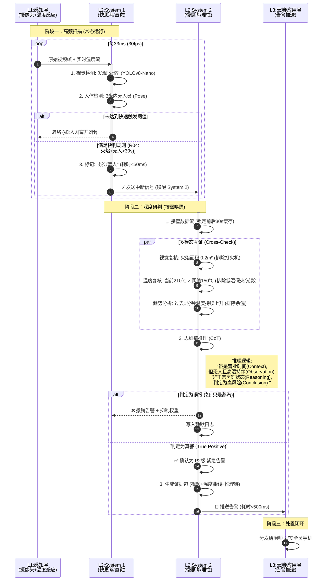
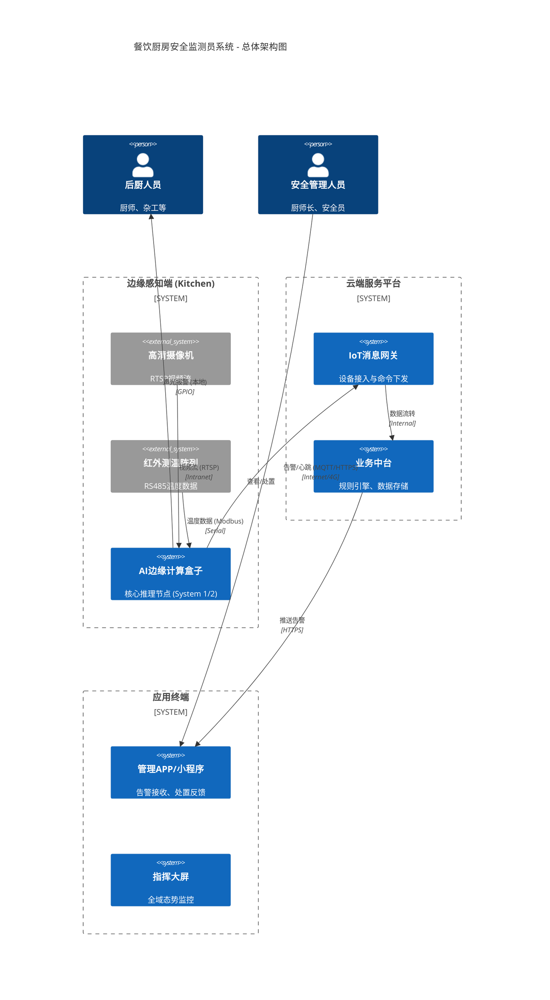
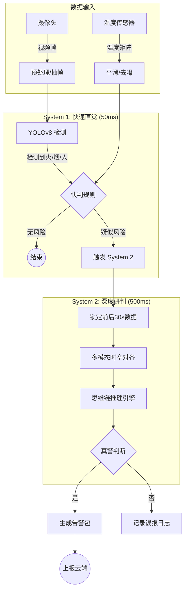
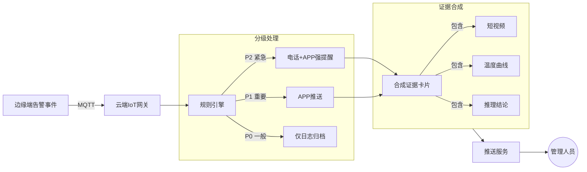
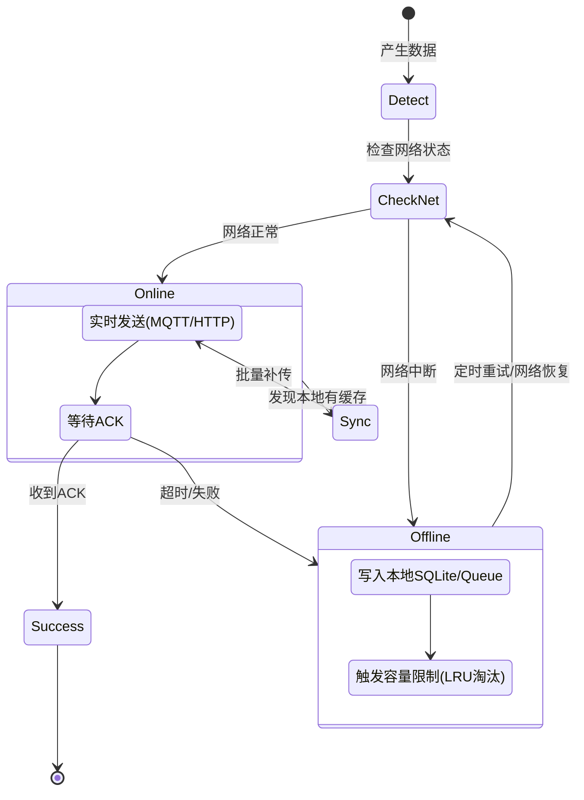
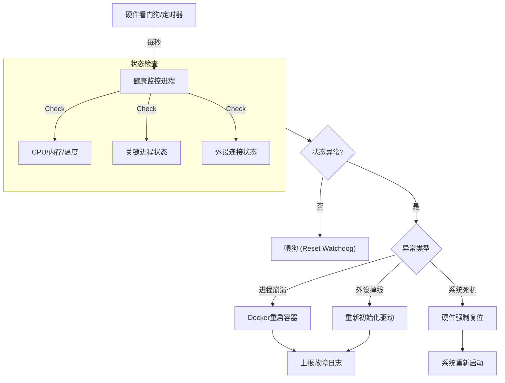

## 可行性报告

### 多模态感知能力

#### 需求描述
系统需构建全方位的感知网，具备对餐饮厨房场景下多种异常行为及环境风险的精准检测能力。具体检测目标包括：
*   **环境风险**：明火、烟雾、老鼠（鼠患）。
*   **合规检测**：厨师帽/厨师服穿戴识别。
*   **行为异常**：抽烟、打电话、跌倒。
*   **管理缺失**：人员离岗监测（关键岗位无人）。

#### 可行性结论
**完全可行**。

#### 关键依据与技术说明
*   **算法覆盖度验证**：经核查《锐景 AI-BOX 产品介绍》，该硬件平台已内置支持 **160+ 种算法**，能够完全覆盖上述所有核心业务场景，大大降低了算法从零开发的风险与成本。
*   **长尾场景扩展**：对于现有算法库未覆盖的特定场景或长尾需求，系统架构支持集成 **YOLOv8** (视觉检测) 与 **YAMNet** (音频检测) 等主流开源模型。利用项目积累的自有数据进行微调训练（Fine-tuning），可确保感知能力的持续迭代与场景适配。

---

### 实时推理能力

#### 需求描述
解决传统安防监控系统长期存在的痛点——**“快而不准”**（误报率高）或**“准而不快”**（延迟高）。系统需要在毫秒级时间内识别风险，同时通过深度研判过滤误报。

#### 可行性结论
**完全可行**（System 1） / **技术可行**（System 2）。

#### 关键依据与技术说明
*   **双系统架构设计**：采用类脑架构，System 1 (直觉) 负责快速反应，System 2 (理性) 负责深度研判。
*   **System 1 实现**：基于锐景 AI 盒子内置的基础规则引擎即可实现，延迟控制在 **50ms** 以内。
*   **System 2 实现**：当前边缘端硬件（如 Jetson Orin）算力完全满足多模态大模型的推理需求。若对实时性有极致要求（&lt;100ms），需进行 TensorRT 算子级深度优化。
*   **工作流演示**：

---

### 智能告警能力

#### 需求描述
告警系统需具备智能化分级处理能力，避免“狼来了”效应。核心要求包括：
*   **分级推送**：根据风险等级（P0/P1/P2）采用不同的通知触达方式。
*   **证据完备**：告警必须包含“视频切片+温度曲线+推理结论”的完整证据包，而非简单的文本通知。

#### 可行性结论
**100% 可行**（属于成熟软件工程范畴）。

#### 关键依据与技术说明
*   **分级规则链**：通过软件逻辑定义规则链（Rule Chain）。例如，P2级（明火）触发电话语音+APP弹窗强提醒，P0级（轻微违规）仅记录日志。
*   **时间窗口聚合**：在应用层实现时间窗口聚合（Time-Window Aggregation）技术，确保抓拍的视觉图像与当时的传感器数值在毫秒级时间戳上严格对齐。
*   **解耦架构**：边缘设备通过 MQTT 发送包含图片 URL 和元数据的标准 JSON 包至中台服务，由中台根据通讯录进行统一分发，实现软硬件解耦。

---

### 数据上报能力

#### 需求描述
确保在复杂的网络环境下（如弱网、断网），边缘端数据能稳定、高效地传输至云端平台。核心要求包括结构化数据交互、断点续传及低带宽优化。

#### 可行性结论
**100% 可行**（基于成熟物联网协议栈）。

#### 关键依据与技术说明
*   **标准化接口**：利用锐景盒子支持的 HTTP 接口与流推理框架，输出标准化 JSON 数据。
*   **断点续传机制**：利用边缘设备的本地存储 (eMMC/SSD) 建立缓冲池。网络中断时数据写入本地 SQLite 或 MQTT Persistence 队列，网络恢复后自动同步，保障数据零丢失。
*   **带宽优化策略**：启用 H.265 硬件编码（节省50%带宽）。常态下仅上报关键帧或 KB 级数据，仅在告警触发时上报 MB 级证据包。

---

### 自我监测能力

#### 需求描述
系统需具备“自知之明”，能够实时监控自身的软硬件健康状态，并在出现异常时自动恢复，实现无人值守的高可用性（HA）。

#### 可行性结论
**100% 可行**（硬件原生支持 + 容器化技术）。

#### 关键依据与技术说明
*   **硬件接口验证**：验证显示锐景 AI-BOX 已通过底层驱动暴露了 CPU 温度、内存占用率、GPU/NPU 利用率等接口，可直接读取并在仪表盘展示。
*   **软件自愈机制**：基于 Docker 容器化部署，配置 `--restart=always` 策略，实现服务崩溃后的自动拉起。
*   **硬件看门狗**：利用工业级硬件看门狗 (Watchdog) 机制，在系统死机或无响应时强制复位重启。

---

## 技术方案

### 系统总体架构

本系统采用“端-边-云”分层架构，通过边缘计算实现实时感知，云端平台实现统一管理与数据汇聚。

### 核心组件工作流程

#### 边缘感知与推理引擎

融合视觉与温度数据的双系统推理流程，System 1 负责快速初筛，System 2 负责深度多模态研判。

#### 智能告警与分发服务

确保告警准确分级并送达责任人，包含完整的证据链。

#### 数据上报与断网续传

保障弱网环境下的数据完整性，采用本地缓存与自动同步机制。

#### 设备自我监测与自愈

实现无人值守的高可用运行，结合硬件看门狗与软件进程守护。

---

## 人员配置及成本估算

### 人员配置计划

鉴于边缘 AI 盒子已内置大部分所需算法（如火灾检测、人员检测等），本项目**无需专职 AI 算法工程师**进行模型训练。后端与嵌入式开发人员重点关注接口对接与业务逻辑实现。

| 角色 | 人数 | 职责描述 | 投入时间 |
| :--- | :--- | :--- | :--- |
| **项目经理 (PM)** | 1 | 项目整体统筹、需求确认、进度管理及风险控制 | 全程 |
| **AI 应用工程师** | 1 | 负责 System 2 部分的 Agent/RAG 系统开发、测试及多模态推理逻辑实现 | 3个月 |
| **嵌入式工程师** | 1 | 负责 AI-BOX 系统裁剪、算法接口对接、驱动适配及 OTA 开发 | 3个月 |
| **后端开发工程师** | 1 | 负责 IoT 消息网关、规则引擎、数据库设计及算法结果数据的标准化对接 | 3个月 |
| **前端开发工程师** | 1 | 负责管理端 Dashboard 大屏及移动端小程序/APP 开发 | 2个月 |
| **测试工程师** | 1 | 负责软硬件功能测试、现场环境模拟测试及压力测试 | 2个月 |

### 成本估算

#### 研发人力成本估算
*注：按行业平均人月成本核算（仅供参考）*
*   总投入工作量：约 13 人月 (新增 Agent 开发工作量)
*   预计人力总成本：**¥ 350,000 - ¥ 450,000**

#### 云资源与运维成本
*   **云服务器 (ECS)**: 4核 8G, 5M 带宽 - 约 ¥ 600/月
*   **云数据库 (RDS)**: MySQL 高可用版 - 约 ¥ 500/月
*   **对象存储 (OSS)**: 告警视频存储 (按量) - 约 ¥ 200/月
*   **年运维成本**: 约 **¥ 15,600 / 年**

---

## 项目里程碑时间节点估算

项目预计从启动到MVP版本交付共需约 **14周 (约3.5个月)**。

| 阶段 | 关键里程碑 | 时间节点 (T为启动周) | 交付物 |
| :--- | :--- | :--- | :--- |
| **阶段一：方案与准备** | 需求定稿与架构冻结 | T+3周 | 《PRD需求文档》、《系统架构设计书》 |
| | 硬件选型与采购到位 | T+4周 | AI盒子、摄像头、传感器到位 |
| **阶段二：核心研发** | 边缘端推理Demo跑通 | T+8周 | 边缘盒子可识别火/人，并输出日志 |
| | 业务中台与APP MVP版 | T+10周 | 告警数据链路上云，手机端可接收 |
| | Agent/RAG 原型验证 | T+10周 | System 2 完成初步多模态逻辑验证 |
| **阶段三：集成与测试** | 软硬件全链路联调 | T+12周 | 模拟场景下“感-算-传-用”闭环 |
| **阶段四：交付** | 试点厨房部署验收 | T+14周 | 现场部署运行，验收报告签字 |

---

## 附录：风险等级定义

| 风险等级 | 等级说明 | 推送对象 |
| :--- | :--- | :--- |
| **P0** | 低 (Low) | 数智消防官、数智主管、厨师长、安全员、值班经理 |
| **P1** | 中 (Medium) | 数智主管、厨师长、安全员 |
| **P2** | 高 (High) | 数智主管、安全员 |
