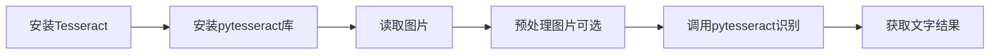
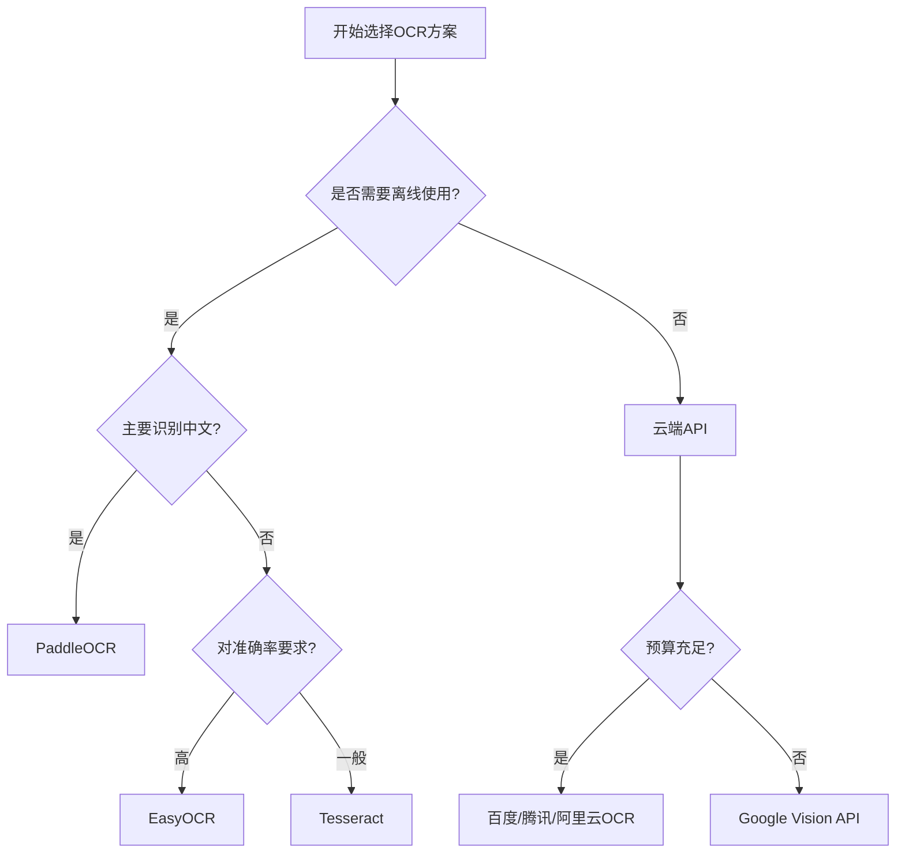

# Python OCR方案

Python中识别图片文字（OCR - Optical Character Recognition，光学字符识别）的主流解决方案。

## 方案对比

| 方案 | 优点 | 缺点 | 适用场景 |
|------|------|------|----------|
| **Tesseract OCR** | 完全免费开源<br/>支持100+种语言<br/>社区活跃 | 对复杂背景识别效果一般<br/>需要额外安装引擎 | 简单场景、成熟稳定需求 |
| **EasyOCR** | 安装简单<br/>支持80+种语言<br/>准确率高 | 首次下载模型较大<br/>运行速度较慢<br/>占用内存多 | 多语言支持、复杂场景 |
| **PaddleOCR** | 中文识别准确率高<br/>支持多种场景<br/>提供轻量级模型 | 主要针对中文优化<br/>文档主要是中文 | 中文为主的场景 |
| **云端API** | 准确率最高<br/>无需本地计算资源<br/>支持复杂场景 | 需要网络连接<br/>通常需要付费<br/>数据隐私问题 | 高准确率要求、有预算 |

## 1. Tesseract OCR

### 安装

```bash
# Windows: 下载安装包
# https://github.com/UB-Mannheim/tesseract/wiki

# Linux
sudo apt-get install tesseract-ocr tesseract-ocr-chi-sim

# Mac
brew install tesseract tesseract-lang

# Python库
pip install pytesseract pillow
```

### 基本使用

```python
import pytesseract
from PIL import Image

# Windows需要设置Tesseract路径
# pytesseract.pytesseract.tesseract_cmd = r'C:\Program Files\Tesseract-OCR\tesseract.exe'

# 读取图片
image = Image.open('image.png')

# 识别中文
text = pytesseract.image_to_string(image, lang='chi_sim')
print(text)

# 识别中英文混合
text = pytesseract.image_to_string(image, lang='chi_sim+eng')
print(text)
```

### 工作流程



## 2. EasyOCR

### 安装

```bash
pip install easyocr
```

### 基本使用

```python
import easyocr

# 初始化读取器（支持中英文）
reader = easyocr.Reader(['ch_sim', 'en'])

# 读取图片
result = reader.readtext('image.png')

# 输出结果
for detection in result:
    bbox, text, confidence = detection
    print(f"文字: {text}, 置信度: {confidence}")
```

## 3. PaddleOCR

### 安装

```bash
pip install paddleocr
```

### 基本使用

```python
from paddleocr import PaddleOCR

# 初始化OCR
ocr = PaddleOCR(use_angle_cls=True, lang='ch')

# 识别图片
result = ocr.ocr('image.png', cls=True)

# 输出结果
for line in result:
    for word_info in line:
        print(word_info[1][0])  # 文字内容
```

## 4. 云端API服务

### 百度OCR示例

```bash
pip install baidu-aip
```

```python
from aip import AipOcr

APP_ID = 'your_app_id'
API_KEY = 'your_api_key'
SECRET_KEY = 'your_secret_key'

client = AipOcr(APP_ID, API_KEY, SECRET_KEY)

# 读取图片
with open('image.png', 'rb') as f:
    image = f.read()

# 调用通用文字识别
result = client.basicGeneral(image)
print(result)
```

### 其他云端服务

- **腾讯云OCR**
- **阿里云OCR**
- **Azure Computer Vision**
- **Google Vision API**

## 图像预处理

无论使用哪种OCR方案,图像预处理都能显著提升识别准确率。

```python
import cv2
import numpy as np

# 读取图片
image = cv2.imread('image.png')

# 灰度化
gray = cv2.cvtColor(image, cv2.COLOR_BGR2GRAY)

# 二值化
_, binary = cv2.threshold(gray, 127, 255, cv2.THRESH_BINARY)

# 降噪
denoised = cv2.fastNlMeansDenoising(binary)

# 调整对比度
alpha = 1.5  # 对比度
beta = 0     # 亮度
adjusted = cv2.convertScaleAbs(denoised, alpha=alpha, beta=beta)

# 保存预处理后的图片
cv2.imwrite('processed.png', adjusted)
```

### 常用预处理技术

- **灰度化**: 减少颜色信息,提高处理速度
- **二值化**: 将图像转换为黑白,突出文字
- **降噪**: 去除图像噪点
- **对比度调整**: 增强文字与背景的区分度
- **倾斜校正**: 矫正图片角度
- **边缘检测**: 提取文字轮廓

## 技术选型决策树



## 选型建议

- **简单场景 + 中文为主** → PaddleOCR
- **多语言支持** → EasyOCR
- **开源免费 + 成熟稳定** → Tesseract
- **高准确率 + 有预算** → 云端API服务
- **实时性要求高** → Tesseract (最快)
- **复杂背景/手写体** → EasyOCR 或 云端API

## 性能对比

| 指标 | Tesseract | EasyOCR | PaddleOCR | 云端API |
|------|-----------|---------|-----------|---------|
| **速度** | ⭐⭐⭐⭐⭐ | ⭐⭐⭐ | ⭐⭐⭐⭐ | ⭐⭐⭐ |
| **准确率** | ⭐⭐⭐ | ⭐⭐⭐⭐ | ⭐⭐⭐⭐ | ⭐⭐⭐⭐⭐ |
| **中文支持** | ⭐⭐⭐ | ⭐⭐⭐⭐ | ⭐⭐⭐⭐⭐ | ⭐⭐⭐⭐⭐ |
| **安装难度** | ⭐⭐ | ⭐⭐⭐⭐ | ⭐⭐⭐⭐ | ⭐⭐⭐⭐⭐ |
| **资源占用** | ⭐⭐⭐⭐⭐ | ⭐⭐ | ⭐⭐⭐ | ⭐⭐⭐⭐⭐ |
| **成本** | 免费 | 免费 | 免费 | 付费 |

