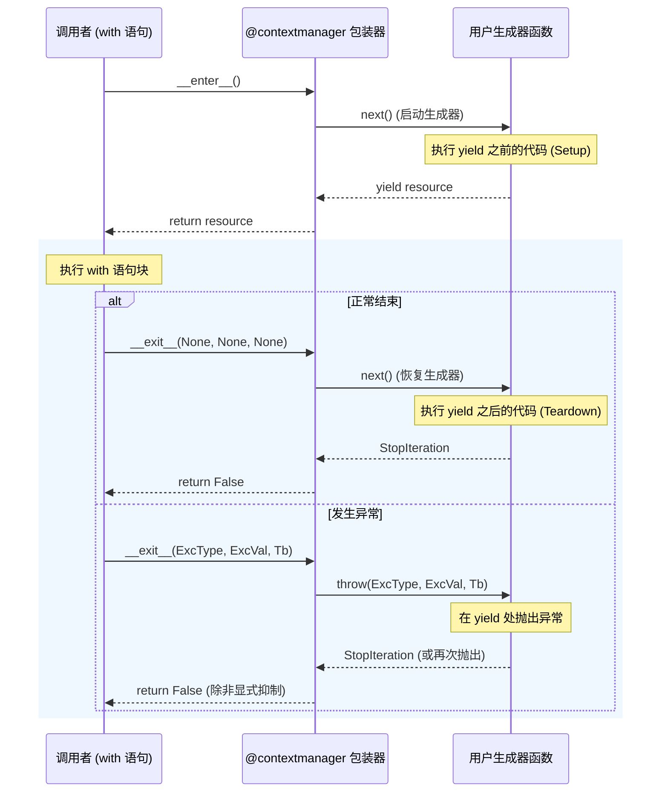
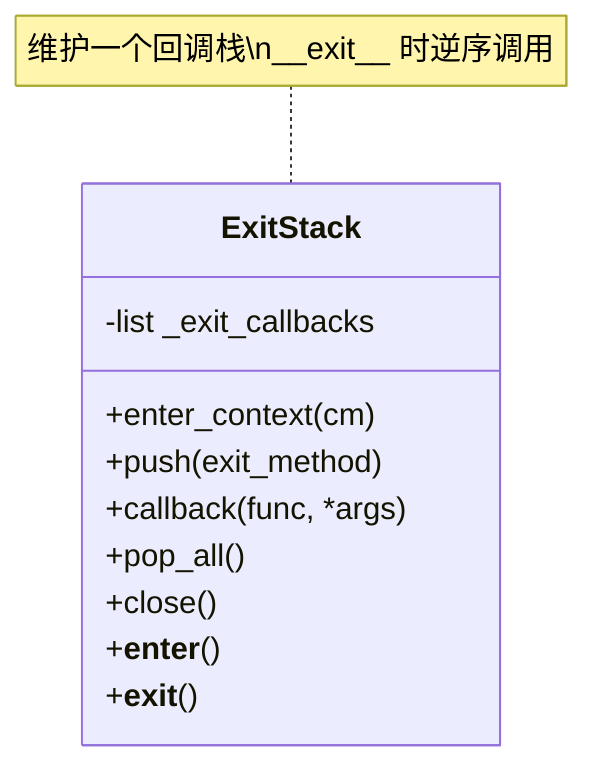

## 1. 概述 (Overview)

`contextlib` 是 Python 标准库中用于增强 `with` 语句功能的实用模块。它不仅提供了创建上下文管理器（Context Manager）的声明式工具，还包含了一系列用于资源管理、异常处理和重定向的高级抽象。

在 Python 编程中，上下文管理器是实现“资源获取即初始化”（RAII, Resource Acquisition Is Initialization）模式的核心机制。`contextlib` 通过简化上下文管理器的编写（如 `@contextmanager`）和提供组合式管理工具（如 `ExitStack`），极大地提升了代码的健壮性与可读性。

## 2. 核心协议与底层机制 (Core Protocol & Internals)

理解 `contextlib` 的前提是掌握 Python 的上下文管理协议。任何实现了 `__enter__` 和 `__exit__` 方法的对象均可被视为上下文管理器。

### 2.1 协议定义

*   **`__enter__(self)`**: 进入上下文时调用。返回值会被赋值给 `as` 后的变量。
*   **`__exit__(self, exc_type, exc_value, traceback)`**: 退出上下文时调用。
    *   若无异常，三个参数均为 `None`。
    *   若有异常，参数为异常信息。
    *   返回 `True` 表示异常已被处理（抑制），返回 `False` 或 `None` 则异常会向外传播。

### 2.2 `@contextmanager` 装饰器原理

`contextlib.contextmanager` 是该模块最常用的工具，它允许将一个生成器（Generator）函数转换为上下文管理器，免去了编写类的繁琐。

#### 执行流程图



#### 实现细节
该装饰器将生成器函数包装在一个实现了 `__enter__` 和 `__exit__` 的类（`_GeneratorContextManager`）中：
1.  **`__enter__`**: 调用 `next(generator)`，获取 `yield` 的值并返回。
2.  **`__exit__`**:
    *   如果有异常，通过 `generator.throw()` 将异常注入到生成器内部的 `yield` 处。
    *   如果无异常，调用 `next(generator)` 继续执行清理代码。

## 3. 常用工具详解 (Utilities)

### 3.1 资源管理
*   **`closing(thing)`**: 为没有实现上下文协议但有 `close()` 方法的对象（如 `urllib.urlopen` 返回的对象）创建上下文。
    ```python
    from contextlib import closing
    from urllib.request import urlopen

    with closing(urlopen('https://www.python.org')) as page:
        for line in page:
            print(line)
    # page.close() 会被自动调用
    ```

*   **`nullcontext(enter_result=None)`**: 一个“空”上下文管理器，什么都不做。常用于条件式上下文管理。
    ```python
    from contextlib import nullcontext

    ctx = open('file.txt') if use_file else nullcontext()
    with ctx as f:
        pass # f 可能是文件对象，也可能是 None
    ```

### 3.2 异常处理
*   **`suppress(*exceptions)`**: 显式抑制指定类型的异常。替代冗长的 `try-except-pass` 结构。
    ```python
    from contextlib import suppress
    import os

    with suppress(FileNotFoundError):
        os.remove('somefile.tmp')
    ```

### 3.3 流重定向
*   **`redirect_stdout(new_target)`** / **`redirect_stderr(new_target)`**: 临时将标准输出/错误重定向到文件或类文件对象。
    ```python
    from contextlib import redirect_stdout
    import io

    f = io.StringIO()
    with redirect_stdout(f):
        print('foobar')
    assert f.getvalue() == 'foobar\n'
    ```

## 4. 高级模式：动态上下文栈 (ExitStack)

`ExitStack` 是 `contextlib` 中最强大的工具，用于程序化地管理动态数量的上下文管理器。它解决了“如何在一个 `with` 语句中管理未知数量的资源”这一难题。

### 4.1 核心特性
*   **LIFO 顺序**: 像栈一样，后进入的上下文先退出。
*   **异常合并**: 正确处理多层上下文中的异常传播和抑制。
*   **灵活注册**: 支持 `enter_context` (完整进入), `push` (仅注册清理), `callback` (注册任意回调)。

### 4.2 典型应用场景：批量文件打开

```python
from contextlib import ExitStack

def process_files(filenames):
    with ExitStack() as stack:
        # 动态打开多个文件
        files = [stack.enter_context(open(fname)) for fname in filenames]
        
        # 此时所有文件都已打开。
        # 如果中间发生异常，ExitStack 会自动关闭已打开的文件。
        
        for f in files:
            process(f)
```

### 4.3 架构示意



## 5. 混合模式：ContextDecorator

`ContextDecorator` 是一个基类，允许定义既可以用作 `with` 语句，又可以用作函数装饰器的上下文管理器。

```python
from contextlib import ContextDecorator

class mycontext(ContextDecorator):
    def __enter__(self):
        print('Starting')
        return self
    def __exit__(self, *exc):
        print('Finishing')
        return False

@mycontext()
def function():
    print('The bit in the middle')

function()
# 输出:
# Starting
# The bit in the middle
# Finishing
```

**注意**: 当用作装饰器时，`__enter__` 的返回值无法被函数内部获取。

## 6. 异步支持 (Async Context Managers)

自 Python 3.7 起，`contextlib` 增加了对异步编程的支持：

*   **`AbstractAsyncContextManager`**: 异步上下文管理器基类，需实现 `__aenter__` 和 `__aexit__`。
*   **`@asynccontextmanager`**: 对应 `@contextmanager` 的异步版本，用于装饰 `async def` 生成器。
*   **`AsyncExitStack`**: 对应 `ExitStack` 的异步版本，支持管理异步和同步上下文管理器。

```python
from contextlib import asynccontextmanager

@asynccontextmanager
async def get_connection():
    conn = await create_db_connection()
    try:
        yield conn
    finally:
        await conn.close()

async def main():
    async with get_connection() as conn:
        await conn.execute("SELECT * ...")
```

## 7. 参考资料 (References)

1.  **Python Official Documentation**: [contextlib — Utilities for with-statement contexts](https://docs.python.org/3/library/contextlib.html)
2.  **PEP 343**: [The "with" Statement](https://peps.python.org/pep-0343/)
3.  **Real Python**: [Python's with Statement: Manage External Resources Safely](https://realpython.com/python-with-statement/)
4.  **PyMOTW-3**: [contextlib — Context Manager Utilities](https://pymotw.com/3/contextlib/)
