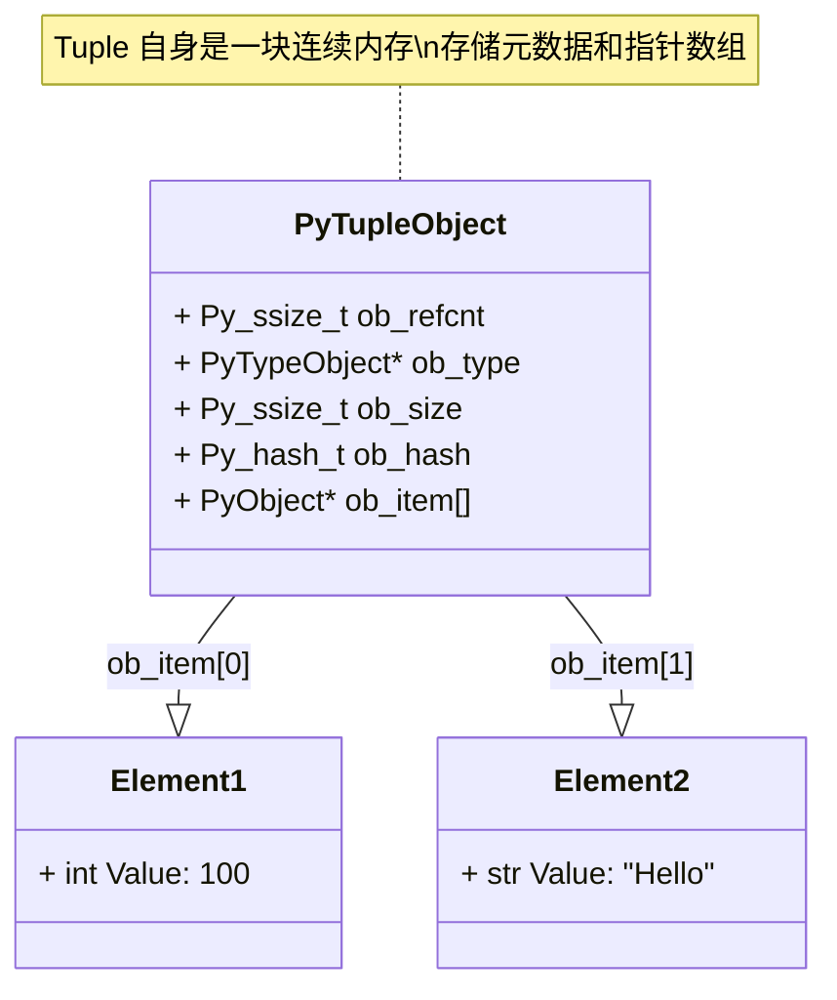

## 1. 概述 (Overview)

Tuple（元组）是 Python 中一种内置的**不可变（Immutable）**序列类型。与 List（列表）不同，Tuple 一旦创建，其长度和元素引用都无法被修改。这种特性使其在多线程安全、哈希键值（如字典 Key）、函数多返回值等场景中具有独特的优势。

在 CPython 解释器中，Tuple 被实现为一段连续的内存块，其头部包含基础元数据，随后紧接着存储指向元素的指针数组。

## 2. 内部结构 (Internal Structure)

在 CPython 源码 (`Include/cpython/tupleobject.h`) 中，Tuple 由 `PyTupleObject` 结构体表示。

### 2.1 C 结构体定义

```c
typedef struct {
    PyObject_VAR_HEAD
    /* Cached hash. Initially set to -1. */
    Py_hash_t ob_hash;
    /* ob_item contains space for 'ob_size' elements.
       Items must normally not be NULL. */
    PyObject *ob_item[1];
} PyTupleObject;
```

### 2.2 字段解析

*   **`PyObject_VAR_HEAD`**:
    *   **`ob_refcnt`**: 引用计数，用于垃圾回收。
    *   **`ob_type`**: 指向 `PyTuple_Type`，标识对象类型。
    *   **`ob_size`**: 元组中元素的数量（即长度）。
*   **`ob_hash`**: 缓存的哈希值。
    *   Tuple 是不可变的，因此其哈希值只需计算一次。
    *   初始值为 `-1` (未计算)。
    *   这也是 Tuple 比 List 更适合作为字典键的原因之一（List 不可哈希）。
*   **`ob_item`**: 指向元素的指针数组。
    *   虽然声明为 `ob_item[1]`，但实际分配内存时会根据 `ob_size` 申请连续空间（Flexible Array Member 模式）。
    *   这里存储的是指向 Python 对象（`PyObject*`）的指针，而非对象本身。

### 2.3 内存布局示意图 (Memory Layout)



## 3. 不可变性 (Immutability)

Tuple 的不可变性体现在两个层面：
1.  **长度固定**：`PyTupleObject` 创建后，没有类似 List 的 `realloc` 机制来动态扩容。
2.  **引用固定**：`ob_item` 数组中的指针一旦赋值，不可更改。

**注意**：不可变性指的是 Tuple 持有的**引用（指针）**不可变。如果 Tuple 指向的一个对象是可变的（如 List），那么这个 List 内部的内容是可以被修改的。

```python
t = (1, [2, 3])
# t[0] = 2       # TypeError: tuple object does not support item assignment
t[1].append(4)   # 合法！修改了 t[1] 指向的对象内部数据
print(t)         # (1, [2, 3, 4])
```

## 4. 内存管理与优化 (Memory Management)

为了提高性能，CPython 对小元组使用了**空闲列表（Free List）**缓存机制。

### 4.1 Free List 机制
当一个 Tuple 被垃圾回收时，如果其长度较小（< 20），它不会立即释放内存给操作系统，而是被放入一个空闲列表。下次需要创建同长度的 Tuple 时，直接从列表中复用这块内存，避免了频繁的 `malloc/free` 开销。

*   **`PyTuple_MAXSAVESIZE`**: 20。只有长度 < 20 的元组会被缓存。
*   **`PyTuple_MAXFREELIST`**: 2000。每种长度的空闲列表中最多缓存 2000 个元组对象。

### 4.2 性能对比 (Tuple vs List)

| 特性 | Tuple | List |
| :--- | :--- | :--- |
| **内存占用** | **更小**。无需存储 `allocated` 容量，结构体头部更紧凑。 | **较大**。需存储 `allocated` 容量，且通常会预分配额外空间以支持 O(1) append。 |
| **创建速度** | **更快**。Free List 机制加速了小对象的创建；由字节码 `BUILD_TUPLE` 直接构建。 | 相对较慢。涉及多次内存分配和初始化。 |
| **扩容** | 不支持。 | 支持（摊销 O(1)）。 |

## 5. 哈希机制 (Hashing)

Tuple 只有当其所有元素都是可哈希（Hashable）时，它自身才是可哈希的。

*   **计算方式**：基于内容的哈希。算法会组合所有元素的哈希值（通常使用类似多项式滚动哈希的算法），并引入长度等因子以减少冲突。
*   **缓存 (`ob_hash`)**：
    *   首次调用 `hash(t)` 时计算，并将结果存入 `ob_hash`。
    *   后续调用直接返回 `ob_hash`，时间复杂度为 O(1)。
    *   如果 Tuple 中包含不可哈希元素（如 List），调用 `hash()` 会抛出 `TypeError`。

```python
t1 = (1, 2)
print(hash(t1))  # 首次计算并缓存

t2 = (1, [2])
# print(hash(t2)) # TypeError: unhashable type: 'list'
```

## 6. 类型系统中的应用 (Typing)

在 Python 的类型提示（Type Hints）中，Tuple 有两种常见的表达方式：

### 6.1 固定长度 Tuple
明确指定每个位置的元素类型。
```python
from typing import Tuple

# 表示一个包含两个元素的元组：第一个是 int，第二个是 str
point: Tuple[int, str] = (10, "A")
```

### 6.2 变长同构 Tuple
表示长度不限，但所有元素类型相同。
```python
# 表示一个包含任意数量 int 的元组
numbers: Tuple[int, ...] = (1, 2, 3, 4, 5)
```

> **注**：在 Python 3.9+ 中，可以直接使用内置类型 `tuple` 代替 `typing.Tuple`（即 `tuple[int, str]`）。

## 参考资料 (References)

1.  [CPython Source Code: tupleobject.h](https://github.com/python/cpython/blob/main/Include/cpython/tupleobject.h)
2.  [How is tuple implemented in CPython? - Stack Overflow](https://stackoverflow.com/questions/14135542/how-is-tuple-implemented-in-cpython)
3.  [CPython Internals: Tuple Implementation](https://github.com/zpoint/CPython-Internals/blob/master/BasicObject/tuple/tuple.md)
