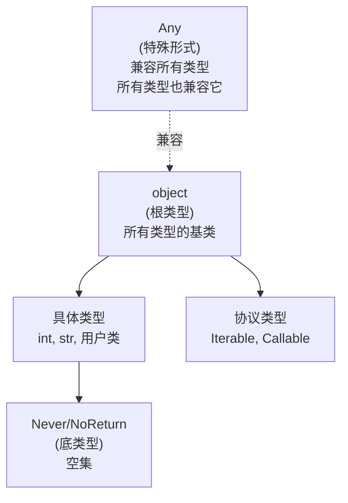

## 1. 概述 (Introduction)

Python 的类型系统是**渐进式 (Gradual Typing)** 的。这意味着 Python 允许程序中部分代码是动态类型的（默认行为），而部分代码是静态类型的（通过类型提示）。`typing` 模块是这一体系的核心，提供了构建复杂类型签名的词汇表。

与 Java 或 C++ 等静态语言不同，Python 的类型注解**不会影响运行时行为**（除了极少数例外，如 `dataclasses` 或 `singledispatch`）。它们主要用于：
1.  **静态分析**：供 `mypy`、`pyright` 等工具在代码运行前捕获错误。
2.  **IDE 支持**：提供更精准的代码补全和重构建议。
3.  **文档化**：作为机器可读的文档。

## 2. 类型系统架构 (Type System Architecture)

Python 的类型层级结构具有独特的“双顶端”特性。



*   **`Any`**: 既是所有类型的子类型（Subtype），也是所有类型的父类型（Supertype）。它是静态类型检查的“逃生舱”，任何对象都可以赋值给 `Any`，`Any` 也可以赋值给任何对象。
*   **`object`**: 真正的类层级顶端。所有类型都是 `object` 的子类。但 `object` 不能赋值给具体的类型（如 `int`）。
*   **`Never` (或 `NoReturn`)**: 底类型（Bottom Type）。没有任何值属于此类型，通常用于表示不可达代码或死循环函数的返回值。

## 3. 泛型与变变性 (Generics & Variance)

泛型允许定义关于类型参数的类或函数。理解泛型的核心在于理解**变变性 (Variance)**，即复合类型的子类型关系如何随其组件类型的子类型关系变化。

假设 `Cat` 是 `Animal` 的子类 (`Cat <: Animal`)：

### 3.1 变变性分类

| 类型 | 描述 | 数学符号 | 示例 |
| :--- | :--- | :--- | :--- |
| **协变 (Covariant)** | 保持子类型关系 | $T <: U \implies C[T] <: C[U]$ | `Sequence[Cat] <: Sequence[Animal]` (只读容器通常是协变的) |
| **逆变 (Contravariant)** | 翻转子类型关系 | $T <: U \implies C[U] <: C[T]$ | `Callable[[Animal], None] <: Callable[[Cat], None]` (函数参数通常是逆变的) |
| **不变 (Invariant)** | 无子类型关系 | $T <: U \nRightarrow C[T] \sim C[U]$ | `List[Cat]` 与 `List[Animal]` 互不兼容 (可变容器必须是不变的) |

### 3.2 定义泛型 (Python 3.12+ Syntax)

Python 3.12 引入了 **PEP 695**，大大简化了泛型语法。

```python
# 旧语法 (Pre-3.12)
from typing import TypeVar, Generic, Sequence

T = TypeVar("T")  # 默认为 Invariant
class Stack(Generic[T]):
    def push(self, item: T) -> None: ...

# 新语法 (Python 3.12+)
class Stack[T]:  # 自动推断 variance
    def push(self, item: T) -> None: ...

# 定义协变泛型 (只读)
class ReadOnlyBox[T]: 
    # 如果仅作为返回值，T 会被自动推断为协变
    def get(self) -> T: ... 
```

### 3.3 显式控制 Variance (旧语法)

```python
from typing import TypeVar

T_co = TypeVar("T_co", covariant=True)      # 协变
T_contra = TypeVar("T_contra", contravariant=True) # 逆变

class Producer(Generic[T_co]): ...          # 只出不进
class Consumer(Generic[T_contra]): ...      # 只进不出
```

## 4. 结构化子类型 (Structural Subtyping / Protocols)

Python 传统上使用“鸭子类型” (Duck Typing)。`typing.Protocol` 将这种动态概念引入了静态类型系统，称为**结构化子类型 (Structural Subtyping)**。

与名义子类型 (Nominal Subtyping, 如继承) 不同，结构化子类型只关心“它有什么方法/属性”，而不关心“它继承自谁”。

```python
from typing import Protocol, runtime_checkable

@runtime_checkable
class Renderable(Protocol):
    """定义一个协议：任何具有 render 方法并返回 str 的类都满足此协议"""
    def render(self) -> str: ...

class Report:
    # 不需要继承 Renderable
    def render(self) -> str:
        return "Report Content"

def display(item: Renderable):
    print(item.render())

display(Report())  # ✅ 通过静态检查
```

*   **`@runtime_checkable`**: 允许在运行时使用 `isinstance(obj, Renderable)`。默认情况下，Protocol 仅用于静态分析。

## 5. 高级类型构造 (Advanced Type Constructors)

### 5.1 `Annotated`
用于附加元数据，这些元数据会被类型检查器忽略，但可供运行时框架（如 FastAPI, Pydantic）使用。

```python
from typing import Annotated

# "Metadata" 对类型检查器不可见，但库可以读取它进行验证
Age = Annotated[int, "必须大于0", "小于120"]
```

### 5.2 `TypeVarTuple` (Variadic Generics)
用于处理不定数量的类型参数，常见于张量库（如 PyTorch, TensorFlow）或类似 `zip` 的函数。

```python
from typing import TypeVarTuple, Unpack

Ts = TypeVarTuple("Ts")

def move_first_to_last(tup: tuple[int, Unpack[Ts]]) -> tuple[Unpack[Ts], int]:
    return (*tup[1:], tup[0])
```

### 5.3 `ParamSpec`
用于精确保留被装饰函数的参数签名。这是编写装饰器时的最佳实践。

```python
from typing import Callable, TypeVar, ParamSpec

P = ParamSpec("P")
R = TypeVar("R")

def logging_decorator(func: Callable[P, R]) -> Callable[P, R]:
    def wrapper(*args: P.args, **kwargs: P.kwargs) -> R:
        print("Calling...")
        return func(*args, **kwargs)
    return wrapper
```

## 6. 类型字典与字面量 (TypedDict & Literal)

### 6.1 `TypedDict`
用于为字典提供结构化类型提示，适用于处理 JSON 数据。支持 `total=False` (所有键可选) 或使用 `Required`/`NotRequired` (Python 3.11+)。

```python
from typing import TypedDict, NotRequired

class Movie(TypedDict):
    title: str
    year: int
    rating: NotRequired[float]  # 该键可以不存在

m: Movie = {"title": "Matrix", "year": 1999}  # ✅ OK
```

### 6.2 `Literal`
限制变量只能是特定的字面值。

```python
from typing import Literal

def open_file(mode: Literal['r', 'w', 'rb', 'wb']) -> None: ...

open_file('r')    # ✅ OK
open_file('rw')   # ❌ Type Error
```

## 7. 最佳实践 (Best Practices)

1.  **优先使用内置集合类型** (Python 3.9+): 使用 `list[int]` 而非 `List[int]`，使用 `dict[str, int]` 而非 `Dict`。
2.  **新语法优先**: 在 Python 3.10+ 中使用 `X | Y` 代替 `Union[X, Y]`。
3.  **配置严格模式**: `mypy` 默认较为宽松。建议开启 `--strict` 或至少 `--disallow-untyped-defs` 以获得真正的类型安全收益。
4.  **避免过度使用 `Any`**: 每当你使用 `Any`，你就关闭了那一部分代码的类型检查。如果不知道类型，考虑使用 `object` (只读) 或泛型。
5.  **使用 `Self`**: 在返回自身实例的方法（如构建器模式）中使用 `Self` 类型 (Python 3.11+)，这比使用 TypeVar 绑定更简洁。

## 参考资料

1.  [Python 3.14.2 Documentation - typing](https://docs.python.org/3/library/typing.html)
2.  [Typing Documentation - Generics](https://typing.python.org/en/latest/reference/generics.html)
3.  [Typing Documentation - Protocols](https://typing.python.org/en/latest/spec/protocol.html)
