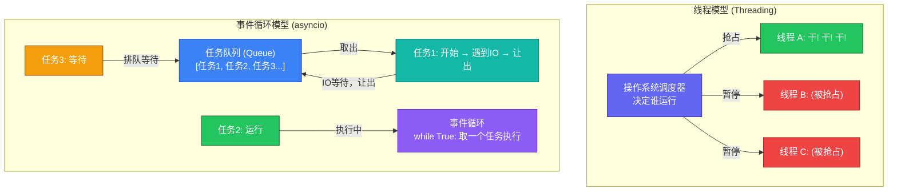
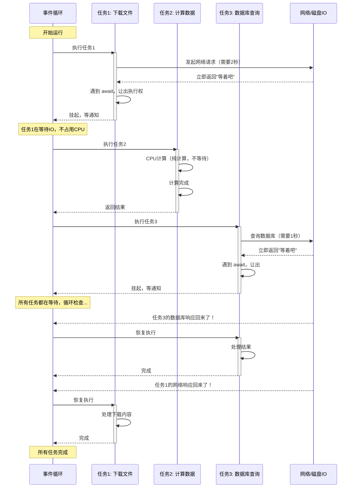
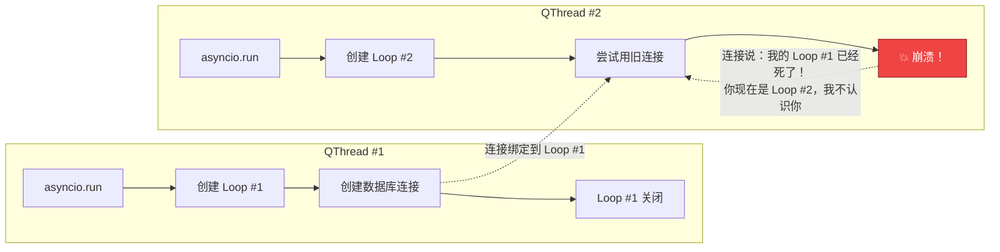

# 从线程到事件循环：一文搞懂 asyncio

> 用你熟悉的线程作为对照，彻底理解什么是事件循环

---

## 一句话概括

> **线程是"抢着干"（抢占式），事件循环是"排着队干"（协作式）**

---

## 直观对比



---

## 餐厅服务员比喻

### 线程模型 = 多服务员多顾客

```
餐厅有3个服务员（3个线程）
每个服务员服务一个顾客（任务）

顾客A: 点菜 → 等菜中（服务员A干等着）
顾客B: 点菜 → 等菜中（服务员B干等着）
顾客C: 点菜 → 等菜中（服务员C干等着）

问题：服务员比顾客多，或者服务员干等浪费资源
```

### 事件循环模型 = 一个超级服务员

```
只有1个服务员（1个线程），但是超高效

顾客A: 点菜 → "好了我叫您" → 服务员去服务B（不等）
顾客B: 点菜 → "好了我叫您" → 服务员去服务C
顾客C: 点菜 → "好了我叫您" → 服务员看看谁菜好了

关键：遇到等待（IO）时，不傻等，先去干别的
```

---

## 代码对比

### 线程版本（你熟悉的）

```python
import threading
import time
import requests

def fetch_url(url):
    # 线程会在这里卡住等待网络响应
    # 操作系统会抢占了去执行别的线程
    response = requests.get(url)  # 阻塞！线程干等
    print(f"Got {len(response.content)} bytes")

# 开3个线程同时下载
urls = ["http://a.com", "http://b.com", "http://c.com"]
for url in urls:
    t = threading.Thread(target=fetch_url, args=(url,))
    t.start()

# 问题：线程切换有开销（保存/恢复上下文）
# 10000个并发 = 开10000个线程？系统要炸了
```

### 事件循环版本（asyncio）

```python
import asyncio
import aiohttp

async def fetch_url(url):
    # 遇到IO时，主动说"我先让出，你们先执行"
    # 网络响应回来后，再回来继续执行
    response = await aiohttp.get(url)  # 非阻塞！让出执行权
    print(f"Got {len(response.content)} bytes")

async def main():
    urls = ["http://a.com", "http://b.com", "http://c.com"]
    # 创建3个任务，但只用1个线程交替执行
    tasks = [fetch_url(url) for url in urls]
    await asyncio.gather(*tasks)  # 同时"等待"所有任务

# 启动事件循环
asyncio.run(main())

# 优势：单线程处理10000个并发，只要内存够
```

---

## 事件循环的核心机制：遇到IO就让出



---

## 核心区别总结

| 特性 | 线程 (Thread) | 事件循环 (Event Loop) |
|------|--------------|---------------------|
| **调度方式** | 操作系统抢占 | 协作式（自己让出） |
| **切换时机** | 操作系统决定 | 遇到 `await` 让出 |
| **并发能力** | 几百-几千（开销大） | 几万-几十万（开销小） |
| **适合场景** | CPU密集型计算 | IO密集型（网络/文件） |
| **编程难度** | 简单（顺序执行） | 较复杂（要加 `async/await`） |
| **数据共享** | 需要锁（Lock） | 单线程，天然安全 |
| **代表** | Java Thread, Python threading | Node.js, Python asyncio, Go goroutine |

---

## 为什么要用事件循环？

### 场景：Web服务器处理10000个并发请求

**线程方案：**
```python
# 开10000个线程？
# 每个线程栈1MB内存 → 10GB内存！
# 线程切换开销巨大，CPU都在切换了，没空处理请求
```

**事件循环方案：**
```python
# 1个线程，10000个任务在队列里排队
# 每个任务只需要保存状态（协程栈），几KB内存
# 总内存几十MB，轻松处理
```

---

## 回到星城模拟器的问题

### 为什么会报错？



**问题本质：**
- 数据库连接是在 **Loop #1** 中创建的，它心里只认 Loop #1
- 第二次你在 **Loop #2** 中想用这个连接
- 连接说：**"我只听 Loop #1 的，Loop #2 你是谁？我不干！"**

就像你请了A公司的服务员，结果A公司倒闭了，你还想找那个服务员，他原公司的工牌已经失效了。

---

## 关键概念速查

### 什么是协程 (Coroutine)？

```python
async def my_func():  # ← 这就是协程函数
    await something()  # ← 这里是"让出点"

# 调用方式
coro = my_func()     # 创建协程对象（不会立即执行）
await coro           # 在事件循环中执行
```

**类比：**
- 线程 = 一个完整的工人（有完整的工作能力）
- 协程 = 一份工作清单（记录做到哪一步了，可以在任何地方暂停/恢复）

### 什么是 `await`？

```python
# await 就是"我这边要等待了，你们先干别的"
result = await some_async_operation()
# ↑ 这里会挂起当前任务，事件循环去执行其他任务
# 等结果回来，再从这里继续
```

**注意：** `await` 后面必须是：
1. 另一个协程 (`async def`)
2. 一个 Future/Task
3. 一个实现了 `__await__` 的对象

### 什么是 `asyncio.run()`？

```python
asyncio.run(main())  # 三件事：
# 1. 创建一个新的事件循环
# 2. 运行 main() 协程直到完成
# 3. 关闭事件循环
```

**关键点：** 每次调用 `asyncio.run()` 都是全新的循环！

---

## 最佳实践

### 1. 不要混用线程和协程

```python
# ❌ 错误：在普通函数里直接 await
def normal_function():
    await async_func()  # SyntaxError！

# ✅ 正确：async 函数里 await
async def async_function():
    await async_func()  # OK

# ✅ 或者使用 asyncio.run()
def normal_function():
    asyncio.run(async_func())  # OK
```

### 2. 不要在协程里用阻塞操作

```python
# ❌ 错误：在 async 函数里用阻塞IO
async def bad():
    requests.get(url)  # 阻塞了整个事件循环！

# ✅ 正确：用异步版本
async def good():
    await aiohttp.get(url)  # 让出，不阻塞
```

### 3. 生命周期管理

```python
# 问题：跨 asyncio.run() 的模块级单例会绑定到旧的循环
# 解决：要么不复用，要么在 finally 里清理

asyncio.run(task1())  # 创建 Loop #1
clear_singletons()     # ← 清理绑定到 Loop #1 的资源
asyncio.run(task2())  # 创建 Loop #2，资源重新创建
```

---

## 一句话记住

> **线程是多个人同时干活，事件循环是一个人把活排好队，遇到等的时候先干别的**

---

## 延伸阅读

- [事件循环绑定问题解析](./事件循环绑定问题解析.md) - 本文档的姊妹篇，详细解释星城模拟器的具体问题
- [asyncio 官方文档](https://docs.python.org/3/library/asyncio.html)
- [Python Asyncio 从零开始](https://superfastpython.com/python-asyncio/)

---

**文档版本：** 1.0  
**创建时间：** 2026-03-07  
**适用对象：** 有线程基础，想理解 asyncio 的开发者
