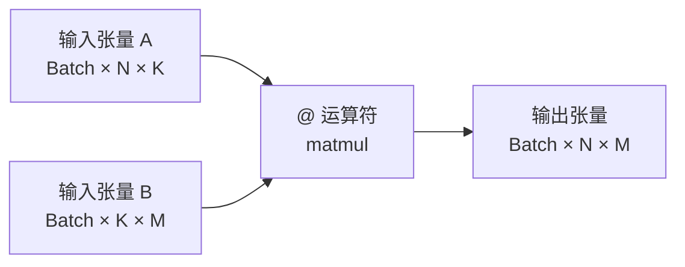

## 1. 概述

在 Python 的科学计算生态中，矩阵运算占据核心地位。Python 3.5 引入了 **PEP 465**，正式添加了用于矩阵乘法的中缀运算符 `@`。这一改进极大地提升了数值计算代码的可读性，并解决了长期以来 `*` 运算符在逐元素乘法（Element-wise multiplication）与矩阵乘法（Matrix multiplication）之间的语义混淆问题。

本文将从语言规范、底层实现、与 NumPy 的集成以及最佳实践等方面，对 Python 中的矩阵运算符进行深入剖析。

## 2. 运算符体系架构

Python 中的数值运算符号设计遵循明确的语义划分：

| 运算符 | 对应的魔术方法 (Magic Methods) | 典型语义 | NumPy 对应函数 |
| :--- | :--- | :--- | :--- |
| `*` | `__mul__`, `__rmul__` | **逐元素乘法** (Hadamard Product) | `numpy.multiply` |
| `@` | `__matmul__`, `__rmatmul__` | **矩阵乘法** (Matrix Product) | `numpy.matmul` |
| (无) | (无) | 点积 (Dot Product) | `numpy.dot` |

### 2.1 历史背景 (PEP 465)

在 Python 3.5 之前，科学计算社区主要依赖 `numpy.dot(a, b)` 或 `a.dot(b)` 来进行矩阵乘法。这种函数式调用的语法在处理复杂公式时会导致可读性严重下降。例如，数学公式 $S = (H\beta - r)^T (HVH^T)^{-1} (H\beta - r)$ 的实现：

*   **Pre-PEP 465**: `(H.dot(beta) - r).T.dot(inv(H.dot(V).dot(H.T))).dot(H.dot(beta) - r)`
*   **Post-PEP 465**: `(H @ beta - r).T @ inv(H @ V @ H.T) @ (H @ beta - r)`

`@` 运算符的引入使得代码与数学公式形成了直观的映射。

## 3. 核心机制解析

### 3.1 `@` 运算符 (Matrix Multiplication)

`@` 运算符在 NumPy 中映射为 `numpy.matmul` 函数。其行为与传统的 `numpy.dot` 存在关键差异，特别是在处理高维张量时。

#### 3.1.1 广播机制 (Broadcasting)
`@` 运算符将输入张量视为**矩阵堆叠 (Stack of matrices)**。如果输入维度大于 2，它将最后两个维度视为矩阵，而对前面的维度执行广播。

*   对于形状为 `(n, k)` 和 `(k, m)` 的输入，结果为 `(n, m)`。
*   对于形状为 `(B, n, k)` 和 `(B, k, m)` 的输入，结果为 `(B, n, m)`。
*   **差异点**：`numpy.dot` 在处理高维数组时执行的是**张量点积**（Sum product over the last axis of a and the second-to-last of b），而**不是**批量的矩阵乘法。



#### 3.1.2 标量运算禁止
`@` 运算符严格定义为矩阵乘法，因此**不支持**标量操作数。
```python
import numpy as np
A = np.ones((2, 2))
# A @ 2  # 抛出 ValueError: matmul: Input operand 1 does not have enough dimensions
A * 2    # 合法：逐元素乘法
```

### 3.2 `*` 运算符 (Element-wise Multiplication)

`*` 运算符在 NumPy 的 `ndarray` 上执行**逐元素乘法**（也称为 Hadamard 积）。
*   要求操作数形状相同，或满足 NumPy 的广播规则。
*   输出形状与输入形状的广播结果一致。

### 3.3 `numpy.dot` 与 `@` 的对比

| 特性 | `numpy.dot(a, b)` | `a @ b` (`numpy.matmul`) |
| :--- | :--- | :--- |
| **2D 数组 (矩阵)** | 矩阵乘法 | 矩阵乘法 |
| **1D 数组 (向量)** | 向量内积 (Inner product) | 向量内积 (无复共轭) |
| **标量乘法** | 支持 (等同于 `*`) | **不支持** (抛出异常) |
| **高维数组 (>2D)** | 张量点积 (Sum product) | **批量矩阵乘法** (Broadcast semantics) |

**高维差异示例**：
```python
import numpy as np
a = np.random.rand(8, 13, 13)
b = np.random.rand(8, 13, 13)

c = a @ b       # 形状: (8, 13, 13) - 8次 (13x13) 乘 (13x13)
d = np.dot(a, b) # 形状: (8, 13, 8, 13) - 极其不同的几何意义
```

## 4. 底层实现细节

Python 数据模型通过以下特殊方法支持 `@` 运算符：

1.  **`__matmul__(self, other)`**: 当执行 `obj @ other` 时调用。
2.  **`__rmatmul__(self, other)`**: 当执行 `other @ obj` 且 `other` 未定义 `__matmul__` 时调用。
3.  **`__imatmul__(self, other)`**: 当执行 `obj @= other` (原地更新) 时调用。

在 CPython 层面，这对应于 `nb_matrix_multiply` 和 `nb_inplace_matrix_multiply` 槽位。

### 4.1 1D 数组的特殊处理
PEP 465 规定了 1D 数组参与矩阵乘法时的特殊规则（NumPy 遵循此规则）：
*   如果第一个参数是 1D，它被临时提升为行向量（前置维度 1）。
*   如果第二个参数是 1D，它被临时提升为列向量（后置维度 1）。
*   运算结束后，临时添加的维度会被移除。

这种设计使得 `vector @ matrix` 和 `matrix @ vector` 符合线性代数的直觉，而无需用户手动 `reshape`。

## 5. 最佳实践建议

1.  **首选 `@` 进行矩阵乘法**：在处理 PyTorch Tensor 或 NumPy ndarray 时，使用 `@` 语义最清晰。
2.  **慎用 `numpy.matrix`**：NumPy 的 `matrix` 子类将 `*` 强制定义为矩阵乘法。这虽然在旧代码中常见，但已被 NumPy 官方**不推荐使用**（Deprecated/Discouraged）。应始终使用 `ndarray` 并配合 `@` 运算符。
3.  **明确维度意图**：处理 3D+ 张量时，务必区分你是需要“批量矩阵乘法”（使用 `@`）还是“张量缩并”（使用 `np.tensordot` 或 `np.einsum`）。
4.  **使用 `np.multiply` 明确逐元素意图**：虽然 `*` 是标准的逐元素乘法，但在复杂的数学表达式中，显式调用 `np.multiply` 有时能增加代码的可读性，特别是当涉及广播操作时。

## 参考资料

1.  [PEP 465 – A dedicated infix operator for matrix multiplication](https://peps.python.org/pep-0465/)
2.  [NumPy Documentation: numpy.matmul](https://numpy.org/doc/stable/reference/generated/numpy.matmul.html)
3.  [Stack Overflow: Difference between numpy dot() and Python 3.5+ matrix multiplication @](https://stackoverflow.com/questions/34142485/difference-between-numpy-dot-and-python-3-5-matrix-multiplication)
4.  [CSDN: numpy中运算符* @ mutiply dot的用法分析](https://blog.csdn.net/Invokar/article/details/89532476)
