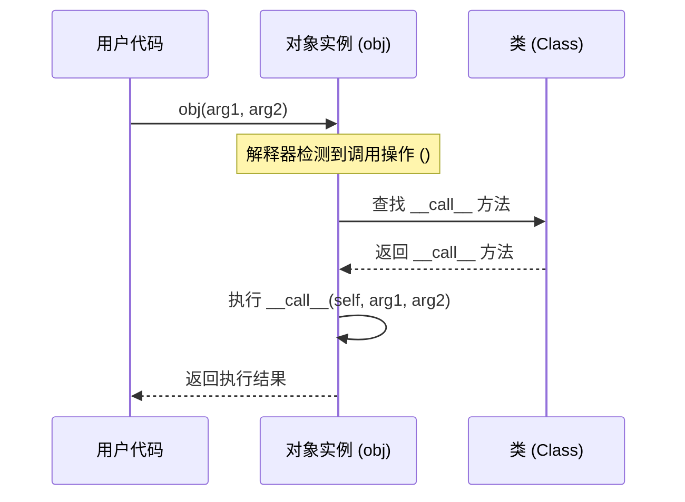

## 1. 概述

`__call__` 是 Python 中用于**使实例变得可调用（Callable）**的魔术方法。

在 Python 中，不仅函数（Function）和方法（Method）是可调用的，任何实现了 `__call__` 方法的类的实例都可以像函数一样被调用。这体现了 Python "一切皆对象" 的设计哲学，以及函数作为一等公民（First-class Citizen）的地位。

## 2. 核心原理

### 2.1 方法签名

```python
def __call__(self, *args, **kwargs):
    ...
```

*   **`self`**: 实例对象本身。
*   **`*args`**: 位置参数。
*   **`**kwargs`**: 关键字参数。

### 2.2 触发机制

当对一个对象使用圆括号 `()` 进行调用操作时，Python 解释器会自动查找该对象所属类中定义的 `__call__` 方法并执行。



### 2.3 底层实现（CPython）

在 CPython 层面，所有调用的核心都是 `PyObject_Call` 函数。当对象被调用时，解释器会检查该对象类型结构体（`PyTypeObject`）中的 `tp_call` 槽位（Slot）。

*   对于**函数**和**方法**，`tp_call` 指向其具体的执行逻辑。
*   对于**自定义类的实例**，`tp_call` 会映射到类中定义的 `__call__` 方法。

## 3. `__call__` 与 `__init__` 的区别

这是初学者最容易混淆的两个概念：

| 方法 | 触发时机 | 主要用途 | 对应操作 |
| :--- | :--- | :--- | :--- |
| **`__init__`** | **实例化时** | 初始化对象状态，设置属性 | `obj = MyClass()` |
| **`__call__`** | **调用实例时** | 执行具体业务逻辑，让对象像函数一样行为 | `obj()` |

**代码对比**：

```python
class Counter:
    def __init__(self):
        self.count = 0  # 状态初始化
        print("Initialized")

    def __call__(self):
        self.count += 1 # 业务逻辑执行
        print(f"Called: {self.count}")

c = Counter()  # 触发 __init__ -> 输出 "Initialized"
c()            # 触发 __call__ -> 输出 "Called: 1"
c()            # 触发 __call__ -> 输出 "Called: 2"
```

## 4. 典型应用场景

### 4.1 保持状态的函数（Stateful Callables）

相比于闭包（Closure），使用类和 `__call__` 来维护状态更加直观和易于扩展。

```python
class CumulativeAverager:
    def __init__(self):
        self.data = []

    def __call__(self, new_value):
        self.data.append(new_value)
        return sum(self.data) / len(self.data)

avg = CumulativeAverager()
print(avg(10))  # 10.0
print(avg(20))  # 15.0
```

### 4.2 基于类的装饰器（Class-based Decorators）

装饰器本质上是一个可调用对象。使用类来实现装饰器时，必须实现 `__call__` 方法。

```python
import time

class ExecutionTimer:
    def __init__(self, func):
        self.func = func

    def __call__(self, *args, **kwargs):
        start = time.perf_counter()
        result = self.func(*args, **kwargs)
        end = time.perf_counter()
        print(f"{self.func.__name__} took {end - start:.4f}s")
        return result

@ExecutionTimer
def slow_function():
    time.sleep(0.5)

slow_function()  # 触发 ExecutionTimer 实例的 __call__
```

### 4.3 策略模式（Strategy Pattern）

在策略模式中，可以将一系列算法封装为不同的可调用对象，并在运行时动态替换。

```python
class JsonSerializer:
    def __call__(self, data):
        return f"JSON: {str(data)}"

class XmlSerializer:
    def __call__(self, data):
        return f"XML: <data>{str(data)}</data>"

class DataProcessor:
    def __init__(self, serializer):
        self.serializer = serializer  # 注入策略

    def process(self, data):
        return self.serializer(data)  # 调用策略

processor = DataProcessor(JsonSerializer())
print(processor.process({"a": 1}))
```

### 4.4 缓存与记忆化（Memoization）

利用对象属性存储缓存，通过 `__call__` 执行带缓存的计算。

```python
class Fibonacci:
    def __init__(self):
        self.cache = {0: 0, 1: 1}

    def __call__(self, n):
        if n not in self.cache:
            self.cache[n] = self(n-1) + self(n-2)
        return self.cache[n]

fib = Fibonacci()
print(fib(10))  # 55
```

## 5. 如何判断对象是否可调用

使用内置函数 `callable()`：

```python
def my_func(): pass
class MyClass: pass
class CallableClass:
    def __call__(self): pass

print(callable(my_func))        # True
print(callable(MyClass))        # True (类本身也是可调用的，用于创建实例)
print(callable(MyClass()))      # False (普通实例不可调用)
print(callable(CallableClass()))# True (实现了 __call__ 的实例)
```

## 6. 参考资料

1.  [Python Documentation: Data Model - Special method names](https://docs.python.org/3/reference/datamodel.html#special-method-names)
2.  [Real Python: Python's .__call__() Method](https://realpython.com/python-callable-instances/)
3.  [Eli Bendersky: Python internals: how callables work](https://eli.thegreenplace.net/2012/03/23/python-internals-how-callables-work)
