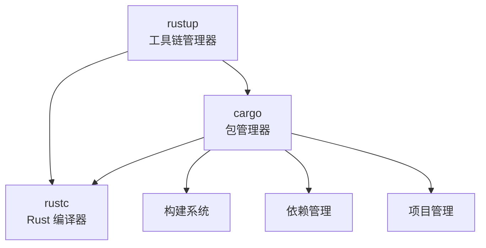
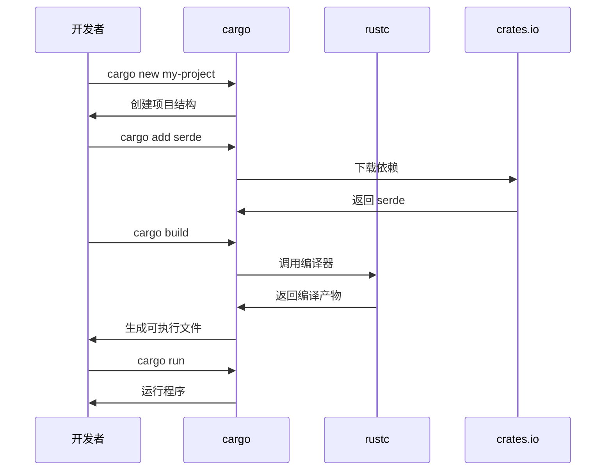

# Rust 工具链：rustup、cargo、rustc

Rust 的工具链由三个核心工具组成，它们协同工作，为开发者提供完整的开发体验。

---

## 🦀 工具链概览



---

## 1️⃣ rustup - Rust 工具链管理器

### 📖 什么是 rustup？

**rustup** 是 Rust 的官方工具链安装器和版本管理工具，类似于：
- Node.js 的 `nvm`
- Python 的 `pyenv`
- Ruby 的 `rbenv`

### 🎯 核心功能

#### 1. 管理 Rust 版本

Rust 有三个发布通道：

- **stable**（稳定版）：每 6 周发布一次，推荐日常使用
- **beta**（测试版）：下一个稳定版的候选版本
- **nightly**（每夜版）：最新的实验性功能

```bash
# 安装稳定版
rustup install stable

# 安装 nightly 版
rustup install nightly

# 安装特定版本
rustup install 1.75.0

# 查看已安装的工具链
rustup toolchain list

# 设置默认工具链
rustup default stable
```

#### 2. 管理编译目标

支持交叉编译到不同平台：

```bash
# 查看当前已安装的目标
rustup target list --installed

# 添加编译目标
rustup target add x86_64-pc-windows-msvc      # Windows
rustup target add x86_64-unknown-linux-gnu    # Linux
rustup target add x86_64-apple-darwin         # macOS
rustup target add wasm32-unknown-unknown      # WebAssembly
rustup target add aarch64-linux-android       # Android ARM64

# 移除编译目标
rustup target remove wasm32-unknown-unknown
```

#### 3. 管理组件

```bash
# 查看可用组件
rustup component list

# 安装常用组件
rustup component add rustfmt      # 代码格式化工具
rustup component add clippy       # 代码检查工具
rustup component add rust-src     # Rust 源代码（用于 IDE 补全）
rustup component add rust-docs    # 离线文档
rustup component add rust-analyzer # LSP 服务器

# 移除组件
rustup component remove rustfmt
```

#### 4. 更新工具链

```bash
# 更新所有已安装的工具链
rustup update

# 更新特定工具链
rustup update stable
rustup update nightly

# 检查更新
rustup check
```

### 🔧 常用命令

```bash
# 查看 rustup 版本
rustup --version

# 查看当前激活的工具链
rustup show

# 打开本地文档
rustup doc

# 打开标准库文档
rustup doc --std

# 打开 The Rust Book
rustup doc --book

# 卸载 Rust
rustup self uninstall

# 更新 rustup 自身
rustup self update
```

### 📁 项目级工具链配置

在项目根目录创建 `rust-toolchain.toml`：

```toml
[toolchain]
channel = "1.75.0"
components = ["rustfmt", "clippy"]
targets = ["wasm32-unknown-unknown"]
```

或简单版本 `rust-toolchain`：

```
1.75.0
```

当进入该目录时，rustup 会自动切换到指定的工具链。

### 🌍 环境变量

```bash
# 设置工具链安装目录（默认 ~/.rustup）
RUSTUP_HOME=/custom/path

# 设置 cargo 安装目录（默认 ~/.cargo）
CARGO_HOME=/custom/path

# 使用镜像加速（中国大陆）
RUSTUP_DIST_SERVER=https://mirrors.ustc.edu.cn/rust-static
RUSTUP_UPDATE_ROOT=https://mirrors.ustc.edu.cn/rust-static/rustup
```

---

## 2️⃣ cargo - Rust 包管理器和构建工具

### 📖 什么是 cargo？

**cargo** 是 Rust 的官方包管理器和构建系统，类似于：
- Node.js 的 `npm`
- Python 的 `pip`
- Java 的 `Maven`

### 🎯 核心功能

#### 1. 项目管理

```bash
# 创建新项目（二进制程序）
cargo new my-project

# 创建新项目（库）
cargo new my-lib --lib

# 在当前目录初始化项目
cargo init

# 项目结构
my-project/
├── Cargo.toml          # 项目配置文件
├── Cargo.lock          # 依赖锁定文件
├── src/
│   └── main.rs         # 入口文件
└── target/             # 编译输出目录
```

#### 2. 构建和运行

```bash
# 编译项目（debug 模式）
cargo build

# 编译项目（release 模式，启用优化）
cargo build --release

# 编译并运行
cargo run

# 运行并传递参数
cargo run -- arg1 arg2

# 只检查代码，不生成可执行文件（速度快）
cargo check

# 清理编译产物
cargo clean
```

#### 3. 依赖管理

**Cargo.toml 示例：**

```toml
[package]
name = "my-project"
version = "0.1.0"
edition = "2021"

[dependencies]
serde = "1.0"                          # 最新 1.x 版本
tokio = { version = "1.35", features = ["full"] }
rand = "0.8.5"

[dev-dependencies]
criterion = "0.5"                      # 仅用于测试/基准测试

[build-dependencies]
cc = "1.0"                             # 仅用于构建脚本
```

**常用命令：**

```bash
# 添加依赖
cargo add serde
cargo add tokio --features full

# 移除依赖
cargo remove serde

# 更新依赖
cargo update                # 更新所有依赖
cargo update serde          # 更新特定依赖

# 查看依赖树
cargo tree

# 搜索 crates.io 上的包
cargo search serde
```

#### 4. 测试

```bash
# 运行所有测试
cargo test

# 运行特定测试
cargo test test_name

# 显示测试输出
cargo test -- --nocapture

# 运行文档测试
cargo test --doc

# 运行基准测试
cargo bench
```

#### 5. 文档

```bash
# 生成并打开项目文档
cargo doc --open

# 生成文档（包含依赖）
cargo doc --no-deps

# 生成文档（包含私有项）
cargo doc --document-private-items
```

#### 6. 发布

```bash
# 打包项目
cargo package

# 发布到 crates.io
cargo publish

# 登录 crates.io
cargo login <token>

# 撤回已发布的版本
cargo yank --vers 1.0.0
```

### 🔧 常用命令

```bash
# 格式化代码
cargo fmt

# 代码检查（lint）
cargo clippy

# 修复可自动修复的问题
cargo fix

# 查看项目元数据
cargo metadata

# 安装二进制程序
cargo install ripgrep
cargo install cargo-watch

# 卸载二进制程序
cargo uninstall ripgrep

# 列出已安装的二进制程序
cargo install --list
```

### 📦 Workspace（工作空间）

管理多个相关的包：

```toml
# Cargo.toml（根目录）
[workspace]
members = [
    "crate-a",
    "crate-b",
    "crate-c",
]

[workspace.dependencies]
serde = "1.0"  # 共享依赖版本
```

```bash
# 构建工作空间中的所有包
cargo build --workspace

# 测试工作空间中的所有包
cargo test --workspace
```

### 🚀 常用 Cargo 插件

```bash
# 监听文件变化自动重新编译
cargo install cargo-watch
cargo watch -x run

# 生成依赖图
cargo install cargo-deps
cargo deps | dot -Tpng > graph.png

# 检查过时的依赖
cargo install cargo-outdated
cargo outdated

# 审计安全漏洞
cargo install cargo-audit
cargo audit

# 扩展 Cargo.toml
cargo install cargo-edit
cargo add/rm/upgrade

# 生成代码覆盖率
cargo install cargo-tarpaulin
cargo tarpaulin
```

---

## 3️⃣ rustc - Rust 编译器

### 📖 什么是 rustc？

**rustc** 是 Rust 的编译器，负责将 Rust 源代码编译成机器码。

通常不直接使用 rustc，而是通过 cargo 间接调用。

### 🎯 基本用法

```bash
# 编译单个文件
rustc main.rs

# 指定输出文件名
rustc main.rs -o my_program

# 优化编译
rustc -O main.rs

# 查看版本
rustc --version

# 查看详细版本信息
rustc --version --verbose
```

### 🔧 编译选项

```bash
# 指定编译目标
rustc --target wasm32-unknown-unknown main.rs

# 生成库文件
rustc --crate-type lib lib.rs

# 设置优化级别（0-3）
rustc -C opt-level=3 main.rs

# 生成调试信息
rustc -g main.rs

# 显示警告
rustc -W warnings main.rs

# 将警告视为错误
rustc -D warnings main.rs
```

### 📊 查看编译信息

```bash
# 查看支持的目标平台
rustc --print target-list

# 查看默认目标平台
rustc --print target-spec-json

# 查看 sysroot 路径
rustc --print sysroot

# 展开宏
rustc -Z unstable-options --pretty=expanded main.rs

# 生成 LLVM IR
rustc --emit=llvm-ir main.rs

# 生成汇编代码
rustc --emit=asm main.rs
```

### 🎨 通过 Cargo 使用 rustc 选项

在 `Cargo.toml` 中配置：

```toml
[profile.dev]
opt-level = 0      # 不优化

[profile.release]
opt-level = 3      # 最高优化
lto = true         # 链接时优化
codegen-units = 1  # 单个代码生成单元（更好的优化）
strip = true       # 移除符号信息（减小体积）
```

或通过环境变量：

```bash
# 传递选项给 rustc
RUSTFLAGS="-C target-cpu=native" cargo build --release
```

---

## 🔄 工具链协作流程



---

## 📚 实用技巧

### 1. 加速编译

```bash
# 使用 sccache 缓存编译结果
cargo install sccache
export RUSTC_WRAPPER=sccache

# 使用 mold 链接器（Linux）
sudo apt install mold
export RUSTFLAGS="-C link-arg=-fuse-ld=mold"

# 增加并行编译单元
export CARGO_BUILD_JOBS=8
```

### 2. 配置国内镜像

创建 `~/.cargo/config.toml`：

```toml
[source.crates-io]
replace-with = 'ustc'

[source.ustc]
registry = "https://mirrors.ustc.edu.cn/crates.io-index"

[source.tuna]
registry = "https://mirrors.tuna.tsinghua.edu.cn/git/crates.io-index.git"

[source.sjtu]
registry = "https://mirrors.sjtug.sjtu.edu.cn/git/crates.io-index/"
```

### 3. 常用别名

在 `~/.cargo/config.toml` 中添加：

```toml
[alias]
b = "build"
r = "run"
t = "test"
c = "check"
br = "build --release"
rr = "run --release"
```

使用：

```bash
cargo b      # 等同于 cargo build
cargo rr     # 等同于 cargo run --release
```

---

## 🎯 快速参考

### rustup 常用命令

| 命令 | 说明 |
|------|------|
| `rustup update` | 更新工具链 |
| `rustup default stable` | 设置默认工具链 |
| `rustup show` | 显示当前工具链 |
| `rustup doc` | 打开本地文档 |
| `rustup component add clippy` | 安装组件 |
| `rustup target add <target>` | 添加编译目标 |

### cargo 常用命令

| 命令 | 说明 |
|------|------|
| `cargo new <name>` | 创建新项目 |
| `cargo build` | 编译项目 |
| `cargo run` | 运行项目 |
| `cargo test` | 运行测试 |
| `cargo check` | 快速检查代码 |
| `cargo fmt` | 格式化代码 |
| `cargo clippy` | 代码检查 |
| `cargo doc --open` | 生成并打开文档 |

### rustc 常用选项

| 选项 | 说明 |
|------|------|
| `-O` | 优化编译 |
| `-g` | 生成调试信息 |
| `--target <target>` | 指定编译目标 |
| `--emit=asm` | 生成汇编代码 |
| `-C opt-level=3` | 设置优化级别 |

---

## 🛠️ Rust 安装时包含的所有工具

当你通过 `rustup` 安装 Rust 时，会自动安装以下组件：

### 核心组件（默认安装）

#### 1. **cargo** - 包管理器和构建工具
```bash
cargo --version
```
- 项目管理、依赖管理、构建系统
- 详见上文 "cargo" 章节

#### 2. **clippy** - 代码检查工具（Linter）
```bash
cargo clippy
```

**功能：**
- 检测常见错误和不良实践
- 提供代码改进建议
- 超过 600 个 lint 规则

**示例：**
```rust
// 不推荐的写法
let x = 0;
if x == 0 {
    println!("zero");
}

// clippy 会建议：
if x.is_zero() {  // 更清晰
    println!("zero");
}
```

**常用命令：**
```bash
# 运行 clippy
cargo clippy

# 将警告视为错误
cargo clippy -- -D warnings

# 自动修复部分问题
cargo clippy --fix

# 查看所有 lint 规则
cargo clippy --help
```

**配置 clippy：**

在 `Cargo.toml` 中：
```toml
[lints.clippy]
all = "warn"
pedantic = "warn"
nursery = "warn"
```

或在代码中：
```rust
#![warn(clippy::all)]
#![warn(clippy::pedantic)]
#![deny(clippy::unwrap_used)]  // 禁止使用 unwrap
```

---

#### 3. **rust-docs** - 离线文档
```bash
rustup doc
```

**包含的文档：**
- **The Rust Book** - Rust 官方教程
- **Rust by Example** - 示例学习
- **Standard Library API** - 标准库文档
- **Cargo Book** - Cargo 使用指南
- **rustc Book** - 编译器文档
- **rustdoc Book** - 文档生成工具指南

**常用命令：**
```bash
# 打开主文档页面
rustup doc

# 打开 The Rust Book
rustup doc --book

# 打开标准库文档
rustup doc --std

# 打开 Cargo Book
rustup doc --cargo

# 打开特定模块文档
rustup doc std::collections
```

**优势：**
- ✅ 完全离线可用
- ✅ 与安装的 Rust 版本完全匹配
- ✅ 包含所有标准库 API
- ✅ 搜索功能强大

---

#### 4. **rustfmt** - 代码格式化工具
```bash
cargo fmt
```

**功能：**
- 自动格式化 Rust 代码
- 统一代码风格
- 支持自定义配置

**常用命令：**
```bash
# 格式化整个项目
cargo fmt

# 检查格式但不修改
cargo fmt -- --check

# 格式化单个文件
rustfmt src/main.rs

# 显示格式化差异
cargo fmt -- --emit=diff
```

**配置 rustfmt：**

创建 `rustfmt.toml` 或 `.rustfmt.toml`：
```toml
max_width = 100
hard_tabs = false
tab_spaces = 4
newline_style = "Unix"
use_small_heuristics = "Default"
reorder_imports = true
reorder_modules = true
remove_nested_parens = true
edition = "2021"
```

**常用配置项：**
```toml
# 每行最大字符数
max_width = 100

# 导入排序
reorder_imports = true

# 函数参数换行
fn_args_layout = "Tall"

# 链式调用换行
chain_width = 60

# 注释宽度
comment_width = 80

# 使用字段初始化简写
use_field_init_shorthand = true
```

**在 CI 中使用：**
```bash
# 检查代码格式
cargo fmt -- --check || exit 1
```

---

#### 5. **rustc** - Rust 编译器
```bash
rustc --version
```
- 将 Rust 代码编译成机器码
- 详见上文 "rustc" 章节

---

#### 6. **rust-std** - Rust 标准库
```bash
rustc --print sysroot
```

**包含的内容：**
- **核心库（core）** - 不依赖操作系统的基础功能
- **标准库（std）** - 完整的标准库
- **alloc** - 堆分配相关功能
- **proc_macro** - 过程宏支持

**标准库模块：**
- `std::collections` - 集合类型（Vec, HashMap 等）
- `std::io` - 输入输出
- `std::fs` - 文件系统操作
- `std::net` - 网络编程
- `std::thread` - 线程
- `std::sync` - 同步原语
- `std::process` - 进程管理
- `std::env` - 环境变量

**查看标准库源码：**
```bash
# 安装源码组件
rustup component add rust-src

# 源码位置
rustc --print sysroot
# 通常在 <sysroot>/lib/rustlib/src/rust/library/
```

---

### 可选组件（需要手动安装）

#### 7. **rust-src** - Rust 源代码
```bash
rustup component add rust-src
```

**用途：**
- IDE 代码补全和跳转
- 查看标准库实现
- 交叉编译某些目标
- 学习 Rust 内部实现

**使用场景：**
```bash
# 跳转到标准库定义（在 IDE 中）
# 例如：跳转到 Vec::push 的实现

# 嵌入式开发
cargo build --target thumbv7em-none-eabihf
```

---

#### 8. **rust-analyzer** - LSP 语言服务器
```bash
rustup component add rust-analyzer
```

**功能：**
- 代码补全
- 类型提示
- 错误检查
- 代码导航（跳转定义、查找引用）
- 重构支持
- 内联提示

**支持的编辑器：**
- VS Code（推荐插件：rust-analyzer）
- IntelliJ IDEA / CLion
- Vim / Neovim
- Emacs
- Sublime Text
- Helix

**VS Code 配置示例：**
```json
{
  "rust-analyzer.checkOnSave.command": "clippy",
  "rust-analyzer.cargo.features": "all",
  "rust-analyzer.inlayHints.enable": true,
  "rust-analyzer.completion.autoimport.enable": true
}
```

---

#### 9. **rustdoc** - 文档生成工具
```bash
rustdoc --version
```

**功能：**
- 从代码注释生成 HTML 文档
- 支持 Markdown 语法
- 自动生成 API 文档
- 运行文档测试

**文档注释语法：**
```rust
/// 计算两个数的和
///
/// # Examples
///
/// ```
/// let result = add(2, 3);
/// assert_eq!(result, 5);
/// ```
///
/// # Panics
///
/// 当结果溢出时会 panic
pub fn add(a: i32, b: i32) -> i32 {
    a + b
}
```

**常用命令：**
```bash
# 生成文档
cargo doc

# 生成并打开文档
cargo doc --open

# 包含私有项
cargo doc --document-private-items

# 不包含依赖的文档
cargo doc --no-deps

# 测试文档中的代码示例
cargo test --doc
```

---

#### 10. **rust-mingw**（仅 Windows）
```bash
# Windows 上自动安装
```

**功能：**
- 提供 MinGW 工具链
- 用于 `x86_64-pc-windows-gnu` 目标
- 包含 GCC 和相关工具

**目标选择：**
- `x86_64-pc-windows-msvc` - 使用 MSVC（推荐）
- `x86_64-pc-windows-gnu` - 使用 MinGW

---

### 其他实用工具

#### 11. **cargo-fmt** / **cargo-clippy**
这些是 cargo 的子命令，由对应组件提供：
```bash
cargo fmt    # 由 rustfmt 提供
cargo clippy # 由 clippy 提供
```

---

## 📦 完整的安装清单

根据你的安装截图，标准安装包含：

| 组件 | 大小 | 说明 |
|------|------|------|
| **cargo** | ~20 MiB | 包管理器和构建工具 |
| **clippy** | ~20 MiB | 代码检查工具 |
| **rust-docs** | ~20 MiB | 离线文档 |
| **rust-std** | ~20 MiB | 标准库 |
| **rustc** | ~76 MiB | Rust 编译器 |
| **rustfmt** | ~76 MiB | 代码格式化工具 |

**总大小：** 约 230-250 MiB

---

## 🎯 推荐的开发环境配置

### 1. 安装必要组件

```bash
# 基础组件（已默认安装）
rustup component add rustfmt
rustup component add clippy

# 推荐额外安装
rustup component add rust-src        # IDE 支持
rustup component add rust-analyzer   # LSP 服务器
```

### 2. 安装常用工具

```bash
# 监听文件变化自动编译
cargo install cargo-watch

# 更好的错误信息显示
cargo install cargo-expand

# 依赖管理
cargo install cargo-edit
cargo install cargo-outdated
cargo install cargo-audit

# 性能分析
cargo install cargo-flamegraph
cargo install cargo-benchcmp
```

### 3. 配置编辑器

**VS Code：**
```bash
# 安装 rust-analyzer 扩展
code --install-extension rust-lang.rust-analyzer
```

**配置文件（.vscode/settings.json）：**
```json
{
  "rust-analyzer.checkOnSave.command": "clippy",
  "rust-analyzer.cargo.features": "all",
  "editor.formatOnSave": true,
  "[rust]": {
    "editor.defaultFormatter": "rust-lang.rust-analyzer"
  }
}
```

---

## 🔍 验证安装

运行以下命令验证所有工具是否正确安装：

```bash
# 核心工具
rustc --version
cargo --version
rustup --version

# 组件
cargo fmt --version
cargo clippy --version
rustdoc --version

# 检查已安装组件
rustup component list --installed

# 检查工具链
rustup show
```

**预期输出：**
```
rustc 1.90.0 (11159782cd 2025-05-1d)
cargo 1.90.0 (11159782cd 2025-05-1d)
rustup 1.27.0 (2024-09-18)
rustfmt 1.7.0-stable (11159782cd 2025-05-1d)
clippy 0.1.80 (11159782cd 2025-05-1d)
rustdoc 1.90.0 (11159782cd 2025-05-1d)
```

---

## 🔗 相关资源

- [rustup 官方文档](https://rust-lang.github.io/rustup/)
- [cargo 官方文档](https://doc.rust-lang.org/cargo/)
- [rustc 官方文档](https://doc.rust-lang.org/rustc/)
- [The Cargo Book](https://doc.rust-lang.org/cargo/index.html)
- [crates.io](https://crates.io/) - Rust 包仓库
- [rust-analyzer 官网](https://rust-analyzer.github.io/)
- [clippy lint 列表](https://rust-lang.github.io/rust-clippy/master/)

---

**相关文档：**
- [Rust 学习路线](./学习路线.mdx)
- [为什么学习 Rust](./为什么学习Rust.mdx)

