# 动作组合架构的5种设计模式详解

在面对需要将多个原子动作灵活组合的场景时（如企业微信的标签、备注、欢迎语组合，或外呼系统的短信+语音组合），软件工程提供了多种设计模式来优雅地解决这个问题。

本文详细解析 **5种主流模式**：Command（命令模式）、Pipeline（管道模式）、Strategy + Composite（策略+组合模式）、Action/Step（动作/步骤模式）、Saga（长事务/补偿模式），每种模式都配有 UML 类图和序列图帮助你直观理解。

---

## 目录

1. [Command 命令模式](#1-command-命令模式)
2. [Pipeline 管道模式](#2-pipeline-管道模式)
3. [Strategy + Composite 策略+组合模式](#3-strategy--composite-策略组合模式)
4. [Action/Step 动作/步骤模式](#4-actionstep-动作步骤模式)
5. [Saga 长事务/补偿模式](#5-saga-长事务补偿模式)
6. [模式对比与选择指南](#6-模式对比与选择指南)

---

## 1. Command 命令模式

### 1.1 核心概念

**Command 模式**将请求封装为对象，从而使你可以用不同的请求、队列或日志来参数化其他对象。命令模式也支持可撤销的操作。

**大白话**：把每个动作封装成一张张"任务卡片"，需要时把卡片放到列表里交给执行器执行。

### 1.2 UML 类图

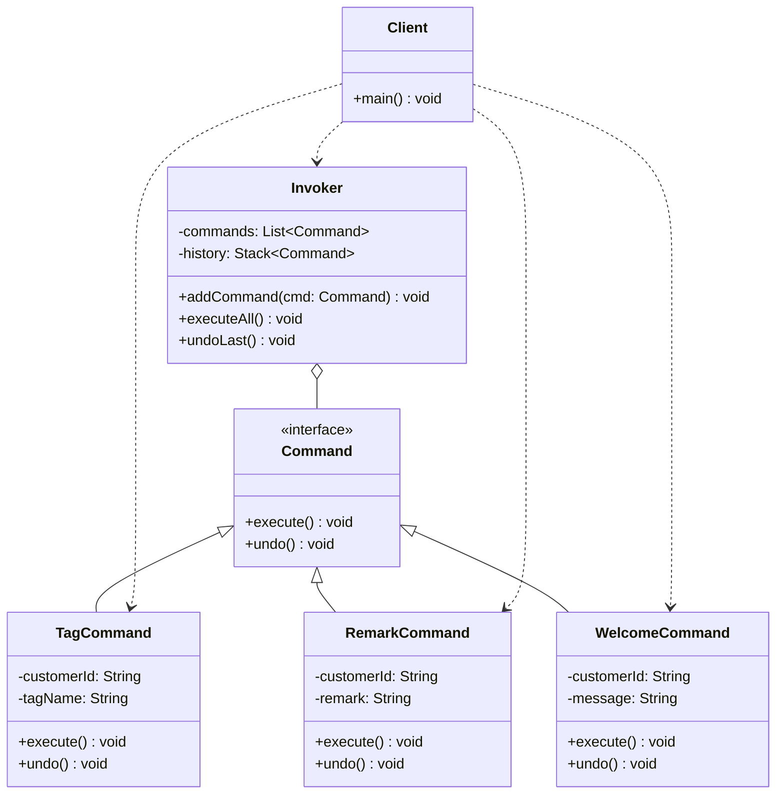

### 1.3 序列图

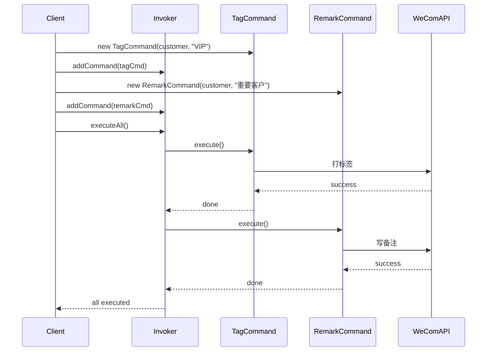

### 1.4 代码示例

```python
from abc import ABC, abstractmethod
from typing import List

class Command(ABC):
    """命令接口"""
    @abstractmethod
    def execute(self) -> None:
        pass
    
    @abstractmethod
    def undo(self) -> None:
        pass

class TagCommand(Command):
    """打标签命令"""
    def __init__(self, customer_id: str, tag_name: str):
        self.customer_id = customer_id
        self.tag_name = tag_name
    
    def execute(self) -> None:
        print(f"给客户 {self.customer_id} 打上标签: {self.tag_name}")
    
    def undo(self) -> None:
        print(f"撤销客户 {self.customer_id} 的标签: {self.tag_name}")

class RemarkCommand(Command):
    """写备注命令"""
    def __init__(self, customer_id: str, remark: str):
        self.customer_id = customer_id
        self.remark = remark
    
    def execute(self) -> None:
        print(f"给客户 {self.customer_id} 写备注: {self.remark}")
    
    def undo(self) -> None:
        print(f"清空客户 {self.customer_id} 的备注")

class Invoker:
    """命令调度器"""
    def __init__(self):
        self.commands: List[Command] = []
        self.history: List[Command] = []
    
    def add_command(self, command: Command) -> None:
        self.commands.append(command)
    
    def execute_all(self) -> None:
        for cmd in self.commands:
            cmd.execute()
            self.history.append(cmd)
        self.commands.clear()
    
    def undo_last(self) -> None:
        if self.history:
            self.history.pop().undo()

# 使用示例
invoker = Invoker()
invoker.add_command(TagCommand("user123", "VIP"))
invoker.add_command(RemarkCommand("user123", "高价值客户"))
invoker.execute_all()
```

### 1.5 适用场景

- ✅ 需要灵活排队执行多个操作
- ✅ 需要支持撤销/重做功能
- ✅ 需要记录操作日志
- ✅ 操作需要延迟执行或异步执行
- ✅ 需要将操作的调用者和执行者解耦

---

## 2. Pipeline 管道模式

### 2.1 核心概念

**Pipeline 模式**将数据处理流程分解为一系列独立的步骤（管道），数据像流水线一样依次经过每个步骤的处理。

**大白话**：车间里的流水线作业，数据依次流过各个处理节点，每个节点只干自己的事。

### 2.2 UML 类图

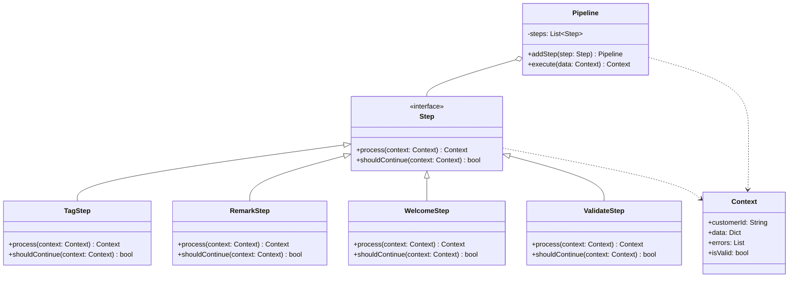

### 2.3 序列图

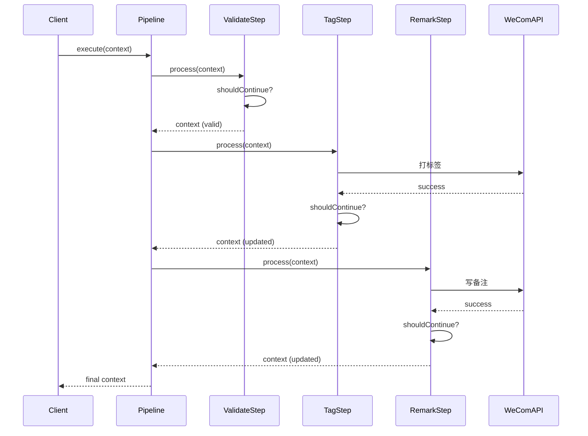

### 2.4 代码示例

```python
from abc import ABC, abstractmethod
from typing import List, Dict, Any
from dataclasses import dataclass, field

@dataclass
class Context:
    """上下文对象，在管道中传递"""
    customer_id: str
    data: Dict[str, Any] = field(default_factory=dict)
    errors: List[str] = field(default_factory=list)
    is_valid: bool = True

class Step(ABC):
    """管道步骤接口"""
    @abstractmethod
    def process(self, context: Context) -> Context:
        pass
    
    def should_continue(self, context: Context) -> bool:
        """是否继续执行下一步"""
        return context.is_valid and not context.errors

class ValidateStep(Step):
    """验证步骤"""
    def process(self, context: Context) -> Context:
        if not context.customer_id:
            context.errors.append("客户ID不能为空")
            context.is_valid = False
        return context

class TagStep(Step):
    """打标签步骤"""
    def __init__(self, tag_name: str):
        self.tag_name = tag_name
    
    def process(self, context: Context) -> Context:
        print(f"步骤: 给客户 {context.customer_id} 打标签 {self.tag_name}")
        context.data["tags"] = context.data.get("tags", []) + [self.tag_name]
        return context

class RemarkStep(Step):
    """写备注步骤"""
    def __init__(self, remark: str):
        self.remark = remark
    
    def process(self, context: Context) -> Context:
        print(f"步骤: 给客户 {context.customer_id} 写备注 {self.remark}")
        context.data["remark"] = self.remark
        return context

class Pipeline:
    """管道"""
    def __init__(self):
        self.steps: List[Step] = []
    
    def add_step(self, step: Step) -> "Pipeline":
        self.steps.append(step)
        return self
    
    def execute(self, context: Context) -> Context:
        for step in self.steps:
            context = step.process(context)
            if not step.should_continue(context):
                print(f"管道中断于: {step.__class__.__name__}")
                break
        return context

# 使用示例
pipeline = (Pipeline()
    .add_step(ValidateStep())
    .add_step(TagStep("VIP"))
    .add_step(RemarkStep("重要客户")))

context = Context(customer_id="user123")
result = pipeline.execute(context)
```

### 2.5 适用场景

- ✅ 数据处理有明显的顺序性
- ✅ 上一步的输出是下一步的输入
- ✅ 需要在中间步骤拦截或过滤数据
- ✅ 每个步骤相对独立，可单独测试
- ✅ 需要灵活地添加、删除或重排步骤

---

## 3. Strategy + Composite 策略+组合模式

### 3.1 核心概念

**Strategy 模式**定义了一系列算法，并将每个算法封装起来，使它们可以互相替换。

**Composite 模式**允许你将对象组合成树形结构来表现"整体/部分"层次结构。

**组合使用**：让所有的动作实现统一的策略接口，同时允许动作嵌套组合，形成树状结构。

**大白话**：统一接口（策略）+ 俄罗斯套娃（组合）。外部调用者看来，执行一个原子动作和执行一套连招，代码一模一样。

### 3.2 UML 类图

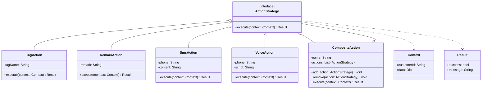

### 3.3 序列图

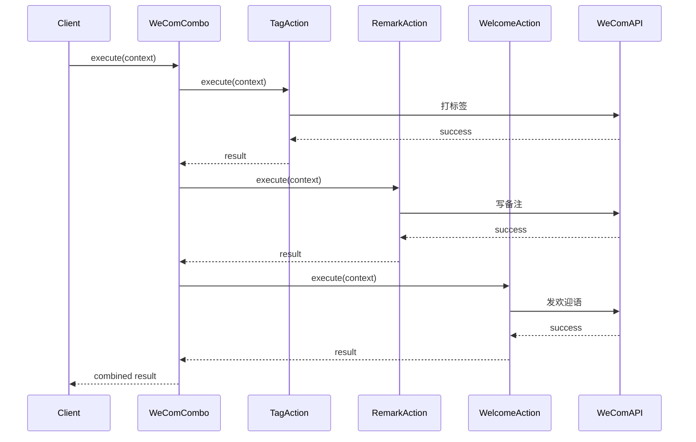

### 3.4 代码示例

```python
from abc import ABC, abstractmethod
from typing import List
from dataclasses import dataclass

@dataclass
class Result:
    success: bool
    message: str

class Context:
    def __init__(self, customer_id: str):
        self.customer_id = customer_id
        self.data = {}

class ActionStrategy(ABC):
    """动作策略接口"""
    @abstractmethod
    def execute(self, context: Context) -> Result:
        pass

class TagAction(ActionStrategy):
    """打标签动作"""
    def __init__(self, tag_name: str):
        self.tag_name = tag_name
    
    def execute(self, context: Context) -> Result:
        print(f"执行: 打标签 [{self.tag_name}]")
        return Result(True, f"标签 {self.tag_name} 添加成功")

class RemarkAction(ActionStrategy):
    """写备注动作"""
    def __init__(self, remark: str):
        self.remark = remark
    
    def execute(self, context: Context) -> Result:
        print(f"执行: 写备注 [{self.remark}]")
        return Result(True, f"备注设置成功")

class WelcomeAction(ActionStrategy):
    """发欢迎语动作"""
    def __init__(self, message: str):
        self.message = message
    
    def execute(self, context: Context) -> Result:
        print(f"执行: 发欢迎语 [{self.message}]")
        return Result(True, f"欢迎语发送成功")

class CompositeAction(ActionStrategy):
    """组合动作 - 俄罗斯套娃"""
    def __init__(self, name: str):
        self.name = name
        self.actions: List[ActionStrategy] = []
    
    def add(self, action: ActionStrategy) -> "CompositeAction":
        self.actions.append(action)
        return self
    
    def remove(self, action: ActionStrategy) -> None:
        self.actions.remove(action)
    
    def execute(self, context: Context) -> Result:
        print(f"\n=== 执行组合动作: {self.name} ===")
        results = []
        for action in self.actions:
            result = action.execute(context)
            results.append(result)
            if not result.success:
                return Result(False, f"组合动作中断: {result.message}")
        
        return Result(True, f"{self.name} 执行完成")

# 使用示例
# 创建原子动作
tag_action = TagAction("VIP")
remark_action = RemarkAction("高价值客户")
welcome_action = WelcomeAction("欢迎加入VIP俱乐部！")

# 创建组合动作
wecom_combo = CompositeAction("企业微信三连")
wecom_combo.add(tag_action).add(remark_action).add(welcome_action)

# 执行 - 和原子动作一样的调用方式
context = Context("user123")
result = wecom_combo.execute(context)

# 甚至可以嵌套组合
nested_combo = CompositeAction("超级组合")
nested_combo.add(wecom_combo)
nested_combo.add(TagAction("特别关怀"))
result = nested_combo.execute(context)
```

### 3.5 适用场景

- ✅ 需要处理复杂的树状任务结构
- ✅ 动作可以嵌套组合（连招套连招）
- ✅ 客户端代码需要统一处理单个动作和组合动作
- ✅ 需要动态地构建复杂的执行流程
- ✅ 需要支持条件分支和循环执行

---

## 4. Action/Step 动作/步骤模式

### 4.1 核心概念

**Action/Step 模式**是一种轻量级的架构模式，通过配置来定义业务流程中的动作序列。这不是一个标准的 GoF 设计模式，但在企业应用中非常常见。

**大白话**：按剧本演出的轻量级引擎，通过配置文件决定执行哪些步骤，而不是把组合写死在代码里。

### 4.2 UML 类图

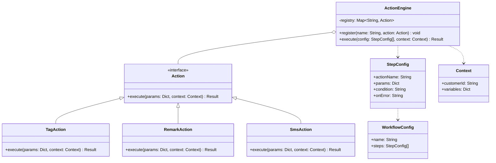

### 4.3 序列图

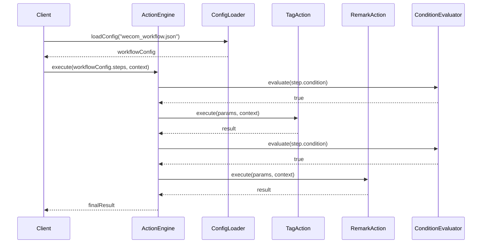

### 4.4 代码示例

```python
from abc import ABC, abstractmethod
from typing import List, Dict, Any, Optional
from dataclasses import dataclass
import json

@dataclass
class StepConfig:
    """步骤配置"""
    action_name: str
    params: Dict[str, Any]
    condition: Optional[str] = None  # 执行条件表达式
    on_error: str = "continue"  # 错误处理: continue/stop/rollback

@dataclass
class WorkflowConfig:
    """工作流配置"""
    name: str
    steps: List[StepConfig]

class Context:
    """执行上下文"""
    def __init__(self, customer_id: str):
        self.customer_id = customer_id
        self.variables: Dict[str, Any] = {}
        self.execution_log: List[str] = []
    
    def log(self, message: str):
        self.execution_log.append(message)
        print(f"[LOG] {message}")

class Action(ABC):
    """动作接口"""
    @abstractmethod
    def execute(self, params: Dict[str, Any], context: Context) -> bool:
        pass

class TagAction(Action):
    """打标签动作"""
    def execute(self, params: Dict[str, Any], context: Context) -> bool:
        tag_name = params.get("tag_name", "")
        context.log(f"给客户 {context.customer_id} 打标签: {tag_name}")
        context.variables["last_tag"] = tag_name
        return True

class RemarkAction(Action):
    """写备注动作"""
    def execute(self, params: Dict[str, Any], context: Context) -> bool:
        remark = params.get("remark", "")
        context.log(f"给客户 {context.customer_id} 写备注: {remark}")
        return True

class SmsAction(Action):
    """发短信动作"""
    def execute(self, params: Dict[str, Any], context: Context) -> bool:
        phone = params.get("phone", "")
        content = params.get("content", "")
        context.log(f"给 {phone} 发短信: {content}")
        return True

class ActionEngine:
    """动作执行引擎"""
    def __init__(self):
        self._registry: Dict[str, Action] = {}
    
    def register(self, name: str, action: Action) -> None:
        """注册动作"""
        self._registry[name] = action
    
    def execute(self, steps: List[StepConfig], context: Context) -> bool:
        """执行配置的动作序列"""
        for step in steps:
            # 检查条件
            if step.condition and not self._evaluate_condition(step.condition, context):
                context.log(f"跳过步骤 {step.action_name} (条件不满足)")
                continue
            
            # 执行动作
            action = self._registry.get(step.action_name)
            if not action:
                context.log(f"错误: 未找到动作 {step.action_name}")
                if step.on_error == "stop":
                    return False
                continue
            
            context.log(f"执行步骤: {step.action_name}")
            try:
                success = action.execute(step.params, context)
                if not success and step.on_error == "stop":
                    return False
            except Exception as e:
                context.log(f"执行 {step.action_name} 时出错: {e}")
                if step.on_error == "stop":
                    return False
        
        return True
    
    def _evaluate_condition(self, condition: str, context: Context) -> bool:
        """评估条件表达式（简化版）"""
        # 实际项目中可以使用更复杂的表达式引擎
        if condition == "is_vip":
            return context.variables.get("is_vip", False)
        return True

# 使用示例
engine = ActionEngine()
engine.register("tag", TagAction())
engine.register("remark", RemarkAction())
engine.register("sms", SmsAction())

# 从配置文件加载工作流
workflow_json = """
{
    "name": "VIP客户欢迎流程",
    "steps": [
        {"action_name": "tag", "params": {"tag_name": "VIP"}},
        {"action_name": "remark", "params": {"remark": "高价值客户"}},
        {"action_name": "sms", "params": {"phone": "13800138000", "content": "欢迎加入VIP！"}, "condition": "is_vip"}
    ]
}
"""

config = json.loads(workflow_json)
steps = [StepConfig(**s) for s in config["steps"]]

context = Context("user123")
context.variables["is_vip"] = True

engine.execute(steps, context)
```

### 4.5 配置文件示例

```json
{
    "name": "新客户入职流程",
    "steps": [
        {
            "action_name": "validate",
            "params": {"fields": ["phone", "email"]},
            "on_error": "stop"
        },
        {
            "action_name": "tag",
            "params": {"tag_name": "新客户"}
        },
        {
            "action_name": "remark",
            "params": {"remark": "2024年1月注册"}
        },
        {
            "action_name": "sms",
            "params": {"template": "welcome_new_user"},
            "condition": "phone_verified"
        },
        {
            "action_name": "email",
            "params": {"template": "onboarding_guide"},
            "condition": "email_verified",
            "on_error": "continue"
        }
    ]
}
```

### 4.6 适用场景

- ✅ 需要把动作组合交给配置文件管理
- ✅ 不希望每次修改组合都要重新发版
- ✅ 业务人员需要参与流程配置
- ✅ 需要支持动态修改流程
- ✅ 有多个相似的流程模板

---

## 5. Saga 长事务/补偿模式

### 5.1 核心概念

**Saga 模式**用于处理跨多个服务的长时间事务。它将一个大事务拆分为多个本地事务，每个本地事务执行后发布事件或消息，触发下一个本地事务。如果某个步骤失败，则执行补偿操作来回滚之前已完成的步骤。

**大白话**：给每个动作配备一个"反向补偿动作"，如果流程断了，自动反向执行补偿，保证数据不脏。

### 5.2 UML 类图

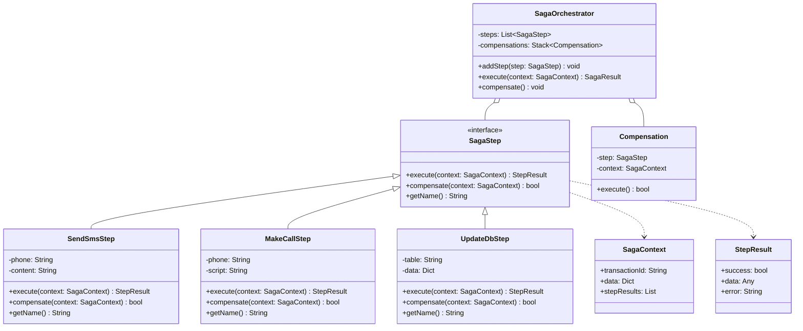

### 5.3 序列图

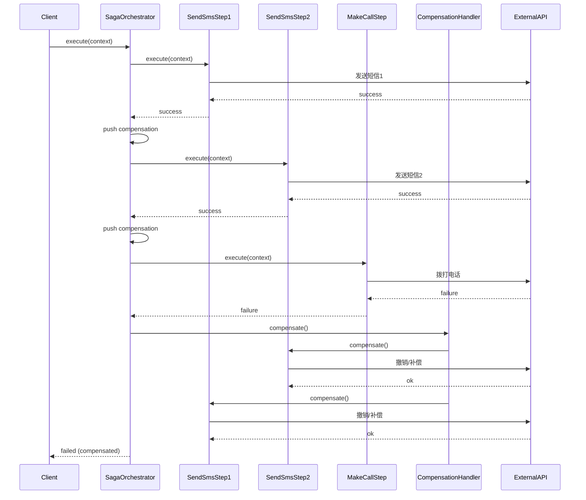

### 5.4 代码示例

```python
from abc import ABC, abstractmethod
from typing import List, Dict, Any, Optional
from dataclasses import dataclass
from enum import Enum

class StepStatus(Enum):
    PENDING = "pending"
    SUCCESS = "success"
    FAILED = "failed"
    COMPENSATED = "compensated"

@dataclass
class StepResult:
    success: bool
    data: Any = None
    error: str = ""

@dataclass
class SagaContext:
    transaction_id: str
    data: Dict[str, Any]
    step_results: List[Dict] = None
    
    def __post_init__(self):
        if self.step_results is None:
            self.step_results = []

@dataclass
class Compensation:
    """补偿记录"""
    step: "SagaStep"
    context: SagaContext
    result: Any
    
    def execute(self) -> bool:
        print(f"  [补偿] 执行 {self.step.get_name()} 的补偿操作")
        return self.step.compensate(self.context, self.result)

class SagaStep(ABC):
    """Saga 步骤接口"""
    @abstractmethod
    def execute(self, context: SagaContext) -> StepResult:
        pass
    
    @abstractmethod
    def compensate(self, context: SagaContext, result: Any) -> bool:
        """补偿操作，回滚已执行的步骤"""
        pass
    
    @abstractmethod
    def get_name(self) -> str:
        pass

class SendSmsStep(SagaStep):
    """发送短信步骤"""
    def __init__(self, phone: str, content: str):
        self.phone = phone
        self.content = content
    
    def execute(self, context: SagaContext) -> StepResult:
        print(f"  [执行] 发送短信给 {self.phone}: {self.content}")
        # 模拟调用外部短信API
        message_id = f"SMS_{id(self)}"
        context.data[f"sms_{self.phone}"] = message_id
        return StepResult(True, {"message_id": message_id, "phone": self.phone})
    
    def compensate(self, context: SagaContext, result: Any) -> bool:
        """补偿：发送解释短信或标记为撤销"""
        message_id = result.get("message_id")
        phone = result.get("phone")
        print(f"  [补偿] 撤销短信 {message_id} 给 {phone}")
        # 实际项目中可能调用API撤销或发送解释短信
        return True
    
    def get_name(self) -> str:
        return f"SendSms({self.phone})"

class MakeCallStep(SagaStep):
    """拨打电话步骤"""
    def __init__(self, phone: str, script: str):
        self.phone = phone
        self.script = script
    
    def execute(self, context: SagaContext) -> StepResult:
        print(f"  [执行] 拨打电话给 {self.phone}")
        # 模拟调用外部语音API
        # 假设这里失败了
        return StepResult(False, error="线路繁忙")
    
    def compensate(self, context: SagaContext, result: Any) -> bool:
        """补偿：记录失败日志"""
        print(f"  [补偿] 记录通话失败日志")
        return True
    
    def get_name(self) -> str:
        return f"MakeCall({self.phone})"

class UpdateDbStep(SagaStep):
    """更新数据库步骤"""
    def __init__(self, table: str, record_id: str, data: Dict):
        self.table = table
        self.record_id = record_id
        self.data = data
        self._backup_data = None
    
    def execute(self, context: SagaContext) -> StepResult:
        print(f"  [执行] 更新 {self.table} 表, 记录 {self.record_id}")
        # 模拟：先备份原数据
        self._backup_data = {"status": "pending"}  # 实际应从数据库读取
        # 更新数据
        context.data[f"db_{self.record_id}"] = self.data
        return StepResult(True, {"table": self.table, "id": self.record_id, "backup": self._backup_data})
    
    def compensate(self, context: SagaContext, result: Any) -> bool:
        """补偿：恢复原数据"""
        backup = result.get("backup")
        record_id = result.get("id")
        print(f"  [补偿] 恢复 {self.table} 表记录 {record_id} 为 {backup}")
        return True
    
    def get_name(self) -> str:
        return f"UpdateDb({self.table}.{self.record_id})"

class SagaOrchestrator:
    """Saga 编排器"""
    def __init__(self):
        self.steps: List[SagaStep] = []
        self.compensations: List[Compensation] = []
    
    def add_step(self, step: SagaStep) -> "SagaOrchestrator":
        self.steps.append(step)
        return self
    
    def execute(self, context: SagaContext) -> StepResult:
        """执行 Saga，如果失败则触发补偿"""
        print(f"\n=== 开始 Saga 事务: {context.transaction_id} ===")
        
        for step in self.steps:
            print(f"\n执行步骤: {step.get_name()}")
            result = step.execute(context)
            
            if result.success:
                # 记录成功步骤，用于后续补偿
                self.compensations.append(Compensation(step, context, result.data))
                context.step_results.append({
                    "step": step.get_name(),
                    "status": StepStatus.SUCCESS.value,
                    "data": result.data
                })
            else:
                # 执行失败，触发补偿
                print(f"  步骤失败: {result.error}")
                self._compensate()
                return StepResult(False, error=f"Saga 失败于 {step.get_name()}: {result.error}")
        
        print(f"\n=== Saga 事务完成: {context.transaction_id} ===")
        return StepResult(True, data=context.step_results)
    
    def _compensate(self) -> None:
        """执行补偿，回滚已完成的步骤"""
        print(f"\n=== 开始补偿 ===")
        # 按照 LIFO 顺序执行补偿
        while self.compensations:
            compensation = self.compensations.pop()
            try:
                success = compensation.execute()
                if not success:
                    print(f"  警告: 补偿操作失败，需要人工介入")
            except Exception as e:
                print(f"  错误: 补偿执行异常: {e}")
        print(f"=== 补偿完成 ===\n")

# 使用示例
saga = (SagaOrchestrator()
    .add_step(SendSmsStep("13800138000", "您的订单已确认"))
    .add_step(SendSmsStep("13800138000", "即将为您安排发货"))
    .add_step(MakeCallStep("13800138000", "确认订单详情"))  # 这一步会失败
    .add_step(UpdateDbStep("orders", "ORD123", {"status": "confirmed"})))

context = SagaContext(
    transaction_id="TXN_20240115_001",
    data={}
)

result = saga.execute(context)
print(f"\n最终结果: {'成功' if result.success else '失败'}")
if result.error:
    print(f"错误信息: {result.error}")
```

### 5.5 Saga 模式两种实现方式

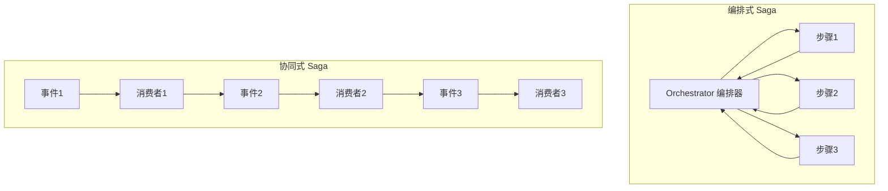

**编排式（Orchestration）**：由一个中央协调器负责调用各个服务，决定执行顺序。

**协同式（Choreography）**：服务之间通过事件总线通信，每个服务完成自己的工作后发布事件，触发下一个服务。

### 5.6 适用场景

- ✅ 跨多个外部系统的长时间事务
- ✅ 无法用本地数据库事务回滚的场景
- ✅ 需要最终一致性的分布式系统
- ✅ 每个步骤都有明确的补偿操作
- ✅ 需要支持事务的部分成功和部分回滚

---

## 6. 模式对比与选择指南

### 6.1 对比表

| 特性 | Command | Pipeline | Strategy+Composite | Action/Step | Saga |
|------|---------|----------|-------------------|-------------|------|
| **核心关注点** | 封装请求 | 数据流处理 | 树形组合 | 配置驱动 | 分布式事务 |
| **撤销支持** | ✅ 原生支持 | ⚠️ 需额外实现 | ⚠️ 需额外实现 | ⚠️ 需额外实现 | ✅ 补偿机制 |
| **配置化** | ⚠️ 较难 | ⚠️ 中等 | ✅ 容易 | ✅ 原生支持 | ⚠️ 中等 |
| **适用规模** | 小到中 | 中 | 中到大 | 中到大 | 大（分布式） |
| **复杂度** | 低 | 中 | 中 | 低 | 高 |
| **外部依赖** | 任意 | 任意 | 任意 | 任意 | 跨系统 |

### 6.2 选择决策树

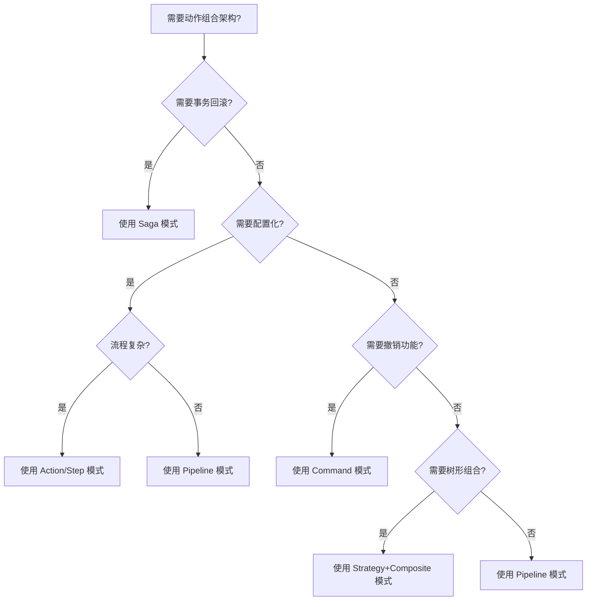

### 6.3 具体场景推荐

#### 场景1：企业微信客户运营（标签+备注+欢迎语）

**推荐：Command 或 Strategy+Composite**

理由：
- 动作相对固定（标签、备注、欢迎语）
- 可能需要撤销操作（Command 原生支持）
- 可能需要组合多种动作（Strategy+Composite）

#### 场景2：外呼系统（2短信+1语音）

**推荐：Saga 模式**

理由：
- 涉及外部系统（短信网关、语音平台）
- 任何一步失败都需要回滚
- 需要保证数据一致性

#### 场景3：业务流程引擎（可配置的审批流）

**推荐：Action/Step 模式**

理由：
- 流程经常变动
- 业务人员需要配置
- 不想每次改流程都发版

#### 场景4：数据处理流水线（ETL）

**推荐：Pipeline 模式**

理由：
- 数据流有明确的顺序
- 每一步的输出是下一步的输入
- 需要在中间步骤过滤数据

### 6.4 组合使用建议

这些模式不是互斥的，可以组合使用：

```python
# Saga + Command 组合
class SagaCommand(Command):
    """支持补偿的命令"""
    def __init__(self, saga_orchestrator):
        self.saga = saga_orchestrator
    
    def execute(self):
        return self.saga.execute(context)
    
    def undo(self):
        self.saga.compensate()

# Pipeline + Strategy 组合
class StrategyPipeline(Pipeline):
    """管道中执行策略"""
    def add_strategy(self, strategy):
        self.add_step(StrategyStep(strategy))
```

---

## 总结

选择合适的动作组合架构模式，需要考虑：

1. **业务复杂度**：简单场景用 Command，复杂场景用 Saga
2. **变更频率**：经常变动的用 Action/Step（配置化）
3. **可靠性要求**：跨系统的用 Saga（补偿机制）
4. **团队熟悉度**：选择团队能理解和维护的模式
5. **扩展性需求**：需要树形组合的用 Strategy+Composite

**记住**：设计模式是为了解决问题，不是为了使用模式而使用模式。选择最简单能满足需求的方案即可（KISS 原则）。

---

## 参考资料

1. [Design Patterns: Elements of Reusable Object-Oriented Software](https://en.wikipedia.org/wiki/Design_Patterns) - Gang of Four
2. [Microservices Patterns](https://microservices.io/patterns/) - Chris Richardson
3. [Saga Pattern](https://microservices.io/patterns/data/saga.html) - Microservices.io
4. [Command Pattern](https://refactoring.guru/design-patterns/command) - Refactoring Guru
5. [Strategy Pattern](https://refactoring.guru/design-patterns/strategy) - Refactoring Guru
6. [Composite Pattern](https://refactoring.guru/design-patterns/composite) - Refactoring Guru
7. [Pipeline Pattern](https://www.enterpriseintegrationpatterns.com/patterns/messaging/PipesAndFilters.html) - Enterprise Integration Patterns
