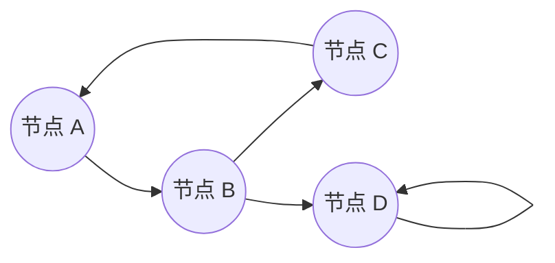

**有向图**（Directed Graph），通常简称为 **DiGraph**，是计算机科学和离散数学中的一个基础概念。它是一种图的类型，其中的边具有方向性。

简单来说，如果把无向图比作双向通行的道路网络，那么有向图就是由**单行道**组成的网络。

---

### 1. 核心定义

在数学形式上，一个有向图 $G$ 被定义为一个二元组 $G = (V, E)$，其中：

*   **$V$ (Vertices/Nodes)**：顶点的集合。代表图中的对象或节点。
*   **$E$ (Edges/Arcs)**：有向边的集合。每一条边都是一个有序对 $(u, v)$。
    *   这意味着边是从顶点 $u$ 指向顶点 $v$ 的。
    *   $u$ 被称为边的**起点** (tail/source)。
    *   $v$ 被称为边的**终点** (head/target)。

> **注意**：在有向图中，边 $(u, v)$ 和边 $(v, u)$ 是完全不同的两条边。而在无向图中，它们代表同一条连接。

### 2. 直观理解与视觉表示

在绘图中：
*   **顶点**通常画成圆圈。
*   **有向边**画成带有箭头的线段或曲线。箭头的方向从起点指向终点。

例如：如果你看到一个箭头从 $A$ 指向 $B$，这意味着存在关系 "$A$ 到 $B$"，但并不自动意味着存在 "$B$ 到 $A$"。

点击展开：查看有向图的简单图示代码

在这个例子中：
*   $A \to B$ 是一条边。
*   $D \to D$ 是一个**自环** (Self-loop)，即自己指向自己。
*   $A$ 可以到达 $C$ (通过 $B$)，但 $D$ 无法到达 $A$。

### 3. 关键术语

理解有向图需要掌握以下几个关键术语：

| 术语 | 定义 |
| :--- | :--- |
| **入度 (In-degree)** | 指向某个顶点的边的数量（有多少箭头指着它）。记为 $\deg^-(v)$。 |
| **出度 (Out-degree)** | 从某个顶点发出的边的数量（有多少箭头从它出发）。记为 $\deg^+(v)$。 |
| **路径 (Path)** | 顶点序列 $v_1, v_2, ..., v_n$，其中每相邻两个顶点 $(v_i, v_\{i+1\})$ 都有边相连。 |
| **环 / 圈 (Cycle)** | 起点和终点相同的路径（例如 $A \to B \to C \to A$）。 |
| **有向无环图 (DAG)** | 一个没有任何环的有向图。这是计算机科学中非常重要的一类图（如下详述）。 |
| **加权有向图** | 每条边都有一个相关数值（权重）的有向图。例如，路网中单行道的长度。 |

### 4. 计算机科学中的应用

有向图是许多算法和数据结构的基础：

#### A. 网页排名 (PageRank)
Google 的核心算法将互联网视为一个巨大的有向图。
*   **顶点**：网页。
*   **有向边**：网页之间的超链接（网页 A 链接到网页 B 即为 $A \to B$）。
*   如果有许多高质量的网页指向你（入度高且来源权重大），你的排名就高。

#### B. 任务调度与依赖关系 (DAG的应用)
在编译器优化、项目管理或大数据处理（如 Spark/Airflow）中：
*   **顶点**：任务。
*   **有向边**：依赖关系（必须先完成任务 A，才能开始任务 B）。
*   这类图必须是 **DAG (有向无环图)**，否则任务永远无法完成（死锁）。**拓扑排序**算法专门用于线性化这种排序。

#### C. 社交网络
*   **Twitter/微博**：关注关系是有向的。用户 A 关注 用户 B ($A \to B$)，不代表 B 关注 A。
*   (对比：Facebook/微信的好友关系通常是无向图，因为加好友是双向的)。

#### D. 状态机 (State Machines)
*   **顶点**：系统的状态。
*   **有向边**：触发状态转移的事件或条件。

### 5. 常用的图算法

针对有向图，我们经常使用以下算法：

1.  **最短路径算法**：
    *   **Dijkstra 算法**：在加权有向图中找到从起点到其他所有点的最短路径（要求无负权边）。
    *   **Bellman-Ford 算法**：可以处理负权边。
    *   应用场景：地图导航（考虑单行道）、网络路由协议。

2.  **搜索算法**：
    *   **BFS (广度优先搜索)** 和 **DFS (深度优先搜索)**：用于遍历图或寻找连通性。

3.  **强连通分量 (Strongly Connected Components)**：
    *   将图分解为若干个子图，在每个子图中，任意两个顶点都可以互相到达。
    *   算法：Tarjan 算法, Kosaraju 算法。

### 6. 总结

有向图的核心在于**关系的不对称性**。

$$ A \to B \neq B \to A $$

这种不对称性使其能够完美地模拟现实世界中具有方向性的流动，如交通流、信息流、控制流和依赖关系。理解有向图是掌握高级算法和系统设计的必经之路。