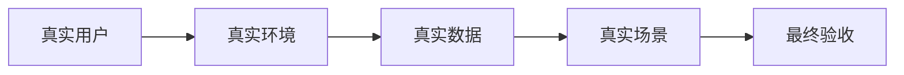
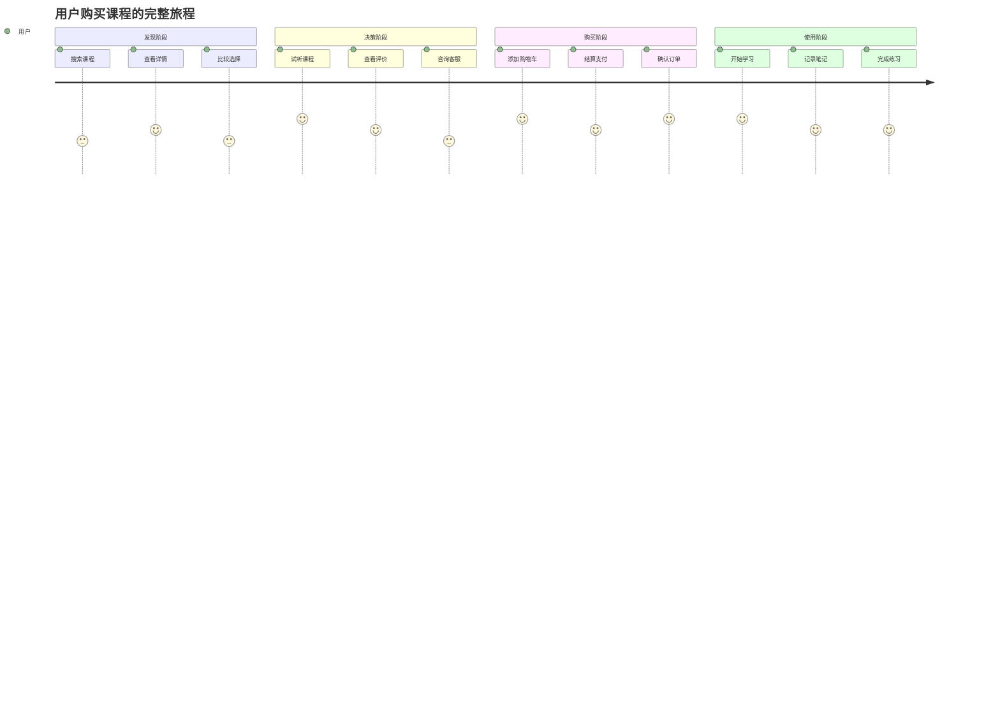

通过模拟真实用户的使用，来确保软件产品上线以后其行为和预期一致，这种测试手段主要包括：

- **用户验收测试（User Acceptance Testing, UAT）**
- **端到端测试（End-to-End Testing, E2E）**
- **场景测试（Scenario Testing）**
- **Beta测试（Beta Testing）**

这些测试方法都围绕一个核心目标：**从用户角度验证软件是否真正满足业务需求和使用预期**。

## 1. 用户验收测试（UAT）

### 1.1 定义与目标

**用户验收测试（UAT）** 是软件测试的最后阶段，由实际用户或业务代表执行，验证系统是否满足业务需求和用户期望。

**核心目标**：
- ✅ 验证软件是否解决了用户的实际问题
- ✅ 确保系统在真实环境中的可用性
- ✅ 验证业务流程的完整性和正确性
- ✅ 获得用户对软件的最终认可

### 1.2 UAT的特点



**关键特征**：
- **由实际用户执行**：不是专业测试人员
- **业务导向**：关注业务价值而非技术细节
- **黑盒测试**：不关心内部实现
- **最终验收**：通过UAT是软件发布的前提

### 1.3 UAT的类型

#### Alpha测试
```typescript
// 内部用户测试
interface AlphaTest {
  environment: "内部受控环境";
  participants: "公司内部员工";
  focus: "基本功能验证";
  timing: "开发完成后";
}
```

#### Beta测试
```typescript
// 外部真实用户测试
interface BetaTest {
  environment: "用户真实环境";
  participants: "目标用户群体";
  focus: "真实使用场景";
  timing: "正式发布前";
}
```

#### 业务验收测试（BAT）
```typescript
// 业务流程验证
interface BusinessAcceptanceTest {
  focus: "端到端业务流程";
  scenarios: "完整用户旅程";
  criteria: "业务目标达成";
  stakeholders: "业务方代表";
}
```

## 2. 端到端测试（E2E Testing）

### 2.1 什么是E2E测试

端到端测试模拟用户的完整操作流程，从应用的一端到另一端验证整个系统的工作流程。

```typescript
// E2E测试示例 - 用户购买课程流程
describe('完整购买流程', () => {
  test('用户从注册到购买课程的完整流程', async () => {
    // 1. 用户注册
    await page.goto('/register');
    await page.fill('#email', 'user@example.com');
    await page.fill('#password', 'SecurePass123');
    await page.click('#register-btn');
    
    // 2. 浏览课程
    await page.goto('/courses');
    await page.click('[data-course-id="react-basics"]');
    
    // 3. 添加到购物车
    await page.click('#add-to-cart');
    
    // 4. 结算支付
    await page.goto('/checkout');
    await page.fill('#card-number', '4532123456789012');
    await page.fill('#expiry', '12/25');
    await page.fill('#cvv', '123');
    await page.click('#pay-now');
    
    // 5. 验证结果
    await expect(page.locator('#success-message')).toBeVisible();
    await expect(page.locator('#order-number')).toContainText(/ORD-\d+/);
  });
});
```

### 2.2 E2E测试的价值

**🎯 关键价值**：
- 验证系统各组件的集成
- 发现单元测试无法发现的问题
- 确保用户流程的完整性
- 提供对整个系统的信心

**⚠️ 成本考虑**：
- 执行时间长
- 维护成本高
- 环境依赖多
- 调试困难

### 2.3 E2E测试最佳实践

```typescript
// 使用页面对象模式
class CheckoutPage {
  constructor(private page: Page) {}
  
  async fillPaymentInfo(cardInfo: CardInfo) {
    await this.page.fill('#card-number', cardInfo.number);
    await this.page.fill('#expiry', cardInfo.expiry);
    await this.page.fill('#cvv', cardInfo.cvv);
  }
  
  async submitPayment() {
    await this.page.click('#pay-now');
    return new OrderConfirmationPage(this.page);
  }
}

// 测试数据管理
const testData = {
  validUser: {
    email: 'test@example.com',
    password: 'SecurePass123'
  },
  validCard: {
    number: '4532123456789012',
    expiry: '12/25',
    cvv: '123'
  }
};
```

## 3. 场景测试（Scenario Testing）

### 3.1 定义与方法

场景测试基于真实用户的使用场景设计测试用例，模拟用户在实际环境中的行为模式。

```gherkin
# 使用BDD格式描述场景
Feature: 在线课程学习
  As a 付费用户
  I want to 学习已购买的课程
  So that 我可以获得知识和技能

Scenario: 观看视频课程
  Given 我已经登录并购买了"React基础课程"
  When 我点击进入课程页面
  And 我选择第一个视频开始观看
  Then 我应该能够正常播放视频
  And 系统应该记录我的学习进度
  And 我可以暂停、快进、调节音量

Scenario: 完成课程练习
  Given 我正在学习"React基础课程"
  When 我完成了视频学习并点击练习题
  And 我提交了练习答案
  Then 系统应该显示我的答题结果
  And 我的课程进度应该更新
  And 我应该能够查看正确答案解析
```

### 3.2 场景测试设计原则

**🎭 用户角色驱动**：
```typescript
interface UserPersona {
  role: "新手用户" | "经验用户" | "专家用户";
  goals: string[];
  painPoints: string[];
  typicalJourney: string[];
}

const personas = {
  newbie: {
    role: "新手用户",
    goals: ["快速上手", "避免出错"],
    painPoints: ["不熟悉界面", "担心操作错误"],
    typicalJourney: ["谨慎探索", "需要指导", "频繁确认"]
  },
  expert: {
    role: "专家用户",
    goals: ["高效完成", "批量操作"],
    painPoints: ["重复操作", "速度慢"],
    typicalJourney: ["快速导航", "使用快捷键", "批量处理"]
  }
};
```

**🔄 完整用户旅程**：


## 4. 实施策略与最佳实践

### 4.1 测试环境准备

```typescript
// 生产环境镜像配置
interface TestEnvironment {
  database: "生产数据的匿名化副本";
  services: "与生产环境相同的服务配置";
  network: "模拟真实网络条件";
  devices: "覆盖目标用户设备";
}

// 测试数据准备
class TestDataFactory {
  static createRealisticUser(): User {
    return {
      id: faker.datatype.uuid(),
      email: faker.internet.email(),
      name: faker.name.findName(),
      preferences: this.generateUserPreferences(),
      history: this.generateUserHistory()
    };
  }
  
  static generateUserPreferences() {
    // 基于真实用户行为模式生成偏好设置
  }
  
  static generateUserHistory() {
    // 生成符合真实使用模式的历史数据
  }
}
```

### 4.2 测试执行策略

```typescript
// 分层测试策略
const testingPyramid = {
  e2e: {
    percentage: "10%",
    focus: "关键业务流程",
    tools: ["Playwright", "Cypress"],
    frequency: "每次发布前"
  },
  integration: {
    percentage: "20%",
    focus: "组件间交互",
    tools: ["Jest", "@testing-library/react"],
    frequency: "每次构建"
  },
  unit: {
    percentage: "70%",
    focus: "单个功能验证",
    tools: ["Vitest", "Jest"],
    frequency: "持续运行"
  }
};

// 测试优先级分类
const testPriority = {
  P0: "核心业务流程，阻断发布",
  P1: "重要功能，影响用户体验",
  P2: "次要功能，可延后修复",
  P3: "边缘情况，优化项"
};
```

### 4.3 测试结果评估

```typescript
// 验收标准定义
interface AcceptanceCriteria {
  functionalRequirements: {
    criticalPath: "100%通过";
    majorFeatures: "95%通过";
    minorFeatures: "90%通过";
  };
  
  performanceRequirements: {
    pageLoadTime: "< 3秒";
    apiResponseTime: "< 500ms";
    userAction: "< 200ms响应";
  };
  
  usabilityRequirements: {
    taskCompletionRate: "> 90%";
    userSatisfactionScore: "> 4.0/5.0";
    errorRate: "< 5%";
  };
}

// 问题分类与处理
enum IssueCategory {
  BLOCKER = "阻断发布，必须修复",
  CRITICAL = "严重影响使用，优先修复", 
  MAJOR = "功能缺陷，计划修复",
  MINOR = "轻微问题，择机修复",
  ENHANCEMENT = "改进建议，未来考虑"
}
```

## 5. 工具与技术栈

### 5.1 自动化测试工具

```typescript
// Playwright - 现代E2E测试框架
import { test, expect } from '@playwright/test';

test('用户登录流程', async ({ page }) => {
  await page.goto('/login');
  await page.fill('#email', 'user@example.com');
  await page.fill('#password', 'password123');
  await page.click('#login-button');
  
  await expect(page).toHaveURL('/dashboard');
  await expect(page.locator('#welcome-message')).toBeVisible();
});

// Cypress - 流行的E2E测试工具
describe('购物车功能', () => {
  it('添加商品到购物车', () => {
    cy.visit('/products');
    cy.get('[data-cy=product-card]').first().click();
    cy.get('[data-cy=add-to-cart]').click();
    cy.get('[data-cy=cart-badge]').should('contain', '1');
  });
});
```

### 5.2 用户反馈收集

```typescript
// 用户体验数据收集
interface UserFeedback {
  usabilityScore: number;  // SUS量表评分
  taskSuccess: boolean;    // 任务完成情况
  timeToComplete: number;  // 完成时间
  errorCount: number;      // 错误次数
  satisfaction: number;    // 满意度评分
  comments: string;        // 用户反馈
}

// A/B测试集成
class ABTestService {
  async trackUserBehavior(userId: string, variant: 'A' | 'B') {
    // 记录用户在不同版本下的行为差异
  }
  
  async analyzeConversionRate() {
    // 分析不同版本的转化率
  }
}
```

### 5.3 监控与分析

```typescript
// 实时用户行为监控
interface UserAnalytics {
  pageViews: UserEvent[];
  clickStreams: ClickEvent[];
  errorEvents: ErrorEvent[];
  performanceMetrics: PerformanceData[];
}

// 错误追踪
class ErrorTracker {
  static captureUserError(error: Error, context: UserContext) {
    // 记录用户遇到的错误，包含完整上下文
    return {
      timestamp: new Date(),
      error: error.message,
      stack: error.stack,
      userAgent: navigator.userAgent,
      url: window.location.href,
      userId: context.userId,
      sessionId: context.sessionId,
      userActions: context.recentActions
    };
  }
}
```

## 6. 实际项目中的应用

### 6.1 电商平台UAT案例

```typescript
// 电商平台关键用户场景
const ecommerceScenarios = [
  {
    name: "新用户首次购买",
    steps: [
      "访问首页",
      "浏览商品分类",
      "搜索特定商品",
      "查看商品详情",
      "添加到购物车",
      "注册账户",
      "填写收货地址",
      "选择支付方式",
      "完成支付",
      "接收订单确认"
    ],
    successCriteria: "整个流程在10分钟内完成，无系统错误"
  },
  
  {
    name: "老用户复购",
    steps: [
      "登录账户",
      "查看购买历史",
      "一键重购",
      "修改收货地址",
      "使用优惠券",
      "快速支付"
    ],
    successCriteria: "3分钟内完成购买"
  }
];
```

### 6.2 SaaS软件UAT实施

```typescript
// SaaS产品多租户测试
class SaaSUATFramework {
  async testMultiTenantScenarios() {
    const tenants = ['small-business', 'enterprise', 'startup'];
    
    for (const tenant of tenants) {
      await this.setupTenantEnvironment(tenant);
      await this.runTenantSpecificTests(tenant);
      await this.validateDataIsolation(tenant);
    }
  }
  
  async validateUserRoles(tenant: string) {
    const roles = ['admin', 'manager', 'user', 'viewer'];
    
    for (const role of roles) {
      await this.loginAsRole(tenant, role);
      await this.verifyAccessPermissions(role);
      await this.testFeatureAccess(role);
    }
  }
}
```

## 7. 常见挑战与解决方案

### 7.1 测试环境挑战

**🔧 环境一致性问题**：
```typescript
// 使用Docker确保环境一致性
// docker-compose.yml
const dockerConfig = `
version: '3.8'
services:
  app:
    build: .
    environment:
      - NODE_ENV=uat
      - DATABASE_URL=postgresql://uat_user:password@db:5432/uat_db
  
  db:
    image: postgres:13
    environment:
      - POSTGRES_DB=uat_db
      - POSTGRES_USER=uat_user
      - POSTGRES_PASSWORD=password
    volumes:
      - ./data/uat-seed.sql:/docker-entrypoint-initdb.d/seed.sql
`;

// 自动化环境部署
class EnvironmentManager {
  async setupUATEnvironment() {
    await this.provisionInfrastructure();
    await this.deployApplication();
    await this.seedTestData();
    await this.runSmokeTests();
  }
}
```

### 7.2 数据管理挑战

**📊 测试数据问题**：
```typescript
// 数据脱敏与生成
class TestDataManager {
  async anonymizeProductionData() {
    // 对生产数据进行脱敏处理
    return await this.db.query(`
      UPDATE users 
      SET 
        email = CONCAT('test_', id, '@example.com'),
        phone = CONCAT('1234567', LPAD(id::text, 3, '0')),
        name = CONCAT('Test User ', id)
      WHERE environment = 'uat'
    `);
  }
  
  async generateRealisticTestData() {
    // 生成符合业务规律的测试数据
    const users = Array.from({ length: 1000 }, () => ({
      email: faker.internet.email(),
      registrationDate: faker.date.between('2020-01-01', '2023-12-31'),
      purchaseHistory: this.generatePurchasePattern(),
      behaviorPattern: this.generateUserBehavior()
    }));
    
    return users;
  }
}
```

### 7.3 用户参与挑战

**👥 用户协调问题**：
```typescript
// 用户测试管理系统
interface UATUserManagement {
  recruitment: {
    criteria: "目标用户画像";
    incentives: "参与激励机制";
    scheduling: "测试时间协调";
  };
  
  guidance: {
    training: "用户培训材料";
    scenarios: "测试场景指导";
    support: "实时支持渠道";
  };
  
  feedback: {
    collection: "反馈收集机制";
    analysis: "反馈分析流程";
    tracking: "问题跟踪系统";
  };
}
```

## 8. 度量与改进

### 8.1 关键指标（KPI）

```typescript
// UAT成功度量指标
interface UATMetrics {
  // 功能性指标
  testCoverage: number;        // 测试覆盖率
  passRate: number;           // 通过率
  defectDensity: number;      // 缺陷密度
  
  // 用户体验指标
  taskCompletionRate: number;  // 任务完成率
  userSatisfaction: number;    // 用户满意度
  usabilityScore: number;      // 可用性评分
  
  // 效率指标
  testExecutionTime: number;   // 测试执行时间
  defectDetectionRate: number; // 缺陷发现率
  timeToMarket: number;       // 上市时间
}

// 持续改进机制
class UATImprovement {
  async analyzeTestEffectiveness() {
    const metrics = await this.collectMetrics();
    const bottlenecks = await this.identifyBottlenecks();
    const improvements = await this.suggestImprovements();
    
    return {
      currentState: metrics,
      identifiedIssues: bottlenecks,
      actionPlan: improvements
    };
  }
  
  async implementImprovements(actionPlan: ActionItem[]) {
    for (const action of actionPlan) {
      await this.executeImprovement(action);
      await this.measureImpact(action);
    }
  }
}
```

### 8.2 回归分析

```typescript
// 回归测试策略
class RegressionTestStrategy {
  async selectCriticalTests() {
    // 基于风险和变更影响选择回归测试用例
    const changedComponents = await this.analyzeCodeChanges();
    const impactedFeatures = await this.mapFeatureImpacts(changedComponents);
    const criticalTests = await this.prioritizeTests(impactedFeatures);
    
    return criticalTests;
  }
  
  async executeSmartRegression() {
    // 智能回归测试执行
    const testSelection = await this.selectCriticalTests();
    const results = await this.runParallelTests(testSelection);
    
    if (results.hasFailures) {
      await this.expandTestScope();
    }
    
    return results;
  }
}
```

## 9. 总结

### 9.1 核心价值

通过模拟真实用户使用来验证软件的测试方法具有以下核心价值：

**🎯 用户中心验证**：
- 确保软件真正解决用户问题
- 验证用户体验是否符合预期
- 发现技术测试无法发现的问题

**🚀 风险降低**：
- 在上线前发现潜在问题
- 减少生产环境故障
- 提高用户满意度和产品成功率

**💡 业务价值确认**：
- 验证商业目标的实现
- 确保投资回报
- 为产品决策提供数据支持

### 9.2 成功要素

**📋 完整的测试策略**：
- 明确的验收标准
- 全面的场景覆盖
- 合适的工具选择
- 有效的团队协作

**🔄 持续改进机制**：
- 定期回顾和总结
- 基于数据的决策
- 流程优化和工具升级
- 知识积累和传承

### 9.3 最佳实践建议

1. **早期规划**：在项目开始就制定UAT策略
2. **用户参与**：确保真实用户的深度参与
3. **环境准备**：构建接近生产的测试环境
4. **自动化结合**：平衡自动化和手工测试
5. **持续监控**：上线后继续监控用户反馈

通过系统性地实施这些测试方法，可以显著提高软件质量，确保产品上线后的成功。记住，最好的测试不是找到最多的bug，而是确保用户能够成功地使用软件完成他们的目标。

---

**相关文档**：
- [软件测试基本概念](./基本概念.mdx)
- [Testing Library - 用户中心测试](./Testing%20Library.mdx)
- [测试成本与开发效率的平衡](./测试成本与开发效率的平衡.mdx)
