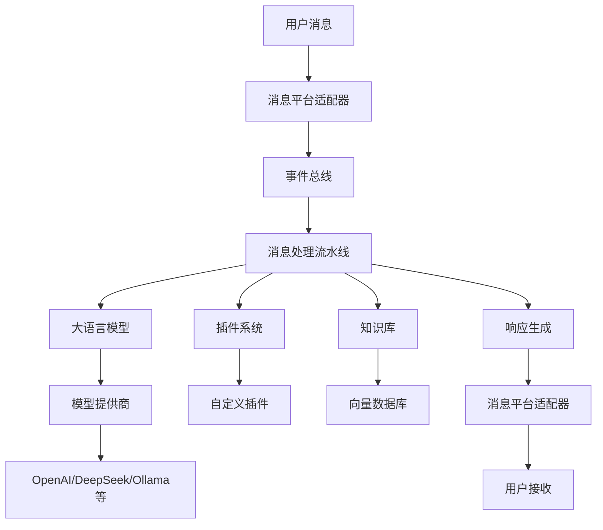

AstrBot 是一个开源的多平台聊天机器人及开发框架，旨在提供易于使用且多平台兼容的聊天机器人解决方案。它支持多个消息平台的集成，并能够接入各种大语言模型，实现智能对话、知识库问答、角色扮演等功能。


## 文档导航

- **[部署指南](./部署指南)** - 详细的部署教程，包括Docker、Windows、云部署等多种方式
- **[插件开发](./插件开发指南)** - 插件开发教程和API文档

## 核心特性

### 🌟 多平台支持
- **QQ**: 支持QQ个人号和QQ频道
- **微信**: 支持微信个人号和微信公众平台
- **企业通讯**: 支持飞书、钉钉、企业微信
- **国际平台**: 支持Telegram、Discord、Slack、KOOK等
- **多实例部署**: 可同时在多个平台部署机器人实例

### 🧠 大语言模型集成
- **主流模型**: OpenAI GPT、Anthropic Claude、Google Gemini
- **国产模型**: 智谱GLM、DeepSeek、通义千问、文心一言
- **本地部署**: 支持Ollama、LMStudio等本地模型
- **第三方服务**: 支持302.AI、PPIO派欧云等模型服务
- **多模态能力**: 支持图片理解、语音转文字(Whisper)、文字转语音

### 🏗️ 架构设计
- **松耦合**: 基于事件总线和流水线的架构设计
- **异步处理**: 采用异步编程模型，高效处理多平台消息
- **模块化**: 完全模块化设计，所有功能可独立开启或关闭
- **高扩展性**: 支持插件开发，轻松扩展功能

### 🛠️ 开发友好
- **可视化管理**: 提供Web管理面板，支持配置修改、插件管理、日志查看
- **插件系统**: 极简的插件开发接口，几行代码即可开发插件
- **丰富API**: 完善的开发文档和API接口
- **多种部署方式**: 支持Docker、Windows一键安装、手动部署等

## 主要功能

### 智能对话
- 多轮对话支持
- 人格情境设定
- 上下文记忆
- 自定义回复逻辑

### Agent能力
- 代码执行器
- 网页搜索
- 自然语言待办
- 函数调用(Function Calling)
- MCP(Model Context Protocol)支持

### 知识库
- 文档问答
- 知识检索
- RAG(检索增强生成)
- 与Dify平台集成

### 群聊管理
- 速率限制
- 白名单控制
- 关键词过滤
- 内容审核(百度内容审核)

### 多媒体处理
- 图片理解和生成
- 语音转文字
- 文字转语音
- 文件处理

## 架构图



## 快速开始

### Docker部署(推荐)

```bash
# 创建数据目录
mkdir astrbot

# 运行容器
docker run -itd \
  -p 6180-6200:6180-6200 \
  -p 11451:11451 \
  -v ./astrbot/data:/AstrBot/data \
  --name astrbot \
  soulter/astrbot:latest

# 查看启动日志获取登录信息
docker logs astrbot
```

### Windows一键部署

1. 下载Windows安装器
2. 运行安装程序
3. 按照向导完成配置

### 雨云一键部署

访问 [雨云部署页面](https://www.rainyun.com/NjY3OTQ1_) 进行一键云部署。

## 配置示例

### 基础配置

```yaml
# config.yaml
bot:
  name: "AstrBot"
  admin: ["your_qq_number"]
  
platform:
  qq:
    enabled: true
    adapter: "aiocqhttp"
    
llm:
  provider: "openai"
  api_key: "your_api_key"
  model: "gpt-3.5-turbo"
```

### 插件配置

```python
# plugins/example_plugin.py
from astrbot.api import Star, AstrMessageEvent

class ExampleStar(Star):
    def __init__(self):
        super().__init__()
        self.name = "示例插件"
        self.description = "这是一个示例插件"
    
    async def handle(self, event: AstrMessageEvent):
        if event.message.content == "hello":
            await event.reply("Hello, World!")
```

## 使用场景

### 个人助手
- 日程管理
- 信息查询
- 智能问答
- 生活助手

### 企业应用
- 客服机器人
- 知识库问答
- 工作流自动化
- 团队协作

### 开发学习
- AI应用开发
- 聊天机器人研究
- 多平台集成
- 插件开发

## 社区与支持

- **官方网站**: https://astrbot.soulter.top/
- **GitHub仓库**: https://github.com/AstrBotDevs/AstrBot
- **文档中心**: https://astrbot.app/
- **社区交流**: 加入官方QQ群或Telegram群
- **问题反馈**: 通过GitHub Issues提交

## 开源许可

AstrBot 采用 [AGPL-v3](https://www.chinasona.org/gnu/agpl-3.0-cn.html) 开源许可证。如需商业使用，请联系 community@astrbot.app 申请商业授权。

## 相关项目

- **Dify**: 大模型应用开发平台，与AstrBot深度集成
- **Gewechat**: 微信聊天机器人接口
- **NapCat**: QQ机器人协议实现
- **Ollama**: 本地大模型运行环境

---

*最后更新: 2025年7月*
