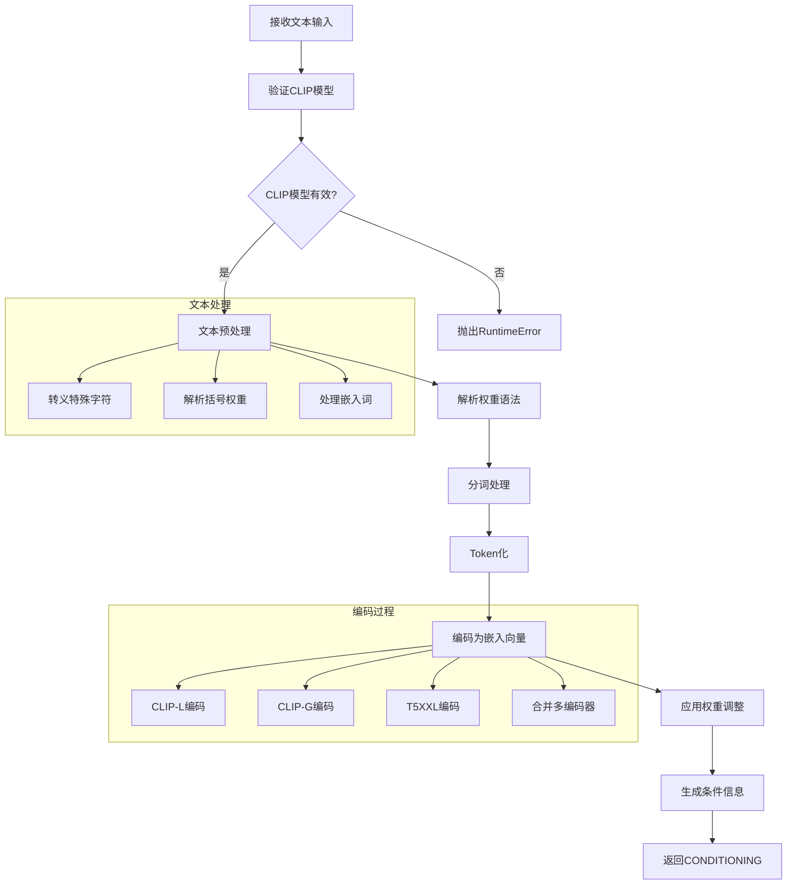
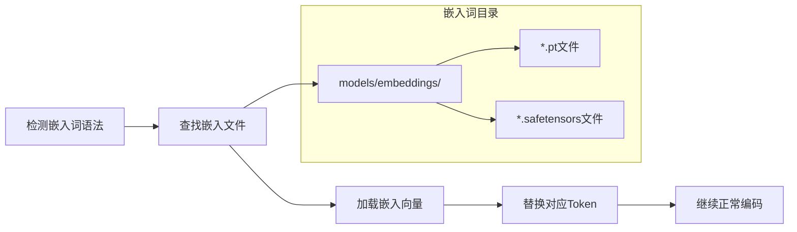
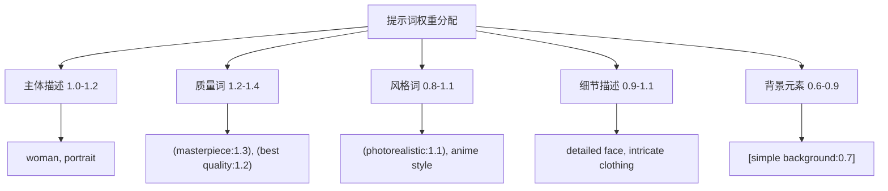
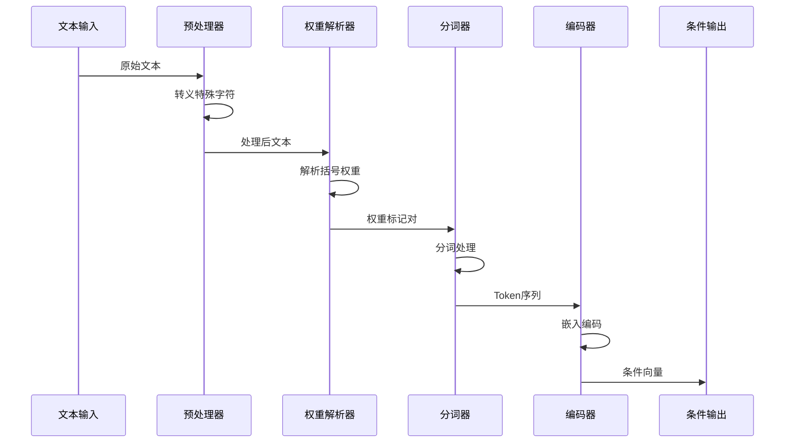
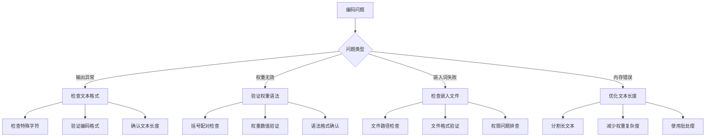

# CLIPTextEncode 节点详细分析

## 概述

`CLIPTextEncode` 是ComfyUI中负责文本编码的核心节点，它将自然语言文本转换为扩散模型可以理解的数值表示（嵌入向量）。这个节点是连接人类语言和AI图像生成的桥梁，直接影响生成图像与文本描述的匹配程度。

## 节点基本信息

### 类定义
```python
class CLIPTextEncode(ComfyNodeABC):
    CATEGORY = "conditioning"
    DESCRIPTION = "Encodes a text prompt using a CLIP model into an embedding that can be used to guide the diffusion model towards generating specific images."
    FUNCTION = "encode"
    RETURN_TYPES = (IO.CONDITIONING,)
```

### 显示名称
- **内部名称**: `CLIPTextEncode`
- **显示名称**: `CLIP Text Encode`
- **类别**: `conditioning`

## 输入输出规格

### 输入参数详解

```python
@classmethod
def INPUT_TYPES(s) -> InputTypeDict:
    return {
        "required": {
            "text": (IO.STRING, {
                "multiline": True, 
                "dynamicPrompts": True, 
                "tooltip": "The text to be encoded."
            }),
            "clip": (IO.CLIP, {
                "tooltip": "The CLIP model used for encoding the text."
            })
        }
    }
```

#### 参数详细说明

1. **text** (STRING)
   - 要编码的文本提示词
   - 支持多行输入
   - 支持动态提示词语法
   - 支持权重调整语法

2. **clip** (CLIP)
   - CLIP文本编码器模型
   - 来源：CheckpointLoaderSimple等加载器节点
   - 用于将文本转换为嵌入向量

### 输出类型

```python
RETURN_TYPES = (IO.CONDITIONING,)
OUTPUT_TOOLTIPS = ("A conditioning containing the embedded text used to guide the diffusion model.",)
```

**输出说明**:
- **CONDITIONING**: 包含文本嵌入的条件信息，用于引导扩散模型生成

## 核心实现分析

### 主要执行函数

```python
def encode(self, clip, text):
    if clip is None:
        raise RuntimeError("ERROR: clip input is invalid: None\n\nIf the clip is from a checkpoint loader node your checkpoint does not contain a valid clip or text encoder model.")
    tokens = clip.tokenize(text)
    return (clip.encode_from_tokens_scheduled(tokens), )
```

### 执行流程图



## 文本权重语法详解

### 权重调整语法

CLIPTextEncode支持丰富的文本权重调整语法：

#### 1. 基本括号语法
```
(word)          # 权重 × 1.1
((word))        # 权重 × 1.21 (1.1²)
(((word)))      # 权重 × 1.331 (1.1³)
[word]          # 权重 × 0.909 (1/1.1)
[[word]]        # 权重 × 0.826 (1/1.1²)
```

#### 2. 精确权重语法
```
(word:1.5)      # 权重设为1.5
(word:0.8)      # 权重设为0.8
(word:2.0)      # 权重设为2.0
```

#### 3. 复合权重示例
```
(beautiful:1.3) woman, ((detailed face:1.2)), [background:0.7]
```

### 权重处理机制

```python
def token_weights(string, current_weight):
    a = parse_parentheses(string)
    out = []
    for x in a:
        weight = current_weight
        if len(x) >= 2 and x[-1] == ')' and x[0] == '(':
            x = x[1:-1]
            xx = x.rfind(":")
            weight *= 1.1  # 默认权重增强
            if xx > 0:
                try:
                    weight = float(x[xx+1:])  # 自定义权重
                    x = x[:xx]
                except:
                    pass
            out += token_weights(x, weight)
        else:
            out += [(x, current_weight)]
    return out
```

## 多编码器架构支持

### 不同模型的编码器配置

#### 1. SD 1.x/2.x 模型
```python
# 单一CLIP-L编码器
class SD1Tokenizer:
    def __init__(self):
        self.clip_l = SDTokenizer()
    
    def tokenize_with_weights(self, text):
        return {"l": self.clip_l.tokenize_with_weights(text)}
```

#### 2. SDXL 模型
```python
# 双编码器：CLIP-L + CLIP-G
class SDXLTokenizer:
    def __init__(self):
        self.clip_l = SDTokenizer()
        self.clip_g = SDXLClipGTokenizer()
    
    def tokenize_with_weights(self, text):
        return {
            "g": self.clip_g.tokenize_with_weights(text),
            "l": self.clip_l.tokenize_with_weights(text)
        }
```

#### 3. SD3 模型
```python
# 三编码器：CLIP-L + CLIP-G + T5XXL
class SD3Tokenizer:
    def __init__(self):
        self.clip_l = SDTokenizer()
        self.clip_g = SDXLClipGTokenizer()
        self.t5xxl = T5XXLTokenizer()
    
    def tokenize_with_weights(self, text):
        return {
            "g": self.clip_g.tokenize_with_weights(text),
            "l": self.clip_l.tokenize_with_weights(text),
            "t5xxl": self.t5xxl.tokenize_with_weights(text)
        }
```

### 编码器特点对比

| 编码器 | 最大长度 | 特点 | 适用模型 |
|--------|----------|------|----------|
| **CLIP-L** | 77 tokens | 基础文本理解 | SD1.x, SD2.x, SDXL, SD3 |
| **CLIP-G** | 77 tokens | 增强语义理解 | SDXL, SD3 |
| **T5XXL** | 512 tokens | 长文本支持 | SD3, Flux |

## 嵌入词(Embeddings)支持

### 嵌入词语法
```
embedding:filename.pt
embedding:filename
```

### 嵌入词处理流程



## 高级文本编码节点

### 1. CLIPTextEncodeSDXL
专为SDXL模型设计的高级编码器：

```python
def encode(self, clip, width, height, crop_w, crop_h, target_width, target_height, text_g, text_l):
    tokens = clip.tokenize(text_g)
    tokens["l"] = clip.tokenize(text_l)["l"]
    return (clip.encode_from_tokens_scheduled(tokens, add_dict={
        "width": width, "height": height, 
        "crop_w": crop_w, "crop_h": crop_h, 
        "target_width": target_width, "target_height": target_height
    }), )
```

**特点**:
- 分离的全局(text_g)和局部(text_l)提示
- 分辨率条件信息
- 裁剪参数支持

### 2. CLIPTextEncodeFlux
专为Flux模型设计：

```python
def encode(self, clip, clip_l, t5xxl, guidance):
    tokens = clip.tokenize(clip_l)
    tokens["t5xxl"] = clip.tokenize(t5xxl)["t5xxl"]
    return (clip.encode_from_tokens_scheduled(tokens, add_dict={"guidance": guidance}), )
```

**特点**:
- CLIP-L + T5XXL双编码器
- 内置引导强度参数
- 长文本支持(T5XXL)

### 3. CLIPTextEncodeSD3
专为SD3模型设计：

```python
def encode(self, clip, clip_l, clip_g, t5xxl, empty_padding):
    tokens = clip.tokenize(clip_g)
    tokens["l"] = clip.tokenize(clip_l)["l"]
    tokens["t5xxl"] = clip.tokenize(t5xxl)["t5xxl"]
    return (clip.encode_from_tokens_scheduled(tokens), )
```

**特点**:
- 三编码器架构
- 独立的文本输入
- 空填充控制

## 性能优化特性

### 1. 调度编码(Scheduled Encoding)
```python
def encode_from_tokens_scheduled(self, tokens, unprojected=False, add_dict={}, show_pbar=True):
    # 支持动态权重调度
    # 批处理优化
    # 内存管理
```

### 2. 批处理优化
- 自动批次大小调整
- 内存使用优化
- GPU/CPU智能调度

### 3. 缓存机制
- Token缓存
- 嵌入向量缓存
- 重复文本优化

## 使用示例和最佳实践

### 基本用法
```json
{
    "text_encoder": {
        "inputs": {
            "text": "a beautiful woman, detailed face, photorealistic",
            "clip": ["checkpoint_loader", 1]
        },
        "class_type": "CLIPTextEncode"
    }
}
```

### 高级权重调整
```
正向提示：
(masterpiece:1.3), (best quality:1.2), beautiful woman, (detailed face:1.1), photorealistic, [background:0.8]

负向提示：
(worst quality:1.4), (low quality:1.4), (normal quality:1.4), lowres, bad anatomy, [text:0.5]
```

### 长文本处理
```
# 对于SD3/Flux等支持长文本的模型
A highly detailed portrait of a young woman with flowing auburn hair, 
wearing an elegant Victorian-era dress with intricate lace patterns, 
standing in a sunlit garden filled with blooming roses and jasmine flowers, 
with soft natural lighting creating gentle shadows across her face, 
painted in the style of John Singer Sargent with photorealistic detail.
```

## 常见问题和解决方案

### 1. CLIP模型为空错误
```
ERROR: clip input is invalid: None
```
**解决方案**:
- 确保CheckpointLoaderSimple正确连接
- 检查模型文件是否包含CLIP组件
- 验证模型文件完整性

### 2. 文本过长截断
**问题**: 文本超过最大长度限制
**解决方案**:
- 使用支持长文本的模型(SD3, Flux)
- 分解长文本为多个部分
- 使用ConditioningCombine组合多个编码

### 3. 权重语法错误
**问题**: 括号不匹配或语法错误
**解决方案**:
- 检查括号配对
- 验证权重数值格式
- 使用转义字符处理特殊符号

### 4. 嵌入词加载失败
**问题**: 嵌入词文件找不到
**解决方案**:
- 确认文件在models/embeddings/目录
- 检查文件名和扩展名
- 验证文件格式(.pt, .safetensors)

## 与其他节点的关系

### 上游依赖
- **CheckpointLoaderSimple**: 提供CLIP模型
- **CLIPLoader**: 独立加载CLIP模型
- **文本输入**: 用户提供的提示词

### 下游连接
- **KSampler**: 接收CONDITIONING用于采样
- **ConditioningCombine**: 组合多个条件
- **ConditioningSetArea**: 区域条件设置

## 扩展和变体节点

### 专用编码器节点
- **CLIPTextEncodeSDXL**: SDXL专用
- **CLIPTextEncodeFlux**: Flux专用
- **CLIPTextEncodeSD3**: SD3专用
- **CLIPTextEncodeHunyuanDiT**: HunyuanDiT专用

### 功能增强节点
- **CLIPTextEncodeControlnet**: ControlNet集成
- **GLIGENTextBoxApply**: GLIGEN文本框
- **ConditioningSetTimestepRange**: 时间步范围控制

## 提示词工程最佳实践

### 1. 权重调整策略

#### 权重分配原则


#### 权重调整示例
```
# 强调质量和主体
(masterpiece:1.4), (best quality:1.3), beautiful woman, (detailed face:1.2),
(photorealistic:1.1), elegant dress, [simple background:0.8]

# 艺术风格强调
(oil painting:1.3), (classical art:1.2), portrait of a woman,
(renaissance style:1.1), detailed brushwork, [modern elements:0.5]

# 细节控制
woman, ((extremely detailed face:1.3)), (perfect eyes:1.2),
(natural skin texture:1.1), [makeup:0.7], soft lighting
```

### 2. 不同模型的提示词策略

#### SD 1.5 模型
```
# 特点：需要详细描述，对权重敏感
(masterpiece:1.2), (best quality:1.2), 1girl, beautiful detailed eyes,
detailed face, long hair, dress, standing, outdoors, garden,
(photorealistic:1.1), (detailed:1.1)
```

#### SDXL 模型
```
# 特点：更好的自然语言理解，可以使用更自然的描述
A beautiful young woman with flowing hair, wearing an elegant dress,
standing in a sunlit garden. Photorealistic, high quality, detailed portrait.
```

#### SD3 模型
```
# 特点：支持长文本，更好的语义理解
A highly detailed photorealistic portrait of a beautiful woman with auburn hair
cascading over her shoulders, wearing an intricately designed Victorian-era gown
with delicate lace details, standing gracefully in a blooming rose garden
with soft natural lighting illuminating her face.
```

### 3. 动态提示词技术

#### 通配符语法
```
{morning|afternoon|evening} light, {red|blue|green} dress,
{happy|serene|mysterious} expression
```

#### 条件提示词
```
# 基于随机性的变化
woman, {detailed face|beautiful eyes|perfect skin},
{long hair|short hair|curly hair}, {dress|blouse|jacket}
```

### 4. 负向提示词策略

#### 通用负向提示词
```
(worst quality:1.4), (low quality:1.4), (normal quality:1.4),
lowres, bad anatomy, bad hands, text, error, missing fingers,
extra digit, fewer digits, cropped, jpeg artifacts, signature,
watermark, username, blurry
```

#### 特定问题针对
```
# 解剖问题
bad anatomy, bad hands, bad feet, malformed limbs, extra limbs,
missing limbs, fused fingers, too many fingers

# 图像质量
blurry, out of focus, low resolution, pixelated, compression artifacts,
noise, grain, oversaturated, undersaturated

# 不需要的元素
text, watermark, signature, logo, copyright, username,
frame, border, multiple views, split screen
```

## 技术深度解析

### 1. Token化过程详解



### 2. 多编码器融合机制

```python
# SDXL编码器融合示例
def encode_token_weights(self, token_weight_pairs):
    token_weight_pairs_g = token_weight_pairs["g"]
    token_weight_pairs_l = token_weight_pairs["l"]

    g_out, g_pooled = self.clip_g.encode_token_weights(token_weight_pairs_g)
    l_out, l_pooled = self.clip_l.encode_token_weights(token_weight_pairs_l)

    # 对齐序列长度
    cut_to = min(l_out.shape[1], g_out.shape[1])

    # 拼接编码结果
    combined = torch.cat([l_out[:,:cut_to], g_out[:,:cut_to]], dim=-1)

    return combined, g_pooled
```

### 3. 内存优化策略

#### 批处理优化
```python
def batch_encode_optimization(texts, clip_model):
    # 按长度分组
    grouped_texts = group_by_length(texts)

    results = []
    for group in grouped_texts:
        # 批量处理相似长度的文本
        batch_tokens = [clip_model.tokenize(text) for text in group]
        batch_encodings = clip_model.encode_batch(batch_tokens)
        results.extend(batch_encodings)

    return results
```

#### 缓存机制
```python
class TextEncodingCache:
    def __init__(self, max_size=1000):
        self.cache = {}
        self.max_size = max_size

    def get_encoding(self, text_hash):
        return self.cache.get(text_hash)

    def store_encoding(self, text_hash, encoding):
        if len(self.cache) >= self.max_size:
            # LRU清理策略
            self.cache.pop(next(iter(self.cache)))
        self.cache[text_hash] = encoding
```

## 调试和故障排除

### 常见编码问题诊断



### 性能监控指标

| 指标 | 正常范围 | 异常表现 | 优化建议 |
|------|----------|----------|----------|
| **编码时间** | &lt;2秒 | &gt;5秒 | 减少文本长度，优化权重 |
| **内存使用** | &lt;2GB | &gt;4GB | 启用批处理，清理缓存 |
| **Token数量** | &lt;77(SD1.5) | 截断警告 | 简化描述，分离提示 |
| **权重复杂度** | &lt;20个权重 | 解析错误 | 简化权重结构 |

## 实际应用案例

### 1. 人像摄影风格
```
# 正向提示
(professional portrait photography:1.3), beautiful woman,
(detailed face:1.2), (perfect eyes:1.1), natural makeup,
(soft studio lighting:1.2), (shallow depth of field:1.1),
85mm lens, (photorealistic:1.2)

# 负向提示
(amateur photography:1.2), harsh lighting, deep focus,
wide angle distortion, [heavy makeup:0.8]
```

### 2. 艺术绘画风格
```
# 正向提示
(oil painting:1.4), (classical art:1.3), portrait of a woman,
(renaissance style:1.2), (detailed brushwork:1.1),
warm color palette, (masterpiece:1.3)

# 负向提示
(digital art:1.2), (modern style:1.1), flat colors,
simple shading, [photographic:0.7]
```

### 3. 动漫插画风格
```
# 正向提示
(anime:1.3), (manga style:1.2), 1girl, beautiful detailed eyes,
(detailed face:1.1), long hair, (colorful:1.1),
(high quality illustration:1.2)

# 负向提示
(realistic:1.3), (photographic:1.2), 3D render,
western cartoon, [simple art:0.8]
```

## 总结

`CLIPTextEncode`是ComfyUI文本到图像生成流程的关键节点，它：

1. **核心功能**: 将自然语言转换为模型可理解的数值表示
2. **灵活语法**: 支持丰富的权重调整和嵌入词语法
3. **多架构支持**: 适配不同模型的编码器配置
4. **性能优化**: 智能缓存和批处理机制
5. **扩展性强**: 为不同模型提供专用变体

理解CLIPTextEncode的工作原理对于掌握提示词工程和优化生成效果至关重要。通过合理使用权重语法、选择合适的编码器变体，用户可以精确控制AI图像生成的方向和质量。

## 相关资源

- [CLIP论文](https://arxiv.org/abs/2103.00020)
- [提示词工程指南](https://docs.comfy.org/essentials/prompting)
- [权重语法文档](https://github.com/comfyanonymous/ComfyUI/wiki/Prompt-Syntax)
- [嵌入词训练教程](https://docs.comfy.org/tutorials/embeddings)
