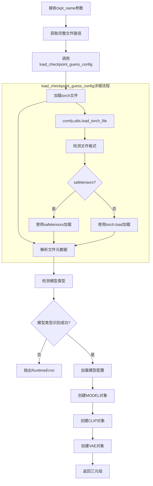
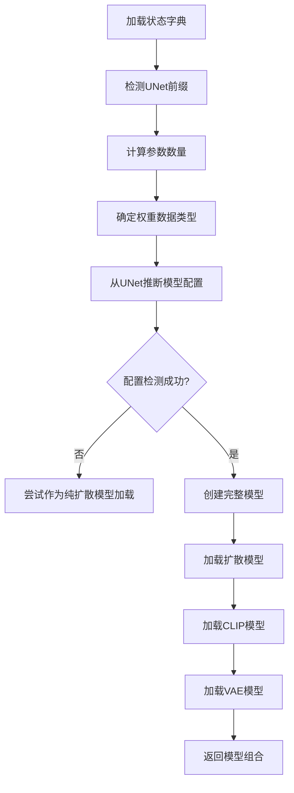
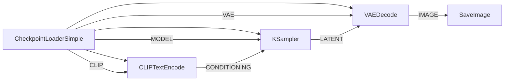

# CheckpointLoaderSimple 节点详细分析

## 概述

`CheckpointLoaderSimple` 是ComfyUI中最重要的基础节点之一，负责加载稳定扩散模型检查点文件。它是大多数AI图像生成工作流的起点，提供了模型、CLIP文本编码器和VAE三个核心组件。

## 节点基本信息

### 类定义
```python
class CheckpointLoaderSimple:
    CATEGORY = "loaders"
    DESCRIPTION = "Loads a diffusion model checkpoint, diffusion models are used to denoise latents."
    FUNCTION = "load_checkpoint"
    RETURN_TYPES = ("MODEL", "CLIP", "VAE")
```

### 显示名称
- **内部名称**: `CheckpointLoaderSimple`
- **显示名称**: `Load Checkpoint`
- **类别**: `loaders`

## 输入输出规格

### 输入参数

#### INPUT_TYPES
```python
@classmethod
def INPUT_TYPES(s):
    return {
        "required": {
            "ckpt_name": (folder_paths.get_filename_list("checkpoints"), 
                         {"tooltip": "The name of the checkpoint (model) to load."}),
        }
    }
```

**参数说明**:
- `ckpt_name`: 检查点文件名
  - **类型**: 下拉选择列表
  - **来源**: `models/checkpoints/` 目录中的文件
  - **支持格式**: `.ckpt`, `.safetensors`, `.pt`, `.pth`
  - **提示**: "The name of the checkpoint (model) to load."

### 输出类型

```python
RETURN_TYPES = ("MODEL", "CLIP", "VAE")
OUTPUT_TOOLTIPS = (
    "The model used for denoising latents.",
    "The CLIP model used for encoding text prompts.", 
    "The VAE model used for encoding and decoding images to and from latent space."
)
```

**输出说明**:
1. **MODEL**: 扩散模型 - 用于去噪潜在空间
2. **CLIP**: 文本编码器 - 用于编码文本提示
3. **VAE**: 变分自编码器 - 用于图像与潜在空间的转换

## 核心实现分析

### 主要执行函数

```python
def load_checkpoint(self, ckpt_name):
    ckpt_path = folder_paths.get_full_path_or_raise("checkpoints", ckpt_name)
    out = comfy.sd.load_checkpoint_guess_config(
        ckpt_path, 
        output_vae=True, 
        output_clip=True, 
        embedding_directory=folder_paths.get_folder_paths("embeddings")
    )
    return out[:3]
```

### 执行流程图



## 深度技术分析

### 1. 文件路径解析

#### folder_paths.get_full_path_or_raise
```python
def get_full_path_or_raise(folder_name: str, filename: str) -> str:
    full_path = get_full_path(folder_name, filename)
    if full_path is None:
        raise FileNotFoundError(f"Model in folder '{folder_name}' with filename '{filename}' not found.")
    return full_path
```

**功能**:
- 在`models/checkpoints/`目录中搜索指定文件
- 支持子目录递归搜索
- 文件不存在时抛出明确错误信息

### 2. 模型加载核心逻辑

#### comfy.sd.load_checkpoint_guess_config
```python
def load_checkpoint_guess_config(ckpt_path, output_vae=True, output_clip=True, 
                                output_clipvision=False, embedding_directory=None, 
                                output_model=True, model_options={}, te_model_options={}):
    # 1. 加载文件和元数据
    sd, metadata = comfy.utils.load_torch_file(ckpt_path, return_metadata=True)
    
    # 2. 解析状态字典并猜测配置
    out = load_state_dict_guess_config(sd, output_vae, output_clip, output_clipvision, 
                                      embedding_directory, output_model, model_options, 
                                      te_model_options=te_model_options, metadata=metadata)
    
    # 3. 错误处理
    if out is None:
        raise RuntimeError("ERROR: Could not detect model type of: {}\n{}".format(
            ckpt_path, model_detection_error_hint(ckpt_path, sd)))
    return out
```

### 3. 智能模型检测

#### 模型类型检测流程


### 4. 支持的模型格式

#### 文件格式支持
- **SafeTensors** (`.safetensors`): 推荐格式，安全且快速
- **PyTorch** (`.ckpt`, `.pt`, `.pth`): 传统格式，需要pickle
- **状态字典结构**: 自动检测和解析

#### 模型架构支持
- **SD 1.x**: 原始Stable Diffusion
- **SD 2.x**: 改进版本，包含unCLIP
- **SDXL**: 高分辨率模型
- **SD3/SD3.5**: 最新架构
- **其他**: Flux, Cascade, 等现代架构

## 使用示例

### 基本用法
```json
{
    "4": {
        "inputs": {
            "ckpt_name": "sd_xl_base_1.0.safetensors"
        },
        "class_type": "CheckpointLoaderSimple"
    }
}
```

### 工作流连接示例


## 性能特性

### 1. 内存管理
- **智能加载**: 根据设备能力选择数据类型
- **设备管理**: 自动GPU/CPU分配
- **内存优化**: 支持低VRAM模式

### 2. 缓存机制
- **模型缓存**: 避免重复加载相同模型
- **权重共享**: 多个实例共享权重
- **延迟加载**: 按需加载模型组件

### 3. 错误处理
- **文件验证**: 检查文件存在性和完整性
- **格式检测**: 自动识别模型格式
- **错误提示**: 提供有用的错误信息

## 与其他节点的关系

### 相关加载器节点
- **CheckpointLoader**: 已弃用的配置文件版本
- **UNETLoader**: 仅加载扩散模型
- **CLIPLoader**: 仅加载CLIP模型
- **VAELoader**: 仅加载VAE模型

### 下游节点
- **KSampler**: 使用MODEL进行采样
- **CLIPTextEncode**: 使用CLIP编码文本
- **VAEDecode/VAEEncode**: 使用VAE处理图像

## 常见问题和解决方案

### 1. 文件未找到错误
```
FileNotFoundError: Model in folder 'checkpoints' with filename 'xxx.safetensors' not found.
```
**解决方案**: 确保模型文件在`models/checkpoints/`目录中

### 2. 模型类型检测失败
```
RuntimeError: ERROR: Could not detect model type of: xxx
```
**解决方案**: 
- 检查文件是否损坏
- 确认文件格式正确
- 查看是否为LoRA文件误放

### 3. 内存不足
**解决方案**:
- 使用`--lowvram`启动参数
- 选择较小的模型
- 启用CPU模式

## 最佳实践

### 1. 模型组织
```
models/
├── checkpoints/
│   ├── sd15/
│   │   └── v1-5-pruned.safetensors
│   ├── sdxl/
│   │   └── sd_xl_base_1.0.safetensors
│   └── sd3/
│       └── sd3_medium.safetensors
```

### 2. 性能优化
- 优先使用`.safetensors`格式
- 根据用途选择合适的模型大小
- 合理配置内存参数

### 3. 工作流设计
- 将CheckpointLoaderSimple放在工作流开始
- 合理连接输出到对应的处理节点
- 避免重复加载相同模型

## 总结

`CheckpointLoaderSimple`是ComfyUI生态系统的核心节点，它：

1. **简化了模型加载**: 无需手动配置，自动检测模型类型
2. **提供完整功能**: 一次加载获得MODEL、CLIP、VAE三个组件
3. **智能化处理**: 自动优化内存使用和设备分配
4. **广泛兼容**: 支持各种模型格式和架构
5. **错误友好**: 提供清晰的错误信息和解决提示

这个节点的设计体现了ComfyUI"简单易用但功能强大"的设计理念，为用户提供了一个可靠的模型加载入口点。
