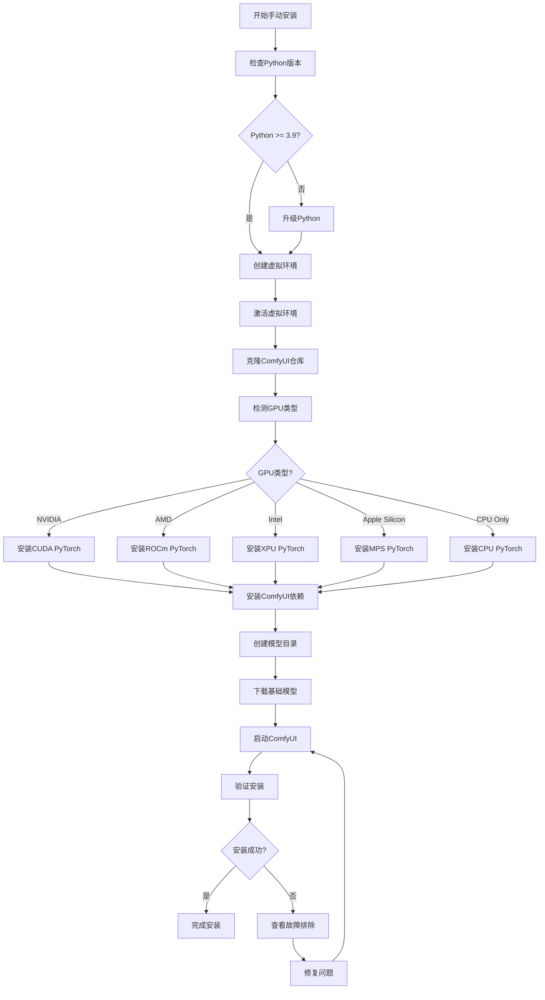

# ComfyUI 安装指南

本指南将详细介绍如何在不同操作系统和硬件配置上安装ComfyUI。

## 目录
- [系统要求](#系统要求)
- [安装方式选择](#安装方式选择)
- [快速安装](#快速安装)
- [手动安装](#手动安装)
- [GPU特定安装](#gpu特定安装)
- [验证安装](#验证安装)
- [常见问题](#常见问题)
- [高级配置](#高级配置)

## 系统要求

### 基本要求
- **Python**: 3.9+ (推荐 3.12 或 3.13)
- **操作系统**: Windows 10+, Linux, macOS 10.15+
- **内存**: 最低 8GB RAM (推荐 16GB+)
- **存储**: 最低 10GB 可用空间 (模型文件需要额外空间)

### GPU要求
| GPU类型 | 最低VRAM | 推荐VRAM | 支持状态 |
|---------|----------|----------|----------|
| NVIDIA | 4GB | 8GB+ | ✅ 完全支持 |
| AMD (Linux) | 6GB | 12GB+ | ✅ ROCm支持 |
| Intel Arc | 8GB | 16GB+ | ✅ XPU支持 |
| Apple Silicon | 8GB | 16GB+ | ✅ MPS支持 |
| CPU Only | - | - | ✅ 支持但较慢 |

## 安装方式选择

### 安装方式决策树


### 1. 桌面应用程序 (推荐新手)
**优点**: 一键安装，自动更新，用户友好
**缺点**: 功能可能有限制
**适用**: Windows, macOS

```bash
# 下载地址
https://www.comfy.org/download
```

### 2. Windows便携包
**优点**: 免安装，完全便携，包含最新功能
**缺点**: 仅支持Windows
**适用**: Windows + NVIDIA GPU

```bash
# 直接下载链接
https://github.com/comfyanonymous/ComfyUI/releases/latest/download/ComfyUI_windows_portable_nvidia.7z
```

### 3. comfy-cli (推荐开发者)
**优点**: 命令行管理，版本控制，环境隔离
**缺点**: 需要命令行知识
**适用**: 所有平台

```bash
pip install comfy-cli
comfy install
```

### 4. 手动安装 (最灵活)
**优点**: 完全控制，支持所有功能，可自定义
**缺点**: 配置复杂
**适用**: 所有平台和GPU类型

## 快速安装

### Windows用户
```powershell
# 方法1: 桌面应用 (最简单)
# 访问 https://www.comfy.org/download 下载安装

# 方法2: 便携包
# 1. 下载 ComfyUI_windows_portable_nvidia.7z
# 2. 用7-Zip解压
# 3. 运行 run_nvidia_gpu.bat

# 方法3: comfy-cli
pip install comfy-cli
comfy install
comfy launch
```

### macOS用户
```bash
# 方法1: 桌面应用
# 访问 https://www.comfy.org/download 下载安装

# 方法2: comfy-cli
pip install comfy-cli
comfy install
comfy launch

# 方法3: 手动安装 (见下文详细步骤)
```

### Linux用户
```bash
# 推荐使用comfy-cli或手动安装
pip install comfy-cli
comfy install
comfy launch
```

## 手动安装

### 安装流程图



### 第一步：准备环境

#### 1. 安装Python
```bash
# 检查Python版本
python --version

# 如果版本低于3.9，请升级Python
# Windows: 从 python.org 下载安装
# macOS: brew install python@3.12
# Linux: sudo apt install python3.12 python3.12-pip
```

#### 2. 创建虚拟环境 (推荐)
```bash
# 创建虚拟环境
python -m venv comfyui_env

# 激活虚拟环境
# Windows:
comfyui_env\Scripts\activate
# macOS/Linux:
source comfyui_env/bin/activate
```

### 第二步：获取源码
```bash
# 克隆仓库
git clone https://github.com/comfyanonymous/ComfyUI.git
cd ComfyUI

# 或下载ZIP包并解压
```

### 第三步：安装PyTorch

#### NVIDIA GPU (推荐)
```bash
# 稳定版本
pip install torch torchvision torchaudio --extra-index-url https://download.pytorch.org/whl/cu129

# 夜间版本 (可能有性能改进)
pip install --pre torch torchvision torchaudio --index-url https://download.pytorch.org/whl/nightly/cu129
```

#### AMD GPU (仅Linux)
```bash
# ROCm 6.4 稳定版
pip install torch torchvision torchaudio --index-url https://download.pytorch.org/whl/rocm6.4

# ROCm 6.4 夜间版
pip install --pre torch torchvision torchaudio --index-url https://download.pytorch.org/whl/nightly/rocm6.4
```

#### Intel GPU
```bash
# Intel XPU支持
pip install torch torchvision torchaudio --index-url https://download.pytorch.org/whl/xpu

# 夜间版本
pip install --pre torch torchvision torchaudio --index-url https://download.pytorch.org/whl/nightly/xpu
```

#### Apple Silicon (M1/M2/M3)
```bash
# 安装PyTorch nightly (推荐)
pip install --pre torch torchvision torchaudio --extra-index-url https://download.pytorch.org/whl/nightly/cpu
```

#### CPU Only
```bash
# CPU版本
pip install torch torchvision torchaudio --index-url https://download.pytorch.org/whl/cpu
```

### 第四步：安装依赖
```bash
# 安装ComfyUI依赖
pip install -r requirements.txt
```

### 第五步：准备模型目录
```bash
# 创建模型目录结构 (如果不存在)
mkdir -p models/checkpoints
mkdir -p models/vae
mkdir -p models/loras
mkdir -p models/controlnet
mkdir -p models/clip_vision
mkdir -p models/upscale_models

# 下载基础模型 (示例)
# 将SD模型文件放入 models/checkpoints/
# 将VAE文件放入 models/vae/
```

### 第六步：启动ComfyUI
```bash
# 基本启动
python main.py

# 指定端口
python main.py --port 8080

# 允许外部访问
python main.py --listen 0.0.0.0

# 自动打开浏览器
python main.py --auto-launch
```

## GPU特定安装

### GPU配置选择图

```mermaid
graph LR
    subgraph "GPU类型检测"
        A[检测GPU] --> B{GPU类型}
    end

    subgraph "NVIDIA配置"
        B -->|NVIDIA| C[检查CUDA版本]
        C --> D[安装CUDA PyTorch]
        D --> E[优化选项]
        E --> F[--force-fp16<br/>--bf16-unet]
    end

    subgraph "AMD配置"
        B -->|AMD| G[检查ROCm支持]
        G --> H{Linux?}
        H -->|是| I[安装ROCm PyTorch]
        H -->|否| J[使用DirectML<br/>(不推荐)]
        I --> K[设置环境变量]
        K --> L[HSA_OVERRIDE_GFX_VERSION]
    end

    subgraph "Intel配置"
        B -->|Intel| M[检查Arc GPU]
        M --> N[安装XPU PyTorch]
        N --> O[启用优化]
    end

    subgraph "Apple配置"
        B -->|Apple Silicon| P[检查MPS支持]
        P --> Q[安装PyTorch nightly]
        Q --> R[启用Metal加速]
    end

    subgraph "CPU配置"
        B -->|CPU Only| S[安装CPU PyTorch]
        S --> T[启用多线程]
        T --> U[--cpu选项]
    end
```

### NVIDIA GPU优化
```bash
# 检查CUDA版本
nvidia-smi

# 如果遇到CUDA错误，重新安装PyTorch
pip uninstall torch torchvision torchaudio
pip install torch torchvision torchaudio --extra-index-url https://download.pytorch.org/whl/cu129

# 启动时的优化选项
python main.py --force-fp16  # 强制使用FP16
python main.py --bf16-unet   # 使用BF16 (RTX 30/40系列)
```

### AMD GPU (Linux)
```bash
# 检查ROCm安装
rocm-smi

# 对于不支持的AMD卡
# RDNA2 (6700, 6600等)
HSA_OVERRIDE_GFX_VERSION=10.3.0 python main.py

# RDNA3 (7600等)
HSA_OVERRIDE_GFX_VERSION=11.0.0 python main.py

# 启用实验性优化
TORCH_ROCM_AOTRITON_ENABLE_EXPERIMENTAL=1 python main.py --use-pytorch-cross-attention
```

### Intel GPU
```bash
# 检查Intel GPU
intel_gpu_top

# 启动选项
python main.py --force-fp16
```

### Apple Silicon
```bash
# 检查Metal支持
python -c "import torch; print(torch.backends.mps.is_available())"

# 启动选项
python main.py --force-fp16
```

## 验证安装

### 1. 基本功能测试
```bash
# 启动ComfyUI
python main.py

# 检查控制台输出，应该看到:
# "To see the GUI go to: http://127.0.0.1:8188"
```

### 2. Web界面测试
1. 打开浏览器访问 `http://127.0.0.1:8188`
2. 应该看到ComfyUI的节点编辑界面
3. 尝试加载默认工作流

### 3. GPU测试
```bash
# 在Python中检查GPU
python -c "
import torch
print(f'CUDA available: {torch.cuda.is_available()}')
print(f'MPS available: {torch.backends.mps.is_available()}')
print(f'Device count: {torch.cuda.device_count()}')
if torch.cuda.is_available():
    print(f'Current device: {torch.cuda.current_device()}')
    print(f'Device name: {torch.cuda.get_device_name()}')
"
```

## 常见问题

### 故障排除流程


### 1. PyTorch CUDA错误
```bash
# 错误: "Torch not compiled with CUDA enabled"
# 解决方案:
pip uninstall torch torchvision torchaudio
pip install torch torchvision torchaudio --extra-index-url https://download.pytorch.org/whl/cu129
```

### 2. 内存不足错误
```bash
# 启用低VRAM模式
python main.py --lowvram

# 或使用CPU
python main.py --cpu
```

### 3. 端口被占用
```bash
# 更换端口
python main.py --port 8080

# 检查端口占用
# Windows: netstat -ano | findstr :8188
# Linux/macOS: lsof -i :8188
```

### 4. 模型加载失败
```bash
# 检查模型路径
ls models/checkpoints/

# 检查模型格式 (支持 .ckpt, .safetensors, .pt)
# 确保模型文件完整且未损坏
```

### 5. 权限问题 (Linux/macOS)
```bash
# 给予执行权限
chmod +x main.py

# 或使用sudo (不推荐)
sudo python main.py --port 80
```

## 高级配置

### 1. 环境变量配置
```bash
# 设置模型路径
export COMFYUI_MODEL_PATH="/path/to/models"

# 设置临时目录
export COMFYUI_TEMP_PATH="/path/to/temp"

# 设置输出目录
export COMFYUI_OUTPUT_PATH="/path/to/output"
```

### 2. 配置文件设置
```yaml
# extra_model_paths.yaml
base_path: /path/to/models/
checkpoints: checkpoints/
vae: vae/
loras: loras/
controlnet: controlnet/
```

### 3. 性能优化
```bash
# 启用所有优化
python main.py --fast

# 启用特定优化
python main.py --bf16-unet --attention-pytorch

# 内存优化
python main.py --lowvram --cpu-vae
```

### 4. 开发模式
```bash
# 启用详细日志
python main.py --verbose

# 禁用自定义节点
python main.py --disable-all-custom-nodes

# 启用前端开发模式
python main.py --front-end-version Comfy-Org/ComfyUI_frontend@latest
```

## 更新和维护

### 1. 更新ComfyUI
```bash
# Git方式
git pull origin master

# comfy-cli方式
comfy update

# 手动下载新版本
```

### 2. 更新依赖
```bash
# 更新所有依赖
pip install -r requirements.txt --upgrade

# 更新特定包
pip install torch --upgrade
```

### 3. 清理缓存
```bash
# 清理Python缓存
find . -type d -name "__pycache__" -delete

# 清理临时文件
rm -rf temp/*

# 清理模型缓存
rm -rf models/.cache/
```

## 总结

ComfyUI提供了多种安装方式以适应不同用户的需求：

1. **新手用户**: 推荐使用桌面应用程序或Windows便携包
2. **开发者**: 推荐使用comfy-cli进行环境管理
3. **高级用户**: 推荐手动安装以获得最大灵活性

选择适合您的安装方式，按照本指南的步骤操作，即可成功安装并运行ComfyUI。如遇问题，请参考常见问题部分或访问官方社区寻求帮助。
