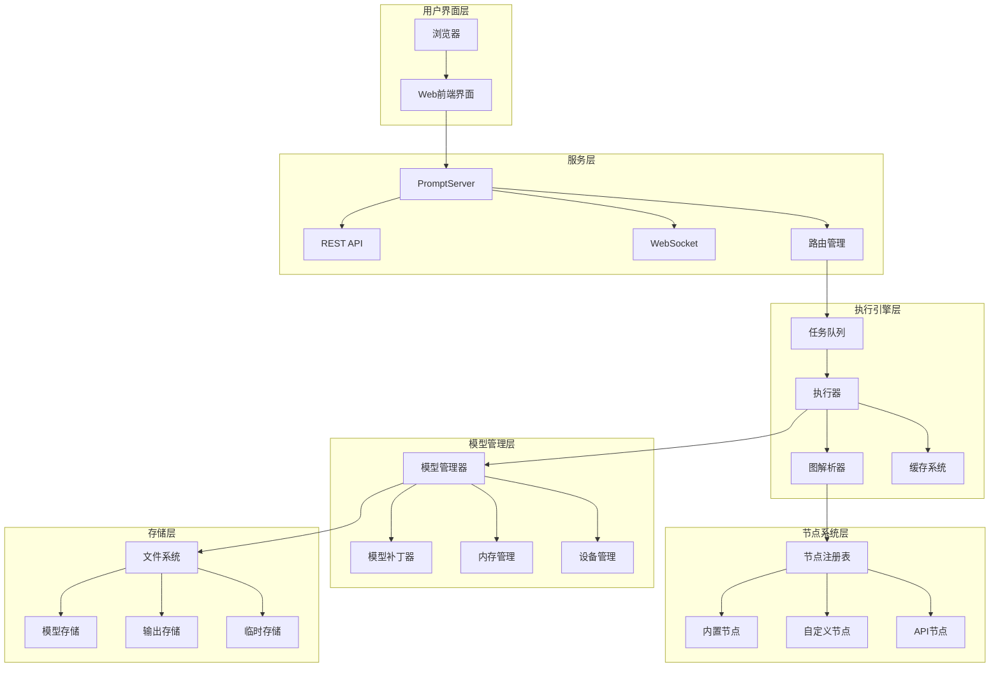
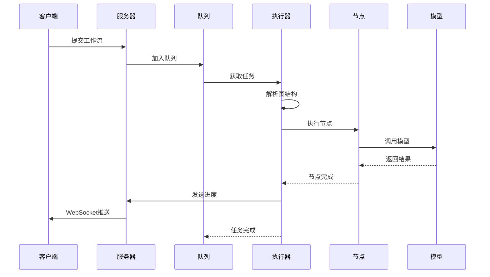
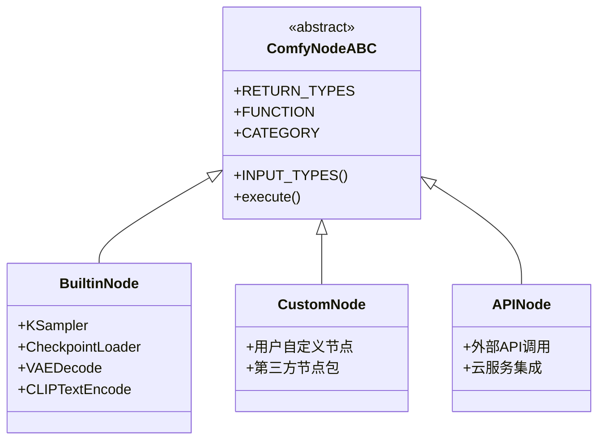
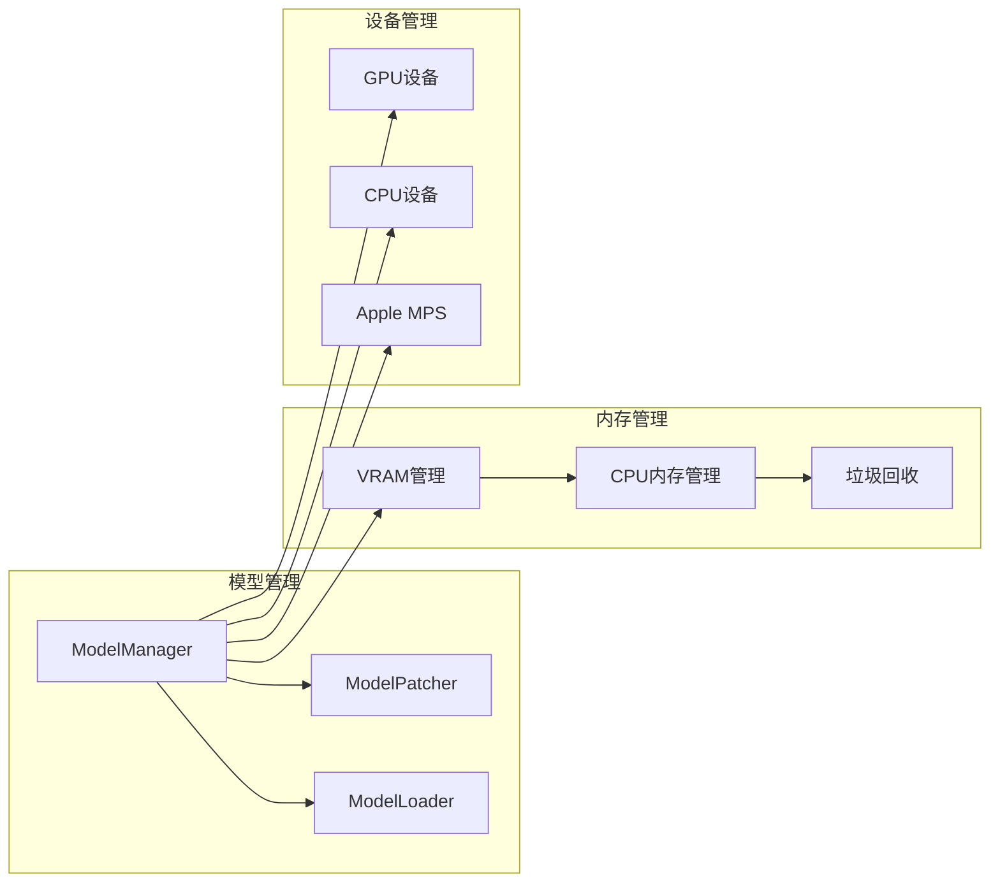
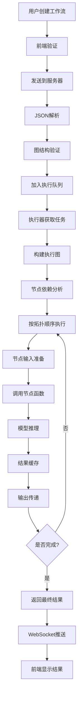
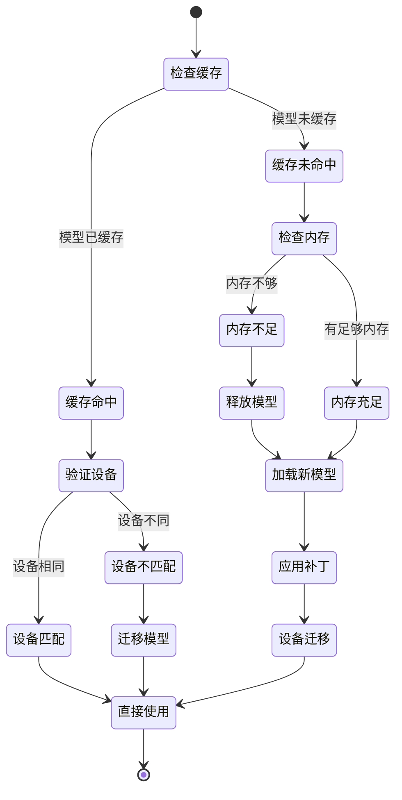
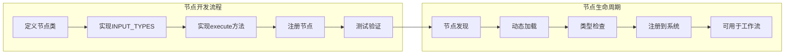
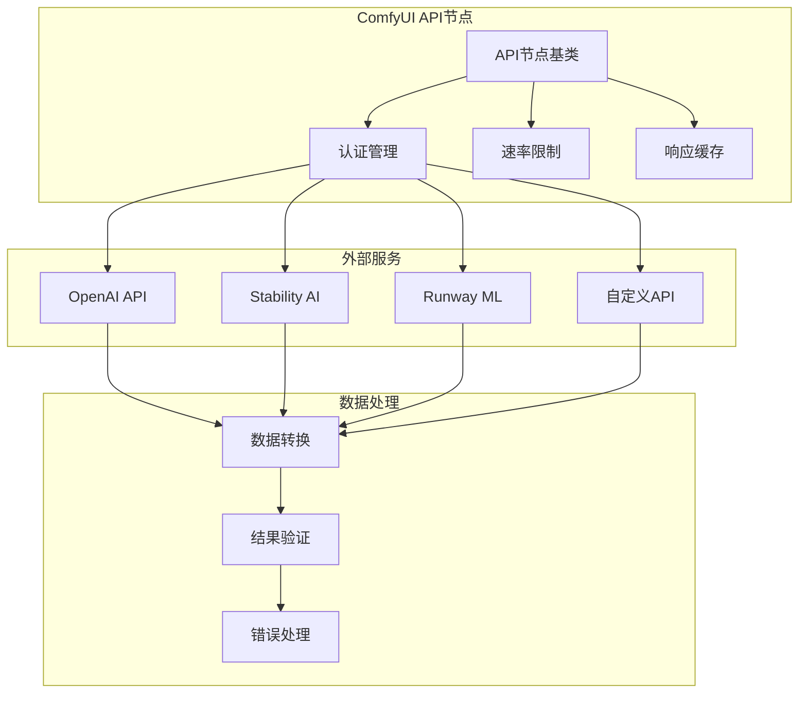

# ComfyUI 架构详解

## 概述

ComfyUI是一个基于节点图的可视化AI工作流引擎，专为稳定扩散和其他AI模型设计。它采用模块化架构，支持复杂的AI管道构建和执行。本文将深入分析ComfyUI的整体架构设计。

## 核心架构组件

### 1. 系统整体架构

ComfyUI采用分层架构设计，主要包括以下几个层次：

- **前端层（Frontend）** - 基于Web的用户界面
- **服务层（Server）** - HTTP/WebSocket服务器
- **执行层（Execution）** - 工作流执行引擎
- **模型层（Model）** - AI模型管理和推理
- **存储层（Storage）** - 文件和数据管理

### 2. 架构图表



## 详细组件分析

### 1. 前端系统

ComfyUI的前端采用现代Web技术栈：

- **技术栈**: TypeScript + Vue.js
- **仓库**: 独立的前端仓库 `ComfyUI_frontend`
- **通信**: 通过WebSocket与后端实时通信
- **功能**: 
  - 可视化节点编辑器
  - 实时预览和进度显示
  - 工作流管理和保存

### 2. 服务器架构

#### PromptServer类
```python
class PromptServer:
    def __init__(self, loop):
        self.app = web.Application()  # aiohttp应用
        self.prompt_queue = execution.PromptQueue(self)
        self.user_manager = UserManager()
        self.model_file_manager = ModelFileManager()
```

**主要功能**:
- HTTP/HTTPS服务器
- WebSocket实时通信
- 用户认证和会话管理
- 文件上传和下载
- API路由管理

### 3. 执行引擎

#### 工作流执行流程



#### 核心执行组件

**1. PromptQueue（任务队列）**
```python
class PromptQueue:
    def __init__(self, server):
        self.queue = []  # 优先级队列
        self.currently_running = {}
        self.history = {}
```

**2. PromptExecutor（执行器）**
```python
class PromptExecutor:
    def execute(self, prompt, prompt_id, extra_data={}, execute_outputs=[]):
        # 解析工作流图
        # 优化执行顺序
        # 缓存管理
        # 节点执行
```

### 4. 节点系统

#### 节点类型架构



#### 节点注册机制
```python
NODE_CLASS_MAPPINGS = {
    "KSampler": KSampler,
    "CheckpointLoaderSimple": CheckpointLoaderSimple,
    "CLIPTextEncode": CLIPTextEncode,
    # ... 更多节点
}
```

### 5. 模型管理系统

#### 模型管理架构



#### 智能内存管理
- **动态卸载**: 根据VRAM使用情况自动卸载模型
- **分层加载**: 支持部分模型加载到GPU
- **设备切换**: 自动在GPU/CPU间切换
- **内存优化**: 智能缓存和垃圾回收

### 6. 文件系统管理

#### 目录结构
```
ComfyUI/
├── models/           # 模型文件
│   ├── checkpoints/  # 主模型
│   ├── vae/         # VAE模型
│   ├── loras/       # LoRA模型
│   └── controlnet/  # ControlNet模型
├── input/           # 输入文件
├── output/          # 输出文件
├── temp/            # 临时文件
└── custom_nodes/    # 自定义节点
```

## 关键特性实现

### 1. 异步执行
- 基于asyncio的异步架构
- 非阻塞的模型加载和推理
- 并发任务处理

### 2. 智能缓存
- 节点输出缓存
- 模型权重缓存
- 增量执行优化

### 3. 扩展性设计
- 插件化节点系统
- 自定义节点开发API
- 第三方集成支持

### 4. 跨平台支持
- Windows/Linux/macOS
- NVIDIA/AMD/Intel GPU
- Apple Silicon优化

## 性能优化策略

### 1. 内存优化
```python
# 智能内存管理示例
def load_models_gpu(models, memory_required=0):
    cleanup_models_gc()  # 垃圾回收
    # 计算所需内存
    # 卸载不必要的模型
    # 加载新模型
```

### 2. 执行优化
- **增量执行**: 只重新执行变化的部分
- **并行处理**: 支持多个独立分支并行
- **预加载**: 预测性模型加载

### 3. 网络优化
- **响应压缩**: 可选的响应体压缩
- **WebSocket**: 实时双向通信
- **文件流**: 大文件流式传输

## 安全性设计

### 1. 文件安全
- 安全的模型文件加载
- 路径遍历防护
- 文件类型验证

### 2. 网络安全
- CORS配置
- TLS/SSL支持
- 请求大小限制

### 3. 执行安全
- 沙箱化节点执行
- 资源使用限制
- 异常处理机制

## 开发和部署

### 1. 开发环境
```bash
# 安装依赖
pip install -r requirements.txt

# 启动开发服务器
python main.py --port 8188
```

### 2. 生产部署
```bash
# HTTPS部署
python main.py \
  --port 8443 \
  --listen 0.0.0.0 \
  --tls-keyfile key.pem \
  --tls-certfile cert.pem
```

### 3. 容器化部署
- Docker支持
- 环境变量配置
- 持久化存储

## 数据流架构

### 工作流数据流



### 模型加载流程



## 扩展机制详解

### 自定义节点开发



### API集成架构



## 总结

ComfyUI采用了现代化的分层架构设计，具有以下优势：

1. **模块化设计**: 各组件职责清晰，易于维护和扩展
2. **高性能**: 智能内存管理和异步执行
3. **可扩展性**: 支持自定义节点和第三方集成
4. **用户友好**: 直观的可视化界面
5. **跨平台**: 广泛的硬件和操作系统支持

这种架构使得ComfyUI能够处理复杂的AI工作流，同时保持良好的性能和用户体验。随着AI技术的发展，ComfyUI的架构设计为未来的功能扩展和性能优化提供了坚实的基础。

## 相关资源

- [ComfyUI官方仓库](https://github.com/comfyanonymous/ComfyUI)
- [ComfyUI前端仓库](https://github.com/Comfy-Org/ComfyUI_frontend)
- [自定义节点开发指南](https://docs.comfy.org/)
- [API文档](https://docs.comfy.org/tutorials/api-nodes/overview)
