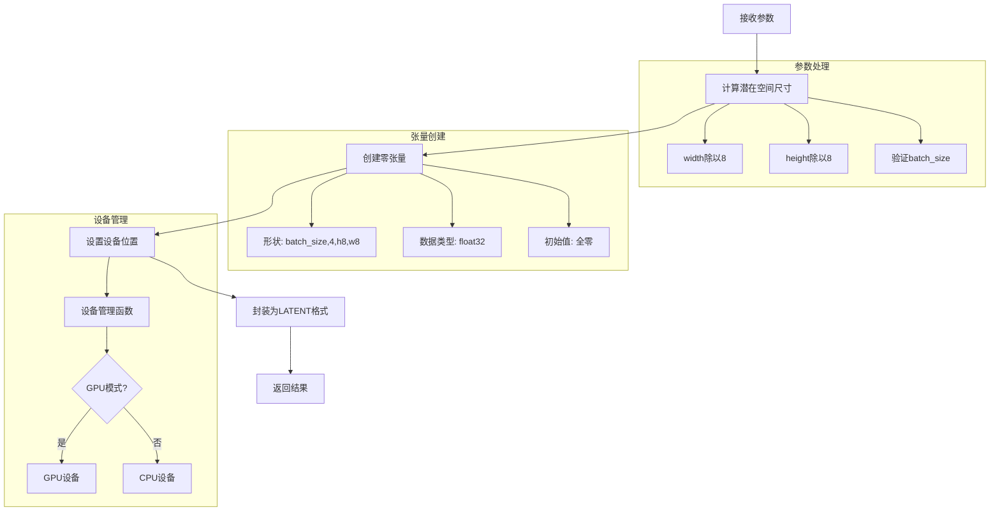
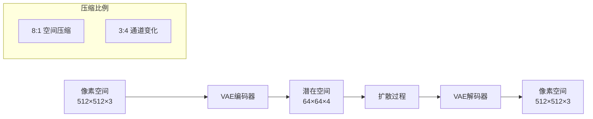
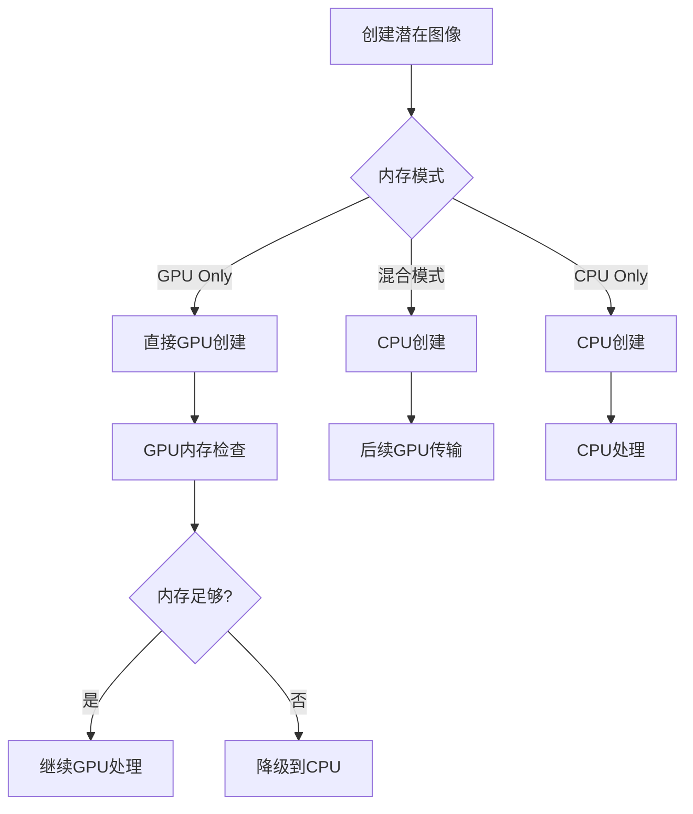
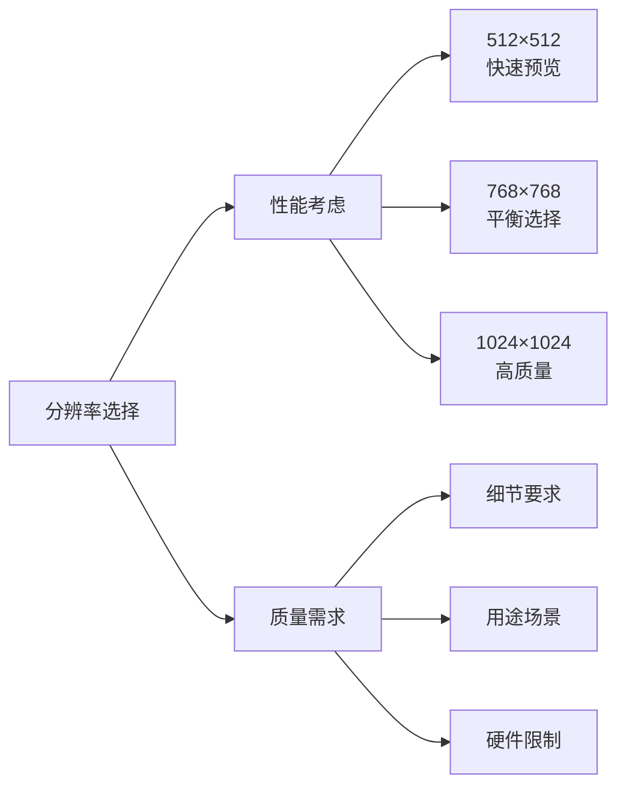
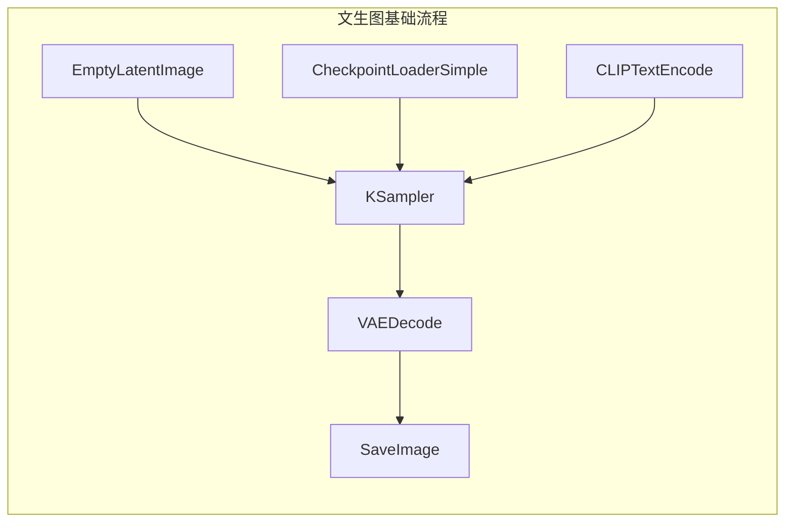
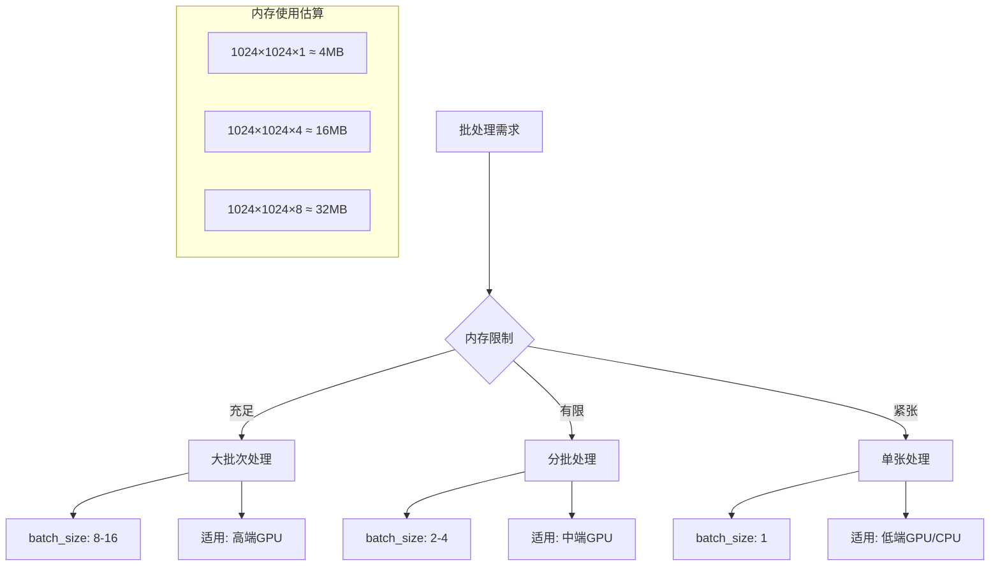
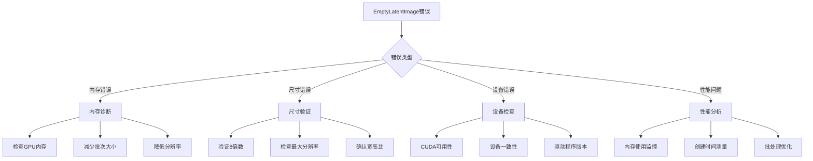

# EmptyLatentImage 节点详细分析

## 概述

`EmptyLatentImage` 是ComfyUI中最基础但极其重要的节点之一，负责创建空的潜在空间图像作为扩散模型采样的起点。它是文生图(Text-to-Image)工作流的必需组件，为KSampler提供初始的噪声画布。

## 节点基本信息

### 类定义
```python
class EmptyLatentImage:
    def __init__(self):
        self.device = comfy.model_management.intermediate_device()
    
    CATEGORY = "latent"
    DESCRIPTION = "Create a new batch of empty latent images to be denoised via sampling."
    FUNCTION = "generate"
    RETURN_TYPES = ("LATENT",)
```

### 显示名称
- **内部名称**: `EmptyLatentImage`
- **显示名称**: `Empty Latent Image`
- **类别**: `latent`

## 输入输出规格

### 输入参数详解

```python
@classmethod
def INPUT_TYPES(s):
    return {
        "required": {
            "width": ("INT", {
                "default": 512, "min": 16, "max": MAX_RESOLUTION, "step": 8,
                "tooltip": "The width of the latent images in pixels."
            }),
            "height": ("INT", {
                "default": 512, "min": 16, "max": MAX_RESOLUTION, "step": 8,
                "tooltip": "The height of the latent images in pixels."
            }),
            "batch_size": ("INT", {
                "default": 1, "min": 1, "max": 4096,
                "tooltip": "The number of latent images in the batch."
            })
        }
    }
```

#### 参数详细说明

1. **width** (INT)
   - 潜在图像的宽度（像素）
   - 默认值：512
   - 范围：16 到 MAX_RESOLUTION
   - 步长：8（必须是8的倍数）
   - 实际潜在空间宽度：width // 8

2. **height** (INT)
   - 潜在图像的高度（像素）
   - 默认值：512
   - 范围：16 到 MAX_RESOLUTION
   - 步长：8（必须是8的倍数）
   - 实际潜在空间高度：height // 8

3. **batch_size** (INT)
   - 批次中的潜在图像数量
   - 默认值：1
   - 范围：1 到 4096
   - 用于批量生成多张图像

### 输出类型

```python
RETURN_TYPES = ("LATENT",)
OUTPUT_TOOLTIPS = ("The empty latent image batch.",)
```

**输出说明**:
- **LATENT**: 包含空潜在图像张量的字典，格式为 `{"samples": tensor}`

## 核心实现分析

### 主要执行函数

```python
def generate(self, width, height, batch_size=1):
    latent = torch.zeros([batch_size, 4, height // 8, width // 8], device=self.device)
    return ({"samples": latent}, )
```

### 执行流程图



## 潜在空间技术详解

### 1. 潜在空间概念

潜在空间是扩散模型工作的核心概念：



### 2. 张量维度解析

```python
# 标准SD模型的潜在空间张量
latent_tensor = torch.zeros([batch_size, 4, height // 8, width // 8])

# 维度说明：
# [0] batch_size: 批次大小
# [1] 4: 潜在空间通道数（固定为4）
# [2] height // 8: 潜在空间高度
# [3] width // 8: 潜在空间宽度
```

#### 不同模型的潜在空间配置

| 模型类型 | 通道数 | 空间压缩比 | 示例尺寸 |
|----------|--------|------------|----------|
| **SD 1.x/2.x** | 4 | 8:1 | 512×512 → 64×64×4 |
| **SDXL** | 4 | 8:1 | 1024×1024 → 128×128×4 |
| **SD3** | 16 | 8:1 | 1024×1024 → 128×128×16 |
| **Flux** | 16 | 8:1 | 1024×1024 → 128×128×16 |

### 3. 设备管理机制

```python
def intermediate_device():
    if args.gpu_only:
        return get_torch_device()  # GPU设备
    else:
        return torch.device("cpu")  # CPU设备
```

**设备选择策略**:
- **GPU模式**: 直接使用GPU设备
- **混合模式**: 使用CPU作为中间设备，减少GPU内存占用
- **CPU模式**: 强制使用CPU设备

## 专用变体节点

### 1. EmptySD3LatentImage
专为SD3模型设计：

```python
def generate(self, width, height, batch_size=1):
    latent = torch.zeros([batch_size, 16, height // 8, width // 8], device=self.device)
    return ({"samples": latent}, )
```

**特点**:
- 16通道潜在空间
- 适配SD3模型架构
- 更高的表达能力

### 2. EmptyLTXVLatentVideo
专为视频生成设计：

```python
def generate(self, width, height, length, batch_size=1):
    latent = torch.zeros([batch_size, 128, ((length - 1) // 8) + 1, height // 32, width // 32], device=self.device)
    return ({"samples": latent}, )
```

**特点**:
- 128通道潜在空间
- 时间维度支持
- 32:1空间压缩比

### 3. StableCascade_EmptyLatentImage
专为Stable Cascade设计：

```python
def generate(self, width, height, compression, batch_size):
    c_latent = torch.zeros([batch_size, 16, height // 16, width // 16])
    b_latent = torch.zeros([batch_size, 4, height // 2, width // 2])
    return ({"samples": c_latent}, {"samples": b_latent})
```

**特点**:
- 双阶段潜在空间
- 不同压缩比例
- 级联生成架构

## 内存优化和性能

### 1. 内存使用计算

```python
def calculate_memory_usage(width, height, batch_size, channels=4, dtype=torch.float32):
    """计算潜在空间张量的内存使用"""
    latent_width = width // 8
    latent_height = height // 8
    
    # 每个元素的字节数
    bytes_per_element = 4 if dtype == torch.float32 else 2
    
    # 总内存使用（字节）
    total_bytes = batch_size * channels * latent_height * latent_width * bytes_per_element
    
    # 转换为MB
    memory_mb = total_bytes / (1024 * 1024)
    
    return memory_mb

# 示例计算
memory_512 = calculate_memory_usage(512, 512, 1)    # ~1MB
memory_1024 = calculate_memory_usage(1024, 1024, 1) # ~4MB
memory_2048 = calculate_memory_usage(2048, 2048, 1) # ~16MB
```

### 2. 批处理优化

```python
# 批处理策略
def optimize_batch_size(target_memory_mb, width, height):
    """根据目标内存使用优化批次大小"""
    single_image_memory = calculate_memory_usage(width, height, 1)
    optimal_batch_size = int(target_memory_mb / single_image_memory)
    return max(1, optimal_batch_size)

# 示例：在2GB内存限制下的最优批次
optimal_batch = optimize_batch_size(2048, 1024, 1024)  # ~512张
```

### 3. 设备优化策略



## 使用示例和最佳实践

### 基本用法
```json
{
    "empty_latent": {
        "inputs": {
            "width": 512,
            "height": 512,
            "batch_size": 1
        },
        "class_type": "EmptyLatentImage"
    }
}
```

### 高分辨率生成
```json
{
    "empty_latent_hd": {
        "inputs": {
            "width": 1024,
            "height": 1024,
            "batch_size": 1
        },
        "class_type": "EmptyLatentImage"
    }
}
```

### 批量生成
```json
{
    "empty_latent_batch": {
        "inputs": {
            "width": 512,
            "height": 512,
            "batch_size": 4
        },
        "class_type": "EmptyLatentImage"
    }
}
```

### 分辨率选择指南

#### 常用分辨率配置

| 用途 | 宽度 | 高度 | 宽高比 | 适用场景 |
|------|------|------|--------|----------|
| **标准方形** | 512 | 512 | 1:1 | 头像、图标 |
| **高清方形** | 1024 | 1024 | 1:1 | 高质量方形图 |
| **横向16:9** | 1024 | 576 | 16:9 | 横屏壁纸 |
| **竖向9:16** | 576 | 1024 | 9:16 | 手机壁纸 |
| **黄金比例** | 832 | 512 | φ:1 | 艺术作品 |

#### 性能vs质量权衡



## 常见问题和解决方案

### 1. 内存不足错误
```
CUDA out of memory
```
**解决方案**:
- 减小分辨率 (1024→768→512)
- 减少批次大小
- 启用 `--lowvram` 模式
- 使用CPU模式

### 2. 分辨率限制错误
```
Width/Height must be multiple of 8
```
**解决方案**:
- 确保宽度和高度都是8的倍数
- 使用预设的标准分辨率
- 手动调整到最近的8倍数值

### 3. 批次大小过大
```
Batch size too large
```
**解决方案**:
- 根据GPU内存调整批次大小
- 使用多次小批次代替单次大批次
- 监控内存使用情况

### 4. 设备兼容性问题
**问题**: 不同设备间的张量传输错误
**解决方案**:
- 确保设备一致性
- 使用正确的设备管理策略
- 检查CUDA可用性

## 与其他节点的关系

### 上游连接
- **无直接上游**: EmptyLatentImage是工作流的起点
- **参数来源**: 用户手动设置或变量节点

### 下游连接
- **KSampler**: 接收潜在图像进行采样
- **LatentUpscale**: 放大潜在图像
- **LatentFromBatch**: 从批次中提取单个潜在图像
- **VAEEncode**: 与图像编码结果合并

### 工作流位置



## 高级应用技巧

### 1. 动态分辨率计算

```python
def calculate_optimal_resolution(aspect_ratio, target_pixels=512*512):
    """根据宽高比和目标像素数计算最优分辨率"""
    import math

    # 计算基础尺寸
    height = math.sqrt(target_pixels / aspect_ratio)
    width = height * aspect_ratio

    # 调整到8的倍数
    width = int(width // 8) * 8
    height = int(height // 8) * 8

    return width, height

# 示例用法
width_16_9, height_16_9 = calculate_optimal_resolution(16/9)  # 704×400
width_4_3, height_4_3 = calculate_optimal_resolution(4/3)    # 592×448
width_golden, height_golden = calculate_optimal_resolution(1.618)  # 640×400
```

### 2. 批处理策略优化



### 3. 分辨率阶梯策略

```python
# 分辨率阶梯配置
RESOLUTION_TIERS = {
    "preview": {"width": 512, "height": 512},      # 快速预览
    "standard": {"width": 768, "height": 768},     # 标准质量
    "high": {"width": 1024, "height": 1024},       # 高质量
    "ultra": {"width": 1536, "height": 1536},      # 超高质量
}

# 根据硬件能力选择
def select_resolution_tier(gpu_memory_gb):
    if gpu_memory_gb >= 12:
        return RESOLUTION_TIERS["ultra"]
    elif gpu_memory_gb >= 8:
        return RESOLUTION_TIERS["high"]
    elif gpu_memory_gb >= 6:
        return RESOLUTION_TIERS["standard"]
    else:
        return RESOLUTION_TIERS["preview"]
```

## 性能基准测试

### 不同配置的性能对比

| 分辨率 | 批次大小 | 内存使用(GB) | 创建时间(ms) | 适用GPU |
|--------|----------|--------------|--------------|---------|
| 512×512 | 1 | 0.001 | &lt;1 | 任何 |
| 512×512 | 4 | 0.004 | 1-2 | GTX 1060+ |
| 1024×1024 | 1 | 0.004 | 1-2 | GTX 1660+ |
| 1024×1024 | 4 | 0.016 | 3-5 | RTX 3060+ |
| 2048×2048 | 1 | 0.016 | 5-10 | RTX 3080+ |
| 2048×2048 | 4 | 0.064 | 15-25 | RTX 4090 |

*基于PyTorch 2.0, CUDA 11.8测试

### 内存使用优化技巧

#### 1. 延迟分配策略
```python
class LazyEmptyLatent:
    def __init__(self, width, height, batch_size):
        self.width = width
        self.height = height
        self.batch_size = batch_size
        self._tensor = None

    @property
    def tensor(self):
        if self._tensor is None:
            self._tensor = torch.zeros([
                self.batch_size, 4,
                self.height // 8, self.width // 8
            ], device=comfy.model_management.intermediate_device())
        return self._tensor
```

#### 2. 内存池管理
```python
class LatentMemoryPool:
    def __init__(self):
        self.pool = {}

    def get_latent(self, width, height, batch_size):
        key = (width, height, batch_size)
        if key not in self.pool:
            self.pool[key] = torch.zeros([
                batch_size, 4, height // 8, width // 8
            ], device=comfy.model_management.intermediate_device())
        return self.pool[key].clone()

    def clear(self):
        self.pool.clear()
```

## 调试和故障排除

### 常见错误诊断流程



### 调试工具和方法

#### 1. 内存监控
```python
def monitor_memory_usage():
    import torch
    if torch.cuda.is_available():
        allocated = torch.cuda.memory_allocated() / 1024**3
        cached = torch.cuda.memory_reserved() / 1024**3
        print(f"GPU Memory - Allocated: {allocated:.2f}GB, Cached: {cached:.2f}GB")

    import psutil
    cpu_memory = psutil.virtual_memory().used / 1024**3
    print(f"CPU Memory: {cpu_memory:.2f}GB")
```

#### 2. 性能分析
```python
import time
import torch

def benchmark_latent_creation(width, height, batch_size, iterations=100):
    device = comfy.model_management.intermediate_device()

    # 预热
    for _ in range(10):
        torch.zeros([batch_size, 4, height // 8, width // 8], device=device)

    # 基准测试
    start_time = time.time()
    for _ in range(iterations):
        latent = torch.zeros([batch_size, 4, height // 8, width // 8], device=device)
        torch.cuda.synchronize() if torch.cuda.is_available() else None

    end_time = time.time()
    avg_time = (end_time - start_time) / iterations * 1000  # ms

    print(f"Average creation time: {avg_time:.2f}ms")
    return avg_time
```

## 扩展和自定义

### 1. 自定义潜在空间格式
```python
class CustomEmptyLatent:
    def __init__(self, channels=4, scale_factor=8):
        self.channels = channels
        self.scale_factor = scale_factor
        self.device = comfy.model_management.intermediate_device()

    def generate(self, width, height, batch_size=1):
        latent_width = width // self.scale_factor
        latent_height = height // self.scale_factor

        latent = torch.zeros([
            batch_size, self.channels,
            latent_height, latent_width
        ], device=self.device)

        return ({"samples": latent}, )
```

### 2. 条件初始化
```python
class ConditionalEmptyLatent:
    def generate(self, width, height, batch_size=1, init_noise_level=0.0):
        latent = torch.zeros([batch_size, 4, height // 8, width // 8], device=self.device)

        if init_noise_level > 0:
            noise = torch.randn_like(latent) * init_noise_level
            latent = latent + noise

        return ({"samples": latent}, )
```

## 总结

`EmptyLatentImage`虽然功能简单，但在ComfyUI生态系统中扮演着基础而重要的角色：

1. **起点作用**: 为文生图工作流提供初始画布
2. **灵活配置**: 支持各种分辨率和批次大小
3. **内存优化**: 智能的设备管理和内存使用
4. **模型适配**: 通过变体节点支持不同模型架构
5. **性能平衡**: 在质量和性能间提供灵活选择

理解EmptyLatentImage的工作原理有助于：
- 优化工作流性能
- 合理配置生成参数
- 解决内存和设备相关问题
- 为高级应用打下基础

这个看似简单的节点实际上承载着扩散模型生成过程的重要基础功能，是掌握ComfyUI的必备知识点。

## 相关资源

- [潜在扩散模型论文](https://arxiv.org/abs/2112.10752)
- [VAE架构详解](https://arxiv.org/abs/1312.6114)
- [ComfyUI内存管理文档](https://docs.comfy.org/essentials/memory)
- [PyTorch张量操作指南](https://pytorch.org/docs/stable/tensors.html)
