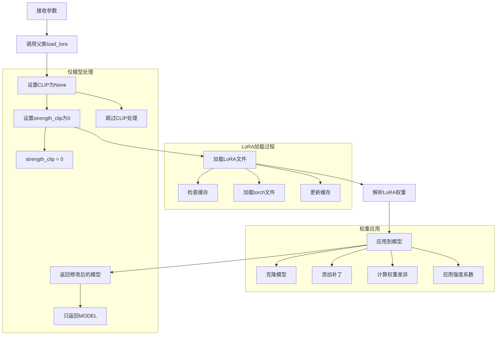

# LoraLoaderModelOnly 节点详细分析

## 概述

`LoraLoaderModelOnly` 是ComfyUI中专门用于仅对扩散模型应用LoRA权重的节点。它继承自`LoraLoader`，但只处理模型部分，不涉及CLIP文本编码器。这个节点特别适用于需要精确控制LoRA应用范围的高级工作流。

## 节点基本信息

### 类定义
```python
class LoraLoaderModelOnly(LoraLoader):
    RETURN_TYPES = ("MODEL",)
    FUNCTION = "load_lora_model_only"
```

### 显示名称
- **内部名称**: `LoraLoaderModelOnly`
- **显示名称**: `Load LoRA (Model Only)`
- **类别**: `loaders`

## 输入输出规格

### 输入参数详解

```python
@classmethod
def INPUT_TYPES(s):
    return {
        "required": {
            "model": ("MODEL",),
            "lora_name": (folder_paths.get_filename_list("loras"), ),
            "strength_model": ("FLOAT", {"default": 1.0, "min": -100.0, "max": 100.0, "step": 0.01}),
        }
    }
```

#### 参数详细说明

1. **model** (MODEL)
   - 要应用LoRA的扩散模型
   - 来源：CheckpointLoaderSimple、UNETLoader等节点
   - 类型：ModelPatcher对象

2. **lora_name** (选择列表)
   - LoRA文件名
   - 来源：`models/loras/` 目录
   - 支持格式：`.safetensors`, `.ckpt`, `.pt`, `.pth`

3. **strength_model** (FLOAT)
   - LoRA对模型的影响强度
   - 默认值：1.0
   - 范围：-100.0 到 100.0
   - 步长：0.01
   - 支持负值（反向应用）

### 输出类型

```python
RETURN_TYPES = ("MODEL",)
```

**输出说明**:
- **MODEL**: 应用了LoRA权重的扩散模型

## 核心实现分析

### 主要执行函数

```python
def load_lora_model_only(self, model, lora_name, strength_model):
    return (self.load_lora(model, None, lora_name, strength_model, 0)[0],)
```

### 继承关系和复用

```python
class LoraLoaderModelOnly(LoraLoader):
    # 继承父类的load_lora方法
    # 但只返回模型部分，CLIP设为None
```

### 执行流程图



## LoRA技术深度解析

### 1. LoRA原理

#### Low-Rank Adaptation概念
```python
# LoRA的数学原理
# 原始权重: W ∈ R^(d×k)
# LoRA分解: ΔW = BA, 其中 B ∈ R^(d×r), A ∈ R^(r×k), r << min(d,k)
# 最终权重: W' = W + αΔW

def lora_forward(weight, lora_up, lora_down, alpha, strength):
    """LoRA前向传播"""
    # 计算低秩分解的权重差异
    delta_weight = torch.mm(lora_up, lora_down)
    
    # 应用缩放因子
    scale = alpha / lora_down.shape[0]  # rank
    
    # 应用强度系数
    final_weight = weight + strength * scale * delta_weight
    
    return final_weight
```

### 2. LoRA文件格式

#### 标准LoRA格式
```python
lora_structure = {
    # 基础权重
    "lora_unet_down_blocks_0_attentions_0_proj_in.lora_down.weight": tensor,
    "lora_unet_down_blocks_0_attentions_0_proj_in.lora_up.weight": tensor,
    "lora_unet_down_blocks_0_attentions_0_proj_in.alpha": scalar,
    
    # 不同层的权重
    "lora_unet_mid_block_attentions_0_proj_out.lora_down.weight": tensor,
    "lora_unet_mid_block_attentions_0_proj_out.lora_up.weight": tensor,
    "lora_unet_mid_block_attentions_0_proj_out.alpha": scalar,
}
```

#### 支持的LoRA变体
```python
supported_formats = {
    "standard": "lora_unet_{layer}.lora_up.weight",
    "diffusers": "{layer}_lora.up.weight", 
    "diffusers2": "{layer}.lora_B.weight",
    "kohya": "lora_unet_{layer}",
    "lycoris": "lycoris_{layer}",
    "transformers": "{layer}.lora_linear_layer.up.weight"
}
```

### 3. 权重映射机制

#### UNET权重映射
```python
def model_lora_keys_unet(model, key_map={}):
    """生成UNET的LoRA键映射"""
    sd = model.state_dict()
    
    for k in sd.keys():
        if k.startswith("diffusion_model.") and k.endswith(".weight"):
            # 标准格式映射
            key_lora = k[len("diffusion_model."):-len(".weight")].replace(".", "_")
            key_map[f"lora_unet_{key_lora}"] = k
            
            # 通用格式映射
            key_map[k[:-len(".weight")]] = k
    
    return key_map
```

## 与LoraLoader的对比

### 功能对比

| 特性 | LoraLoader | LoraLoaderModelOnly |
|------|------------|---------------------|
| **输入** | MODEL + CLIP | 仅MODEL |
| **输出** | MODEL + CLIP | 仅MODEL |
| **LoRA应用范围** | 模型 + 文本编码器 | 仅模型 |
| **参数数量** | 2个强度参数 | 1个强度参数 |
| **使用复杂度** | 中等 | 简单 |
| **内存使用** | 更多 | 更少 |

### 使用场景对比

#### LoraLoader适用场景
```python
# 场景1: 完整的风格转换
model, clip = LoraLoader(
    model=base_model,
    clip=base_clip,
    lora_name="anime_style.safetensors",
    strength_model=1.0,
    strength_clip=1.0
)

# 场景2: 平衡的LoRA应用
model, clip = LoraLoader(
    model=base_model,
    clip=base_clip,
    lora_name="portrait_lora.safetensors",
    strength_model=0.8,
    strength_clip=0.6
)
```

#### LoraLoaderModelOnly适用场景
```python
# 场景1: 仅修改生成风格，保持文本理解
model = LoraLoaderModelOnly(
    model=base_model,
    lora_name="art_style.safetensors",
    strength_model=1.2
)
# CLIP保持原始状态

# 场景2: 多LoRA叠加（仅模型部分）
model = LoraLoaderModelOnly(
    model=base_model,
    lora_name="detail_enhancer.safetensors",
    strength_model=0.5
)

model = LoraLoaderModelOnly(
    model=model,  # 链式应用
    lora_name="color_enhancer.safetensors", 
    strength_model=0.3
)
```

## 高级应用技巧

### 1. 多LoRA叠加策略

#### 串行叠加
```python
def apply_multiple_loras_serial(base_model, lora_configs):
    """串行应用多个LoRA"""
    current_model = base_model
    
    for config in lora_configs:
        current_model = LoraLoaderModelOnly(
            model=current_model,
            lora_name=config["name"],
            strength_model=config["strength"]
        )
    
    return current_model

# 使用示例
lora_stack = [
    {"name": "base_style.safetensors", "strength": 1.0},
    {"name": "detail_enhancer.safetensors", "strength": 0.6},
    {"name": "color_grading.safetensors", "strength": 0.4}
]

final_model = apply_multiple_loras_serial(base_model, lora_stack)
```

#### 强度调节策略
```python
def calculate_optimal_strength(lora_type, base_strength=1.0):
    """根据LoRA类型计算最优强度"""
    strength_multipliers = {
        "style": 1.0,      # 风格LoRA
        "character": 0.8,  # 角色LoRA
        "detail": 0.6,     # 细节增强
        "lighting": 0.4,   # 光照效果
        "background": 0.5  # 背景LoRA
    }
    
    return base_strength * strength_multipliers.get(lora_type, 1.0)
```

### 2. 负强度应用

#### 反向LoRA效果
```python
def apply_negative_lora(model, lora_name, negative_strength=-0.5):
    """应用负强度LoRA实现反向效果"""
    return LoraLoaderModelOnly(
        model=model,
        lora_name=lora_name,
        strength_model=negative_strength  # 负值
    )

# 使用场景：去除特定风格
model_without_anime = apply_negative_lora(
    model=anime_model,
    lora_name="anime_style.safetensors",
    negative_strength=-0.8
)
```

### 3. 动态强度控制

#### 条件强度应用
```python
def conditional_lora_strength(prompt, lora_configs):
    """根据提示词动态调整LoRA强度"""
    strength_adjustments = {}
    
    for config in lora_configs:
        base_strength = config["strength"]
        
        # 根据关键词调整强度
        if any(keyword in prompt.lower() for keyword in config.get("boost_keywords", [])):
            strength_adjustments[config["name"]] = base_strength * 1.3
        elif any(keyword in prompt.lower() for keyword in config.get("reduce_keywords", [])):
            strength_adjustments[config["name"]] = base_strength * 0.7
        else:
            strength_adjustments[config["name"]] = base_strength
    
    return strength_adjustments
```

## 性能优化和内存管理

### 1. LoRA缓存机制

```python
class LoraCache:
    def __init__(self):
        self.loaded_lora = None  # (path, lora_data)
    
    def load_lora_with_cache(self, lora_path):
        """带缓存的LoRA加载"""
        if self.loaded_lora is not None:
            if self.loaded_lora[0] == lora_path:
                return self.loaded_lora[1]  # 使用缓存
            else:
                self.loaded_lora = None  # 清除旧缓存
        
        # 加载新LoRA
        lora = comfy.utils.load_torch_file(lora_path, safe_load=True)
        self.loaded_lora = (lora_path, lora)
        return lora
```

### 2. 内存使用优化

#### LoRA内存占用分析
```python
def analyze_lora_memory_usage(lora_path):
    """分析LoRA的内存使用"""
    lora = comfy.utils.load_torch_file(lora_path)
    
    total_params = 0
    memory_usage = 0
    
    for key, tensor in lora.items():
        if isinstance(tensor, torch.Tensor):
            params = tensor.numel()
            memory = params * tensor.element_size()
            
            total_params += params
            memory_usage += memory
    
    return {
        "total_parameters": total_params,
        "memory_usage_mb": memory_usage / (1024 * 1024),
        "estimated_vram_mb": memory_usage * 2 / (1024 * 1024)  # 考虑梯度
    }
```

### 3. 批量处理优化

```python
def batch_apply_loras(models, lora_configs):
    """批量应用LoRA到多个模型"""
    results = []
    
    # 预加载所有LoRA
    lora_cache = {}
    for config in lora_configs:
        if config["name"] not in lora_cache:
            lora_path = folder_paths.get_full_path("loras", config["name"])
            lora_cache[config["name"]] = comfy.utils.load_torch_file(lora_path)
    
    # 批量应用
    for model in models:
        current_model = model
        for config in lora_configs:
            current_model = apply_cached_lora(current_model, lora_cache[config["name"]], config["strength"])
        results.append(current_model)
    
    return results
```

## 使用示例和最佳实践

### 基本用法
```json
{
    "lora_model_only": {
        "inputs": {
            "model": ["checkpoint_loader", 0],
            "lora_name": "style_lora.safetensors",
            "strength_model": 1.0
        },
        "class_type": "LoraLoaderModelOnly"
    }
}
```

### 多LoRA叠加工作流
```json
{
    "lora_1": {
        "inputs": {
            "model": ["checkpoint_loader", 0],
            "lora_name": "base_style.safetensors",
            "strength_model": 1.0
        },
        "class_type": "LoraLoaderModelOnly"
    },
    "lora_2": {
        "inputs": {
            "model": ["lora_1", 0],
            "lora_name": "detail_enhancer.safetensors", 
            "strength_model": 0.6
        },
        "class_type": "LoraLoaderModelOnly"
    },
    "ksampler": {
        "inputs": {
            "model": ["lora_2", 0],
            "positive": ["clip_text_encode", 0],
            "negative": ["clip_text_encode_neg", 0],
            "latent_image": ["empty_latent", 0]
        },
        "class_type": "KSampler"
    }
}
```

### 精确控制工作流
```json
{
    "model_lora": {
        "inputs": {
            "model": ["unet_loader", 0],
            "lora_name": "model_specific.safetensors",
            "strength_model": 0.8
        },
        "class_type": "LoraLoaderModelOnly"
    },
    "clip_separate": {
        "inputs": {
            "clip_name": "custom_clip.safetensors"
        },
        "class_type": "CLIPLoader"
    }
}
```

## 常见问题和解决方案

### 1. LoRA不生效
```
LoRA loaded but no visible effect
```
**解决方案**:
- 检查strength_model是否为0
- 确认LoRA与模型兼容性
- 验证LoRA文件完整性
- 检查权重映射是否正确

### 2. 内存不足
```
CUDA out of memory when loading LoRA
```
**解决方案**:
- 减少同时加载的LoRA数量
- 降低LoRA强度减少计算开销
- 使用LoRA缓存机制
- 启用模型卸载

### 3. 权重冲突
```
Multiple LoRA conflicts
```
**解决方案**:
- 调整LoRA应用顺序
- 降低冲突LoRA的强度
- 使用负强度抵消效果
- 选择兼容的LoRA组合

### 4. 性能问题
**问题**: LoRA加载速度慢
**解决方案**:
- 启用LoRA缓存
- 使用SSD存储LoRA文件
- 预加载常用LoRA
- 优化文件格式

## 高级调试和分析

### 1. LoRA权重分析工具

#### 权重分布分析
```python
def analyze_lora_weights(lora_path):
    """分析LoRA权重分布"""
    lora = comfy.utils.load_torch_file(lora_path)

    analysis = {
        "layers": {},
        "statistics": {},
        "compatibility": {}
    }

    for key, tensor in lora.items():
        if "lora_up" in key or "lora_down" in key:
            layer_name = key.split('.')[0]

            if layer_name not in analysis["layers"]:
                analysis["layers"][layer_name] = {}

            analysis["layers"][layer_name][key] = {
                "shape": list(tensor.shape),
                "mean": float(tensor.mean()),
                "std": float(tensor.std()),
                "min": float(tensor.min()),
                "max": float(tensor.max())
            }

    return analysis
```

#### LoRA兼容性检查
```python
def check_lora_compatibility(model, lora_path):
    """检查LoRA与模型的兼容性"""
    model_state = model.model.state_dict()
    lora = comfy.utils.load_torch_file(lora_path)

    compatibility_report = {
        "compatible_layers": [],
        "incompatible_layers": [],
        "missing_layers": [],
        "coverage_percentage": 0
    }

    # 生成键映射
    key_map = comfy.lora.model_lora_keys_unet(model.model, {})

    total_lora_keys = 0
    matched_keys = 0

    for lora_key in lora.keys():
        if "lora_up" in lora_key or "lora_down" in lora_key:
            total_lora_keys += 1
            base_key = lora_key.replace(".lora_up.weight", "").replace(".lora_down.weight", "")

            if base_key in key_map:
                model_key = key_map[base_key]
                if model_key in model_state:
                    compatibility_report["compatible_layers"].append(base_key)
                    matched_keys += 1
                else:
                    compatibility_report["missing_layers"].append(base_key)
            else:
                compatibility_report["incompatible_layers"].append(base_key)

    compatibility_report["coverage_percentage"] = (matched_keys / total_lora_keys * 100) if total_lora_keys > 0 else 0

    return compatibility_report
```

### 2. 性能基准测试

#### LoRA加载性能测试
```python
def benchmark_lora_loading():
    """LoRA加载性能基准测试"""
    import time

    test_configs = [
        {"name": "small_lora.safetensors", "expected_size": "< 100MB"},
        {"name": "medium_lora.safetensors", "expected_size": "100-500MB"},
        {"name": "large_lora.safetensors", "expected_size": "> 500MB"}
    ]

    results = {}

    for config in test_configs:
        # 测试冷加载
        start_time = time.time()
        model = LoraLoaderModelOnly(
            model=base_model,
            lora_name=config["name"],
            strength_model=1.0
        )
        cold_load_time = time.time() - start_time

        # 测试热加载（缓存）
        start_time = time.time()
        model = LoraLoaderModelOnly(
            model=base_model,
            lora_name=config["name"],
            strength_model=1.0
        )
        hot_load_time = time.time() - start_time

        results[config["name"]] = {
            "cold_load_time": cold_load_time,
            "hot_load_time": hot_load_time,
            "cache_speedup": cold_load_time / hot_load_time if hot_load_time > 0 else float('inf')
        }

    return results
```

#### 内存使用监控
```python
def monitor_lora_memory_usage():
    """监控LoRA内存使用"""
    import psutil
    import torch

    def get_memory_info():
        return {
            "cpu_memory_gb": psutil.virtual_memory().used / 1024**3,
            "gpu_memory_gb": torch.cuda.memory_allocated() / 1024**3 if torch.cuda.is_available() else 0
        }

    baseline = get_memory_info()

    # 加载LoRA
    model = LoraLoaderModelOnly(
        model=base_model,
        lora_name="test_lora.safetensors",
        strength_model=1.0
    )

    after_load = get_memory_info()

    memory_impact = {
        "cpu_increase_gb": after_load["cpu_memory_gb"] - baseline["cpu_memory_gb"],
        "gpu_increase_gb": after_load["gpu_memory_gb"] - baseline["gpu_memory_gb"],
        "total_increase_gb": (after_load["cpu_memory_gb"] + after_load["gpu_memory_gb"]) -
                           (baseline["cpu_memory_gb"] + baseline["gpu_memory_gb"])
    }

    return memory_impact
```

### 3. 高级工作流模式

#### 条件LoRA应用
```python
def conditional_lora_workflow(prompt, model, lora_rules):
    """根据提示词条件应用LoRA"""

    applied_loras = []
    current_model = model

    for rule in lora_rules:
        should_apply = False

        # 检查触发条件
        if rule["type"] == "keyword":
            should_apply = any(keyword.lower() in prompt.lower() for keyword in rule["keywords"])
        elif rule["type"] == "regex":
            import re
            should_apply = bool(re.search(rule["pattern"], prompt, re.IGNORECASE))
        elif rule["type"] == "length":
            should_apply = len(prompt.split()) >= rule["min_words"]

        if should_apply:
            current_model = LoraLoaderModelOnly(
                model=current_model,
                lora_name=rule["lora_name"],
                strength_model=rule["strength"]
            )
            applied_loras.append(rule["lora_name"])

    return current_model, applied_loras

# 使用示例
lora_rules = [
    {
        "type": "keyword",
        "keywords": ["anime", "manga", "cartoon"],
        "lora_name": "anime_style.safetensors",
        "strength": 1.0
    },
    {
        "type": "keyword",
        "keywords": ["portrait", "face", "headshot"],
        "lora_name": "portrait_enhancer.safetensors",
        "strength": 0.8
    },
    {
        "type": "regex",
        "pattern": r"\b(oil painting|watercolor|acrylic)\b",
        "lora_name": "traditional_art.safetensors",
        "strength": 0.9
    }
]
```

#### 自适应强度调节
```python
def adaptive_lora_strength(model, lora_name, target_similarity=0.8):
    """自适应调节LoRA强度以达到目标相似度"""

    def calculate_similarity(model1, model2, test_input):
        """计算两个模型输出的相似度"""
        with torch.no_grad():
            output1 = model1(test_input)
            output2 = model2(test_input)
            similarity = torch.cosine_similarity(output1.flatten(), output2.flatten(), dim=0)
        return float(similarity)

    # 生成测试输入
    test_input = torch.randn(1, 4, 64, 64)  # 示例潜在空间输入

    # 二分搜索最优强度
    low_strength = 0.0
    high_strength = 2.0
    optimal_strength = 1.0

    for _ in range(10):  # 最多10次迭代
        mid_strength = (low_strength + high_strength) / 2

        lora_model = LoraLoaderModelOnly(
            model=model,
            lora_name=lora_name,
            strength_model=mid_strength
        )

        similarity = calculate_similarity(model, lora_model, test_input)

        if abs(similarity - target_similarity) < 0.05:  # 容差
            optimal_strength = mid_strength
            break
        elif similarity > target_similarity:
            high_strength = mid_strength
        else:
            low_strength = mid_strength

    return optimal_strength
```

### 4. 故障排除和诊断

#### 自动诊断工具
```python
def diagnose_lora_issues(model, lora_name, strength_model):
    """自动诊断LoRA问题"""

    diagnosis = {
        "file_check": "PASS",
        "compatibility_check": "PASS",
        "memory_check": "PASS",
        "strength_check": "PASS",
        "warnings": [],
        "errors": [],
        "suggestions": []
    }

    try:
        # 1. 文件存在性检查
        lora_path = folder_paths.get_full_path("loras", lora_name)
        if not os.path.exists(lora_path):
            diagnosis["file_check"] = "FAIL"
            diagnosis["errors"].append(f"LoRA file not found: {lora_name}")
            return diagnosis

        # 2. 文件完整性检查
        try:
            lora = comfy.utils.load_torch_file(lora_path)
        except Exception as e:
            diagnosis["file_check"] = "FAIL"
            diagnosis["errors"].append(f"Failed to load LoRA file: {str(e)}")
            return diagnosis

        # 3. 兼容性检查
        compatibility = check_lora_compatibility(model, lora_path)
        if compatibility["coverage_percentage"] < 50:
            diagnosis["compatibility_check"] = "WARNING"
            diagnosis["warnings"].append(f"Low compatibility: {compatibility['coverage_percentage']:.1f}%")

        # 4. 强度检查
        if abs(strength_model) > 2.0:
            diagnosis["strength_check"] = "WARNING"
            diagnosis["warnings"].append(f"High strength value: {strength_model}")
            diagnosis["suggestions"].append("Consider using strength between -2.0 and 2.0")

        # 5. 内存检查
        memory_usage = analyze_lora_memory_usage(lora_path)
        if memory_usage["memory_usage_mb"] > 1000:  # 1GB
            diagnosis["memory_check"] = "WARNING"
            diagnosis["warnings"].append(f"Large LoRA file: {memory_usage['memory_usage_mb']:.1f}MB")
            diagnosis["suggestions"].append("Consider using model offloading for large LoRAs")

    except Exception as e:
        diagnosis["errors"].append(f"Diagnosis failed: {str(e)}")

    return diagnosis
```

#### 常见问题自动修复
```python
def auto_fix_lora_issues(model, lora_name, strength_model):
    """自动修复常见LoRA问题"""

    fixes_applied = []

    # 诊断问题
    diagnosis = diagnose_lora_issues(model, lora_name, strength_model)

    # 自动修复
    fixed_strength = strength_model

    # 修复过高的强度
    if abs(strength_model) > 2.0:
        fixed_strength = 2.0 if strength_model > 0 else -2.0
        fixes_applied.append(f"Clamped strength from {strength_model} to {fixed_strength}")

    # 修复零强度
    if strength_model == 0:
        fixed_strength = 1.0
        fixes_applied.append("Changed zero strength to 1.0")

    # 应用修复后的LoRA
    try:
        fixed_model = LoraLoaderModelOnly(
            model=model,
            lora_name=lora_name,
            strength_model=fixed_strength
        )

        return {
            "success": True,
            "model": fixed_model,
            "fixes_applied": fixes_applied,
            "final_strength": fixed_strength
        }
    except Exception as e:
        return {
            "success": False,
            "error": str(e),
            "fixes_applied": fixes_applied
        }
```

## 总结

`LoraLoaderModelOnly`是ComfyUI中的专业化LoRA加载工具，它：

1. **专注性**: 仅处理扩散模型，不涉及CLIP
2. **精确性**: 提供精确的模型权重控制
3. **高效性**: 减少不必要的CLIP处理开销
4. **灵活性**: 支持多LoRA叠加和负强度应用
5. **专业性**: 适合高级用户和复杂工作流

理解LoraLoaderModelOnly的使用方法对于：
- 精确的风格控制
- 复杂的LoRA组合
- 性能优化需求
- 专业工作流设计

具有重要意义。它为需要精细控制LoRA应用范围的用户提供了强大的工具。

## 相关资源

- [LoRA论文](https://arxiv.org/abs/2106.09685)
- [ComfyUI LoRA文档](https://docs.comfy.org/essentials/lora)
- [LoRA训练指南](https://github.com/cloneofsimo/lora)
- [权重适配器技术](https://arxiv.org/abs/2205.05638)
