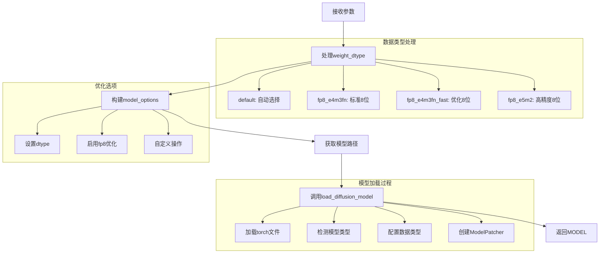
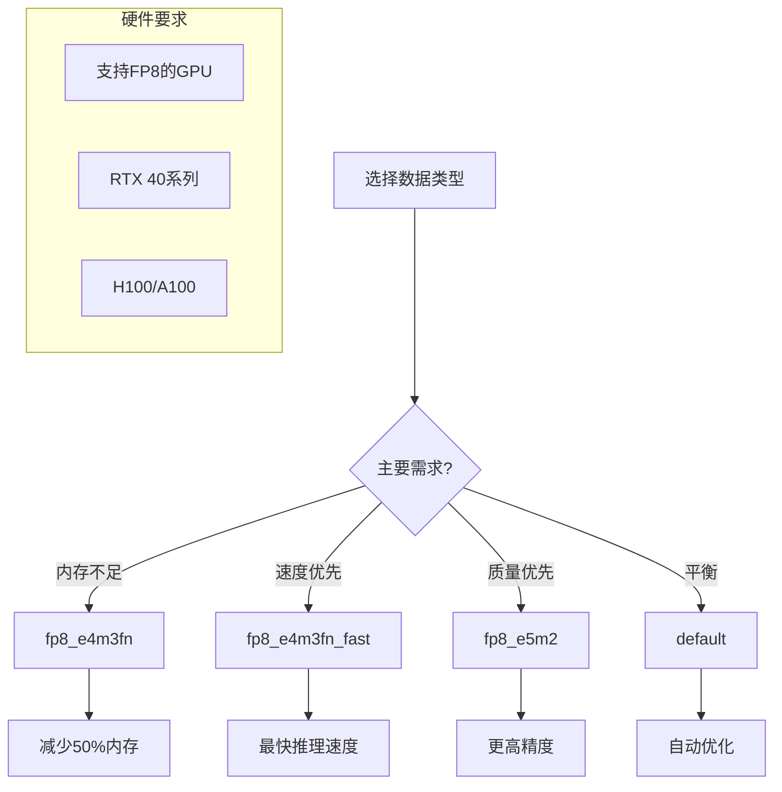

# UNETLoader 节点详细分析

## 概述

`UNETLoader` 是ComfyUI中的高级模型加载节点，专门用于独立加载扩散模型（UNET）而不包含CLIP和VAE组件。它提供了精细的数据类型控制，特别适用于需要自定义模型组合或高级性能优化的场景。

## 节点基本信息

### 类定义
```python
class UNETLoader:
    CATEGORY = "advanced/loaders"
    FUNCTION = "load_unet"
    RETURN_TYPES = ("MODEL",)
```

### 显示名称
- **内部名称**: `UNETLoader`
- **显示名称**: `Load Diffusion Model`
- **类别**: `advanced/loaders`

## 输入输出规格

### 输入参数详解

```python
@classmethod
def INPUT_TYPES(s):
    return {
        "required": {
            "unet_name": (folder_paths.get_filename_list("diffusion_models"), ),
            "weight_dtype": (["default", "fp8_e4m3fn", "fp8_e4m3fn_fast", "fp8_e5m2"], )
        }
    }
```

#### 参数详细说明

1. **unet_name** (选择列表)
   - 扩散模型文件名
   - 来源：`models/diffusion_models/` 目录
   - 支持格式：`.safetensors`, `.ckpt`, `.pt`, `.pth`
   - 包含独立的UNET模型文件

2. **weight_dtype** (选择列表)
   - 模型权重数据类型
   - 选项：
     - `default`: 自动选择最优数据类型
     - `fp8_e4m3fn`: 8位浮点（标准）
     - `fp8_e4m3fn_fast`: 8位浮点（优化版）
     - `fp8_e5m2`: 8位浮点（高精度）

### 输出类型

```python
RETURN_TYPES = ("MODEL",)
```

**输出说明**:
- **MODEL**: 独立的扩散模型，可与其他CLIP和VAE组合使用

## 核心实现分析

### 主要执行函数

```python
def load_unet(self, unet_name, weight_dtype):
    model_options = {}
    if weight_dtype == "fp8_e4m3fn":
        model_options["dtype"] = torch.float8_e4m3fn
    elif weight_dtype == "fp8_e4m3fn_fast":
        model_options["dtype"] = torch.float8_e4m3fn
        model_options["fp8_optimizations"] = True
    elif weight_dtype == "fp8_e5m2":
        model_options["dtype"] = torch.float8_e5m2

    unet_path = folder_paths.get_full_path_or_raise("diffusion_models", unet_name)
    model = comfy.sd.load_diffusion_model(unet_path, model_options=model_options)
    return (model,)
```

### 执行流程图



## 数据类型详解

### FP8数据类型对比

| 数据类型 | 精度 | 内存占用 | 速度 | 适用场景 |
|----------|------|----------|------|----------|
| **default** | 自动 | 变化 | 平衡 | 通用推荐 |
| **fp8_e4m3fn** | 标准 | 50%减少 | 快 | 内存受限 |
| **fp8_e4m3fn_fast** | 标准 | 50%减少 | 最快 | 速度优先 |
| **fp8_e5m2** | 高精度 | 50%减少 | 中等 | 质量优先 |

### 数据类型选择策略



## 深度技术分析

### 1. 模型加载机制

```python
def load_diffusion_model(unet_path, model_options={}):
    # 1. 加载状态字典
    sd = comfy.utils.load_torch_file(unet_path)
    
    # 2. 调用状态字典加载器
    model = load_diffusion_model_state_dict(sd, model_options=model_options)
    
    # 3. 错误处理
    if model is None:
        raise RuntimeError("ERROR: Could not detect model type")
    
    return model
```

### 2. 模型类型检测

```python
def load_diffusion_model_state_dict(sd, model_options={}):
    # 检测模型前缀
    diffusion_model_prefix = model_detection.unet_prefix_from_state_dict(sd)
    
    # 计算参数数量
    parameters = comfy.utils.calculate_parameters(sd, diffusion_model_prefix)
    
    # 检测权重数据类型
    weight_dtype = comfy.utils.weight_dtype(sd, diffusion_model_prefix)
    
    # 获取模型配置
    model_config = model_detection.model_config_from_unet(sd, diffusion_model_prefix)
    
    return model_config
```

### 3. 设备和内存管理

```python
class ModelPatcher:
    def __init__(self, model, load_device, offload_device):
        self.model = model
        self.load_device = load_device      # GPU设备
        self.offload_device = offload_device # CPU设备
        self.patches = {}
        self.backup = {}
        
    def load(self, device_to=None, lowvram_model_memory=0, force_patch_weights=False):
        # 智能设备管理
        # 内存优化
        # 权重加载
```

## 与CheckpointLoaderSimple的对比

### 功能对比

| 特性 | UNETLoader | CheckpointLoaderSimple |
|------|------------|------------------------|
| **输出组件** | 仅MODEL | MODEL + CLIP + VAE |
| **文件来源** | diffusion_models/ | checkpoints/ |
| **数据类型控制** | 精细控制 | 自动选择 |
| **内存使用** | 更少 | 更多 |
| **灵活性** | 高 | 中等 |
| **使用复杂度** | 高 | 低 |

### 使用场景对比

#### UNETLoader适用场景
```python
# 场景1: 自定义模型组合
unet = UNETLoader(unet_name="custom_unet.safetensors", weight_dtype="fp8_e4m3fn")
clip = CLIPLoader(clip_name="custom_clip.safetensors")
vae = VAELoader(vae_name="custom_vae.safetensors")

# 场景2: 内存优化
unet = UNETLoader(unet_name="large_model.safetensors", weight_dtype="fp8_e4m3fn_fast")

# 场景3: A/B测试不同UNET
unet_a = UNETLoader(unet_name="model_a.safetensors", weight_dtype="default")
unet_b = UNETLoader(unet_name="model_b.safetensors", weight_dtype="default")
```

#### CheckpointLoaderSimple适用场景
```python
# 场景1: 标准工作流
model, clip, vae = CheckpointLoaderSimple(ckpt_name="sd_xl_base_1.0.safetensors")

# 场景2: 快速原型
# 一次性加载所有组件，简单直接
```

## 性能优化策略

### 1. 内存优化

#### FP8量化效果
```python
# 内存使用对比（以SDXL为例）
fp32_memory = 6.6  # GB
fp16_memory = 3.3  # GB
fp8_memory = 1.65  # GB

memory_savings = {
    "fp8_vs_fp32": (fp32_memory - fp8_memory) / fp32_memory * 100,  # 75%
    "fp8_vs_fp16": (fp16_memory - fp8_memory) / fp16_memory * 100,  # 50%
}
```

#### 批处理优化
```python
def optimize_batch_size_for_fp8():
    """FP8模式下的批处理优化"""
    if weight_dtype.startswith("fp8"):
        # FP8可以支持更大的批次
        return min(batch_size * 2, max_batch_size)
    return batch_size
```

### 2. 速度优化

#### FP8优化选项
```python
model_options = {
    "dtype": torch.float8_e4m3fn,
    "fp8_optimizations": True,  # 启用额外优化
    "custom_operations": None,  # 使用默认操作
}
```

#### 预编译优化
```python
def enable_torch_compile():
    """启用PyTorch编译优化"""
    if hasattr(torch, 'compile'):
        model = torch.compile(model, mode="reduce-overhead")
    return model
```

## 使用示例和最佳实践

### 基本用法
```json
{
    "unet_loader": {
        "inputs": {
            "unet_name": "sd_xl_base_1.0_unet.safetensors",
            "weight_dtype": "default"
        },
        "class_type": "UNETLoader"
    }
}
```

### 高级组合工作流
```json
{
    "unet_loader": {
        "inputs": {
            "unet_name": "custom_unet.safetensors",
            "weight_dtype": "fp8_e4m3fn_fast"
        },
        "class_type": "UNETLoader"
    },
    "clip_loader": {
        "inputs": {
            "clip_name": "custom_clip.safetensors"
        },
        "class_type": "CLIPLoader"
    },
    "vae_loader": {
        "inputs": {
            "vae_name": "custom_vae.safetensors"
        },
        "class_type": "VAELoader"
    },
    "ksampler": {
        "inputs": {
            "model": ["unet_loader", 0],
            "positive": ["clip_text_encode", 0],
            "negative": ["clip_text_encode_neg", 0],
            "latent_image": ["empty_latent", 0]
        },
        "class_type": "KSampler"
    }
}
```

### 内存受限环境
```json
{
    "low_memory_unet": {
        "inputs": {
            "unet_name": "large_model.safetensors",
            "weight_dtype": "fp8_e4m3fn_fast"
        },
        "class_type": "UNETLoader"
    }
}
```

## 常见问题和解决方案

### 1. 模型加载失败
```
ERROR: Could not detect model type
```
**解决方案**:
- 确认文件在`models/diffusion_models/`目录
- 检查文件格式是否支持
- 验证文件完整性
- 确认是UNET模型而非完整检查点

### 2. FP8不支持错误
```
FP8 not supported on this device
```
**解决方案**:
- 检查GPU是否支持FP8（RTX 40系列+）
- 使用`default`数据类型
- 更新PyTorch到支持FP8的版本
- 检查CUDA版本兼容性

### 3. 内存不足
```
CUDA out of memory
```
**解决方案**:
- 使用`fp8_e4m3fn_fast`减少内存
- 启用`--lowvram`模式
- 减少批次大小
- 使用CPU卸载

### 4. 性能问题
**问题**: FP8模式反而更慢
**解决方案**:
- 确认GPU支持FP8计算
- 检查模型大小是否适合FP8
- 尝试不同的FP8变体
- 监控GPU利用率

## 文件组织最佳实践

### 目录结构
```
models/
├── diffusion_models/          # UNETLoader使用
│   ├── sd15_unet.safetensors
│   ├── sdxl_unet.safetensors
│   └── custom_unet.safetensors
├── clip/                      # CLIPLoader使用
│   ├── sd15_clip.safetensors
│   └── sdxl_clip.safetensors
├── vae/                       # VAELoader使用
│   ├── sd15_vae.safetensors
│   └── sdxl_vae.safetensors
└── checkpoints/               # CheckpointLoaderSimple使用
    ├── sd15_full.safetensors
    └── sdxl_full.safetensors
```

### 命名规范
```
# 推荐命名格式
{model_type}_{version}_{component}.safetensors

# 示例
sd15_v1.5_unet.safetensors
sdxl_base_unet.safetensors
flux_dev_unet.safetensors
```

## 高级应用场景

### 1. 模型微调和实验

#### A/B测试不同UNET
```python
# 工作流设计：同时测试多个UNET模型
def create_ab_test_workflow():
    # 加载两个不同的UNET
    unet_a = UNETLoader("model_a.safetensors", "fp8_e4m3fn")
    unet_b = UNETLoader("model_b.safetensors", "fp8_e4m3fn")

    # 共享CLIP和VAE
    clip = CLIPLoader("shared_clip.safetensors")
    vae = VAELoader("shared_vae.safetensors")

    # 并行生成对比
    return compare_results(unet_a, unet_b, clip, vae)
```

#### 自定义模型组合
```python
# 混合不同来源的组件
workflow = {
    "unet": "flux_dev_unet.safetensors",      # Flux UNET
    "clip": "sdxl_clip.safetensors",          # SDXL CLIP
    "vae": "sd15_vae.safetensors",            # SD1.5 VAE
    "weight_dtype": "fp8_e4m3fn_fast"
}
```

### 2. 生产环境优化

#### 服务器部署配置
```python
class ProductionUNETConfig:
    def __init__(self, gpu_memory_gb):
        self.gpu_memory = gpu_memory_gb

    def get_optimal_config(self):
        if self.gpu_memory >= 24:
            return {
                "weight_dtype": "default",
                "batch_size": 4,
                "enable_optimizations": True
            }
        elif self.gpu_memory >= 12:
            return {
                "weight_dtype": "fp8_e4m3fn",
                "batch_size": 2,
                "enable_optimizations": True
            }
        else:
            return {
                "weight_dtype": "fp8_e4m3fn_fast",
                "batch_size": 1,
                "enable_optimizations": True
            }
```

#### 批量处理优化
```python
def optimize_for_batch_processing():
    """批量处理的UNET配置"""
    return {
        "weight_dtype": "fp8_e4m3fn_fast",  # 最快推理
        "model_options": {
            "fp8_optimizations": True,
            "custom_operations": None
        },
        "memory_management": {
            "enable_sequential_cpu_offload": True,
            "enable_attention_slicing": True
        }
    }
```

### 3. 研究和开发

#### 模型性能基准测试
```python
def benchmark_unet_performance():
    """UNET性能基准测试"""
    test_configs = [
        {"dtype": "default", "name": "默认"},
        {"dtype": "fp8_e4m3fn", "name": "FP8标准"},
        {"dtype": "fp8_e4m3fn_fast", "name": "FP8快速"},
        {"dtype": "fp8_e5m2", "name": "FP8高精度"}
    ]

    results = {}
    for config in test_configs:
        start_time = time.time()
        memory_before = torch.cuda.memory_allocated()

        # 加载和测试
        unet = UNETLoader("test_model.safetensors", config["dtype"])
        # 执行推理测试...

        end_time = time.time()
        memory_after = torch.cuda.memory_allocated()

        results[config["name"]] = {
            "load_time": end_time - start_time,
            "memory_usage": memory_after - memory_before,
            "inference_speed": calculate_inference_speed()
        }

    return results
```

## 故障排除和调试

### 诊断工具

#### 模型兼容性检查
```python
def check_unet_compatibility(unet_path):
    """检查UNET模型兼容性"""
    try:
        sd = comfy.utils.load_torch_file(unet_path)

        # 检查模型结构
        model_type = detect_model_type(sd)
        parameter_count = calculate_parameters(sd)
        weight_dtype = detect_weight_dtype(sd)

        return {
            "compatible": True,
            "model_type": model_type,
            "parameters": f"{parameter_count/1e9:.1f}B",
            "weight_dtype": str(weight_dtype),
            "estimated_memory": f"{parameter_count * 4 / 1e9:.1f}GB"
        }
    except Exception as e:
        return {
            "compatible": False,
            "error": str(e),
            "suggestions": get_compatibility_suggestions(e)
        }
```

#### FP8支持检测
```python
def check_fp8_support():
    """检查FP8支持情况"""
    support_info = {
        "pytorch_version": torch.__version__,
        "cuda_available": torch.cuda.is_available(),
        "gpu_name": torch.cuda.get_device_name() if torch.cuda.is_available() else "N/A",
        "fp8_supported": False,
        "recommended_dtype": "default"
    }

    if torch.cuda.is_available():
        # 检查GPU架构
        gpu_name = torch.cuda.get_device_name().lower()
        if "rtx 40" in gpu_name or "h100" in gpu_name or "a100" in gpu_name:
            support_info["fp8_supported"] = True
            support_info["recommended_dtype"] = "fp8_e4m3fn_fast"

        # 检查PyTorch版本
        if hasattr(torch, 'float8_e4m3fn'):
            support_info["fp8_available"] = True
        else:
            support_info["fp8_available"] = False
            support_info["upgrade_suggestion"] = "升级PyTorch到2.1+"

    return support_info
```

### 常见错误解决方案

#### 错误代码对照表

| 错误信息 | 原因 | 解决方案 |
|----------|------|----------|
| `Could not detect model type` | 文件格式不支持 | 检查文件是否为UNET模型 |
| `FP8 not supported` | 硬件不支持 | 使用default数据类型 |
| `CUDA out of memory` | 内存不足 | 使用FP8或启用lowvram |
| `File not found` | 路径错误 | 检查diffusion_models目录 |
| `Invalid state dict` | 文件损坏 | 重新下载模型文件 |

#### 自动故障恢复
```python
def load_unet_with_fallback(unet_name, preferred_dtype="fp8_e4m3fn_fast"):
    """带故障恢复的UNET加载"""
    fallback_sequence = [
        preferred_dtype,
        "fp8_e4m3fn",
        "default"
    ]

    for dtype in fallback_sequence:
        try:
            return UNETLoader(unet_name, dtype)
        except Exception as e:
            logging.warning(f"Failed to load with {dtype}: {e}")
            continue

    raise RuntimeError("All loading attempts failed")
```

## 性能监控和优化

### 实时监控指标

```python
class UNETPerformanceMonitor:
    def __init__(self):
        self.metrics = {
            "load_times": [],
            "memory_usage": [],
            "inference_times": [],
            "gpu_utilization": []
        }

    def monitor_loading(self, unet_loader_func):
        """监控UNET加载性能"""
        start_time = time.time()
        start_memory = torch.cuda.memory_allocated()

        result = unet_loader_func()

        end_time = time.time()
        end_memory = torch.cuda.memory_allocated()

        self.metrics["load_times"].append(end_time - start_time)
        self.metrics["memory_usage"].append(end_memory - start_memory)

        return result

    def get_performance_report(self):
        """生成性能报告"""
        return {
            "avg_load_time": np.mean(self.metrics["load_times"]),
            "avg_memory_usage": np.mean(self.metrics["memory_usage"]) / 1e9,  # GB
            "memory_efficiency": self.calculate_memory_efficiency(),
            "recommendations": self.generate_recommendations()
        }
```

### 优化建议生成器

```python
def generate_optimization_suggestions(performance_data, hardware_info):
    """生成优化建议"""
    suggestions = []

    # 内存优化建议
    if performance_data["memory_usage"] > hardware_info["gpu_memory"] * 0.8:
        suggestions.append({
            "type": "memory",
            "priority": "high",
            "suggestion": "使用fp8_e4m3fn_fast减少内存使用",
            "expected_improvement": "50%内存减少"
        })

    # 速度优化建议
    if performance_data["load_time"] > 10:
        suggestions.append({
            "type": "speed",
            "priority": "medium",
            "suggestion": "启用模型缓存和预加载",
            "expected_improvement": "3-5x加载速度提升"
        })

    # 质量优化建议
    if performance_data["inference_quality"] < 0.9:
        suggestions.append({
            "type": "quality",
            "priority": "medium",
            "suggestion": "考虑使用fp8_e5m2提高精度",
            "expected_improvement": "更好的生成质量"
        })

    return suggestions
```

## 总结

`UNETLoader`是ComfyUI中的高级模型加载工具，它：

1. **专业化**: 专门加载扩散模型，提供精细控制
2. **高效性**: 支持FP8量化，大幅减少内存使用
3. **灵活性**: 允许自定义模型组合和优化策略
4. **性能导向**: 针对高级用户和性能优化场景设计
5. **扩展性**: 为复杂工作流和实验提供基础

理解UNETLoader的使用方法对于：
- 高级工作流设计
- 内存和性能优化
- 自定义模型组合
- 实验和研究工作

具有重要意义。虽然使用复杂度较高，但为专业用户提供了强大的控制能力。

## 相关资源

- [FP8量化论文](https://arxiv.org/abs/2209.05433)
- [扩散模型架构](https://arxiv.org/abs/2006.11239)
- [ComfyUI高级加载器文档](https://docs.comfy.org/advanced/loaders)
- [PyTorch FP8支持](https://pytorch.org/docs/stable/notes/numerical_accuracy.html)
