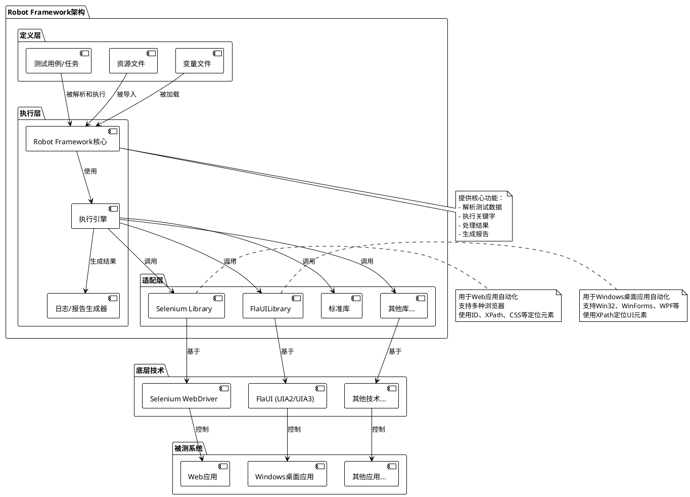

# Robot Framework、Selenium Library与FlaUILibrary关系分析

在自动化测试和RPA（机器人流程自动化）领域，Robot Framework作为一个强大的开源框架，通过各种库的扩展实现了对不同类型应用的自动化。本文将深入分析Robot Framework、Selenium Library和FlaUILibrary三者之间的关系，帮助读者理解它们在自动化测试中的定位和应用场景。

## 1. Robot Framework架构概述

### 1.1 Robot Framework的分层架构

Robot Framework采用了分层架构设计，这与ISTQB高级测试自动化工程师认证中描述的通用测试自动化架构（Generic Test Automation Architecture，gTAA）相对应：

1. **定义层（Definition Layer）**：
   - 包含测试数据、测试用例、任务和资源文件
   - 在Robot Framework中，这一层由`.robot`文件组成，包含测试用例定义和关键字调用

2. **执行层（Execution Layer）**：
   - 包含框架本身的核心组件和API
   - 负责解析测试数据、构建执行模型、执行关键字、记录结果和生成报告

3. **适配层（Adaptation Layer）**：
   - 提供Robot Framework与被测系统（SUT）之间的连接
   - 由各种关键字库组成，这些库负责与不同技术和接口交互
   - **这一层是Selenium Library和FlaUILibrary所在的位置**

### 1.2 Robot Framework的核心功能

Robot Framework本身专注于测试/任务执行，包括：

- 解析测试/任务数据并构建执行模型
- 执行关键字并处理结果
- 生成日志和报告
- 提供通用标准库
- 定义扩展和自定义的API

重要的是，Robot Framework本身**不包含**：

- 控制被测系统的关键字库（如Web前端自动化、API交互、移动自动化等）
- 代码编辑器或IDE
- CI/CD集成

这些功能需要通过外部库和工具来扩展，这就是Selenium Library和FlaUILibrary等库的作用所在。

## 2. Selenium Library详解

### 2.1 Selenium Library概述

Selenium Library是Robot Framework的一个测试库，它利用Selenium工具进行Web应用的自动化测试。它属于Robot Framework架构中的适配层，负责连接Robot Framework和Web应用。

### 2.2 主要特点

- **基于Selenium**：内部使用Selenium WebDriver进行浏览器自动化
- **跨浏览器支持**：支持Chrome、Firefox、Edge、Safari等主流浏览器
- **丰富的关键字**：提供了大量用于Web元素交互的关键字
- **元素定位**：支持多种元素定位策略（ID、XPath、CSS选择器等）
- **与Robot Framework无缝集成**：遵循Robot Framework的关键字驱动方法

### 2.3 适用场景

- Web应用的自动化测试
- 跨浏览器兼容性测试
- Web表单填写和提交
- Web数据抓取
- 基于Web的工作流自动化

## 3. FlaUILibrary详解

### 3.1 FlaUILibrary概述

FlaUILibrary是一个基于FlaUI的Robot Framework库，专门用于Windows应用程序的UI自动化测试。与Selenium Library类似，它也属于Robot Framework架构中的适配层，但专注于Windows桌面应用而非Web应用。

### 3.2 主要特点

- **基于FlaUI**：内部使用FlaUI自动化库，FlaUI是基于Microsoft UI Automation框架的封装
- **支持多种Windows应用**：Win32、WinForms、WPF和Windows Store应用
- **XPath元素定位**：使用XPath表达式定位UI元素，类似于Selenium的方法
- **双重自动化接口**：支持UIA2和UIA3两种自动化接口
- **与Robot Framework无缝集成**：提供关键字驱动的接口

### 3.3 适用场景

- Windows桌面应用的自动化测试
- Windows系统设置和配置自动化
- 传统企业应用的自动化
- 需要操作Windows原生控件的场景
- 不基于Web的Windows工作流自动化

## 4. 三者之间的关系分析

### 4.1 架构关系

从架构角度看，三者之间的关系如下：

- **Robot Framework**：提供核心框架和执行引擎，定义了测试语法和执行流程
- **Selenium Library**：作为适配层的一部分，连接Robot Framework和Web应用
- **FlaUILibrary**：作为适配层的另一部分，连接Robot Framework和Windows桌面应用

它们共同构成了一个完整的自动化测试解决方案，但针对不同的应用类型。

### 4.2 功能对比

| 特性 | Robot Framework | Selenium Library | FlaUILibrary |
|------|----------------|------------------|--------------|
| 核心功能 | 测试执行引擎 | Web自动化 | Windows桌面自动化 |
| 应用类型 | 不限 | Web应用 | Windows桌面应用 |
| 元素定位 | 不适用 | ID、XPath、CSS等 | XPath |
| 技术基础 | Python | Selenium WebDriver | FlaUI (UIA2/UIA3) |
| 跨平台 | 是 | 是 | 否（仅Windows） |
| 浏览器支持 | 不适用 | 多种浏览器 | 不适用 |

### 4.3 使用方式

三者在使用方式上有相似之处，都遵循Robot Framework的关键字驱动方法：

```robotframework
*** Settings ***
# Web自动化
Library    SeleniumLibrary

# Windows桌面自动化
Library    FlaUILibrary

*** Test Cases ***
Web自动化示例
    Open Browser    https://example.com    chrome
    Input Text    id=username    admin
    Click Button    id=login
    Close Browser

Windows桌面自动化示例
    Launch Application    calc.exe
    Click    //Button[@Name="5"]
    Click    //Button[@Name="+"]
    Click    //Button[@Name="3"]
    Click    //Button[@Name="="]
    Close Application
```

虽然语法相似，但它们操作的对象和底层实现完全不同。

## 5. 使用场景选择

在选择使用哪个库时，主要考虑以下因素：

1. **应用类型**：
   - Web应用 → Selenium Library
   - Windows桌面应用 → FlaUILibrary

2. **跨平台需求**：
   - 需要跨平台 → Selenium Library
   - 仅Windows平台 → 可以选择FlaUILibrary

3. **技术栈**：
   - 基于浏览器的应用 → Selenium Library
   - 基于Windows原生技术的应用 → FlaUILibrary

4. **混合场景**：
   - 在同一测试套件中，可以同时导入两个库，分别处理Web部分和Windows桌面部分

## 6. 关系图示

以下是使用PlantUML描述Robot Framework、Selenium Library和FlaUILibrary之间关系的图表：



## 7. 总结

Robot Framework、Selenium Library和FlaUILibrary三者构成了一个强大的自动化测试生态系统：

- **Robot Framework**作为核心框架，提供了测试执行引擎和通用功能
- **Selenium Library**专注于Web应用的自动化，是Web测试的首选
- **FlaUILibrary**专注于Windows桌面应用的自动化，填补了Web自动化之外的空白

理解它们之间的关系和各自的适用场景，可以帮助我们根据实际需求选择合适的工具，构建更高效的自动化测试解决方案。无论是Web应用还是Windows桌面应用，Robot Framework都能通过这些专业库提供强大的自动化能力。

## 8. 参考资源

- [Robot Framework官方文档](https://robotframework.org/)
- [Selenium Library文档](https://robotframework.org/SeleniumLibrary/)
- [FlaUILibrary GitHub仓库](https://github.com/GDATASoftwareAG/robotframework-flaui)
- [Robot Framework架构说明](https://robotframework.org/robotframework-RFCP-syllabus/docs/chapter-01/architecture)
- [FlaUILibrary XPath使用指南](https://gdatasoftwareag.github.io/robotframework-flaui/xpath.html)


