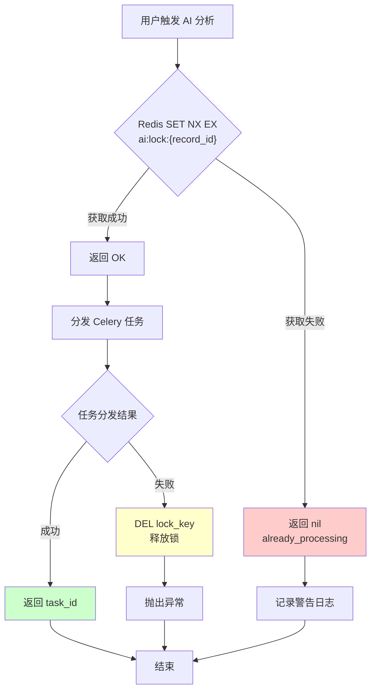
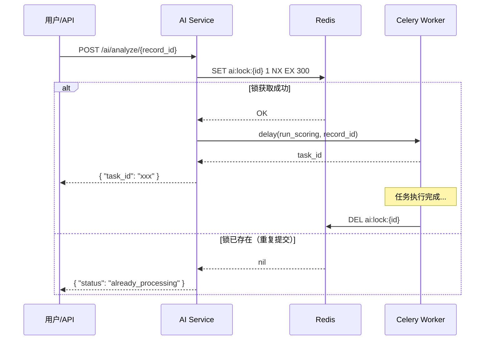

# Redis 幂等锁：分布式系统中的重复提交防护

> 本文档解释智能销售系统中使用的 Redis 幂等锁机制，用于防止 AI 分析任务的重复提交。

## 什么是幂等性？

**幂等性（Idempotency）** 是指一个操作执行一次和执行多次的效果相同，不会产生副作用。

在分布式系统中，由于网络延迟、超时重试、用户双击等原因，同一个请求可能被发送多次。如果没有幂等性保护，可能导致：

- 重复扣款
- 重复发送通知
- 重复处理同一笔数据
- 资源浪费

## 什么是 Redis 幂等锁？

**Redis 幂等锁** 是一种基于 Redis 的分布式锁实现，用于确保同一操作在短时间内只能执行一次。

### 核心机制

```
┌─────────────────────────────────────────────────────────────┐
│                    Redis 幂等锁流程                          │
├─────────────────────────────────────────────────────────────┤
│                                                             │
│   客户端请求                    Redis Server                 │
│       │                              │                       │
│       │  1. SET key value NX EX     │                       │
│       │ ───────────────────────────>│                       │
│       │                              │                       │
│       │      OK (获取锁成功)         │                       │
│       │ <───────────────────────────│                       │
│       │                              │                       │
│       │  2. 执行业务逻辑              │                       │
│       │  ==============>              │                       │
│       │                              │                       │
│       │  3. DEL key (释放锁)         │                       │
│       │ ───────────────────────────>│                       │
│       │                              │                       │
└─────────────────────────────────────────────────────────────┘
```

### 关键命令参数

| 参数 | 含义 | 作用 |
|------|------|------|
| `NX` | Not eXists | 仅在 key 不存在时才设置成功 |
| `EX` | EXpire | 设置 key 的过期时间（秒） |

## 系统中的实际应用

### 场景：AI 分析任务触发

在智能销售系统中，当用户触发 AI 分析时，使用 Redis 幂等锁防止重复提交：

```python
async def trigger_analysis(self, customer_batch_record_id: str, db: AsyncSession) -> str:
    redis = get_redis()
    lock_key = f"ai:lock:{customer_batch_record_id}"

    # 尝试获取锁（NX: 不存在时设置，EX: 过期时间 300 秒）
    lock = await redis.set(lock_key, "1", nx=True, ex=300)
    if not lock:
        # 锁已存在，说明正在处理中
        logger.warning("AI analysis already in progress for record_id=%s", customer_batch_record_id)
        return "already_processing"

    try:
        # 分发 Celery 异步任务
        task = run_scoring.delay(customer_batch_record_id=customer_batch_record_id)
        logger.info("Triggered AI analysis task_id=%s for record_id=%s", task.id, customer_batch_record_id)
        return task.id
    except Exception:
        # 任务分发失败时释放锁
        await redis.delete(lock_key)
        raise
```

### 流程图



### 时序图



## 为什么需要过期时间（EX）？

### 问题：死锁

如果没有过期时间，一旦服务崩溃或异常退出，锁将永远存在，导致该记录无法再被分析：

```
场景：
1. Service A 获取锁成功
2. Service A 在释放锁前崩溃
3. 锁永远存在于 Redis 中
4. 后续所有请求都返回 "already_processing"
   ↓ 死锁！
```

### 解决方案：自动过期

设置合理的过期时间（如 300 秒），即使服务异常，锁也会自动释放：

```
场景（有 EX）：
1. Service A 获取锁成功（EX 300）
2. Service A 在释放锁前崩溃
3. 300 秒后 Redis 自动删除 key
4. 后续请求可以正常获取锁
   ↓ 安全！
```

## 设计要点

### 1. 锁的粒度

```python
# 细粒度：每个记录独立锁
lock_key = f"ai:lock:{customer_batch_record_id}"

# 粗粒度：整个批次一个锁
lock_key = f"ai:lock:batch:{batch_id}"
```

**选择原则**：锁粒度越细，并发度越高，但管理复杂度也越高。

### 2. 过期时间设置

```python
# 根据业务执行时间设置
SHORT_TASK = 60      # 1 分钟 - 快速操作
MEDIUM_TASK = 300    # 5 分钟 - 一般分析
LONG_TASK = 3600     # 1 小时 - 复杂任务
```

**经验法则**：过期时间 = 预期最大执行时间 × 2（安全裕度）

### 3. 锁的值设计

```python
# 简单值
await redis.set(lock_key, "1", nx=True, ex=300)

# 包含上下文信息（便于调试）
import json
lock_value = json.dumps({
    "started_at": datetime.utcnow().isoformat(),
    "service": "ai-service",
    "task_id": task_id
})
await redis.set(lock_key, lock_value, nx=True, ex=300)
```

### 4. 错误处理

```python
try:
    task = run_scoring.delay(customer_batch_record_id=customer_batch_record_id)
    return task.id
except Exception:
    # 关键：任务分发失败时必须释放锁
    await redis.delete(lock_key)
    raise
```

## 对比其他幂等方案

| 方案 | 优点 | 缺点 | 适用场景 |
|------|------|------|----------|
| **Redis 幂等锁** | 高性能、原子操作、自动过期 | 需要 Redis 依赖 | 短时操作、高并发 |
| 数据库唯一索引 | 持久化、强一致性 | 性能较低、清理麻烦 | 关键业务数据 |
| Token 机制 | 客户端控制 | 需要客户端配合 | 表单提交 |
| 状态机 | 业务语义清晰 | 实现复杂 | 复杂业务流程 |

## 常见问题

### Q1: 锁过期了但任务还在执行怎么办？

**A**: 可以采用"看门狗"模式，在任务执行期间定期续期锁：

```python
async def extend_lock(redis, lock_key, additional_seconds):
    """延长锁的过期时间"""
    await redis.expire(lock_key, additional_seconds)

# 在长时间任务中定期调用
while task_running:
    await extend_lock(redis, lock_key, 300)
    await asyncio.sleep(60)  # 每分钟续期一次
```

### Q2: 如何监控锁的使用情况？

**A**: 使用 Redis 命令查看：

```bash
# 查看所有 AI 相关的锁
KEYS ai:lock:*

# 查看锁的剩余过期时间
TTL ai:lock:record_123

# 查看锁的值
GET ai:lock:record_123
```

### Q3: 集群环境下的注意事项？

**A**: 
- 确保所有服务实例连接到同一个 Redis（或 Redis Cluster）
- 考虑使用 Redlock 算法实现更严格的分布式锁（需要多个 Redis 节点）
- 对于单 Redis 实例，`SET NX EX` 已经是原子操作，足够安全

## 总结

Redis 幂等锁是一种简单高效的重复提交防护机制，核心要点：

1. **原子操作**：`SET key value NX EX` 确保检查和设置是一体的
2. **自动过期**：防止死锁，设置合理的 TTL
3. **及时释放**：业务完成后或异常时及时删除锁
4. **合理粒度**：根据业务场景选择锁的粒度

在本系统中，Redis 幂等锁确保了 AI 分析任务不会因为用户的重复点击或网络重试而被多次执行，保证了数据分析的准确性和系统资源的有效利用。

---

**相关代码**: `backend/src/smart_sales/services/ai_service.py`
**相关文档**: [核心业务场景](./核心业务场景.md)
