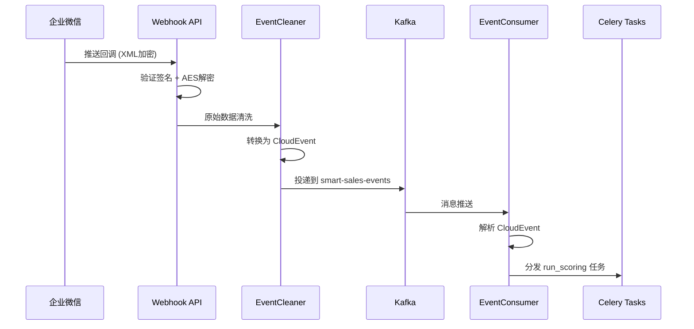

# Kafka 分布式消息流平台详解 - 基于 Smart Sales 项目实践

> 本文档结合智能销售助手系统（Smart Sales）的实际代码，深入讲解 Kafka 的架构设计、工作流程和核心概念。

---

## 📋 目录

1. [什么是 Kafka](#什么是-kafka)
2. [系统架构概览](#系统架构概览)
3. [核心概念详解](#核心概念详解)
4. [项目中的 Kafka 实践](#项目中的-kafka-实践)
5. [CloudEvents 标准化](#cloudevents-标准化)
6. [Producer 生产者](#producer-生产者)
7. [Consumer 消费者](#consumer-消费者)
8. [部署与配置](#部署与配置)
9. [最佳实践与注意事项](#最佳实践与注意事项)

---

## 什么是 Kafka

**Apache Kafka** 是一个开源的分布式事件流平台，主要用于：

- **消息队列**：高吞吐量、低延迟的消息传递
- **事件流处理**：实时处理连续的数据流
- **日志聚合**：集中收集分布式系统的日志
- **流式 ETL**：实时数据管道和集成

### 为什么选择 Kafka？

| 特性 | 说明 |
|------|------|
| **高吞吐量** | 单机每秒可处理数十万条消息 |
| **低延迟** | 端到端延迟可控制在毫秒级 |
| **可扩展** | 支持水平扩展，动态添加 Broker |
| **持久性** | 消息持久化到磁盘，支持多副本 |
| **容错性** | 自动故障转移，数据不丢失 |

### Kafka vs RabbitMQ vs Redis

| 特性 | Kafka | RabbitMQ | Redis |
|------|-------|----------|-------|
| **设计目标** | 流处理、事件溯源 | 通用消息队列 | 缓存/轻量级队列 |
| **吞吐量** | 极高（百万级/秒） | 高（万级/秒） | 高（万级/秒） |
| **消息持久化** | ✅ 磁盘持久化 | ✅ 可选 | ⚠️ 内存为主 |
| **消息回溯** | ✅ 支持按 offset 回溯 | ❌ 消费即删除 | ❌ 消费即删除 |
| **顺序保证** | ✅ 分区级顺序 | ✅ 队列级顺序 | ✅ 列表顺序 |
| **适用场景** | 大数据流、日志、事件总线 | 企业集成、任务队列 | 缓存、简单队列 |

---

## 系统架构概览

### Kafka 在 Smart Sales 中的架构位置

```
┌─────────────────────────────────────────────────────────────────┐
│                        Smart Sales 系统                        │
├─────────────────────────────────────────────────────────────────┤
│                                                                  │
│  ┌──────────────────────────────────────────────────────────┐  │
│  │                   感知层 (Perception)                     │  │
│  │  ┌──────────────┐    ┌──────────────┐    ┌────────────┐  │  │
│  │  │ Webhook API  │───▶│ EventCleaner │───▶│  Producer  │  │  │
│  │  └──────────────┘    └──────────────┘    └────────────┘  │  │
│  └──────────────────────────────────────────────────────────┘  │
│                              │                                   │
│                              ▼                                   │
│  ┌──────────────────────────────────────────────────────────┐  │
│  │              Kafka 事件总线 (Event Bus)                   │  │
│  │                                                          │  │
│  │   ┌─────────────┐     ┌─────────────┐     ┌──────────┐  │  │
│  │   │  Topic:     │     │  Partition  │     │   Log    │  │  │
│  │   │smart-sales- │────▶│     0       │────▶│  Segment │  │  │
│  │   │   events    │     │     1       │     │  Segment │  │  │
│  │   │  (3 parts)  │     │     2       │     │  Segment │  │  │
│  │   └─────────────┘     └─────────────┘     └──────────┘  │  │
│  │                                                          │  │
│  └──────────────────────────────────────────────────────────┘  │
│                              │                                   │
│                              ▼                                   │
│  ┌──────────────────────────────────────────────────────────┐  │
│  │                   消费者层 (Consumers)                    │  │
│  │                                                          │  │
│  │   ┌────────────┐    ┌────────────┐    ┌────────────┐    │  │
│  │   │   Data     │    │    FSM     │    │     AI     │    │  │
│  │   │   Sync     │    │  Consumer  │    │  Consumer  │    │  │
│  │   │  Consumer  │    │            │    │            │    │  │
│  │   └────────────┘    └────────────┘    └────────────┘    │  │
│  │                                                          │  │
│  └──────────────────────────────────────────────────────────┘  │
│                                                                  │
└─────────────────────────────────────────────────────────────────┘
```

### 项目中的 Kafka 服务

根据 `docker-compose.yml` 配置：

```yaml
services:
  kafka:
    image: apache/kafka:latest
    environment:
      KAFKA_NODE_ID: 1
      KAFKA_PROCESS_ROLES: broker,controller
      KAFKA_LISTENERS: PLAINTEXT://0.0.0.0:9092
      KAFKA_ADVERTISED_LISTENERS: PLAINTEXT://192.168.1.4:9092
      KAFKA_NUM_PARTITIONS: 3
    
  kafka-ui:
    image: provectuslabs/kafka-ui:latest
    environment:
      KAFKA_CLUSTERS_0_NAME: smart-sales-cluster
      KAFKA_CLUSTERS_0_BOOTSTRAPSERVERS: kafka:9092
```

| 服务 | 端口 | 用途 |
|------|------|------|
| Kafka | 9092 | 消息队列服务 |
| Kafka UI | 8190 | Web 管理界面 |

---

## 核心概念详解

### 1. Topic（主题）

**Topic** 是 Kafka 中消息的逻辑分类单元，类似于数据库的表。

**项目中的 Topic**：

```python
# backend/src/smart_sales/perception/webhooks/wechat.py
KAFKA_TOPIC = "smart-sales-events"
```

**Topic 特性**：
- 一个 Topic 可以有多个 **Partition（分区）**
- 消息在 Partition 内保持**顺序**
- 不同 Partition 之间的消息**无顺序保证**

**分区策略**（docker-compose.yml）：

```yaml
KAFKA_NUM_PARTITIONS: 3  # 默认 3 个分区
```

### 2. Partition（分区）

**Partition** 是 Topic 的物理分片，每个分区是一个有序的、不可变的消息序列。

```
Topic: smart-sales-events
┌─────────────────────────────────────────────────────────┐
│ Partition 0          │ Partition 1          │ Partition 2           │
│ ┌─────────────────┐  │ ┌─────────────────┐  │ ┌─────────────────┐  │
│ │ Offset 0        │  │ │ Offset 0        │  │ │ Offset 0        │  │
│ │ Offset 1        │  │ │ Offset 1        │  │ │ Offset 1        │  │
│ │ Offset 2        │  │ │ Offset 2        │  │ │ Offset 2        │  │
│ │ ...             │  │ │ ...             │  │ │ ...             │  │
│ └─────────────────┘  │ └─────────────────┘  │ └─────────────────┘  │
└─────────────────────────────────────────────────────────┘
```

**分区的作用**：
1. **水平扩展**：通过增加分区提升吞吐量
2. **并行消费**：一个 Consumer Group 内的消费者可以并行消费不同分区
3. **容错性**：分区可以配置多个副本

### 3. Offset（偏移量）

**Offset** 是消息在分区中的唯一标识，是一个递增的整数。

**消费模式**：

```python
# backend/src/smart_sales/perception/consumer.py
consumer = KafkaConsumer(
    bootstrap_servers=settings.KAFKA_BOOTSTRAP_SERVERS,
    group_id=self._group_id,
    auto_offset_reset="earliest",  # 从最早的消息开始消费
    enable_auto_commit=False,       # 手动提交 offset
)
```

| 参数 | 说明 |
|------|------|
| `auto_offset_reset="earliest"` | 从头开始消费（新 Consumer Group） |
| `auto_offset_reset="latest"` | 从最新位置开始消费 |
| `enable_auto_commit=False` | 手动控制 offset 提交，确保消息处理完成后再提交 |

### 4. Consumer Group（消费者组）

**Consumer Group** 是一组共同消费一个 Topic 的消费者。

```
Topic: smart-sales-events (3 partitions)

Consumer Group: smart-sales-consumer
┌─────────────────────────────────────────────────────────┐
│                                                         │
│  Consumer-1 ──────▶ Partition-0                         │
│  Consumer-2 ──────▶ Partition-1                         │
│  Consumer-3 ──────▶ Partition-2                         │
│                                                         │
└─────────────────────────────────────────────────────────┘
```

**消费者组特性**：
- 一个分区只能被组内一个消费者消费
- 组内消费者数量 ≤ 分区数（超出则空闲）
- 不同消费者组相互独立，可重复消费

### 5. Producer（生产者）

**Producer** 负责向 Kafka 发送消息。

```python
# backend/src/smart_sales/perception/cleaner.py
producer = KafkaProducer(
    bootstrap_servers=settings.KAFKA_BOOTSTRAP_SERVERS,
    value_serializer=lambda v: json.dumps(v).encode("utf-8"),
    max_block_ms=3000,
    request_timeout_ms=5000,
    retries=2,
)
```

**生产者配置**：

| 参数 | 说明 | 项目配置 |
|------|------|----------|
| `bootstrap_servers` | Kafka 集群地址 | `localhost:9092` |
| `value_serializer` | 消息序列化器 | JSON |
| `max_block_ms` | 发送阻塞超时 | 3000ms |
| `request_timeout_ms` | 请求超时 | 5000ms |
| `retries` | 发送失败重试次数 | 2 |

### 6. Message（消息）

**Kafka 消息结构**：

```
┌─────────────────────────────────────────────────────────┐
│  Message                                                │
├─────────────────────────────────────────────────────────┤
│  Key        : Optional[str]    → 用于分区路由           │
│  Value      : bytes            → 消息体（JSON序列化）   │
│  Headers    : List[Tuple]      → 元数据（CloudEvent）   │
│  Timestamp  : int              → 消息时间戳             │
│  Offset     : int              → 分区偏移量             │
│  Partition  : int              → 分区号                 │
└─────────────────────────────────────────────────────────┘
```

---

## 项目中的 Kafka 实践

### 1. 整体工作流程



### 2. 事件清洗与标准化

**EventCleaner 类**（`cleaner.py`）：

```python
class EventCleaner:
    """数据清洗与标准化引擎."""

    # 渠道映射配置
    SOURCE_PREFIX_MAP: dict[str, str] = {
        "wechat": "/perception/wechat",
        "douyin": "/perception/douyin",
    }

    EVENT_TYPE_MAP: dict[str, str] = {
        "wechat.message": "com.smart-sales.wechat.message",
        "wechat.event": "com.smart-sales.wechat.event",
        "douyin.lead": "com.smart-sales.douyin.lead",
    }

    async def clean(self, raw_payload: dict[str, Any], source: str) -> CloudEvent:
        """将原始数据清洗为标准 CloudEvent."""
        match source:
            case "wechat":
                # 企微消息清洗
                event_type = self.EVENT_TYPE_MAP.get("wechat.message")
                data = {
                    "to_user": raw_payload.get("ToUserName"),
                    "from_user": raw_payload.get("FromUserName"),
                    "msg_type": raw_payload.get("MsgType"),
                    "content": raw_payload.get("Content"),
                }
            case "douyin":
                # 抖音线索清洗
                event_type = self.EVENT_TYPE_MAP.get("douyin.lead")
                data = {
                    "lead_id": raw_payload.get("lead_id"),
                    "phone": raw_payload.get("phone"),
                }
        
        return CloudEvent(
            type=event_type,
            source=event_source,
            data=data,
        )
```

### 3. 去重与防抖

**去重检查**（`wechat.py`）：

```python
# 1. 初始化去重器
dedup = EventDeduplicator(redis_client)

# 2. 去重检查
if await dedup.is_duplicate(event.id):
    logger.warning(f"重复事件，跳过处理: event_id={event.id}")
    return {"errcode": 0, "errmsg": "ok"}

# 3. 限流检查
if await dedup.check_throttle(event.subject or "unknown", event.type):
    logger.warning(f"触发限流，跳过处理: event_id={event.id}")
    return {"errcode": 0, "errmsg": "ok"}
```

---

## CloudEvents 标准化

### CloudEvents 规范

项目采用 **CloudEvents v1.0** 作为事件标准格式：

```python
# backend/src/smart_sales/core/events.py
class CloudEvent(BaseModel):
    """CloudEvents v1.0 Pydantic 模型."""

    # 必需属性
    specversion: str = "1.0"          # 规范版本
    id: str                           # 事件唯一标识
    type: str                         # 事件类型
    source: str                       # 事件来源
    
    # 可选属性
    time: datetime                    # 事件产生时间
    subject: str | None               # 事件主题
    datacontenttype: str = "application/json"
    
    # 事件负载
    data: dict[str, Any] | None       # 事件数据
    
    # 扩展属性
    traceparent: str | None           # W3C Trace Context
    idempotencykey: str | None        # 幂等键
```

### 事件类型命名规范

```
{领域}.{子域}.{动作}

示例：
- com.smart-sales.wechat.message      # 企微消息事件
- com.smart-sales.wechat.event        # 企微事件（加好友等）
- com.smart-sales.douyin.lead         # 抖音线索事件
- com.smart-sales.customer.created    # 客户创建事件
```

### Kafka Headers

CloudEvent 元数据通过 Kafka Headers 传递：

```python
def to_kafka_headers(self) -> list[tuple[str, bytes]]:
    """将 CloudEvent 元数据转为 Kafka 消息头."""
    headers = [
        ("ce_specversion", self.specversion.encode()),
        ("ce_id", self.id.encode()),
        ("ce_type", self.type.encode()),
        ("ce_source", self.source.encode()),
        ("ce_time", self.time.isoformat().encode()),
    ]
    if self.subject:
        headers.append(("ce_subject", self.subject.encode()))
    if self.traceparent:
        headers.append(("ce_traceparent", self.traceparent.encode()))
    return headers
```

---

## Producer 生产者

### 生产者初始化

```python
# backend/src/smart_sales/perception/cleaner.py
_kafka_producer_instance: KafkaProducer | None = None

def _get_kafka_producer() -> KafkaProducer | None:
    """获取模块级 Kafka Producer 单例（惰性初始化）."""
    global _kafka_producer_instance

    if _kafka_producer_instance is not None:
        return _kafka_producer_instance

    try:
        _kafka_producer_instance = KafkaProducer(
            bootstrap_servers=settings.KAFKA_BOOTSTRAP_SERVERS,
            value_serializer=lambda v: json.dumps(v).encode("utf-8"),
            max_block_ms=3000,
            request_timeout_ms=5000,
            retries=2,
        )
        logger.info(f"Kafka Producer 初始化成功")
        return _kafka_producer_instance
    except KafkaError as e:
        logger.warning(f"Kafka Producer 初始化失败，将降级运行: {e}")
        return None
```

### 发送消息

```python
async def publish_to_kafka(self, event: CloudEvent, topic: str) -> None:
    """将 CloudEvent 投递到 Kafka 指定 topic."""
    producer = _get_kafka_producer()

    if producer is None:
        logger.warning(f"Kafka 不可用，跳过事件投递")
        return

    try:
        # 异步发送消息
        future = producer.send(
            topic=topic,
            value=event.model_dump(mode="json"),
            headers=event.to_kafka_headers(),
        )
        # 等待发送确认（带超时）
        future.get(timeout=5)
        logger.info(f"事件投递成功: event_id={event.id}, topic={topic}")
    except KafkaError as e:
        logger.warning(f"Kafka 投递失败，降级跳过: {e}")
```

### 发送模式

| 模式 | 方法 | 说明 |
|------|------|------|
| **同步发送** | `future.get(timeout=5)` | 等待确认，可靠性高 |
| **异步发送** | `producer.send()` | 不等待确认，性能高 |
| **批量发送** | `producer.flush()` | 批量提交，减少网络开销 |

---

## Consumer 消费者

### EventConsumer 类

```python
# backend/src/smart_sales/perception/consumer.py
class EventConsumer:
    """Kafka Consumer，负责消费 CloudEvent 并分发 Celery 任务。"""

    def __init__(self, group_id: str = "smart-sales-consumer"):
        self._group_id = group_id
        self._consumer = self._build_consumer_with_retry()

    def _build_consumer_with_retry(self) -> KafkaConsumer:
        """带重试的 Consumer 初始化."""
        attempts = 0
        while attempts < 3:
            attempts += 1
            try:
                consumer = KafkaConsumer(
                    bootstrap_servers=self._settings.KAFKA_BOOTSTRAP_SERVERS,
                    group_id=self._group_id,
                    auto_offset_reset="earliest",
                    enable_auto_commit=False,  # 手动提交
                    value_deserializer=self._deserialize_message,
                )
                logger.info("Kafka Consumer 初始化成功")
                return consumer
            except (NoBrokersAvailable, KafkaError) as exc:
                logger.warning(f"Kafka Consumer 初始化失败({attempts}/3): {exc}")
                time.sleep(1)
```

### 消费循环

```python
def start(self, topics: list[str]) -> None:
    """启动消费循环。"""
    self._consumer.subscribe(topics)
    logger.info(f"Kafka Consumer 开始消费: topics={topics}")

    try:
        for message in self._consumer:
            try:
                self._dispatch(message.value)
                self._consumer.commit()  # 手动提交 offset
            except Exception as exc:
                logger.exception(f"消费消息失败: {exc}")
    except KeyboardInterrupt:
        logger.info("收到中断信号，Kafka Consumer 退出")
    finally:
        self._consumer.close()
```

### 消息分发

```python
def _dispatch(self, event_data: dict[str, Any]) -> None:
    """解析 CloudEvent 并按 type 分发。"""
    event = CloudEvent(**event_data)

    match event.type:
        case "com.smart-sales.wechat.message" | "com.smart-sales.douyin.lead":
            record_id = self._resolve_customer_batch_record_id(event)
            if not record_id:
                return
            # 分发 Celery 任务
            run_scoring.delay(customer_batch_record_id=record_id)
            logger.info(f"任务分发成功: event_id={event.id}")
        case _:
            logger.warning(f"Unknown event type: {event.type}")
```

---

## 部署与配置

### Docker Compose 配置

```yaml
services:
  kafka:
    image: apache/kafka:latest
    ports:
      - "9092:9092"
    environment:
      # 节点配置
      KAFKA_NODE_ID: 1
      KAFKA_PROCESS_ROLES: broker,controller
      
      # 监听配置
      KAFKA_LISTENERS: PLAINTEXT://0.0.0.0:9092,CONTROLLER://0.0.0.0:9093
      KAFKA_ADVERTISED_LISTENERS: PLAINTEXT://192.168.1.4:9092
      
      # 控制器配置
      KAFKA_CONTROLLER_LISTENER_NAMES: CONTROLLER
      KAFKA_LISTENER_SECURITY_PROTOCOL_MAP: CONTROLLER:PLAINTEXT,PLAINTEXT:PLAINTEXT
      KAFKA_CONTROLLER_QUORUM_VOTERS: 1@kafka:9093
      
      # 主题配置
      KAFKA_OFFSETS_TOPIC_REPLICATION_FACTOR: 1
      KAFKA_NUM_PARTITIONS: 3
      
      # 性能配置
      KAFKA_GROUP_INITIAL_REBALANCE_DELAY_MS: 0
```

### 关键配置说明

| 配置项 | 说明 |
|--------|------|
| `KAFKA_NODE_ID` | 节点唯一标识（KRaft 模式） |
| `KAFKA_PROCESS_ROLES` | 节点角色：broker（数据存储）、controller（集群管理） |
| `KAFKA_LISTENERS` | 监听地址，PLAINTEXT 为明文协议 |
| `KAFKA_ADVERTISED_LISTENERS` | 对外暴露的地址，客户端通过此地址连接 |
| `KAFKA_NUM_PARTITIONS` | 默认分区数 |
| `KAFKA_OFFSETS_TOPIC_REPLICATION_FACTOR` | 消费偏移量主题的副本数 |

### Kafka UI 管理界面

```yaml
kafka-ui:
  image: provectuslabs/kafka-ui:latest
  ports:
    - "8190:8080"
  environment:
    KAFKA_CLUSTERS_0_NAME: smart-sales-cluster
    KAFKA_CLUSTERS_0_BOOTSTRAPSERVERS: kafka:9092
```

访问地址：`http://localhost:8190`

功能：
- 查看 Topic 列表和详情
- 查看 Consumer Group 消费进度
- 查看消息内容（支持 CloudEvent Headers）
- 创建和管理 Topic

---

## 最佳实践与注意事项

### ✅ 最佳实践

#### 1. 消息设计原则

```python
# ✅ 好的实践：包含幂等键和追踪 ID
event = CloudEvent(
    type="com.smart-sales.order.created",
    source="/api/orders",
    idempotencykey=f"order:{order_id}",  # 幂等键
    traceparent=f"00-{trace_id}-{span_id}-00",  # 分布式追踪
    data={
        "order_id": order_id,
        "customer_id": customer_id,
        "amount": amount,
        "timestamp": datetime.now(UTC).isoformat(),
    }
)
```

#### 2. 消费者幂等性

```python
# ✅ 好的实践：消费端去重
dedup_key = f"kafka:consumed:{event.id}"
if await redis.get(dedup_key):
    logger.info(f"消息已消费过，跳过: {event.id}")
    return

# 处理消息
process_message(event)

# 标记已消费（设置过期时间）
await redis.setex(dedup_key, 86400, "1")
```

#### 3. 错误处理与重试

```python
# ✅ 好的实践：区分可重试错误和永久错误
for message in consumer:
    try:
        process(message)
        consumer.commit()
    except ValidationError as e:
        # 永久错误：记录到死信队列
        send_to_dlq(message, str(e))
        consumer.commit()
    except KafkaError as e:
        # 临时错误：不提交 offset，稍后重试
        logger.error(f"处理失败，将重试: {e}")
        time.sleep(1)
```

#### 4. 批量消费提升吞吐

```python
# ✅ 好的实践：批量获取消息
consumer = KafkaConsumer(
    bootstrap_servers=servers,
    max_poll_records=500,  # 每次拉取 500 条
    max_poll_interval_ms=300000,  # 5 分钟处理时间
)
```

### ⚠️ 常见陷阱

#### 1. 避免消息过大

```python
# ❌ 错误：消息过大（> 1MB）
event.data = {
    "image": base64_encoded_large_image,  # 10MB 图片
}

# ✅ 正确：存储引用，消息传递 ID
event.data = {
    "image_url": "https://minio/bucket/image.jpg",
    "image_id": "img_12345",
}
```

#### 2. 正确处理异步代码

```python
# ❌ 错误：在同步 Consumer 中直接使用 await
for message in consumer:  # 同步循环
    await process(message)  # 错误！

# ✅ 正确：使用事件循环
import asyncio

loop = asyncio.new_event_loop()
for message in consumer:
    result = loop.run_until_complete(process_async(message))
```

#### 3. 避免重复消费

```python
# ❌ 错误：自动提交可能导致消息丢失
consumer = KafkaConsumer(
    enable_auto_commit=True,  # 消息可能还没处理就提交了
    auto_commit_interval_ms=5000,
)

# ✅ 正确：手动提交确保处理完成
consumer = KafkaConsumer(enable_auto_commit=False)
for message in consumer:
    process(message)
    consumer.commit()  # 处理完成后再提交
```

#### 4. 消费者组管理

```python
# ❌ 错误：消费者频繁加入/离开
consumer = KafkaConsumer(group_id="group-1")
consumer.close()
# ... 短时间内重新创建
consumer = KafkaConsumer(group_id="group-1")  # 触发 Rebalance

# ✅ 正确：保持消费者稳定运行
consumer = KafkaConsumer(group_id="group-1")
try:
    for message in consumer:
        process(message)
finally:
    consumer.close()
```

### 🔍 监控与调试

#### 1. Kafka UI 监控

访问 `http://localhost:8190` 查看：
- Topic 消息积压量
- Consumer Group Lag（消费延迟）
- Partition 分布

#### 2. 日志追踪

```python
# 添加追踪信息
logger.info(
    f"Kafka 消息处理",
    extra={
        "event_id": event.id,
        "event_type": event.type,
        "topic": message.topic,
        "partition": message.partition,
        "offset": message.offset,
        "traceparent": event.traceparent,
    }
)
```

#### 3. Lag 监控脚本

```python
from kafka import KafkaConsumer

def check_consumer_lag(group_id: str, topic: str):
    """检查消费者延迟."""
    consumer = KafkaConsumer(
        group_id=group_id,
        bootstrap_servers="localhost:9092",
    )
    
    # 获取当前 offset
    partitions = consumer.partitions_for_topic(topic)
    total_lag = 0
    
    for partition in partitions:
        tp = TopicPartition(topic, partition)
        committed = consumer.committed(tp)
        end_offset = consumer.end_offsets([tp])[tp]
        
        if committed:
            lag = end_offset - committed
            total_lag += lag
            print(f"Partition {partition}: lag={lag}")
    
    print(f"Total lag: {total_lag}")
```

---

## 总结

### Kafka 在 Smart Sales 中的价值

| 场景 | 不使用 Kafka | 使用 Kafka |
|------|-------------|-----------|
| Webhook 处理 | API 同步处理，响应慢 | 异步投递，立即返回 |
| 系统解耦 | 服务间直接调用 | 通过事件总线解耦 |
| 数据一致性 | 容易丢失消息 | 持久化 + 多副本保证 |
| 扩展性 | 垂直扩展受限 | 水平扩展 Consumer |

### 核心要点回顾

1. **Topic-Partition** 是 Kafka 的核心存储模型
2. **Consumer Group** 实现负载均衡和高可用
3. **手动提交 Offset** 确保消息可靠处理
4. **CloudEvents** 提供跨系统的事件标准化
5. **幂等性设计** 防止消息重复处理
6. **降级机制** 确保 Kafka 故障时服务可用

---

## 参考资源

- [Apache Kafka 官方文档](https://kafka.apache.org/documentation/)
- [CloudEvents 规范](https://cloudevents.io/)
- [kafka-python 客户端文档](https://kafka-python.readthedocs.io/)
- [Kafka UI 项目](https://github.com/provectus/kafka-ui)
- 项目 Kafka 配置: `docker-compose.yml`
- 项目 CloudEvent 模型: `backend/src/smart_sales/core/events.py`
- 项目 Producer 实现: `backend/src/smart_sales/perception/cleaner.py`
- 项目 Consumer 实现: `backend/src/smart_sales/perception/consumer.py`
