Memoir 为 [Claude Code](https://docs.claude.com/en/docs/claude-code/overview) 提供了一个一等公民级别的插件。安装后，memoir 会原生融入到你的编码会话中：会话开始时注入上下文，每轮对话结束时自动捕获持久化事实，以及一整套覆盖各类操作的斜杠命令。

该插件位于仓库的 `plugins/claude-code/` 目录下。

## 安装

在 Claude Code 会话中执行：

```
/plugin marketplace add zhangfengcdt/memoir
/plugin install memoir@memoir
```

第一条命令将 memoir 的 GitHub 仓库注册为插件市场；第二条命令从该市场安装 `memoir` 插件。Hook 会在下次会话启动时生效。

每个项目都有自己独立的 memoir 存储库，位于 `~/.memoir/<slug>/` 下，路径基于你的当前工作目录派生。可通过导出 `MEMOIR_STORE=/path/to/store` 来覆盖。如果你使用了 `git worktree`，同一仓库的所有关联 worktree 共享一个存储库，键为主 worktree 的路径 —— 如需每个 worktree 独立，请按 worktree 设置 `MEMOIR_STORE`。

## 包含内容

| 组件 | 数量 | 作用 |
|---|---|---|
| 斜杠命令 | 9 | 手动记忆操作、管理、UI 启动 |
| Skills | 2 | 自动调用：召回 + 代码库引导 |
| 生命周期 Hook | 4 | 上下文注入 + 自动捕获 |
| 辅助脚本 | 3 | 存储路径、UI 控制、状态行 |

## 斜杠命令

| 命令 | 用途 |
|---|---|
| `/memoir:onboard [--force]` | 填充或刷新 `codebase:onboard` 快照。 |
| `/memoir:remember <fact>` | 捕获一条记忆。`-p <path>` 跳过分类。 |
| `/memoir:recall <query>` | 从历史会话中召回（委托给 `memory-recall` skill）。 |
| `/memoir:status` | 显示分支、提交数、记忆数、命名空间。 |
| `/memoir:ui` | 启动或重新打开 Web UI（默认只读，LLM 关闭）。 |

管理类操作（`forget`、`taxonomy`、`unmerged`、`sync-branch`）可直接通过 `memoir` CLI 使用 —— 之所以从斜杠命令中移除，是为了让会话内的 UX 聚焦于五个常用操作。

## Skills

| Skill | 命名空间 | 作用 |
|---|---|---|
| `memory-recall` | `default` | 用户捕获的事实。通过 `summarize` 选取分类法路径，批量 `get`，从不嵌套调用 LLM。在 fork 的上下文中运行。配置为**默认开启**且具有激进的触发条件，确保已记住的偏好绝不会被悄悄跳过。 |
| `memoir-onboard` | `codebase:onboard` | 维护一份高层级的仓库快照，通过 SessionStart 注入为后续会话提供初始上下文。 |

这种拆分是有意的：**recall 负责用户捕获的事实；onboard 负责代码库结构。**

### 读写不对称

按设计：

- **读取由 skills 自动触发。** 代理在认为可能需要时主动拉取上下文，无需用户要求。
- **写入是显式的斜杠命令。** `/memoir:remember` 保留为命令而非 skill —— 因为 `Stop` hook 已经处理了自动捕获；这条命令是手动的逃生通道。删除（`memoir forget`）则放在 CLI 中而非斜杠命令，刻意保持显式以确保安全。

## 生命周期 Hook

在 `plugins/claude-code/hooks/hooks.json` 中配置：

| 事件 | 脚本 | 超时 | 异步 | 用途 |
|---|---|---|---|---|
| `SessionStart` | `session-start.sh` | 15 秒 | — | 注入存储状态、分支/提交状态、引导快照、"记忆可用"提示。 |
| `UserPromptSubmit` | `user-prompt-submit.sh` | 10 秒 | — | 为当前提示展示匹配的记忆提示。 |
| `Stop` | `stop.sh` | 180 秒 | 是 | 解析对话记录，将持久化事实自动捕获到分类法中。 |
| `SessionEnd` | `session-end.sh` | 5 秒 | 是 | 清理。 |

共享辅助函数：`hooks/common.sh`、`hooks/parse-transcript.sh`。

## 辅助脚本

| 脚本 | 作用 |
|---|---|
| `derive-store-path.sh` | 将当前 cwd 映射到 `~/.memoir/<slug>`（关联的 worktree 折叠到主 worktree 的 slug 上）。遵循 `$MEMOIR_STORE`。 |
| `memoir-ui-ctl.sh` | Web UI 的 `start` / `stop` / `status`，配合 pidfile 簿记，使重复的 `/memoir:ui` 调用复用同一服务器。 |
| `statusline.sh` | 将 memoir 状态渲染到 Claude Code 的状态行，例如 `memoir: feature/foo · 14 memories`。 |

## 生命周期

一个会话流经四个 hook 事件。第 2–4 步在每个用户提示时循环一次；第 5 步在结束时只运行一次。

```mermaid
sequenceDiagram
    actor 你
    participant Claude as Claude Code
    participant Plugin as memoir 插件 hooks
    participant Store as memoir 存储

    rect rgb(30, 50, 70)
    Note over Claude,Store: 1. SessionStart — session-start.sh（同步）
    Plugin->>Store: 读取状态、分支/提交、codebase:onboard
    Store-->>Claude: 注入快照 + "记忆可用"提示
    end

    rect rgb(30, 55, 45)
    Note over 你,Store: 2–4. 每个用户提示（循环）
    你->>Claude: 提示
    Plugin->>Store: 2. UserPromptSubmit — 召回判定（同步）
    Store-->>Claude: "[memoir] 记忆可用"提示
    Claude->>Store: 3. memory-recall skill（fork、按需）
    Store-->>Claude: summarize → 选择前缀 → get → 事实
    Claude-->>你: 响应
    Plugin->>Store: 4. Stop — 分类 + 自动捕获（异步）
    end

    rect rgb(60, 45, 30)
    Note over Claude,Store: 5. SessionEnd — session-end.sh（异步）
    Plugin->>Store: 清理
    end
```



注意两个特性：

- **读取急切发生，写入懒惰发生。** 每个提示都会经过 `UserPromptSubmit`（步骤 2），并可能触发 `memory-recall`（步骤 3）—— 代理无需用户要求就主动拉取上下文。自动捕获被推迟到 `Stop`（步骤 4），它是异步的，因此绝不会阻塞对话轮次。
- **命名空间沿读写路径分离。** `memory-recall` 工作在 `default`（用户捕获的事实，由 `Stop` hook 或 `/memoir:remember` 写入）。`memoir-onboard` 工作在 `codebase:onboard`（仓库快照，由 `/memoir:onboard` 写入，由 `SessionStart` hook 重放）。两个命名空间，两套生命周期，互不重叠。

管理操作的接口 —— `/memoir:ui`、`/memoir:status`（斜杠命令）以及 `memoir taxonomy`、`memoir unmerged`、`memoir sync-branch`（CLI）—— 处于该生命周期之外：它是显式的用户调用，不由 hook 驱动。

## 会话上下文注入

`SessionStart` 向标准输出写入一个 JSON 对象，Claude Code 将其作为会话前导读取：`{"systemMessage": ..., "hookSpecificOutput": {"hookEventName": "SessionStart", "additionalContext": ...}}`。`additionalContext` 块按顺序由最多四个部分组合而成，每部分都以"是否有内容可说"为前提条件。每个部分都来源于原生的 `memoir get`/`summarize` 调用 —— 会话开始时不调用任何 LLM。

| 块 | 来源 | 是否始终启用？ |
|---|---|---|
| 存储概要 | `memoir status` + `memoir summarize taxonomy` | 是 —— 分支、用户记忆数、命名空间数。 |
| 默认命名空间键 | `memoir summarize --keys "*" -n default` | 是（当 default 有键时）。上限 200 条，按 L1 前缀分组。 |
| 未合并分支检测 | `git for-each-ref` 作用于 `refs/heads/memoir/*` | 仅当**代码分支为 `main`** 时。在功能分支中途，其他分支的未合并工作就是噪声。 |
| 代码库快照 | `memoir summarize --keys "*" -n codebase:onboard` + 批量 `get` | 默认开启（`MEMOIR_ONBOARD_INJECT=1`）。详见下文 [代码库快照](#代码库快照-codebaseonboard)。 |

状态行本身遵循同样的条件式形态：`[memoir] <branch> · <N> memories [· capture disabled] [· N branches unmerged] [· concurrent session warning]`。

默认键块的形态：

```text
# default namespace keys
(12 keys, grouped by L1 prefix)

knowledge (7):
  - knowledge.technical.branching
  - knowledge.technical.merge
  ...
preferences (1):
  - preferences.communication.tone
metrics (1):
  - metrics.turn.main
```

这只是索引 —— 代理对它们关心的项执行 `memoir get <key>`，仅按需为内容付费。

## 代码库快照（`codebase:onboard`）

由 `/memoir:onboard` 写入并由 `SessionStart` 重放的持久化高层仓库概览，让新鲜会话能带着结构化的代码库地图启动。

**布局。** 键位于 `codebase:onboard` 命名空间下，按 L1 根分组：

| 根 | 捕获内容 |
|---|---|
| `goal.primary` / `goal.non_goals` | 项目是什么，不是什么。 |
| `structure.entrypoints` | CLI、服务器、main 函数。 |
| `structure.modules.<fs_path>` | 每个主要模块一个键（`src_memoir_cli`、`plugins_claude_code`、…）。1–3 行的角色摘要。 |
| `test.strategy` | 测试布局 + 如何运行。 |
| `debug.common` | 如何复现常见的故障模式。 |
| `deploy.targets` | 代码如何发布（CI 工作流、打包）。 |
| `document.sources` | 权威文档的存放位置。 |
| `rules.*` | CLAUDE.md 之外的项目规则，每条规则一个键。 |
| `lessons.*` | 来自先前事件的来之不易的事实，每条经验一个键。 |
| `references.*` | 外部链接 / 上游约定。 |
| `_meta.last_onboard.{commit,date,memoir_commit,mode}` | 过期锚点。 |

每个值不超过约 500 字符；SessionStart 的紧凑视图取首句，并将一个根的子项联合起来截断到 140 字符内。

**刷新路径。** `/memoir:onboard` 探测 `_meta.last_onboard.commit` 并从三种路径中选一种：

- **cold** —— 没有先前的快照。完整扫描：`ls -d */`、浏览 `CLAUDE.md` / `README*` / `pyproject.toml` / `Makefile` / `.github/workflows/*.yml`、`git log --oneline -20`。用 `memoir remember -p <path> -n codebase:onboard` 写入每个 `goal.*` / `structure.modules.*` / `rules.*` / `lessons.*` / `references.*` 键（`-p` 标志会绕过 LLM 分类器 —— 快速且确定）。
- **warm** —— 代码 HEAD 已经移动。`git log --stat <last_sha>..HEAD` 列出变更路径；只重写受影响的 `structure.modules.*` 键和任何新经验。通常每次 1–5 个键。
- **meta-only** —— 代码 HEAD 未变。仅推进 `_meta.last_onboard.date`，让过期指示器渲染为新鲜状态；不动任何叙述类键。

`--force` 始终走 cold 路径。

**分支行为。** 快照位于 `codebase:onboard` 命名空间，**而非 `default`** —— `BranchService.promote_branch` 仅承载 default 命名空间，因此 `codebase:onboard` 保持按分支隔离。这是有意的：功能分支可以携带自己的结构性笔记，而不会泄漏到 `main`，直到用户显式选择合并。

**过期。** 当 `_meta.last_onboard.date` 超过 30 天时，`SessionStart` 将快照标记为 `stale="true"`，并追加 `(snapshot is stale — run /memoir:onboard to refresh)` 提示。`memoir sync-branch` 会在合并的分支上调用 `update_onboard_meta_after_sync`，让 meta 键即使在用户没有重跑 `/memoir:onboard` 时也保持真实。

## 非 Git 文件夹（`project:onboard`）

插件将非 Git 文件夹视为一等公民，而非降级的 Git 模式。这是为在**非代码项目**上运行 Claude Code 而设计的 —— 写作（草稿、手稿、研究笔记）、视频剪辑（片段、字幕、项目文件）、记账（账单、收据、电子表格）以及类似的混合媒体文件夹。

**约定。**

| 接口 | Git 文件夹 | 非 Git 文件夹 |
|---|---|---|
| 分支 | 自动跟踪代码分支 | 锁定为 `main` |
| 状态行 | `[memoir] <branch> · N memories` | `[memoir] main · N memories` |
| Stop 自动捕获 | 捕获到当前 memoir 分支 | 捕获到 `main` |
| `memoir sync-branch`、`memoir unmerged`（CLI） | 正常运行 | 短路返回 "non-git folder: only `main` exists" |
| `/memoir:onboard` | 基于**代码 SHA** 的 `codebase:onboard` cold/warm | 基于**文件系统快照哈希**的 `project:onboard` cold/warm |
| `SessionStart` 注入 | 渲染 `codebase:onboard` 块 | 渲染 `project:onboard` 块 |
| 统计 / `memoir log`、`graph`、`tree` | 相同 | 相同 |

**`project:onboard` 命名空间布局。**

| 键 | 内容 |
|---|---|
| `summary.overview` | 由确定性形态检测器（写作 / 记账 / 视频剪辑 / 混合）自动组合的 2–4 句话。 |
| `structure.shape` | `writing-shape`、`bookkeeping-shape`、`video-editing-shape`、`mixed` 之一。 |
| `structure.tree` | 修剪过的目录树（深度 ≤ 3）。 |
| `structure.totals` | JSON：`{file_count, dir_count, total_bytes, kind_histogram}`。 |
| `files.<sanitized_path>.meta` | 每个文件的 `{size, mtime, ext, kind}`（路径段中的 `/` 与 `.` → `_`）。 |
| `files.<sanitized_path>.summary` | 来自每个 kind 的提取器的结构化 `key=value` 块。始终以 `kind=…` 开头。 |
| `_meta.last_onboard.{date,mode,snapshot_hash,memoir_commit,file_count}` | 刷新锚点。 |

**确定性提取器 —— 索引时不调用 LLM。** Skill 对每个文件运行一次 `plugins/claude-code/skills/memoir-onboard/extractors.py`（仅依赖标准库的 Python）。每个 `kind` 一个函数，全部有边界：

- prose / markdown —— frontmatter 的 `title:` → 第一个 H1 → 第一行非空文本；前 50 / 后 20 个词；词数；高频非停用词。
- csv / tsv —— 嗅探得到的分隔符、列、16 行样本、流式行计数、数值列。当列同时包含日期+金额+类别等模式时添加 `shape=ledger`。
- office-zip（`.docx`、`.pptx`、`.xlsx`、`.epub`）—— 标准库 `zipfile` + `xml.etree` 读取 `docProps/core.xml`、工作表名、幻灯片数、段落数、EPUB manifest。
- pdf —— v1 仅元数据（文件大小、magic bytes、版本）。真正的文本提取作为工具入口。
- video-project（`.fcpxml`、`.kdenlive`、`.prproj`、`.aep`）—— XML 解析项目名、片段数、时长；二进制 `.aep` 仅元数据。
- json / yaml —— 顶层键、最大深度、项数。
- srt / vtt —— 第一条 cue、最后一条 cue、cue 数、总时长。
- 图像 / 音频 / 视频 —— 由扩展名派生 `kind`，加上标准库低成本的头部解析（PNG 从 IHDR 解析尺寸、WAV 时长等）。任何需要真实编解码器的内容仅保留元数据。

大于 50 MB 的文件无论 kind 如何都仅保留元数据，因此原始视频和音频不会进入快照。

**Cold / warm / meta-only 路径。** 形态与 `codebase:onboard` 相同，但以**文件系统快照哈希**（对排序后的 `(path, size, mtime_ns)` 元组的 sha256）替代代码 SHA 作为键：

- **cold** —— 没有先前快照。遍历 → 运行所有提取器 → 写入 `files.*` 键、`summary.overview`、`structure.tree`、`structure.totals`、`structure.shape` → 标记 `_meta.*`。
- **warm** —— 快照哈希不同。逐路径对比：新增 → 运行提取器 + 写入；删除 → `memoir forget`；修改 → 重新运行提取器 + 写入；不变 → 跳过。刷新聚合键并重新打 meta 标记。当超过约 30% 的文件发生变化时，回退到完整的 cold 重写。
- **meta-only** —— 快照哈希未变。仅推进 `_meta.last_onboard.date`。

**可插拔工具注册表。** v1 出厂时**没有任何工具条目** —— 每次 cold 和 warm 通过都是免费、离线、仅依赖标准库的。要添加外部工具（例如 Whisper 用于音频转写、ExifTool 用于图像、视觉 LLM 用于图像描述），放入一份 YAML 或 JSON 配置：

```yaml
# ~/.memoir/onboard-tools.yaml          （用户级全局）
# <project>/.memoir/onboard-tools.yaml  （项目级局部；在全局之后合并）
audio:
  - name: whisper
    command: "whisper {path} --output-format json"
    timeout_s: 60
image:
  - name: claude-vision
    command: "vision-caption.sh {path}"
    timeout_s: 30
```

对每个 `kind`，标准库提取器始终先运行；然后配置的工具运行并将其 JSON 输出合并到 `extractor.<tool_name>.<field>` 键下，因此消费的 LLM 可以通过 `extractor.stdlib.fields=[…]` 出处行将确定性字段与工具派生字段区分开。结果缓存在 `<store>/.git/plugin-extractor-cache/<sha256-of-file-content>.<tool>.json`，使 warm 模式在文件内容未变时复用工具输出。失败是静默的 —— 工具错误和超时记录到 `/tmp/memoir-hook.log`；blob 仅以标准库字段输出。

**排除项。** 默认排除 glob 涵盖 OS / 编辑器残留（`.DS_Store`、`~$*`）、代码构建产物（`node_modules`、`__pycache__`、`dist`、`.venv`），以及视频 / 音频编辑器缓存（`Adobe Premiere Pro Auto-Save/`、`*.fcpcache/`、`Render Files/`）。可通过 `.memoir/onboard-excludes.txt`（gitignore 语法，每行一个 glob）添加项目级条目。

**存储模式漂移护栏（仅警告）。** 一个文件夹在非 Git 与 Git 状态间翻转（在已存在项目上运行 `git init`，或对一个被跟踪的文件夹 `rm -rf .git`）保留同一存储路径 —— 它们共享 `~/.memoir/<slug>`。插件在第一次创建存储时将模式记录在 `<store>/.git/plugin-store-mode`。后续的 SessionStart 会将该标记与当前状态比较；不一致时，会在常规状态行旁附加一个单块警告：

```
[memoir] note: store mode drift
  This store was created in `non-git` mode; the project directory is now `git`.
  Captures continue, but branch auto-matching and the SessionStart onboard
  injection now use the new mode — earlier non-git-mode data may be on a
  different memoir branch (run `memoir branch list` to inspect).
  To suppress: `memoir checkout main` and update the marker with
  `echo git > <store>/.git/plugin-store-mode`.
```

捕获在警告期间继续工作 —— 它仅供参考，并不强制。当首次观察到一个旧的（早于护栏的）存储时，标记会自动回填，因此对早于此特性的存储不会触发警告。

## 自动捕获如何决定记什么

`Stop` hook 的捕获阶段（`stop.sh:69-end`，由 `MEMOIR_NO_CAPTURE=1` 控制开关）每轮对话只调用一次 haiku，**一次性完成提取与分类** —— 直接发出已分类到分类法的持久化事实，绕过 memoir 内部的 LLM 分类器链路。净效果：每轮只调用 1 次 haiku，而不是 1 次（提取） + N×4-5 次（每条事实的分类 + 决策 + 元数据）—— 端到端通常快 25–30 倍。

**流水线。**

1. **预检守卫。** 如果对话记录少于 3 行，或 `parse-transcript.sh` 返回 `(empty transcript)`、`(no user message found)` 或 `(empty turn)`，则静默跳过。锚定在最近的用户消息上 —— 仅将末尾轮次发送给 haiku。
2. **分类法解析。** 读取 `SessionStart` 时填充的缓存分类法块。如果存储未加载分类法，则回退到一份硬编码的提示表（顶层 + 常见的二级路径）—— 这样即便首次运行的会话也能正确分类。
3. **系统提示词。** 加载 `plugins/claude-code/hooks/prompts/stop_capture.tmpl`（单一信息源，可通过 prompt-harness 测试），并在 bash 中替换 `${TAXONOMY_BLOCK}`。`CATEGORIES` + `EXAMPLES` 块来自存储中持久化的分类法（`taxonomy:v1:*`），所以自动捕获使用与显式 `/memoir:remember "fact"`（不带 `-p`）相同的分类法进行分类。
4. **价值守门 —— 静默默认。** 系统提示词指示 haiku：*默认答案是什么都不写*。仅当一条事实通过四道硬性闸门时才会输出：
    1. 持久 —— 在数周或数月后仍然相关。
    2. 后续会话真的能从知道这件事中受益。
    3. 不能从代码、git log、`CLAUDE.md` 或 `README` 中发现。
    4. 一位资深工程师会在入职笔记中写下它。

    始终捕获的触发条件优先于静默默认：明文规则（"从现在开始…"、"始终 X"、"绝不 X"）、明确的偏好（"我更喜欢 X 而非 Y"）、本轮刚刚拍板的架构 / 工具决策（带原因）、尚未进入仓库的项目事实，以及非显然的技术不变量。多数轮次会产生零行 —— 这是预期的、高质量的结果。
5. **一次性 LLM 调用。** `claude -p --model haiku --no-session-persistence --no-chrome --system-prompt "$STOP_SYSTEM_PROMPT"`，将解析后的对话记录通过 stdin 传入。子进程上设置 `MEMOIR_NO_CAPTURE=1 CLAUDECODE=` 以防止递归到宿主机的插件 hook。
6. **输出格式。** 每行 `<path>[,<path>...]<TAB><fact>`。第 1 列中的逗号分隔路径意味着"将同一事实在一次调用中写入多个路径" —— 每个 blob 的 `related_keys` 字段会记录兄弟键（由 memoir 端处理）。
7. **行格式校验。** 出现以下任一情形则拒绝该行：路径或事实为空、事实少于 8 个字符、路径不匹配 `^[a-z][a-z0-9_]*(\.[a-z0-9_]+){1,3}(,…)*$`。这能防止 haiku 失控产生前导文本或畸形分类法路径。
8. **写入。** 对每条幸存的行，从逗号列表构造 `-p p1 -p p2 …` argv 并调用 `memoir remember "$fact" -p …` —— 完全绕过 memoir 的内部分类器。
9. **状态行刷新。** 捕获完成后，重新计算用户记忆数量并重写状态行缓存，以便显示的计数立即递增。

**开关与失败模式。** `MEMOIR_NO_CAPTURE=1` 仅禁用捕获阶段；指标阶段照常运行。整条流水线是静默失败的 —— 每个子进程都使用 `2>/dev/null || true`，畸形的 haiku 输出会被行格式检查过滤掉，并且 hook 总是退出 `0`。一个失败的轮次是静默的，而非喧闹的。

**测试。** 系统提示词是一等产物 —— 已抽取到 `hooks/prompts/stop_capture.tmpl`，使 prompt-harness 能够单独测试它：

```bash
# 完整 LLM 套件（约 60 秒，消耗 LLM token）
plugins/claude-code/tests/prompt-harness/runner.py run --prompt stop_capture --model haiku

# 单个用例
plugins/claude-code/tests/prompt-harness/runner.py case stop_capture/<case>.yaml --model haiku
```

测试驱动会在 `/tmp/memoir-prompt-tests/<UTC-timestamp>/` 下为每个用例落盘 `system.txt`、`input.txt`、`output.txt`、`result.json` 以及可重放的 `command.sh`。读取 `summary.md` 查看通过 / 失败。断言 DSL：`plugins/claude-code/tests/prompt-harness/README.md`。

## 代码变更审计日志（`metrics.code.<branch>`）

在自动捕获阶段之后，`Stop` hook 会运行第三轮，检测本轮的文件编辑并将一行摘要追加到按分支组织的审计日志中。目标是产出一份按时间排序、人类可读的*代码变更*记录，可以稍后通过 `memoir get metrics.code.<branch>`（或 UI）浏览。

**流水线。**

1. **开关闸门。** 如果 `MEMOIR_NO_CODE_SUMMARY=1` 则跳过。
2. **对话记录扫描。** `hooks/collect-edits.sh` 遍历最近一轮的 `tool_use` 块，查找 `Edit`、`Write`、`MultiEdit` 和 `NotebookEdit`。返回一个 JSON 对象 `{user_prompt, edits: [{tool, file_path, snippet}, …]}`，每个片段截断到 300 字符，用户提示截断到 2000 字符。stdout 为空 = 无文件编辑 → 跳过 LLM 调用。
3. **构建提示输入。** 先附加可选的 `[User prompt]\n<text>\n---` 头部（*为什么* —— 让 haiku 知道用户陈述的意图），然后将编辑串联为 `<tool> <file_path>\n<snippet>\n---`，总量上限约 8 KB，使多文件重构也能稳稳低于 haiku 的上下文窗口。
4. **一次 haiku 调用。** `claude -p --model haiku --no-session-persistence --no-chrome --system-prompt "$CC_SUMMARY_PROMPT"`，将组装好的块通过 stdin 传入。防递归环境：`MEMOIR_NO_CAPTURE=1 MEMOIR_NO_METRICS=1 MEMOIR_NO_CODE_SUMMARY=1 CLAUDECODE=`。提示模板：`hooks/prompts/code_change_summary.tmpl`。Haiku 把用户提示作为关于*为什么*最高信号的来源；片段确认*做了什么*。
5. **输出校验与清理。** 剥离两端的引号 / 前导文本（`Here is`、`Summary:`、起始项目符号），折叠为第一行非空内容，截断到 1000 字符（haiku 被要求 ≤100 词，所以该上限是为失控输出准备的安全带）。如果结果恰好是 `trivial`（不区分大小写），跳过写入 —— 微小编辑的抑制由 haiku 在提示词内部裁决。
6. **分支查询。** `memoir_json status` → 当前 memoir 分支（回退为 `unknown`）。
7. **读-合并-写追加。** `memoir remember -p` 按路径替换，因此 hook 自行负责追加（与 `metrics.turn.<branch>` 流程一致）。读取现有 JSON 值，解析 `entries[]`，追加 `{timestamp, summary}`，将合并后的累加器写回。

**键形态：** `metrics.code.<branch>` —— `metrics.turn.<branch>` 的兄弟键。带 `/` 的分支名（如 `feature/x`）保持原样。

**值形态：**

```json
{
  "schema_version": 1,
  "entries": [
    {"timestamp": 1714800000.0, "summary": "Refactored auth middleware to use JWT; added unit tests for token expiry."},
    {"timestamp": 1714801200.0, "summary": "Renamed getUser → getCurrentUser across 7 callers; updated docstrings."}
  ]
}
```

条目永久追加 —— 不衰减。Bash 引发的编辑（`sed -i`、`mv`、重构脚本）按设计**不会**被检测到；该日志反映的是代理本身通过 Edit/Write/MultiEdit/NotebookEdit 所做的事情。

**开关与失败模式。** `MEMOIR_NO_CODE_SUMMARY=1` 仅禁用此阶段；捕获和指标仍运行。每个子进程都使用 `2>/dev/null || true`，并且 hook 总是退出 `0` —— 与其他阶段相同的静默失败设计。失败的轮次是静默的，而非喧闹的。

**分支身份与合并。** 源分支身份位于键的片段中，而非值中。当用户运行 `memoir sync-branch feature/x` 时，`BranchService.promote_branch` 会自动将 `metrics.code.feature/x` 带到 `main`，保留按源分支隔离的视角。

**测试。** 单元 + 集成 + prompt-harness 分别覆盖三层：

```bash
# 对话记录扫描的单元测试（无 memoir、无 haiku）
bash plugins/claude-code/tests/test_collect_edits.sh

# Stop-hook 集成（读-合并-写追加、闸门；无 haiku）
bash plugins/claude-code/tests/test_stop_code_summary.sh

# Prompt 用例（haiku 驱动，消耗 LLM token）
plugins/claude-code/tests/prompt-harness/runner.py run --prompt code_change_summary --model haiku
```

## 按分支的轮次指标（`metrics.turn.<branch>`）

`Stop` hook 将每轮的统计数据累计到 `default` 命名空间下、每个分支一个键中，与自动捕获的记忆并列。

**键形态：** `metrics.turn.<branch>` —— 例如 `metrics.turn.main`、`metrics.turn.feature/x`。带 `/` 的分支名保持原样（memoir 的 `remember -p` 接受任意路径字符串）。

**值形态：**

```json
{
  "schema_version": 1,
  "tokens": null,
  "llms": null,
  "turns_count": 42,
  "total_output_chars": 198432,
  "total_tool_input_chars": 24561,
  "total_tool_result_chars": 884201,
  "total_tool_calls": 187,
  "total_tool_errors": 6,
  "total_repeated_tool_calls": 12,
  "total_latency_ms": 1845300,
  "latency_samples": 31
}
```

每轮 hook 读取现有累加器，将 `collect-metrics.sh` 计算出的增量折叠进去，然后通过 `merge-metrics.py` 写回。`tokens` 与 `llms` 保留为 `null`，直到 Claude Code 向 hook 暴露每轮 usage；今天的代理是字符计数和工具计数字段。`latency_samples` 仅在对话记录行携带用户消息时间戳的轮次中递增。

**开关与失败模式。** `MEMOIR_NO_METRICS=1` 独立于 `MEMOIR_NO_CAPTURE` 禁用指标路径 —— 任一可在不影响另一者的情况下失败。整段被包裹在 `2>/dev/null || true` 中，与 Stop hook 其余部分的静默失败设计一致。

**分支身份与合并。** 源分支身份位于键的片段中，而非值中 —— 因此 `BranchService.promote_branch`（仅 default 命名空间）会在用户运行 `memoir sync-branch feature/x` 时自动将 `metrics.turn.feature/x` 带到 `main`。提升后，`main` 保留自己的 `metrics.turn.main` 不被触动；`metrics.turn.feature/x` 随之而来，保留按源分支的视角。

**UI 接口。** `/memoir:ui` 的 Statistics 弹窗在 Overview 之后增长出两个条件式标签页：

- **Codebase** —— 渲染 `codebase:onboard` 键，按 L1 前缀分组，每个子项取首句，并附带显示 `last_onboard <commit> · <date> · <mode>` 的页头。与 SessionStart 注入相同的紧凑渲染形态。
- **Metrics** —— 表格视图：行 = 分支，列 = 累加器字段（`Turns`、`Calls`、`Errors`、`Avg latency (ms)`、`Output chars`、…）。下方三个柱状图展示跨分支的平均延迟 / 输出字符 / 工具结果字符的分布。

两个标签页只有在数据存在时才会出现。两者都通过原生的 `GET /api/onboard` 与 `GET /api/metrics` 获取数据 —— 无 LLM。

## 环境变量

均为可选。

| 变量 | 默认值 | 效果 |
|---|---|---|
| `MEMOIR_STORE` | `~/.memoir/memoir_<hash>` | 覆盖按项目的存储路径。 |
| `MEMOIR_NO_CAPTURE` | 未设置 | `1` 禁用 `Stop` hook 的自动捕获（haiku 分类 + 记忆写入）。指标仍记录。 |
| `MEMOIR_NO_METRICS` | 未设置 | `1` 禁用按分支轮次指标累加器。自动捕获仍运行。 |
| `MEMOIR_NO_CODE_SUMMARY` | 未设置 | `1` 禁用按分支的代码变更审计日志（`metrics.code.<branch>`）。捕获和指标仍运行。 |
| `MEMOIR_ONBOARD_INJECT` | `1` | `0` 抑制 `SessionStart` 的 `additionalContext` 中的 `codebase:onboard` 块。 |
| `MEMOIR_LLM_MODEL` | `haiku` | `Stop` hook 的事实提取器使用的模型。仅在你已经通过 prompt 测试驱动验证对齐后才覆盖。 |
| `MEMOIR_MAX_RESULT_CHARS` | `1000` | `parse-transcript.sh` 中的每个工具结果的截断长度。 |

### 在哪里设置

挑选你想要的作用域 —— Claude Code 会合并三层设置，项目级局部 > 用户级全局 > shell 环境。

**1. 用户级全局（每个 Claude Code 会话、每个项目）** —— `~/.claude/settings.json`：

```json
{
  "env": {
    "MEMOIR_NO_CAPTURE": "1",
    "MEMOIR_LLM_MODEL": "claude-sonnet-4-6"
  }
}
```

**2. 按项目、提交到仓库（本仓库的每位协作者）** —— `<repo>/.claude/settings.json`：

```json
{
  "env": {
    "MEMOIR_NO_CODE_SUMMARY": "1"
  }
}
```

**3. 按项目、仅本地（仅你自己，gitignored）** —— `<repo>/.claude/settings.local.json`。形态同上。用于你不想提交的个人开关（例如指向自定义路径的 `MEMOIR_STORE`）。

**4. 一次性 / shell 会话** —— 在启动 `claude` 之前导出：

```bash
MEMOIR_NO_CAPTURE=1 claude
# 或
export MEMOIR_LLM_MODEL=claude-sonnet-4-6
claude
```

要持久化，可将 `export` 行加入 `~/.zshrc` / `~/.bashrc`，或对每个项目使用 `direnv` + `.envrc`。

编辑 `settings.json` 后，请重启 Claude Code 会话以使变更生效（插件在 hook 触发时读取环境变量，但 Claude Code 在会话开始时读取 settings）。

## Manifest

`plugins/claude-code/.claude-plugin/plugin.json`：

```json
{
  "name": "memoir",
  "version": "0.1.0",
  "description": "Git-versioned, taxonomy-structured memory for Claude Code — recall by path, branch to isolate, time-travel to audit."
}
```

## 另见

- [CLI](https://github.com/zhangfengcdt/memoir/blob/main/docs/cli.md) —— 插件包装的底层 `memoir` 命令。
- [API](https://github.com/zhangfengcdt/memoir/blob/main/docs/api/memoir.md) —— 用于编程式使用的 Python 库。
- [Architecture](https://github.com/zhangfengcdt/memoir/blob/main/docs/architecture.md) —— memoir 的内部结构。
