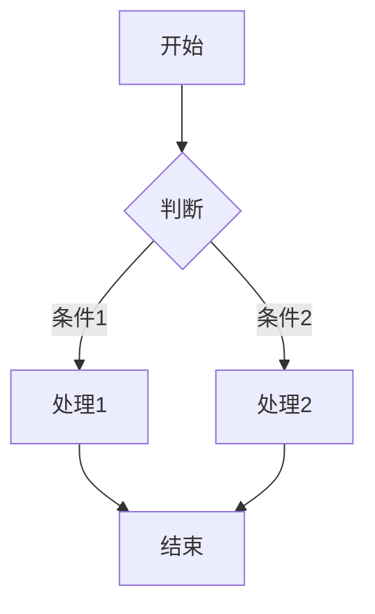

# Python 工具 (IPython 内核)

OMP 集成了完整的 IPython 执行环境，支持持久化内核、富文本输出和强大的辅助函数库。

## 快速开始

### 启动 Python 工具

```
> 使用 Python 计算 2 的 100 次方
```

或显式调用：

```
> /python
```

### 基本计算

```python
> 计算 fibonacci(100)

OMP 会启动 Python 内核并执行：

```python
def fibonacci(n):
    if n <= 1:
        return n
    a, b = 0, 1
    for _ in range(2, n + 1):
        a, b = b, a + b
    return b

fibonacci(100)
# 输出: 354224848179261915075
```

## 核心特性

### 持久化内核

Python 内核在会话期间保持运行，变量和导入持续有效：

```python
> import pandas as pd
> df = pd.DataFrame({'A': [1, 2, 3], 'B': [4, 5, 6]})

> 显示 df 的统计信息
# 内核中 df 变量仍然存在
print(df.describe())
```

### 流式输出

实时显示 stdout/stderr：

```python
> 运行这个脚本：
import time
for i in range(5):
    print(f"Step {i}...")
    time.sleep(1)

# 实时输出：
# Step 0...
# Step 1...
# Step 2...
# ...
```

### 富文本输出

#### Markdown 渲染

```python
from IPython.display import Markdown
display(Markdown("""
# 分析结果

## 数据概览
- **总行数**: 1000
- **列数**: 5
- **缺失值**: 12
"""))
```

#### 图像显示

```python
import matplotlib.pyplot as plt
import numpy as np

x = np.linspace(0, 10, 100)
y = np.sin(x)

plt.figure(figsize=(10, 6))
plt.plot(x, y)
plt.title('Sine Wave')
plt.show()
# 图像将内联显示在终端中
```

#### JSON 树

```python
import json
from IPython.display import JSON

data = {
    "users": [
        {"name": "Alice", "age": 30},
        {"name": "Bob", "age": 25}
    ],
    "total": 2
}

JSON(data)
# 以可折叠的树形结构显示
```

#### Mermaid 图表

```python
display(Markdown("""

"""))
# 在 iTerm2/Kitty 终端中渲染为图形
```

## Prelude 辅助函数

OMP 预加载了一组强大的辅助函数，无需导入即可使用。

### 文件操作

#### 读写文件

```python
# 读取文件
content = read_file("data.txt")
lines = read_lines("data.csv")  # 返回行列表

# 写入文件
write_file("output.txt", "Hello World")
append_file("log.txt", "New entry\n")
```

#### 路径操作

```python
# 查找文件
matches = find_files("*.py")  # 递归查找
count = count_lines("src/")   # 统计代码行数

# 路径处理
absolute = expand_path("~/docs")
exists = path_exists("config.json")
```

### 搜索与替换

#### 文本搜索

```python
# grep 搜索
results = grep("TODO", "src/")
results = grep("class.*Controller", "src/", regex=True)

# 查找文件
files = find("*.md")
files = find("test_*.py", "tests/")
```

#### 替换操作

```python
# 简单替换
replace_in_file("config.txt", "old_value", "new_value")

# 正则替换
replace_regex("data.csv", r"\d{4}-\d{2}-\d{2}", "YYYY-MM-DD")
```

### 行操作

```python
# 获取行
all_lines = lines("file.txt")  # 所有行
line_10 = line("file.txt", 10)  # 第 10 行
range_lines = lines("file.txt", 5, 15)  # 5-15 行

# 插入和删除
insert_at("file.txt", 10, "# New line")  # 在第 10 行前插入
delete_lines("file.txt", [1, 3, 5])      # 删除多行
delete_matching("file.txt", r"^\s*#")    # 删除匹配的行

# 替换
replace_line("file.txt", 20, "replacement")
replace_range("file.txt", 5, 10, ["new", "lines"])
```

### Shell 集成

```python
# 执行 shell 命令
output = shell("ls -la")
result = shell("git status", capture=True)

# 管道
output = shell("cat data.txt | grep error | wc -l")

# 多行命令
script = """
cd /tmp
echo "Current dir: $(pwd)"
ls
"""
shell(script)
```

### 数据处理

```python
# JSON
json_data = read_json("config.json")
write_json("output.json", {"key": "value"}, indent=2)

# CSV
rows = read_csv("data.csv")
write_csv("output.csv", [{"name": "A", "value": 1}])

# YAML
yaml_data = read_yaml("config.yml")
write_yaml("output.yml", yaml_data)
```

## 共享网关模式

多个 OMP 会话可以共享同一个 Python 内核，节省资源：

```json
// ~/.omp/settings.json
{
  "python": {
    "sharedGateway": true,
    "gatewayPort": 5678
  }
}
```

优势：
- 减少内存占用
- 共享大型数据集
- 更快的启动速度

## 自定义模块

### 加载扩展

创建自定义 Python 模块：

```python
# ~/.omp/agent/modules/myutils.py
def custom_helper(data):
    """我的自定义工具函数"""
    return data.upper()

class DataProcessor:
    def process(self, items):
        return [item.strip() for item in items]
```

在 OMP 中自动加载：

```python
> 使用 myutils 处理数据
processor = DataProcessor()
result = processor.process(["  a  ", "  b  "])
```

### 模块搜索路径

OMP 按以下顺序加载模块：

1. `.omp/modules/` (项目级)
2. `~/.omp/agent/modules/` (用户级)
3. 标准 Python 路径

## 安装依赖

### 通过命令安装

```bash
omp setup python
```

### 手动安装

```bash
# 安装到 OMP 的 Python 环境
~/.omp/python/bin/pip install numpy pandas matplotlib
```

### 在会话中安装

```python
> 安装 requests 和 beautifulsoup4

# OMP 会自动执行
!pip install requests beautifulsoup4
```

## 使用示例

### 示例 1：数据分析

```python
> 分析 sales.csv 的销售数据

import pandas as pd
import matplotlib.pyplot as plt

# 读取数据
df = pd.read_csv("sales.csv")

# 显示概览
display(Markdown(f"""
## 销售数据分析

- **总记录数**: {len(df)}
- **总销售额**: ${df['amount'].sum():,.2f}
- **平均订单**: ${df['amount'].mean():.2f}
"""))

# 按月汇总
df['date'] = pd.to_datetime(df['date'])
monthly = df.groupby(df['date'].dt.to_period('M'))['amount'].sum()

# 绘图
monthly.plot(kind='bar', figsize=(12, 6))
plt.title('Monthly Sales')
plt.show()
```

### 示例 2：代码生成

```python
> 生成一个 FastAPI 路由的 CRUD 代码

template = """
from fastapi import APIRouter, HTTPException
from typing import List

router = APIRouter(prefix="/items", tags=["items"])

@router.get("/", response_model=List[Item])
async def list_items():
    return await Item.all()

@router.post("/", response_model=Item)
async def create_item(item: ItemCreate):
    return await Item.create(**item.dict())
"""

write_file("routes/items.py", template)
print("✓ 已生成 routes/items.py")
```

### 示例 3：批量处理

```python
> 批量重命名 src/ 目录下所有 .js 文件为 .ts

import os
import re

for root, dirs, files in os.walk("src"):
    for file in files:
        if file.endswith(".js"):
            old_path = os.path.join(root, file)
            new_path = os.path.join(root, file[:-3] + ".ts")
            os.rename(old_path, new_path)
            print(f"Renamed: {old_path} -> {new_path}")
```

## 故障排除

### 问题：内核启动失败

**检查：**

```bash
# 检查 Python 安装
which python3
python3 --version

# 检查 IPython
python3 -c "import IPython; print(IPython.__version__)"

# 重新安装
omp setup python --force
```

### 问题：模块导入错误

**解决方案：**

```python
# 查看 Python 路径
import sys
print(sys.path)

# 安装缺失模块
!pip install <module-name>
```

### 问题：输出显示异常

**检查终端支持：**

```python
# 检查图形协议支持
print(shell("echo $TERM"))
# 应为 xterm-256color 或支持 iTerm2/Kitty 图形协议
```

## 性能优化

1. **使用共享网关**：多会话共享内核
2. **批量操作**：减少文件 I/O 次数
3. **延迟导入**：只在需要时导入大模块
4. **清理变量**：及时删除大对象 `del large_data`

---

💡 **提示**：输入 `/python` 可以进入专用的 Python 交互模式！
